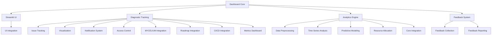

---
title: ARCHITECTURE
version: 1.0.0
status: Active
date_created: 2025-05-10
date_modified: 2025-05-10
authors: [EGOS Team]
description: 
file_type: documentation
scope: 
primary_entity_type: 
primary_entity_name: 
tags: []
---

---
title: ARCHITECTURE
version: 1.0.0
status: Active
date_created: 2025-05-10
date_modified: 2025-05-10
authors: [EGOS Team]
description: 
file_type: documentation
scope: 
primary_entity_type: 
primary_entity_name: 
tags: []
---

# EGOS Dashboard Architecture Documentation

**@module**: DASHBOARD
**@author**: EGOS Team
**@version**: 1.0.0
**@date**: 2025-05-04
**@status**: development

@references:
- .windsurfrules
- CODE_OF_CONDUCT.md
- MQP.md
- README.md
- ROADMAP.md
- CROSSREF_STANDARD.md

  - <!-- TO_BE_REPLACED --> - Project roadmap and planning
  - [MQP](..\..\reference\MQP.md) - Master Quantum Prompt defining EGOS principles
- Related Subsystems:
  - <!-- TO_BE_REPLACED --> - Messaging and communication subsystem
  - <!-- TO_BE_REPLACED --> - Visualization-first approach to system design
  - apps/dashboard/docs/dashboard_ARCHITECTURE.md

## System Overview

The EGOS Dashboard is a comprehensive monitoring, diagnostic tracking, and analytics system designed to provide real-time insights into EGOS operations. It features a modular architecture with distinct but interconnected components that follow the Conscious Modularity principle.

## Module Descriptions

### 1. Core Dashboard UI

These components form the main user interface of the EGOS Dashboard, built on Streamlit.

| File | Purpose | Technology | Cross-References |
|------|---------|------------|------------------|
| **streamlit_app.py** | Main entry point for the Streamlit dashboard application. Orchestrates UI components and integrates with the feedback and Mycelium subsystems. | Streamlit, Pandas | <!-- TO_BE_REPLACED -->, <!-- TO_BE_REPLACED -->, <!-- TO_BE_REPLACED --> |
| **streamlit_app_rewrite.py** | Rewritten/optimized version of the main Streamlit app with improved performance and organization. | Streamlit, Pandas | <!-- TO_BE_REPLACED --> |
| **streamlit_app_integration.py** | Extends the dashboard to include diagnostic visualization options and sidebar integration. | Streamlit | <!-- TO_BE_REPLACED -->, <!-- TO_BE_REPLACED --> |

### 2. MYCELIUM Messaging Integration

Components for real-time data exchange and event-driven communication.

| File | Purpose | Technology | Cross-References |
|------|---------|------------|------------------|
| **mycelium_client.py** | Client for the MYCELIUM messaging system that handles real-time data streams and event subscriptions. | NATS.io, Asyncio | <!-- TO_BE_REPLACED -->, <!-- TO_BE_REPLACED --> |
| **mycelium_utils.py** | Utility functions for MYCELIUM message formatting, parsing, and handling. | JSON, Pydantic | <!-- TO_BE_REPLACED -->, <!-- TO_BE_REPLACED --> |
| **event_schemas.py** | Defines the Pydantic schema models for different event types used in the MYCELIUM messaging system. | Pydantic | <!-- TO_BE_REPLACED -->, <!-- TO_BE_REPLACED --> |

### 3. Feedback System

Components for collecting and analyzing user feedback.

| File | Purpose | Technology | Cross-References |
|------|---------|------------|------------------|
| **feedback.py** | Implements the feedback collection form and storage mechanism. | Streamlit, JSON | <!-- TO_BE_REPLACED -->, <!-- TO_BE_REPLACED --> |
| **feedback_report.py** | Generates analysis and visualization of collected feedback, including trends and word clouds. | Pandas, Wordcloud, Matplotlib | <!-- TO_BE_REPLACED -->, <!-- TO_BE_REPLACED --> |

### 4. Diagnostic Tracking System

Components for tracking, visualizing, and managing diagnostic issues across EGOS.

| File | Purpose | Technology | Cross-References |
|------|---------|------------|------------------|
| **diagnostic_tracking.py** | Core component for tracking and managing diagnostic issues, including CRUD operations. | SQLAlchemy, Pydantic | <!-- TO_BE_REPLACED -->, <!-- TO_BE_REPLACED --> |
| **diagnostic_visualization.py** | Interactive visualizations for diagnostic data, including issue trends, status distributions, and relationships. | Plotly, Streamlit | <!-- TO_BE_REPLACED -->, <!-- TO_BE_REPLACED --> |
| **diagnostic_mycelium.py** | Real-time collaboration features and MYCELIUM integration for the diagnostic tracking system. | NATS.io, Asyncio | <!-- TO_BE_REPLACED -->, <!-- TO_BE_REPLACED --> |
| **diagnostic_notifications.py** | Email and in-app notification system for task assignments and due date reminders. | SMTP, Jinja2 (templates) | <!-- TO_BE_REPLACED --> |
| **diagnostic_roadmap.py** | Integration with roadmap files to connect diagnostic issues with development plans. | Markdown parsing, Regex | <!-- TO_BE_REPLACED --> |
| **diagnostic_metrics.py** | Analytics dashboard for tracking remediation progress and team performance. | Pandas, Plotly | <!-- TO_BE_REPLACED --> |
| **diagnostic_access_control.py** | Authentication and authorization for the diagnostic tracking system, implementing role-based access control. | JWT, Bcrypt | <!-- TO_BE_REPLACED --> |
| **diagnostic_cicd.py** | CI/CD integration for automated roadmap updates and GitHub interactions. | GitPython, GitHub API | <!-- TO_BE_REPLACED -->, <!-- TO_BE_REPLACED --> |
| **diagnostic_launcher.py** | Unified entry point for the diagnostic tracking system, integrating all components. | FastAPI, Uvicorn | <!-- TO_BE_REPLACED -->, <!-- TO_BE_REPLACED --> |
| **production_deployment.py** | Production deployment configuration with security hardening for the diagnostic tracking system. | Docker, NGINX, TLS | <!-- TO_BE_REPLACED --> |

### 5. Diagnostic Analytics Module

Advanced analytics components for data-driven insights, predictions, and optimization.

| File | Purpose | Technology | Cross-References |
|------|---------|------------|------------------|
| **diagnostic_analytics_preprocessor.py** | Data preprocessing, cleaning, and feature engineering for machine learning models. | Pandas, Scikit-learn | <!-- TO_BE_REPLACED -->, <!-- TO_BE_REPLACED --> |
| **diagnostic_analytics_timeseries.py** | Time series analysis for trend detection, decomposition, and forecasting of diagnostic data. | Statsmodels, Prophet, Plotly | <!-- TO_BE_REPLACED -->, <!-- TO_BE_REPLACED --> |
| **diagnostic_analytics_models.py** | Machine learning models for predicting resolution time, risk assessment, and feature importance analysis. | Scikit-learn, Pandas | <!-- TO_BE_REPLACED -->, <!-- TO_BE_REPLACED --> |
| **diagnostic_analytics_resource.py** | Resource allocation optimization and scheduling for efficient remediation. | NumPy, Pandas, Plotly | <!-- TO_BE_REPLACED -->, <!-- TO_BE_REPLACED --> |
| **diagnostic_analytics_core.py** | Core integration module that ties together all analytics components into a unified system. | Pandas, NumPy | <!-- TO_BE_REPLACED -->, <!-- TO_BE_REPLACED -->, <!-- TO_BE_REPLACED -->, <!-- TO_BE_REPLACED --> |

## Integration Points

The Dashboard system integrates with other EGOS subsystems through these key interfaces:

1. **MYCELIUM Integration**
   - Real-time message exchange via <!-- TO_BE_REPLACED -->
   - Event-driven updates with <!-- TO_BE_REPLACED -->

2. **Roadmap Integration**
   - Connection to development plans via <!-- TO_BE_REPLACED -->
   - Automatic updates through <!-- TO_BE_REPLACED -->

3. **User Interface**
   - Streamlit-based UI via <!-- TO_BE_REPLACED --> and <!-- TO_BE_REPLACED -->
   - Interactive visualizations through <!-- TO_BE_REPLACED -->

4. **API & External Access**
   - RESTful API endpoints through <!-- TO_BE_REPLACED -->
   - Authentication and access control via <!-- TO_BE_REPLACED -->

## Technology Stack

1. **Frontend**
   - Streamlit for interactive dashboards
   - Plotly for data visualization
   - Markdown for documentation

2. **Backend**
   - FastAPI for RESTful API endpoints
   - SQLAlchemy for database operations
   - Pydantic for data validation

3. **Analytics**
   - Pandas & NumPy for data manipulation
   - Scikit-learn for machine learning models
   - Statsmodels & Prophet for time series analysis

4. **Messaging**
   - NATS.io for real-time communication
   - Pydantic for message schema validation

5. **Authentication & Security**
   - JWT for token-based authentication
   - Bcrypt for password hashing
   - Role-based access control

6. **Deployment**
   - Docker for containerization
   - NGINX for reverse proxy
   - TLS for secure communication

## File Organization

The Dashboard directory follows a modular organization pattern with these logical groupings:

1. **Core UI**: streamlit_app.py, streamlit_app_rewrite.py, streamlit_app_integration.py
2. **Messaging**: mycelium_client.py, mycelium_utils.py, event_schemas.py
3. **Feedback**: feedback.py, feedback_report.py
4. **Diagnostic Tracking**: diagnostic_tracking.py, diagnostic_visualization.py, diagnostic_mycelium.py, diagnostic_notifications.py, diagnostic_roadmap.py, diagnostic_metrics.py, diagnostic_access_control.py, diagnostic_cicd.py, diagnostic_launcher.py, production_deployment.py
5. **Analytics**: diagnostic_analytics_preprocessor.py, diagnostic_analytics_timeseries.py, diagnostic_analytics_models.py, diagnostic_analytics_resource.py, diagnostic_analytics_core.py
6. **Documentation**: /docs directory (including this ARCHITECTURE.md file)

## Development Status

| Component | Status | Completeness |
|-----------|--------|--------------|
| Core UI | ✅ Completed | 100% |
| Messaging | ✅ Completed | 100% |
| Feedback | ✅ Completed | 100% |
| Diagnostic Tracking | ✅ Completed | 100% |
| Analytics | ⚡ Active | 90% |
| API Integration | 📝 Planned | 0% |
| Documentation | ⏳ In Progress | 70% |

## Future Enhancements

1. **API Integration**
   - RESTful API endpoints for external system integration
   - Webhook support for CI/CD pipelines
   - OpenAPI/Swagger documentation

2. **Advanced Analytics**
   - Complete resource allocation optimization component
   - Add support for more ML model types for predictive analytics
   - Implement model persistence and retraining capabilities

3. **Dashboard Unification**
   - Combine all diagnostic and analytics components into a unified dashboard
   - Create custom visualization widgets for analytics insights
   - Add configuration UI for analytics settings

## Contribution Guidelines

When contributing to the Dashboard subsystem, please follow these guidelines:

1. Adhere to the Conscious Modularity principle by keeping files under 400 lines of code
2. Include proper cross-references to at least two other related files
3. Follow KOIOS documentation standards with metadata headers
4. Add comprehensive docstrings to all classes and functions
5. Include type hints for all function parameters and return values
6. Write test cases for new functionality
7. Update this architecture document when adding new components