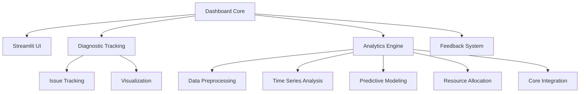

---
title: ROADMAP
version: 1.0.0
status: Active
date_created: 2025-05-10
date_modified: 2025-05-10
authors: [EGOS Team]
description: 
file_type: documentation
scope: 
primary_entity_type: 
primary_entity_name: 
tags: []
---

---
title: ROADMAP
version: 1.0.0
status: Active
date_created: 2025-05-10
date_modified: 2025-05-10
authors: [EGOS Team]
description: 
file_type: documentation
scope: 
primary_entity_type: 
primary_entity_name: 
tags: []
---

---
title: Dashboard Subsystem Roadmap
version: 1.0.0
status: Active
date: 2025-05-05
tags: [roadmap, dashboard, diagnostics, analytics]
@references:
- .windsurfrules
- CODE_OF_CONDUCT.md
- MQP.md
- README.md
- ROADMAP.md
- CROSSREF_STANDARD.md

  - <!-- TO_BE_REPLACED --> - Main project roadmap
  - [MQP](..\..\reference\MQP.md) - Master Quantum Prompt defining EGOS principles
- Implementation Standards:
  - <!-- TO_BE_REPLACED --> - SDRE protocol
  - <!-- TO_BE_REPLACED --> - SEGURO protocol
- Component Documentation:
  - <!-- TO_BE_REPLACED --> - Dashboard architecture
  - <!-- TO_BE_REPLACED --> - Component redundancy analysis
---
  - apps/dashboard/docs/dashboard_ROADMAP.md

Dashboard Subsystem Roadmap

**Status:** Active  
**Last Updated:** 2025-05-05

This roadmap provides an overview of planned, active, and completed tasks for the EGOS Dashboard subsystem. It coordinates work on the core dashboard, diagnostic tracking, and analytics components.

## Overview

The Dashboard subsystem is a comprehensive monitoring, diagnostic tracking, and analytics system designed to provide real-time insights into EGOS operations. It follows a modular architecture with distinct but interconnected components adhering to the Conscious Modularity principle.

## Completed Tasks

### DASH-UI-001: Implement Core Streamlit Dashboard Structure 

**Status:** Completed  
**Date:** 2025-04-20  
**PR:** #421

**Description:**
Implemented the core Streamlit dashboard with sidebar navigation, module selection, and styling. Established the framework for adding more dashboard components.

**Key Achievements:**

- Created modular UI structure with sidebar navigation
- Set up page organization and navigation flow
- Implemented EGOS-themed styling
- Created placeholder sections for all planned components

**References:**

- <!-- TO_BE_REPLACED -->

### DASH-DIAG-001: Implement Diagnostic Tracking System 

**Status:** Completed  
**Date:** 2025-04-25  
**PR:** #435

**Description:**
Implemented the core diagnostic tracking system for monitoring issues across EGOS components.

**Key Achievements:**

- Created system for tracking and managing diagnostic issues
- Implemented data models and storage mechanisms
- Added visualization components for diagnostic data
- Integrated with Mycelium for real-time collaboration
- Developed notification system for task assignments and deadlines

**References:**

- <!-- TO_BE_REPLACED -->
- <!-- TO_BE_REPLACED -->
- <!-- TO_BE_REPLACED -->
- <!-- TO_BE_REPLACED -->

### DASH-ANA-001: Implement Diagnostic Analytics Data Preprocessor 

**Status:** Completed  
**Date:** 2025-05-01  
**PR:** #447

**Description:**
Created the data preprocessing component for the diagnostic analytics system.

**Key Achievements:**

- Developed data loading and cleaning mechanism
- Implemented feature engineering
- Added categorical encoding and transformations
- Built caching system for preprocessed data

**References:**

- <!-- TO_BE_REPLACED -->

### DASH-ANA-002: Implement Time Series Analysis Component 

**Status:** Completed  
**Date:** 2025-05-02  
**PR:** #448

**Description:**
Built the time series analysis component for analyzing temporal patterns in diagnostic data.

**Key Achievements:**

- Implemented trend detection and seasonal decomposition
- Added ARIMA and Prophet forecasting models
- Created visualization tools for temporal patterns
- Developed API for forecasting future issue trends

**References:**

- <!-- TO_BE_REPLACED -->

### DASH-ANA-003: Implement Predictive Modeling Component 

**Status:** Completed  
**Date:** 2025-05-03  
**PR:** #449

**Description:**
Implemented the predictive modeling component for issue resolution time prediction and risk assessment.

**Key Achievements:**

- Built resolution time prediction system
- Implemented risk assessment models
- Created feature importance analysis
- Developed model training and evaluation pipeline

**References:**

- <!-- TO_BE_REPLACED -->

### DASH-ANA-004: Implement Resource Allocation Component 

**Status:** Completed  
**Date:** 2025-05-04  
**PR:** #450

**Description:**
Created the resource allocation optimization component for the analytics system.

**Key Achievements:**

- Implemented issue weighting algorithm
- Built resource optimization scheduler
- Created priority management system
- Developed API for remediating scheduling

**References:**

- <!-- TO_BE_REPLACED -->

### DASH-ANA-005: Implement Analytics Core Integration 

**Status:** Completed  
**Date:** 2025-05-04  
**PR:** #451

**Description:**
Created the core integration module that ties together all analytics components into a cohesive system.

**Key Achievements:**

- Unified all analytics components
- Implemented state management
- Added model persistence
- Created high-level API for analytics
- Built error handling and graceful degradation

**References:**

- <!-- TO_BE_REPLACED -->

### DASH-DOC-001: Create Architecture Documentation 

**Status:** Completed  
**Date:** 2025-05-04  
**PR:** #452

**Description:**
Created comprehensive architecture documentation for the Dashboard subsystem.

**Key Achievements:**

- Documented all components and their relationships
- Created system overview with mermaid diagrams
- Detailed integration points with other subsystems
- Documented technology stack and file organization

**References:**

- <!-- TO_BE_REPLACED -->

### DASH-OPT-001: Perform Component Redundancy Analysis 

**Status:** Completed  
**Date:** 2025-05-04  
**PR:** #453

**Description:**
Implemented the SDRE protocol for Dashboard components and performed comprehensive redundancy analysis.

**Key Achievements:**

- Identified redundancy in UI components
- Analyzed file purpose and organization
- Created recommendations for consolidation
- Detailed implementation plan for optimization

**References:**

- <!-- TO_BE_REPLACED -->

## Active Tasks

### DASH-CONS-001: Consolidate Redundant Dashboard UI Components 

**Status:** In Progress
**Priority:** High
**Est. Completion:** 2025-05-10
**Assigned To:** UI Team

**Description:**
Analyze `FILE_ANALYSIS.md` and consolidate identified redundant Streamlit UI components to improve maintainability and consistency. **Note:** Document final consolidation decisions in `docs_egos/FILE_ANALYSIS.md`.

**Tasks:**

- [ ] Merge `streamlit_app.py` and `streamlit_app_rewrite.py`
- [ ] Move integration functionality from `streamlit_app_integration.py` to main app
- [ ] Extract common visualization utilities to shared module
- [ ] Refactor Mycelium integration to reduce duplication

**References:**

- <!-- TO_BE_REPLACED -->

### DASH-HARM-001: Develop Dashboard Harmonization Strategy 

**Status:** Planned
**Priority:** High
**Est. Completion:** 2025-05-15
**Assigned To:** Architecture Team

**Description:**
Develop a formal integration and harmonization plan for the two existing dashboard implementations (`apps/dashboard` and `apps/egos_dashboard`). Document the analysis and final decision in <!-- TO_BE_REPLACED -->.

**Tasks:**

- [ ] Analyze pros and cons of each dashboard
- [ ] Define potential integration paths (merge, deprecate, distinct roles)
- [ ] Propose recommended strategy
- [ ] Document decision and rationale

**Requirements:**

- Clear plan for a unified dashboard approach
- Documented decision process

## Planned Tasks

### DASH-API-001: Implement RESTful API Interface 

**Status:** Planned
**Priority:** Medium
**Est. Completion:** 2025-05-10
**Assigned To:** Development Team

**Description:**
Create a RESTful API interface for the diagnostic tracking and analytics system to enable external integration.

**Tasks:**

- [ ] Design API endpoints for diagnostic tracking
- [ ] Implement analytics API endpoints
- [ ] Add authentication and authorization
- [ ] Create OpenAPI/Swagger documentation
- [ ] Implement rate limiting and security features

**Requirements:**

- FastAPI framework
- JWT authentication
- Thorough unit tests
- Performance benchmarking

### DASH-INT-001: Dashboard & Analytics Integration 

**Status:** Planned
**Priority:** High
**Est. Completion:** 2025-05-12
**Assigned To:** Development Team

**Description:**
Integrate the diagnostic analytics components with the Streamlit dashboard, providing visualizations and insights.

**Tasks:**

- [ ] Create analytics dashboard pages
- [ ] Implement visualization components for insights
- [ ] Add configuration UI for analytics settings
- [ ] Create summary reports and recommendations
- [ ] Develop alert system for anomalies

**Requirements:**

- Integration with all analytics components
- Interactive visualizations
- User-friendly configuration UI

### DASH-TEST-001: Comprehensive Testing Suite 

**Status:** Planned
**Priority:** Medium
**Est. Completion:** 2025-05-15
**Assigned To:** QA Team

**Description:**
Develop a comprehensive testing suite for all dashboard components, including unit tests, integration tests, and UI tests.

**Tasks:**

- [ ] Create unit tests for all modules
- [ ] Implement integration tests for component interaction
- [ ] Add UI tests for Streamlit interface
- [ ] Create performance tests for analytics components
- [ ] Set up CI pipeline for automated testing

**Requirements:**

- 80%+ code coverage
- Performance testing baseline
- Automated CI integration

## Integration Points

The Dashboard subsystem integrates with several other EGOS subsystems:

1. **MYCELIUM Integration**

   - Real-time message exchange via `mycelium_client.py`
   - Event-driven updates with `diagnostic_mycelium.py`

2. **TRUST_WEAVER Integration**

   - Code quality verification
   - Security validation
   - SDRE implementation

3. **KOIOS Integration**

   - Documentation standards
   - Cross-referencing
   - Metadata consistency

4. **HARMONY Integration**

   - UI/UX guidelines
   - Visualization standards
   - Accessibility compliance

## Technology Stack

1. **Frontend**

   - Streamlit for interactive dashboards
   - Plotly for data visualization
   - Markdown for documentation

2. **Backend**

   - FastAPI for RESTful endpoints
   - SQLAlchemy for data persistence
   - Pydantic for data validation

3. **Analytics**

   - Pandas & NumPy for data manipulation
   - Scikit-learn for machine learning models
   - Statsmodels & Prophet for time series analysis

4. **Messaging**

   - NATS.io for real-time communication
   - Pydantic for message schema validation

## Next Steps

1. Complete the consolidation of redundant UI components (DASH-CONS-001)
2. Begin implementation of the RESTful API interface (DASH-API-001)
3. Integrate analytics components with the dashboard (DASH-INT-001)
4. Develop comprehensive testing suite (DASH-TEST-001)