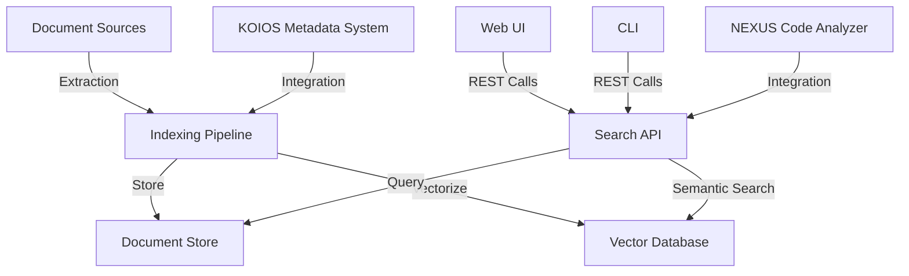

# NEXUS Search Engine Technical Specification

**Document Status**: Draft  
**Version**: 0.2.0  
**Last Updated**: 2025-05-21  
**Author**: EGOS Development Team  

## Overview

This technical specification outlines the architecture, components, and implementation details for the NEXUS Search Engine, which will leverage standardized cross-references to provide enhanced search capabilities for EGOS documentation and code.

## References

- [NEXUS Search Engine Design](./search_engine_design.md)
- [EGOS Cross-Reference Standardization](../../05_development/standards/cross_reference_standard.md)
- [NEXUS Subsystem Documentation](./README.md)
- [ROADMAP.md - XREF-SEARCH-01](../../../ROADMAP.md)

## 1. Architecture

### 1.1 High-Level Architecture



### 1.2 Core Components

1. **Document Processor**
   - Extracts content, metadata, and references from documents
   - Normalizes content for indexing
   - Identifies relationships between documents

2. **Indexing Pipeline**
   - Processes documents for text search
   - Generates embeddings for semantic search
   - Maintains document relationships

3. **Storage Layer**
   - Document Store: Stores document content and metadata
   - Vector Database (Qdrant): Stores document embeddings
   - Reference Graph: Maintains document relationships

4. **Search API**
   - RESTful interface for search operations
   - Query processing and result ranking
   - Authentication and access control

5. **User Interfaces**
   - Web UI: React-based interface for search and visualization
   - CLI: Command-line interface for developer usage

## 2. Component Specifications

### 2.1 Document Processor

#### 2.1.1 Document Extraction

```python
class DocumentExtractor:
    """Extracts content and metadata from documents."""
    
    def extract(self, path: Path) -> Document:
        """Extract document content and metadata.
        
        Args:
            path: Path to document
            
        Returns:
            Document object
        """
        # Implementation details
```

#### 2.1.2 Reference Extraction

```python
class ReferenceExtractor:
    """Extracts references from documents."""
    
    def extract_references(self, document: Document) -> List[Reference]:
        """Extract references from document.
        
        Args:
            document: Document to extract references from
            
        Returns:
            List of references
        """
        # Implementation details
```

### 2.2 Indexing Pipeline

#### 2.2.1 Text Indexing

- **Technology**: Elasticsearch or custom inverted index
- **Features**:
  - Full-text indexing with stemming and lemmatization
  - Support for multiple languages
  - Boosting for title, headings, and metadata

#### 2.2.2 Vector Database Integration (Qdrant)

- **Technology**: Qdrant Vector Database
- **Features**:
  - Storage for document embeddings
  - Fast approximate nearest neighbor search
  - Support for filtering and hybrid search

**Implementation Details**:

1. **Qdrant Client Configuration**:
```python
from qdrant_client import QdrantClient
from qdrant_client.http import models

# Initialize Qdrant client
client = QdrantClient(
    url="http://localhost:6333",  # For production, use proper URL
    timeout=60.0,                 # Timeout for operations
)

# Create collection for document embeddings
client.recreate_collection(
    collection_name="egos_documents",
    vectors_config=models.VectorParams(
        size=768,                 # Dimension of embeddings (depends on model)
        distance=models.Distance.COSINE,  # Distance metric
    ),
    optimizers_config=models.OptimizersConfigDiff(
        indexing_threshold=20000  # Threshold for index optimization
    ),
)
```

2. **Document Chunking Strategy**:
```python
def chunk_document(document: Document, chunk_size: int = 512, overlap: int = 128) -> List[DocumentChunk]:
    """Split document into overlapping chunks for embedding.
    
    Args:
        document: Document to chunk
        chunk_size: Maximum chunk size in characters
        overlap: Overlap between chunks in characters
        
    Returns:
        List of document chunks
    """
    text = document.content
    chunks = []
    
    # Split document into paragraphs
    paragraphs = re.split(r'\n\s*\n', text)
    
    current_chunk = ""
    current_chunk_size = 0
    
    for paragraph in paragraphs:
        # Skip empty paragraphs
        if not paragraph.strip():
            continue
        
        # If adding this paragraph would exceed chunk size
        if current_chunk_size + len(paragraph) > chunk_size:
            # Add current chunk to chunks
            if current_chunk:
                chunks.append(DocumentChunk(
                    document_id=document.id,
                    chunk_id=len(chunks),
                    text=current_chunk,
                    metadata=document.metadata
                ))
            
            # Start new chunk with overlap
            if current_chunk and overlap > 0:
                # Get last N characters for overlap
                overlap_text = current_chunk[-overlap:]
                current_chunk = overlap_text + "\n\n" + paragraph
                current_chunk_size = len(overlap_text) + 2 + len(paragraph)
            else:
                current_chunk = paragraph
                current_chunk_size = len(paragraph)
        else:
            # Add paragraph to current chunk
            if current_chunk:
                current_chunk += "\n\n" + paragraph
                current_chunk_size += 2 + len(paragraph)
            else:
                current_chunk = paragraph
                current_chunk_size = len(paragraph)
    
    # Add final chunk
    if current_chunk:
        chunks.append(DocumentChunk(
            document_id=document.id,
            chunk_id=len(chunks),
            text=current_chunk,
            metadata=document.metadata
        ))
    
    return chunks
```

3. **Embedding Generation**:
```python
from sentence_transformers import SentenceTransformer

class EmbeddingGenerator:
    """Generates embeddings for document chunks."""
    
    def __init__(self, model_name: str = "all-mpnet-base-v2"):
        """Initialize embedding generator.
        
        Args:
            model_name: Name of the sentence transformer model
        """
        self.model = SentenceTransformer(model_name)
    
    def generate_embeddings(self, chunks: List[DocumentChunk]) -> List[np.ndarray]:
        """Generate embeddings for document chunks.
        
        Args:
            chunks: List of document chunks
            
        Returns:
            List of embeddings
        """
        texts = [chunk.text for chunk in chunks]
        embeddings = self.model.encode(texts, show_progress_bar=True)
        return embeddings
```

4. **Vector Storage and Retrieval**:
```python
def store_document_embeddings(
    client: QdrantClient,
    collection_name: str,
    document: Document,
    embeddings: List[np.ndarray],
    chunks: List[DocumentChunk]
) -> None:
    """Store document embeddings in Qdrant.
    
    Args:
        client: Qdrant client
        collection_name: Name of the collection
        document: Document
        embeddings: List of embeddings
        chunks: List of document chunks
    """
    # Prepare points for Qdrant
    points = []
    for i, (embedding, chunk) in enumerate(zip(embeddings, chunks)):
        points.append(models.PointStruct(
            id=f"{document.id}_{i}",
            vector=embedding.tolist(),
            payload={
                "document_id": document.id,
                "chunk_id": chunk.chunk_id,
                "text": chunk.text,
                "metadata": {
                    "title": document.title,
                    "path": str(document.path),
                    "type": document.metadata.get("type", ""),
                    "author": document.metadata.get("author", ""),
                    "tags": document.metadata.get("tags", []),
                    "created": document.metadata.get("created", ""),
                    "updated": document.metadata.get("updated", "")
                }
            }
        ))
    
    # Upsert points to Qdrant
    client.upsert(
        collection_name=collection_name,
        points=points
    )
```

5. **Semantic Search Implementation**:
```python
def semantic_search(
    client: QdrantClient,
    collection_name: str,
    query: str,
    embedding_generator: EmbeddingGenerator,
    limit: int = 10,
    filters: Optional[Dict[str, Any]] = None
) -> List[Dict[str, Any]]:
    """Perform semantic search.
    
    Args:
        client: Qdrant client
        collection_name: Name of the collection
        query: Search query
        embedding_generator: Embedding generator
        limit: Maximum number of results
        filters: Optional filters
        
    Returns:
        List of search results
    """
    # Generate embedding for query
    query_embedding = embedding_generator.generate_embeddings([DocumentChunk(
        document_id="query",
        chunk_id=0,
        text=query,
        metadata={}
    )])[0]
    
    # Prepare filter
    filter_query = None
    if filters:
        filter_conditions = []
        
        if "type" in filters and filters["type"]:
            filter_conditions.append(
                models.FieldCondition(
                    key="metadata.type",
                    match=models.MatchValue(value=filters["type"])
                )
            )
        
        if "author" in filters and filters["author"]:
            filter_conditions.append(
                models.FieldCondition(
                    key="metadata.author",
                    match=models.MatchValue(value=filters["author"])
                )
            )
        
        if "tags" in filters and filters["tags"]:
            filter_conditions.append(
                models.FieldCondition(
                    key="metadata.tags",
                    match=models.MatchAny(any=filters["tags"])
                )
            )
        
        if filter_conditions:
            filter_query = models.Filter(
                must=filter_conditions
            )
    
    # Search for similar vectors
    search_result = client.search(
        collection_name=collection_name,
        query_vector=query_embedding.tolist(),
        limit=limit,
        query_filter=filter_query
    )
    
    # Process results
    results = []
    for scored_point in search_result:
        results.append({
            "id": scored_point.id,
            "score": scored_point.score,
            "document_id": scored_point.payload["document_id"],
            "chunk_id": scored_point.payload["chunk_id"],
            "text": scored_point.payload["text"],
            "metadata": scored_point.payload["metadata"]
        })
    
    return results
```

#### 2.2.3 Embedding Generation

- **Technology**: Sentence Transformers or OpenAI Embeddings
- **Features**:
  - Generation of document embeddings
  - Support for chunking long documents
  - Batch processing for efficiency

### 2.3 Storage Layer

#### 2.3.1 Document Store Schema

```json
{
  "id": "string",
  "title": "string",
  "content": "string",
  "path": "string",
  "metadata": {
    "author": "string",
    "created": "datetime",
    "updated": "datetime",
    "tags": ["string"],
    "type": "string"
  },
  "references": [
    {
      "source_id": "string",
      "target_id": "string",
      "ref_type": "string",
      "context": "string",
      "position": [0, 0]
    }
  ]
}
```

#### 2.3.2 Vector Database Schema

```json
{
  "id": "string",
  "vector": [0.1, 0.2, ...],
  "payload": {
    "document_id": "string",
    "chunk_id": "integer",
    "chunk_text": "string"
  }
}
```

### 2.4 Search API

#### 2.4.1 API Endpoints

| Endpoint | Method | Description |
|----------|--------|-------------|
| `/api/v1/documents` | GET | List documents |
| `/api/v1/documents/{id}` | GET | Get document details |
| `/api/v1/search` | GET | Search documents |
| `/api/v1/search/semantic` | GET | Semantic search |
| `/api/v1/documents/{id}/related` | GET | Get related documents |
| `/api/v1/index` | POST | Index a document |
| `/api/v1/index/batch` | POST | Batch index documents |
| `/api/v1/index/status` | GET | Get indexing status |

#### 2.4.2 Search Parameters

```json
{
  "query": "string",
  "filters": {
    "type": "string",
    "author": "string",
    "tags": ["string"],
    "created_after": "datetime",
    "created_before": "datetime"
  },
  "sort": "relevance|created|updated",
  "page": 1,
  "page_size": 10,
  "highlight": true,
  "include_related": true
}
```

### 2.5 User Interfaces

#### 2.5.1 Web UI Components

- **Search Bar**: Main search input with filters
- **Results List**: Display of search results with highlighting
- **Document Viewer**: Display of document content
- **Related Documents**: Display of related documents
- **Faceted Navigation**: Filters for document type, author, tags, etc.
- **Visualization**: Graph visualization of document relationships

#### 2.5.2 CLI Commands

```bash
# Search documents
nexus-search query "search query"

# Get document details
nexus-search document get <document_id>

# Get related documents
nexus-search document related <document_id>

# Index a document
nexus-search index add <path>

# Batch index documents
nexus-search index batch <directory>

# Get indexing status
nexus-search index status
```

## 3. Integration Points

### 3.1 NEXUS Code Analyzer Integration

- **Purpose**: Enhance search with code analysis insights
- **Integration Method**: API calls between systems
- **Data Exchange**: Code structure, dependencies, metrics

### 3.2 KOIOS Metadata System Integration

- **Purpose**: Leverage standardized metadata for search
- **Integration Method**: Shared database or API calls
- **Data Exchange**: Document metadata, tags, categories

### 3.3 Automatic Index Updates

- **Purpose**: Keep search index up-to-date
- **Integration Method**: File system watchers or git hooks
- **Data Exchange**: File change events, document content

## 4. Performance Requirements

### 4.1 Indexing Performance

- **Throughput**: Index at least 100 documents per second
- **Latency**: Complete individual document indexing in < 500ms
- **Resource Usage**: Use < 2GB RAM for indexing pipeline

### 4.2 Search Performance

- **Throughput**: Handle at least 50 queries per second
- **Latency**: Return results in < 200ms for text search, < 500ms for semantic search
- **Resource Usage**: Use < 4GB RAM for search API

## 5. Security Considerations

### 5.1 Authentication and Authorization

- **Authentication**: JWT-based authentication
- **Authorization**: Role-based access control
- **API Security**: Rate limiting, input validation

### 5.2 Data Security

- **Sensitive Data**: No storage of credentials or secrets
- **Data Validation**: Strict validation of all inputs
- **Error Handling**: No leakage of sensitive information

## 6. Implementation Plan

### 6.1 Phase 1: Reference Infrastructure Finalization

1. Execute `docs_directory_fixer.py` in live mode
2. Run `optimized_reference_fixer.py` in live mode
3. Validate all references with `cross_reference_validator.py`
4. Document performance metrics and results

### 6.2 Phase 2: Core Search Engine Development

1. **Vector Database Integration**
   - Develop adapters for Qdrant
   - Implement embedding storage and retrieval
   - Create embedding generation pipeline

2. **RESTful API Development**
   - Create document indexing endpoints
   - Implement search capabilities
   - Develop index management functionality
   - Add authentication and access control
   - Generate API documentation

3. **Subsystem Integration**
   - Connect with NEXUS code analyzer
   - Integrate with KOIOS metadata system
   - Establish automatic index updates

### 6.3 Phase 3: Advanced Features

1. **Web Interface**
   - Develop React frontend
   - Implement result highlighting
   - Create documentation dashboard

2. **Advanced Search Features**
   - Add faceted search
   - Implement boolean operators
   - Create search suggestions
   - Develop document similarity analysis

### 6.4 Phase 4: Expansion and Optimization

1. **Capability Expansion**
   - Add semantic code indexing
   - Implement natural language queries
   - Integrate with AI assistants

2. **Performance Optimization**
   - Implement distributed caching
   - Optimize ranking algorithms
   - Develop incremental indexing

## 7. Testing Strategy

### 7.1 Unit Testing

- Test individual components in isolation
- Achieve > 80% code coverage
- Use pytest for Python components, Jest for JavaScript

### 7.2 Integration Testing

- Test component interactions
- Verify API contracts
- Use API testing tools like Postman or pytest-requests

### 7.3 Performance Testing

- Measure indexing throughput and latency
- Measure search throughput and latency
- Use locust or k6 for load testing

### 7.4 User Acceptance Testing

- Verify search result quality
- Test user interfaces
- Gather feedback from stakeholders

## 8. Deployment Strategy

### 8.1 Development Environment

- Local development with Docker Compose
- CI/CD integration with GitHub Actions
- Automated testing on pull requests

### 8.2 Production Environment

- Containerized deployment with Docker
- Orchestration with Kubernetes or Docker Compose
- Monitoring with Prometheus and Grafana

## 9. Maintenance and Support

### 9.1 Monitoring

- Log aggregation with ELK stack
- Performance monitoring with Prometheus
- Alerting with Grafana or PagerDuty

### 9.2 Backup and Recovery

- Regular backups of document store and vector database
- Automated recovery procedures
- Disaster recovery testing

### 9.3 Updates and Upgrades

- Semantic versioning for API
- Backward compatibility guarantees
- Documented upgrade procedures

## Appendix A: Glossary

| Term | Definition |
|------|------------|
| Document | A file in the EGOS ecosystem, such as a Markdown file, Python file, etc. |
| Reference | A link between documents, such as a Markdown link, import statement, etc. |
| Embedding | A vector representation of a document or chunk of text |
| Semantic Search | Search based on meaning rather than exact keyword matching |
| Vector Database | A database optimized for storing and querying vector embeddings |

## Appendix B: References

1. [Qdrant Documentation](https://qdrant.tech/documentation/)
2. [Sentence Transformers](https://www.sbert.net/)
3. [React Documentation](https://reactjs.org/docs/getting-started.html)
4. [OpenAPI Specification](https://swagger.io/specification/)
5. [JWT Authentication](https://jwt.io/introduction)

✧༺❀༻∞ EGOS ∞༺❀༻✧
