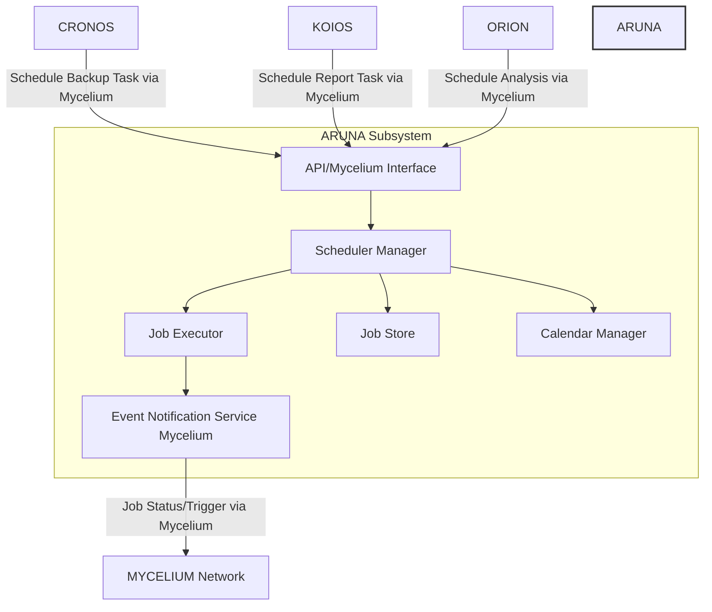
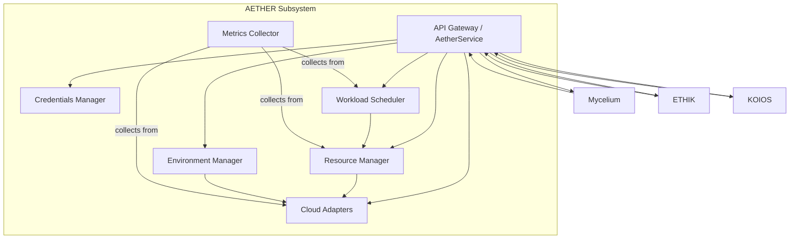
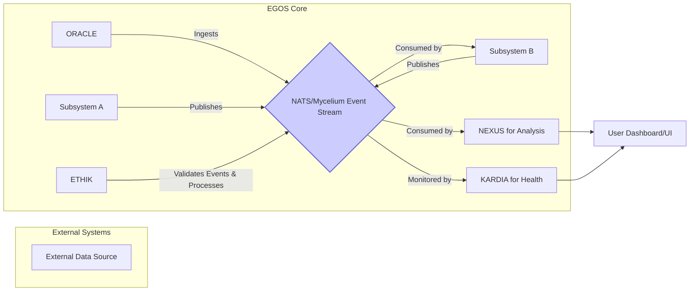
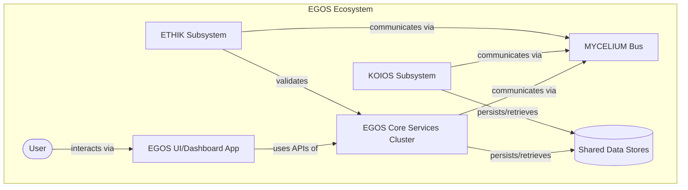

# @references:
#   - .windsurfrules
#   - CODE_OF_CONDUCT.md
#   - MQP.md
#   - README.md
#   - ROADMAP.md
#   - CROSSREF_STANDARD.md

---
title: EGOS System Architecture
version: 1.0.0
status: Draft
date_created: 2025-05-19
date_modified: 2025-05-19
authors: [EGOS Collective, Cascade AI]
description: "A comprehensive overview of the EGOS (Evolving General Operating System) architecture, including its high-level structure, core subsystems, data flow, and guiding principles."
file_type: architecture_documentation
scope: project-wide
primary_entity_type: system_architecture
primary_entity_name: egos_architecture
tags: [egos, architecture, system_design, overview, C4_model, subsystems, data_flow, KOIOS_STANDARD]
---

@references:
  - docs/ARCHITECTURE.MD

# EGOS System Architecture

## 1. Introduction

This document provides a comprehensive architectural overview of the **EGOS (Evolving General Operating System)**. Its purpose is to describe the high-level structure, core subsystems, key interactions, data flow patterns, and the guiding principles that shape the system's design. This understanding is essential for all contributors to the EGOS project, facilitating consistent development, maintenance, and future evolution.

EGOS is founded upon the principles outlined in the **<!-- TO_BE_REPLACED -->**, emphasizing **Conscious Modularity, Systemic Cartography (ensuring comprehensive and accessible documentation, including detailed module READMEs, planning documents, and API specifications as outlined in EGOS standards like the [EGOS_MCP_Standardization_Guidelines.md](file:///C:/EGOS/EGOS_Framework/docs/standards/EGOS_MCP_Standardization_Guidelines.md)), Integrated Ethics, and Unconditional Love** in its design and operation.

## 2. High-Level System Structure

The EGOS project's file system is organized into a clear, hierarchical structure. This structure promotes modularity and discoverability.

The primary top-level directories include:
- **`/apps`**: Standalone applications within the EGOS ecosystem.
- **`/docs`**: Central repository for all documentation.
- **`/scripts`**: Operational, maintenance, and automation scripts.
- **`/subsystems`**: Source code for the core EGOS subsystems.
- **`/tools`**: Developer tools and utilities.

```mermaid
graph TD
    A[EGOS Root: /] --> B[/apps];
    A --> C[/docs];
    A --> D[/scripts];
    A --> E[/subsystems - Code];
    A --> F[/tools];
    A --> G[README.md];
    A --> H[ROADMAP.md];

    B --> B1[website];
    B --> B2[dashboard];

    C --> C1[reference];
    C --> C2[concepts];
    C --> C3[governance];
    C --> C4[subsystems - Docs];
    C --> C5[templates];
    C --> C7[SYSTEM_ORGANIZATION_TASKS.md];

    E --> E_KOIOS[KOIOS_Code];
    E --> E_ETHIK[ETHIK_Code];
    E --> E_ATLAS[ATLAS_Code];
    E --> E_MYCELIUM[MYCELIUM_Code];
    E --> E_NEXUS[NEXUS_Code];
    E --> E_CORUJA[CORUJA_Code];
    E --> E_AETHER[AETHER_Code];
    E --> E_MANA[MANA_Code];
    E --> E_KARDIA[KARDIA_Code];
    E --> E_ORACLE[ORACLE_Code];
    E --> E_CRONOS[CRONOS_Code];

    style A fill:#f9f,stroke:#333,stroke-width:2px,color:#000
    style B fill:#lightgrey,stroke:#333,stroke-width:2px
    style C fill:#lightgrey,stroke:#333,stroke-width:2px
    style D fill:#lightgrey,stroke:#333,stroke-width:2px
    style E fill:#lightgrey,stroke:#333,stroke-width:2px
    style F fill:#lightgrey,stroke:#333,stroke-width:2px
```

## Detailed Filesystem Structure

The following sections provide a statistical overview and breakdown of key top-level directories within the EGOS project, illustrating their current scale and primary contents. This analysis excludes common non-source files and folders such as backups, `node_modules`, `venv`, `.*` (hidden files/folders), `__pycache__`, `*.log`, `*.tmp`, and `*.bak`.

### `/scripts` Directory

The `/scripts` directory serves as a central repository for various operational, maintenance, utility, and automation scripts used across the EGOS project.

**Overall Statistics:**
- **Total Files:** 525
- **Total Subdirectories:** 102
- **Files directly in `/scripts` root:** 98

**Top-Level Subdirectory Breakdown:**

| Subdirectory        | Files | Subdirs | Inferred Purpose / Notes                                                                 |
|---------------------|-------|---------|------------------------------------------------------------------------------------------|
| `apps`              | 24    | 1       | Scripts related to specific applications within EGOS.                                    |
| `archive`           | 17    | 3       | Archived or older scripts, potentially for historical reference or future reinstatement. |
| `cross_reference`   | 87    | 14      | Scripts for managing, generating, or analyzing cross-references within documentation/code. |
| `doc_metrics_utils` | 2     | 0       | Utilities for document metrics.                                                          |
| `maintenance`       | 73    | 18      | Core maintenance scripts and modules (see MEMORY[8ddc2fc8...]).                          |
| `migrations`        | 25    | 1       | Scripts for data or schema migrations.                                                   |
| `qa`                | 4     | 0       | Quality assurance and testing scripts.                                                   |
| `subsystems`        | 23    | 32      | Scripts specific to individual EGOS subsystems (e.g., `AET_*`, `CRJ_*`).                 |
| `templates`         | 13    | 0       | Templates used by or for scripts.                                                        |
| `tests`             | 9     | 0       | General test scripts not specific to a subsystem or QA process.                          |
| `tools`             | 102   | 15      | Utility scripts and script-based tools.                                                  |
| `utilities`         | 48    | 6       | General utility scripts.                                                                 |

**Note on Root Files:** The presence of 98 files directly in the `/scripts` root suggests an area for potential organization into more specific subdirectories. This aligns with findings in MEMORY[8ddc2fc8...] regarding loose utility, check, migration, and test scripts.

### `/apps` Directory

The `/apps` directory houses standalone applications developed as part of the EGOS ecosystem. These applications typically provide user interfaces or dedicated functionalities.

**Overall Statistics:**
- **Total Files:** 257
- **Total Subdirectories:** 98
- **Files directly in `/apps` root:** 0

**Top-Level Subdirectory Breakdown:**

| Subdirectory       | Files | Subdirs | Inferred Purpose / Notes                                     |
|--------------------|-------|---------|--------------------------------------------------------------|
| `dashboard`        | 1     | 0       | Likely an older or minimal dashboard application.            |
| `egos_dashboard`   | 18    | 1       | The primary EGOs dashboard application.                        |
| `public`           | 3     | 0       | Publicly accessible assets or entry points for applications. |
| `website`          | 235   | 93      | Source code and assets for the main EGOS project website.    |

### `/docs` Directory

The `/docs` directory is the central knowledge repository for the EGOS project, containing all forms of documentation from high-level architecture to detailed subsystem references.

**Overall Statistics:**
- **Total Files:** 1293
- **Total Subdirectories:** 397
- **Files directly in `/docs` root:** 7

**Key Top-Level Subdirectory Breakdown:**

| Subdirectory              | Files | Subdirs | Inferred Purpose / Notes                                                                        |
|---------------------------|-------|---------|-------------------------------------------------------------------------------------------------|
| `apps`                    | 9     | 2       | Documentation specific to applications found in the main `/apps` directory.                     |
| `archived`                | 24    | 47      | Older or superseded documentation, kept for historical context.                                 |
| `assets`                  | 16    | 5       | Images, diagrams, and other static assets used within the documentation.                        |
| `governance`              | 457   | 25      | Policies, standards (like KOIOS), procedures, and decision-making frameworks for the project.   |
| `guides`                  | 20    | 7       | User guides, tutorials, and how-to documents.                                                   |
| `markdown`                | 59    | 33      | General markdown documents, possibly utilities or miscellaneous topics.                         |
| `project_documentation`   | 217   | 124     | Documentation related to specific projects or initiatives within EGOS.                          |
| `reference`               | 370   | 101     | Core reference materials such as the MQP, glossaries, API references, and technical deep dives. |
| `subsystems`              | 82    | 30      | Detailed documentation for each EGOS subsystem (e.g., KOIOS, ETHIK).                            |

**Note on Root Files:** The 7 files directly in the `/docs` root are likely key entry points or overarching documents for the documentation system itself.


## 3. Architectural Principles

The design and evolution of EGOS are guided by several key architectural principles:

- **Conscious Modularity:** Components are designed to be independent, cohesive, and loosely coupled, with well-defined responsibilities and interfaces.
- **Systemic Cartography:** The architecture and its documentation aim to provide clear maps of the system, its components, and their interconnections.
- **Event-Driven Architecture (EDA):** Many interactions within EGOS are asynchronous and event-driven, promoting scalability and resilience, often facilitated by MYCELIUM and technologies like NATS.
- **Ethical by Design (ETHIK):** Ethical considerations, privacy, and security are integral to the architecture, not afterthoughts. The ETHIK subsystem plays a crucial role here.
- **KOIOS Documentation Standards:** All architectural components and decisions are thoroughly documented according to KOIOS standards, ensuring clarity and maintainability.
- **API-First Design:** Functionality is exposed through well-defined APIs, enabling programmatic access and integration.
- **Evolutionary Preservation:** The architecture is designed to be adaptable and evolvable, allowing for the integration of new technologies and paradigms without requiring fundamental overhauls.

## 3. Core Subsystems

The EGOS ecosystem is composed of several core subsystems, each with a distinct role and set of responsibilities. These subsystems are designed to be modular yet interconnected, primarily communicating via the **MYCELIUM** network. Below is an overview of each major subsystem. Detailed architectural information for each can be found in their respective documentation.

### 3.1 ATLAS (Automated Task & Learning Orchestration System)
- **Purpose:** The conductor of the EGOS orchestra, managing tasks, learning processes, and adaptation.
- **Key Responsibilities:** Task lifecycle management, resource orchestration for AI processes, adaptation triggering.
- **Documentation:** <!-- TO_BE_REPLACED -->

### 3.2 AETHER (Advanced Ethereal Technology for Hybrid Environment Resources)

### 3.3 ARUNA (Temporal Event & Workflow Orchestrator)

**Overview:**
ARUNA is a proposed subsystem designed to manage complex event scheduling, temporal workflows, and time-based automation within EGOS. It will provide robust control over operations that depend on specific timings, sequences, or recurring schedules.

**Key Responsibilities (Proposed):**

*   **Scheduled Task Management:** Define, manage, and execute cron-like jobs and other scheduled tasks.
*   **Temporal Workflow Orchestration:** Coordinate multi-step processes with defined time dependencies between stages.
*   **Event Registration API:** Allow other subsystems to register for and trigger time-based events.
*   **Calendar & Business Rule Management:** Incorporate calendars, business hours, and non-working periods into scheduling logic.

**Core Components (High-Level):**

*   **Scheduler Engine:** Core component responsible for triggering tasks based on defined schedules.
*   **Job Store:** Persistent storage for job definitions, schedules, and state.
*   **Workflow Manager:** Oversees the execution of multi-step temporal workflows.
*   **Event Bus Interface:** Connects to MYCELIUM for receiving task triggers and emitting event notifications.
*   **Calendar Service:** Provides contextual time information (e.g., holidays, business hours).

**Interactions & Dependencies:**

*   **MYCELIUM Network:** ARUNA will heavily rely on Mycelium for inter-subsystem communication, receiving requests for task scheduling and emitting notifications about job statuses or triggered events.
*   **Interacts With (Examples):**
    *   `CRONOS`: For scheduling regular backup operations.
    *   `KOIOS`: For scheduling periodic generation of reports or documentation checks.
    *   `ORION`: For scheduling recurring data analyses or model training tasks.
*   **Depends On:**
    *   `MYCELIUM`: For message-based communication.
    *   (Potentially) `CHRONICLER` or a persistent database for storing job definitions and state.

**Architectural Diagram (Conceptual):**



**Status:** Proposed. Initial development targeted for Q3-Q4 2025.


**Overview:**
AETHER is a foundational subsystem within EGOS, serving as the central hub for managing and orchestrating computational resources, particularly across diverse cloud provider environments (e.g., AWS, Azure, GCP) and local infrastructure. Its primary goal is to abstract the complexities of these heterogeneous environments, providing a unified, consistent interface for other EGOS subsystems to request, utilize, and manage computational power, storage, and other resources. AETHER plays a critical role in enabling dynamic scalability, resource optimization (both cost and performance), and operational efficiency for the entire EGOS platform.

The existing description in `ARCHITECTURE.MD` also lists "Adaptive Environment & Tooling Hub for Enhanced Reasoning" with responsibilities like "Toolchain management, environment provisioning, code execution sandboxing." This seems to describe a *different* set of responsibilities than what is detailed in the `docs/subsystems/AETHER/` files, which focus on cloud orchestration and resource management. This discrepancy needs to be resolved. For this update, the information from the dedicated AETHER subsystem documents will be prioritized.

**Key Responsibilities (based on `docs/subsystems/AETHER/`):**

*   **Resource Abstraction & Provisioning:** Provides a unified view of available resources regardless of the underlying provider or location. Dynamically allocates and de-allocates resources (VMs, storage, networks) based on demand and policies.
*   **Multi-Cloud Integration:** Implements adapters and interfaces to interact with various public and private cloud APIs.
*   **Workload Orchestration:** Manages the lifecycle of computational tasks, including scheduling, execution, monitoring, and termination.
*   **Environment Management:** Ensures consistent runtime environments for tasks by managing configurations, dependencies, and images.
*   **Credentials Management:** Securely stores and manages access credentials for different cloud providers and services.
*   **Configuration Management:** Manages its own operational configuration and policies related to resource allocation, provider preferences, and security.
*   **Monitoring & Metrics:** Collects and exposes metrics on resource utilization, workload performance, and costs.

**Core Components:**

*   **API Gateway (AetherService):** The primary entry point for AETHER, handling incoming requests and coordinating internal components.
*   **Cloud Adapters:** Provider-specific modules that translate AETHER's generic commands into native API calls for each cloud platform.
*   **Resource Manager:** Tracks resource availability, manages allocations, and applies optimization strategies.
*   **Workload Scheduler:** Assigns tasks to appropriate resources based on defined policies, resource availability, and task requirements.
*   **Environment Manager:** Creates, new_configs, and synchronizes runtime environments across different execution backends.
*   **Credentials Manager:** Securely handles sensitive information like API keys and service account credentials.
*   **Metrics Collector:** Gathers operational data from managed resources and workloads.

**Interactions & Dependencies:**

*   **Mycelium Network:** AETHER heavily relies on Mycelium for communication. It exposes its services and consumes requests from other subsystems via defined Mycelium message contracts (e.g., `request.aether.resource.allocate.v1`).
*   **ETHIK Subsystem:** Integrates with ETHIK to ensure that resource allocation requests, workload submissions, and provider selection decisions align with EGOS's ethical guidelines and operational policies.
*   **KOIOS Subsystem:** Expected to integrate with KOIOS for standardized logging, and potentially for documentation and configuration management standards.
*   **Other EGOS Subsystems:** Any subsystem requiring computational resources or cloud services will interact with AETHER.

**Simplified Component Interaction Diagram:**



**Documentation Link:**
For more in-depth information, including API references, detailed architecture, and user guides, refer to the dedicated AETHER documentation located in <!-- TO_BE_REPLACED -->. (Note: These documents require cleanup of YAML frontmatter and link validation as per review findings).

### 3.3 CHRONICLER (Contextual History & Reasoning Nexus)
- **Purpose:** The scribe and historian, meticulously recording events, context, and reasoning pathways.
- **Key Responsibilities:** Event logging, state capture, maintaining historical context for auditing and learning.
- **Documentation:** <!-- TO_BE_REPLACED -->

### 3.4 CORUJA (Collaborative Operational Reasoning & Unified Joint Architecture)
- **Purpose:** The bridge for human-AI collaboration and operational synergy.
- **Key Responsibilities:** Facilitating structured dialogues, managing shared task contexts, translating intents between humans and AI.
- **Documentation:** <!-- TO_BE_REPLACED -->

### 3.5 ETHIK (Ethical Thresholds & Integrated Knowledge)
- **Purpose:** The moral compass, ensuring all operations align with EGOS's ethical framework as defined in the MQP.
- **Key Responsibilities:** Ethical oversight, policy enforcement, validation of AI actions against ethical guidelines.
- **Documentation:** <!-- TO_BE_REPLACED -->

### 3.6 ATLAS (Systemic Cartography & Visualization)

**ATLAS** is dedicated to understanding, mapping, and visualizing the complex relationships within the EGOS system and its operational environment. It provides tools and services for generating diagrams, analyzing dependencies, and offering insights into the system's structure and dynamics, embodying the **Systemic Cartography** principle.

**Key Responsibilities:**
-   Generating system diagrams (e.g., component, sequence, data flow).
-   Analyzing and visualizing code dependencies and relationships.
-   Providing insights into module interactions and data provenance.
-   Supporting documentation efforts by embedding dynamic visualizations.

**Interactions:**
-   Consumes data from various subsystems (e.g., KOIOS for documentation structure, NEXUS for code analysis) to build its maps.
-   Provides visualization services that can be embedded or accessed by other subsystems and applications.
-   May interact with MYCELIUM to gather real-time system state for dynamic mapping.

**Further Information:** <!-- TO_BE_REPLACED -->

### 3.7 KARDIA (Knowledge & Asset Relationship Dynamics Integrator & Analyzer)
- **Purpose:** The cartographer of knowledge, mapping and analyzing relationships between all system assets, data, and concepts.
- **Key Responsibilities:** Knowledge graph management, semantic relationship analysis, asset tracking.
- **Documentation:** <!-- TO_BE_REPLACED -->

### 3.8 KOIOS (Knowledge Organization & Information Orchestration System)
- **Purpose:** The grand library and its meticulous librarian, responsible for documentation standards, information architecture, and knowledge retrieval.
- **Key Responsibilities:** Enforcing documentation standards, managing the knowledge base, providing search and retrieval capabilities.
- **Documentation:** <!-- TO_BE_REPLACED -->

### 3.9 MANA (Metacognitive Adaptive Networked Agent)
- **Purpose:** The core intelligence, enabling advanced reasoning, learning, and autonomous operation for AI agents within EGOS.
- **Key Responsibilities:** AI model execution, cognitive functions, learning algorithm implementation.
- **Documentation:** <!-- TO_BE_REPLACED -->

### 3.10 MYCELIUM (Modular Yet Connected Event & Logic Integration Unit Manager)
- **Purpose:** The central nervous system, facilitating seamless and resilient asynchronous communication and event routing between all subsystems.
- **Key Responsibilities:** Message bus management, event publishing/subscription, ensuring reliable inter-subsystem communication.
- **Documentation:** <!-- TO_BE_REPLACED -->

### 3.11 NEXUS (Navigational & Explanatory Understanding System)
- **Purpose:** The observatory, providing tools for visualizing, understanding, and navigating the EGOS ecosystem and its complex relationships.
- **Key Responsibilities:** System visualization, generating explanatory insights, facilitating systemic cartography.
- **Documentation:** <!-- TO_BE_REPLACED -->

### 3.12 ORACLE (Objective Reality & Abstraction Layer for Complex Environments)
- **Purpose:** The envoy to the external world, managing integrations and data exchange with outside systems, APIs, and data sources.
- **Key Responsibilities:** External API integration, data ingestion/exfiltration, abstraction of external complexities.
- **Documentation:** <!-- TO_BE_REPLACED -->

### 3.13 TRUST_WEAVER (Trust & Verification Engine for AI-Human & AI-AI Interactions)
- **Purpose:** The arbiter of trust, ensuring secure, verifiable, and authentic interactions within EGOS and with external entities.
- **Key Responsibilities:** Identity management, access control, data integrity verification, communication security.
- **Documentation:** <!-- TO_BE_REPLACED -->

### 3.14 CRONOS (Chrono-Operational Nexus & Orchestration System)
- **Purpose:** The timekeeper, managing scheduled tasks, temporal event processing, and system-wide synchronization.
- **Key Responsibilities:** Task scheduling, event timing, maintaining temporal consistency.
- **Documentation:** <!-- TO_BE_REPLACED --> (Status: New, Documentation WIP)

## 4. Data Flow and Storage

*(Overview of how data flows through EGOS, primary data stores, and data management strategies. This will cover both operational data and knowledge assets.)*

- Key Data Entities
- Data Lifecycle Management
- Storage Technologies (e.g., Vector DBs, Relational DBs, Document Stores)
- Data Security and Privacy Considerations (referencing ETHIK)

## 5. Technology Stack

*(Overview of the primary technologies, frameworks, and languages used in EGOS.)*

- Programming Languages (e.g., Python, TypeScript)
- Key Frameworks (e.g., FastAPI, Next.js)
- Database Technologies
- Communication Protocols (e.g., NATS, gRPC)
- AI/ML Libraries

## 6. Data Flow Architecture

EGOS leverages an event-driven architecture for many of its core processes, promoting resilience and scalability. Key aspects include:

- **Events:** Significant occurrences within subsystems or interactions generate events.
- **NATS Messaging:** Often used as the messaging backbone for publishing and subscribing to events.
- **`trace_id`:** A unique identifier (`trace_id`) is propagated with events and related operations, allowing for comprehensive tracking and auditing of data flows and process execution across multiple components.
- **Standardized Schemas:** Event data typically adheres to standardized Pydantic models to ensure consistency and facilitate automated processing.
- **Real vs. Simulated Data:** The system is designed to handle both real operational data and simulated data for development, testing, and training purposes.
- **Legacy Data:** Mechanisms are planned for migrating and integrating legacy data, transforming it into current event schemas.

*For a detailed textual description, see: <!-- TO_BE_REPLACED -->*

### Example Data Flow Diagram (Conceptual)



## 7. Architectural Diagrams (C4 Model)

To manage architectural complexity and provide clear understanding at different levels of abstraction, EGOS adopts concepts from the **C4 Model (Context, Containers, Components, Code)**.

- **Level 1: System Context Diagram:** Shows EGOS as a black box in its environment, interacting with users and external systems.
- **Level 2: Container Diagram:** Zooms into EGOS, showing high-level deployable units (e.g., applications, data stores, key subsystem clusters).
- **Level 3: Component Diagram:** Decomposes containers into their major structural components and their interactions.
- **Level 4: Code Diagram:** (Optional) Zooms into individual components to show code structure (e.g., classes, functions).

Mermaid diagrams are used extensively for these visualizations.

### High-Level EGOS Components (Conceptual C4 - Container Level Example)


*For more visualization examples, see: <!-- TO_BE_REPLACED -->*

## 8. Key Interactions

- **User to System:** Primarily through the `/apps` (e.g., Dashboard, Website) which interact with backend services via APIs.
- **Subsystem to Subsystem:** Typically asynchronous via MYCELIUM, though direct API calls can exist for tightly coupled services.
- **Scripts to System:** Automation scripts in `/scripts` interact with subsystems or core services via their APIs or by publishing/consuming events on MYCELIUM.

## 9. Cross-References & Further Reading

- **<!-- TO_BE_REPLACED -->**: Detailed filesystem layout.
- **<!-- TO_BE_REPLACED -->**: High-level project goals and initiatives.
- **<!-- TO_BE_REPLACED -->**: Core principles and mission.
- **<!-- TO_BE_REPLACED -->**: Standards for all documentation.
- Subsystem-specific architecture documents in `/docs/subsystems/`.

## 10. Future Considerations & Evolution

EGOS architecture is designed for continuous evolution. Future enhancements will focus on:
- Deeper AI integration across all subsystems.
- Enhanced self-adaptation and learning capabilities.
- Expansion of the Mycelial Network for more sophisticated inter-agent communication.
- Continued refinement of ethical governance (ETHIK) in response to new challenges.

This document will be updated iteratively as the EGOS project evolves.