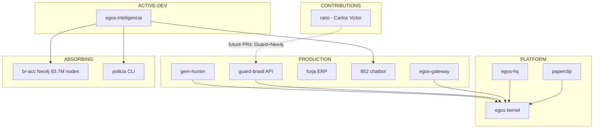

# REPO MAP — EGOS Ecosystem Canonical Classification
> **Version:** 1.0.0 | **Created:** 2026-04-09 | **SSOT for repo classification**
> Anti-confusion guide for AI agents and humans. Use this, ignore older inventory files.

---

## Canonical Classification Table

| Grupo | Repos | Status | Path local |
|-------|-------|--------|-----------|
| **PRODUCTION** | guard-brasil, forja, 852, gem-hunter, egos-gateway | Live com usuários ou pilot | `/home/enio/{forja,852}` + `/home/enio/egos/{apps/egos-gateway,packages/gem-hunter}` |
| **PLATFORM** | egos (kernel), egos-hq, paperclip | Infra interna | `/home/enio/egos`, `/opt/apps/{egos-hq,paperclip}` |
| **ACTIVE-DEV** | egos-inteligencia | Em construção, busca parceiros | `/home/enio/egos-inteligencia` |
| **CONTRIBUTIONS** | ratio | Read-only (PRs externos a Carlos Victor) | `/home/enio/contributions/ratio` |
| **ABSORBING** | policia → egos-inteligencia, br-acc → egos-inteligencia | Migrando peças úteis | `/home/enio/{policia,br-acc}` |
| **PARKED** | arch | Aguarda parceiro de arte | `/home/enio/arch` |
| **ARCHIVING** | egos-lab | Sinalizado para arquivamento | `/home/enio/egos-lab` |

---

## Dependency Graph

---

## Critical Clarifications (anti-confusion for AI agents)

### 1. ratio — NOT a joint product
`ratio` is Carlos Victor Rodrigues' repo (`carlosvictorodrigues/ratio`). We host a copy on VPS only to test 3 planned PRs:
- PR 1: Claude fallback (OpenRouter)
- PR 2: Guard Brasil PII protection
- PR 3: Neo4j entity extraction

**Rule:** Never touch ratio source code. Observe only. Local path: `/home/enio/contributions/ratio`.

### 2. 852 ≠ policia — they are different
- **852**: Public Next.js chatbot, live at `852.egos.ia.br`. Chat UI layer.
- **policia**: Private Python CLI (DHPP, document automation). Backend/ops layer.
- Both will eventually merge into `egos-inteligencia`, but in different layers.

### 3. egos-inteligencia = fusion project
Combines: `intelink` + `br-acc` (Neo4j data) + `852` (chat UI logic) + `policia` (case templates)
- Phase 1: FastAPI + Next.js 15 + Neo4j 5.x, ~30 commits/month
- br-acc remains canonical for Neo4j (83.7M nodes); egos-inteligencia consumes via `api/src/bracc/__init__.py`

### 4. gem-hunter is embedded in kernel (but shouldn't be)
Core engine lives in `agents/agents/gem-hunter.ts` (2537 LOC). Needs to become standalone.
- `agents/api/gem-hunter-server.ts` — already isolated (no kernel imports)
- `packages/gem-hunter/` — npm package v6.0.0, fully portable
- Migration tracked in GH-STANDALONE tasks

### 5. egos-lab is archiving
It was the "lab" for experimental agents. Now superseded by the kernel + paperclip.
Signal: sinalizado para arquivamento. Do not add new features there.

### 6. br-acc stays online
83.7M Neo4j nodes — real production data. egos-inteligencia depends on it.
Do NOT decommission. Selective port of useful pieces to egos-inteligencia over time.

---

## VPS Locations

| Service | Path | Port |
|---------|------|------|
| paperclip | `/opt/apps/paperclip` | 3100 |
| egos-hq | `/opt/apps/egos-hq` | 3060 |
| egos-gateway | `/opt/apps/egos-gateway` | 3050 |
| 852 chatbot | `/opt/apps/852` | varies |
| ratio (test) | `/opt/apps/ratio` | 3001 |
| br-acc | `/opt/apps/br-acc` | 7474 (Neo4j) |

---

## Deprecated References

The following files are superseded by this REPO_MAP.md:
- `docs/COMPLETE_REPO_INVENTORY_2026-04-03.md` — older, incomplete
- `docs/ECOSYSTEM_REGISTRY.md` classification sections — use this table instead

*Last updated: 2026-04-09 by Sonnet 4.6 (Opus planning session)*
