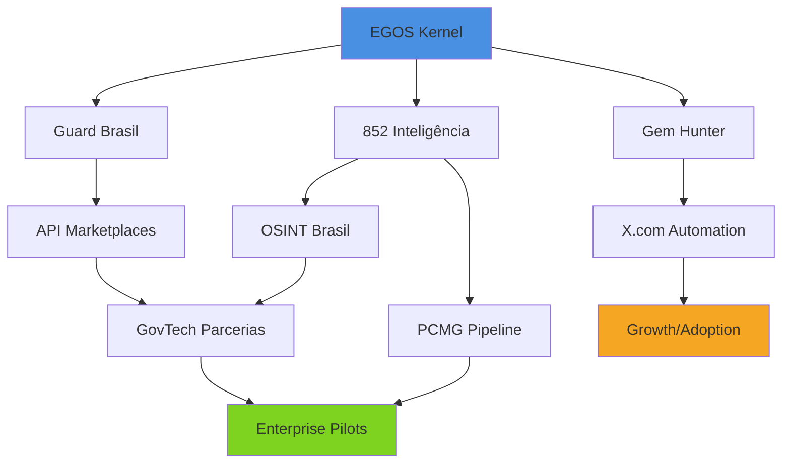

# ROADMAP EGOS — Plano Completo de Desenvolvimento

**Versão:** 1.0.0  
**Atualizado:** 2026-04-08  
**Horizonte:** Abril 2026 → Março 2027  
**Status:** Draft para revisão

---

## 📊 Visão Executiva

O ecossistema EGOS evolui de **framework de orquestração** para **plataforma de inteligência policial e govtech** completa, com 6 produtos interligados:

| Produto | Estado | Foco |
|---------|--------|------|
| **EGOS Kernel** | 🟢 Core estável | Orquestração, agentes, governança |
| **Guard Brasil** | 🟡 Pronto para scale | PII masking, LGPD compliance |
| **852 Inteligência** | 🟢 Produção | Chatbot anônimo para PCMG |
| **Gem Hunter** | 🟡 Feedback loop em dev | Discovery engine |
| **PCMG/Polícia** | 🟢 Completo | Pipeline de dados investigativos |
| **OSINT Brasil** | 🟡 50% docs | Toolkit investigativo |

---

## 🎯 Roadmap por Horizonte

### FASE 1: Curto Prazo (2-4 semanas) — **Consolidação**
*Objetivo: Fechar loops abertos, integrar sistemas, preparar para growth*

#### Semana 1-2: Gem Hunter + X.com
| Task | Descrição | Owner | Status |
|------|-----------|-------|--------|
| GH-096 | HQ aba "Feedback Loop" — score drift chart | EGOS | ⏳ |
| GH-097 | Auto-DM sequences (day 0/3/7) | EGOS | ⏳ |
| X-COM-023 | Hermes integration — análise semanal keywords | EGOS | ⏳ |
| X-COM-024 | Templates DM específicos (OSINT/AI/GovTech) | EGOS | ⏳ |

#### Semana 3-4: OSINT + Guard Brasil
| Task | Descrição | Owner | Status |
|------|-----------|-------|--------|
| OSINT-006 | Integração Brasil.IO/Escavador no 852 | 852 | ⏳ |
| OSINT-007 | Templates DM para delegacias | EGOS | ⏳ |
| OSINT-008 | HIBP API alerts no Guard Brasil | Guard | ⏳ |
| API-002 | APINow.fun — conta + tokenization | Guard | ⏳ |
| API-003 | Proxies.sx avaliação | Guard | ⏳ |

---

### FASE 2: Médio Prazo (2-3 meses) — **Growth & Parcerias**
*Objetivo: Escalar distribuição, fechar parcerias govtech, melhorar UX*

#### Mês 1: GovTech + API Scale
| Task | Descrição | Impacto | Status |
|------|-----------|---------|--------|
| GOV-TECH-005 | Monitoramento diário de licitações | Novas oportunidades | ⏳ |
| GOV-TECH-006 | One-pager "Eagle Eye para Parceiros" | Enable partnerships | ⏳ |
| GOV-TECH-007 | Identificar 5 software houses | Pipeline parcerias | ⏳ |
| API-006 | x402-mcp wrapper | Monetização MCP | ⏳ |
| API-007 | Submit Guard Brasil em Smithery | 5,000+ servers reach | ⏳ |
| API-008 | Listar em Glama | SEO discovery | ⏳ |

#### Mês 2: 852 UX + Notificações
| Task | Descrição | User Impact | Status |
|------|-----------|-------------|--------|
| 852-Notif | Notificações por email (tópicos votados) | Engajamento | ⏳ |
| 852-ATRiAN | ATRiAN v2 — NeMo Guardrails | Safety + trust | ⏳ |
| 852-Tool | Tool use: web search institucional | Data accuracy | ⏳ |
| 852-BYOK | Bring Your Own Key | User autonomy | ⏳ |
| OSINT-010 | Monitoramento diários oficiais | Inteligência automática | ⏳ |

#### Mês 3: GovTech Pilots + OSINT Scale
| Task | Descrição | Revenue Potential | Status |
|------|-----------|-------------------|--------|
| GOV-TECH-009 | Atestado técnico via piloto | Primeira receita gov | ⏳ |
| OSINT-011 | Portal Transparência webhooks | Novos contratos | ⏳ |
| OSINT-012 | API Receita Federal com cache | Compliance accuracy | ⏳ |
| API-016 | RapidAPI provider account | 4M devs reach | ⏳ |
| DRIFT-012 | Drift dashboard em hq.egos.ia.br | Observabilidade | ⏳ |

---

### FASE 3: Longo Prazo (6-12 meses) — **Dominação de Nicho**
*Objetivo: Liderança em inteligência policial BR, govtech scale, IA nativa*

#### Mês 4-6: Enterprise + AI-Native
| Iniciativa | Descrição | Diferencial |
|------------|-----------|-------------|
| **PCMG Integration** | Conectar pipeline PCMG com 852 | Dados operacionais reais |
| **AI Reports v2** | Auto-análise cross-report | Inteligência agregada |
| **Maltego Plugin** | Visualização gráfica de vínculos (OSINT-014) | Network analysis |
| **ExifTool Plugin** | Análise de metadados forense | Evidence integrity |
| **GEOINT Module** | TerraBrasilis + Sentinel Hub | Casos ambientais |

#### Mês 7-9: Tokenomics + DAO Exploration
| Iniciativa | Descrição | Rationale |
|------------|-----------|-----------|
| **Virtuals Tokenization** | 852 como agent tokenizado | Liquidity + incentives |
| **Heurist Mesh Skills** | Web3 audience reach | New market |
| **Nevermined Integration** | Visa card rails | Enterprise payments |
| **API Coins** | APINow.fun model exploration | User retention |

#### Mês 10-12: Platform + Expansion
| Iniciativa | Descrição | Scale |
|------------|-----------|-------|
| **PMMG/PF Expansion** | Replicar modelo 852 para outras polícias | 3x user base |
| **Cross-Product Mesh** | Inteligência compartilhada entre produtos | Network effects |
| **SICAF Registration** | Habilitação completa gov | Direct contracts |
| **Open Source Core** | EGOS kernel open source | Community growth |

---

## 🔗 Dependências Críticas



| Dependência | Bloqueia | Mitigação |
|-------------|----------|-----------|
| GovTech parcerias → Pilotos | GOV-TECH-009 | Identificar 5 prospects já em semana 1 |
| 852 ATRiAN v2 → Confiança institucional | Deploy PCMG | Fazer em paralelo com documentação |
| API marketplaces → Revenue | API-019/20 | Foco em 3 plataformas principais |
| OSINT HIBP → Guard Brasil value | OSINT-008 | Implementar como diferencial LGPD |

---

## 📈 Métricas de Sucesso

### Curto Prazo (Checkpoint: 2026-05-01)
| Métrica | Target | Atual |
|---------|--------|-------|
| Gem Hunter feedback entries | 50+ | 0 |
| X.com monitoring queries | 25+ | 23 |
| Guard Brasil marketplace listings | 3+ | 1 (AgentCash) |
| OSINT Brasil integrations | 2+ | 0 |
| 852 active users (MAU) | 100+ | ~50 |

### Médio Prazo (Checkpoint: 2026-07-01)
| Métrica | Target | Atual |
|---------|--------|-------|
| GovTech partner conversations | 10+ | 0 |
| API marketplace revenue | R$ 1,000+ | R$ 0 |
| Guard Brasil API calls/month | 10,000+ | ~1,000 |
| 852 MAU | 500+ | ~50 |
| OSINT automated alerts | 100+/mês | 0 |

### Longo Prazo (Checkpoint: 2027-03-01)
| Métrica | Target | Atual |
|---------|--------|-------|
| Enterprise pilots (paid) | 3+ | 0 |
| Monthly recurring revenue | R$ 10,000+ | R$ 0 |
| Active police departments | 5+ | 1 (PCMG test) |
| API marketplace presence | 10+ platforms | 1 |
| Open source contributors | 20+ | 2 |

---

## 🗓️ Cronograma Visual

```
2026        | Abril | Maio | Junho | Julho | Ago | Set | Out | Nov | Dez | Jan'27 | Fev | Mar
-----------|-------|------|-------|-------|-----|-----|-----|-----|-----|--------|-----|-----
FASE 1     | ████████████████████████████████████████████████████████████
           | Gem Hunter loop | X.com scale | OSINT base | Guard listings
           |
FASE 2     |       | ██████████████████████████████████████████████████████████████████████████████
           |       | GovTech partners | API scale | 852 UX | Notificações
           |
FASE 3     |                               | ████████████████████████████████████████████████████████████
                                           | PCMG integration | AI-native | Tokenomics | PMMG/PF
           |
MILESTONES |       |        |        | 🎯 GovTech 1ª parceria
           |       |        |        |        | 🎯 852 500 MAU
           |       |        |        |        |        | 🎯 Guard R$1k MRR
           |       |        |        |        |        |        | 🎯 PCMG pilot
           |                               |        |        |        |        | 🎯 3 polícias
```

---

## ⚠️ Riscos e Mitigações

| Risco | Prob. | Impacto | Mitigação |
|-------|-------|---------|-----------|
| GovTech parcerias não decolam | Média | Alto | Diversificar para 10 prospects, focar em SAAE/âmbito municipal |
| 852 adoção lenta na PCMG | Média | Alto | Campanha QR code delegacias, gamification, feedback loop |
| API marketplaces saturadas | Baixa | Médio | Foco em nicho (LGPD/BR) — diferencial único |
| Neo4j 77M entities offline | Baixa | Alto | Documentar status, plano de reativação em TASKS.md |
| Gem Hunter quality degradation | Média | Médio | Feedback loop + repetition detector já em dev |
| X.com API changes | Média | Médio | Abstrair layer, fallback para RSS/scraping |

---

## 🎯 Prioridade de Execução (Próximos 7 Dias)

1. **Segunda:** Finalizar GH-096 (Feedback Loop dashboard)
2. **Terça:** Implementar OSINT-006 (Brasil.IO no 852)
3. **Quarta:** Submit Guard Brasil em Smithery (API-007)
4. **Quinta:** Criar one-pager GovTech (GOV-TECH-006)
5. **Sexta:** HIBP integration (OSINT-008)
6. **Sábado:** Documentação + handoff
7. **Domingo:** Review semanal + ajuste roadmap

---

## 📋 Checklist de Decisões Pendentes

- [ ] **GovTech:** Foco em SAAE (água) ou expandir para outras prefeituras?
- [ ] **Pricing:** Guard Brasil manter usage-based ou testar híbrido?
- [ ] **852:** Priorizar notificações email ou ATRiAN v2 primeiro?
- [ ] **Gem Hunter:** Auto-DM para todos ou apenas high-score gems?
- [ ] **X.com:** Criar conta bot dedicada ou usar conta pessoal?

---

## 📚 Referências

- `TASKS.md` (EGOS Kernel) — v2.55.0
- `TASKS.md` (852) — Sprint backlog
- `TASKS.md` (Policia) — Completo ✅
- `docs/strategy/GUARD_BRASIL_PRICING_RESEARCH.md`
- `docs/knowledge/OSINT_BRASIL_MATRIX.md`
- `docs/social/X_FEATURES_INTEGRATION_ROADMAP.md`

---

**Próximo passo:** Revisar roadmap em call, priorizar fase 1, executar.
