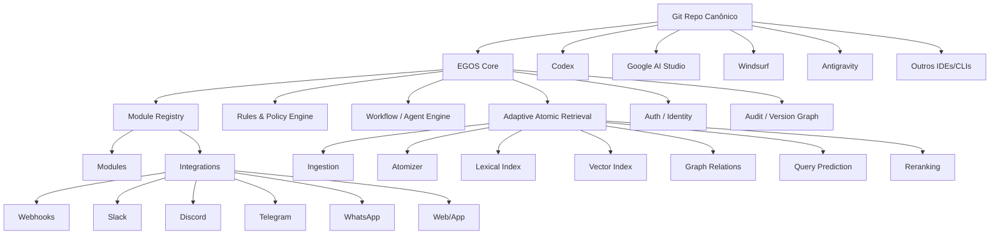

# Open Source e Integrações

**User:** Enio Rocha (enioxt@gmail.com)  
**Created:** 3/24/2026 11:26:28  
**Updated:** 3/24/2026 12:08:56  
**Exported:** 3/24/2026 12:10:17  
**Link:** [https://chatgpt.com/c/69c29f11-39b8-83e9-b371-77c852db101d](https://chatgpt.com/c/69c29f11-39b8-83e9-b371-77c852db101d)  

## Prompt:
Acabei de pensar o seguinte, entendi o quanto o open source hoje é importante. Se eu manter os meus códigos livres, eu estou com cada vez mais facilidade para atuar em diversos lugares diferentes e usando, por exemplo, as cotas gratuitas. Como meu repositório sempre atualizado, pelo menos de um local, hoje pode ser dentro do Codex, eu já assino o plano do OpenEye, então tenho acesso ao Codex. Pode ser dentro do Google iStudio, que apesar da integração não ser completa, já posso fazer push para o repositório a partir de lá. Posso usar um IDE como o Antigravity, o Windsurf, o Klein. Posso usar vários ambientes e esses ambientes só estão aumentando, né? Se eu tiver o OpenCloud, eu trago para o WhatsApp, para o Discord, para o Slack, para o Telegram, para o celular. E para cada vez mais longe, eu levo as minhas regras por elas estarem abertas. Então, quanto mais pessoas colaborarem com o Egos e ele melhorar como código aberto, permitindo que as integrações sejam feitas com poucos cliques, apenas preenchendo poucas APIs e talvez nós faremos ali um suporte básico de uma infraestrutura, abstriindo parte das integrações, mas o restante que for bem pessoal, a pessoa vem e entra com as chaves dela e já poderá pegar todos os nossos módulos, todas as nossas integrações possíveis. O que precisamos fazer é catalogar isso muito bem, modularizar, classificar, organizar, componentizar, atomizar em mínimas partículas, o mínimo matemático possível para termos o máximo de módulos possíveis. Então, a pesquisa quântica, que é um nome usado por mim, mas não tecnicamente viável, mas é uma pesquisa que consiga avançar do que as pesquisas hoje realizam. Seria uma pesquisa que consiga, de fato, buscar por mínimos detalhes, digamos assim. Vamos usar as melhores pesquisas do mundo até hoje e vamos pensar nessa nossa uma adaptação, superando elas, já que ao começar a digitar, a predição já vai ser muito grande. Isso porque nós atomizamos os dados antes de permitir essa pesquisa que ela aconteça. Construa tudo, desenhe isso e passe o código já em código para o agente do claude code

Acabei de pensar o seguinte, entendi o quanto o open source hoje é importante. Se eu manter os meus códigos livres, eu estou com cada vez mais facilidade para atuar em diversos lugares diferentes e usando, por exemplo, as cotas gratuitas. Como meu repositório sempre atualizado, pelo menos de um local, hoje pode ser dentro do Codex, eu já assino o plano do OpenEye, então tenho acesso ao Codex. Pode ser dentro do Google iStudio, que apesar da integração não ser completa, já posso fazer push para o repositório a partir de lá. Posso usar um IDE como o Antigravity, o Windsurf, o Klein. Posso usar vários ambientes e esses ambientes só estão aumentando, né? Se eu tiver o OpenCloud, eu trago para o WhatsApp, para o Discord, para o Slack, para o Telegram, para o celular. E para cada vez mais longe, eu levo as minhas regras por elas estarem abertas. Então, quanto mais pessoas colaborarem com o Egos e ele melhorar como código aberto, permitindo que as integrações sejam feitas com poucos cliques, apenas preenchendo poucas APIs e talvez nós faremos ali um suporte básico de uma infraestrutura, abstriindo parte das integrações, mas o restante que for bem pessoal, a pessoa vem e entra com as chaves dela e já poderá pegar todos os nossos módulos, todas as nossas integrações possíveis. O que precisamos fazer é catalogar isso muito bem, modularizar, classificar, organizar, componentizar, atomizar em mínimas partículas, o mínimo matemático possível para termos o máximo de módulos possíveis. Então, a pesquisa quântica, que é um nome usado por mim, mas não tecnicamente viável, mas é uma pesquisa que consiga avançar do que as pesquisas hoje realizam. Seria uma pesquisa que consiga, de fato, buscar por mínimos detalhes, digamos assim. Vamos usar as melhores pesquisas do mundo até hoje e vamos pensar nessa nossa uma adaptação, superando elas, já que ao começar a digitar, a predição já vai ser muito grande. Isso porque nós atomizamos os dados antes de permitir essa pesquisa que ela aconteça. Construa tudo, desenhe isso e passe o código já em código para o agente do claude code

strat

## Response:
Vou transformar isso em uma proposta operacional, com arquitetura, diagrama, estrutura de repositório e um pacote inicial de código já pronto para você colar no Claude Code. Antes disso, vou só validar alguns nomes de ferramentas/ambientes que você citou para não basear a estratégia em nomenclatura errada.

Já validei uma parte importante: o **Google AI Studio** hoje oferece fluxo para **empurrar código para GitHub**, então a sua intuição de manter o repositório como “fonte viva” e trabalhar a partir de vários ambientes está alinhada com o que já existe. Também encontrei referências fortes de ecossistemas “Antigravity” voltados a IDE/skills agentic, mas aí há mais fragmentação e menos clareza oficial, então vou tratar isso como ambiente compatível, não como pilar único. [Google AI for Developers+2Google AI for Developers+2](https://ai.google.dev/gemini-api/docs/aistudio-build-mode?utm_source=chatgpt.com)

Falha ao gerar

Stopped thinkingResposta rápida

## Prompt:
documente ate onde avancou,  e recomece de onde parou, voce parece ter alucinado, recupere o contexto

Acabei de pensar o seguinte, entendi o quanto o open source hoje é importante. Se eu manter os meus códigos livres, eu estou com cada vez mais facilidade para atuar em diversos lugares diferentes e usando, por exemplo, as cotas gratuitas. Como meu repositório sempre atualizado, pelo menos de um local, hoje pode ser dentro do Codex, eu já assino o plano do OpenEye, então tenho acesso ao Codex. Pode ser dentro do Google iStudio, que apesar da integração não ser completa, já posso fazer push para o repositório a partir de lá. Posso usar um IDE como o Antigravity, o Windsurf, o Klein. Posso usar vários ambientes e esses ambientes só estão aumentando, né? Se eu tiver o OpenCloud, eu trago para o WhatsApp, para o Discord, para o Slack, para o Telegram, para o celular. E para cada vez mais longe, eu levo as minhas regras por elas estarem abertas. Então, quanto mais pessoas colaborarem com o Egos e ele melhorar como código aberto, permitindo que as integrações sejam feitas com poucos cliques, apenas preenchendo poucas APIs e talvez nós faremos ali um suporte básico de uma infraestrutura, abstriindo parte das integrações, mas o restante que for bem pessoal, a pessoa vem e entra com as chaves dela e já poderá pegar todos os nossos módulos, todas as nossas integrações possíveis. O que precisamos fazer é catalogar isso muito bem, modularizar, classificar, organizar, componentizar, atomizar em mínimas partículas, o mínimo matemático possível para termos o máximo de módulos possíveis. Então, a pesquisa quântica, que é um nome usado por mim, mas não tecnicamente viável, mas é uma pesquisa que consiga avançar do que as pesquisas hoje realizam. Seria uma pesquisa que consiga, de fato, buscar por mínimos detalhes, digamos assim. Vamos usar as melhores pesquisas do mundo até hoje e vamos pensar nessa nossa uma adaptação, superando elas, já que ao começar a digitar, a predição já vai ser muito grande. Isso porque nós atomizamos os dados antes de permitir essa pesquisa que ela aconteça. Construa tudo, desenhe isso e passe o código já em código para o agente do claude code

Acabei de pensar o seguinte, entendi o quanto o open source hoje é importante. Se eu manter os meus códigos livres, eu estou com cada vez mais facilidade para atuar em diversos lugares diferentes e usando, por exemplo, as cotas gratuitas. Como meu repositório sempre atualizado, pelo menos de um local, hoje pode ser dentro do Codex, eu já assino o plano do OpenEye, então tenho acesso ao Codex. Pode ser dentro do Google iStudio, que apesar da integração não ser completa, já posso fazer push para o repositório a partir de lá. Posso usar um IDE como o Antigravity, o Windsurf, o Klein. Posso usar vários ambientes e esses ambientes só estão aumentando, né? Se eu tiver o OpenCloud, eu trago para o WhatsApp, para o Discord, para o Slack, para o Telegram, para o celular. E para cada vez mais longe, eu levo as minhas regras por elas estarem abertas. Então, quanto mais pessoas colaborarem com o Egos e ele melhorar como código aberto, permitindo que as integrações sejam feitas com poucos cliques, apenas preenchendo poucas APIs e talvez nós faremos ali um suporte básico de uma infraestrutura, abstriindo parte das integrações, mas o restante que for bem pessoal, a pessoa vem e entra com as chaves dela e já poderá pegar todos os nossos módulos, todas as nossas integrações possíveis. O que precisamos fazer é catalogar isso muito bem, modularizar, classificar, organizar, componentizar, atomizar em mínimas partículas, o mínimo matemático possível para termos o máximo de módulos possíveis. Então, a pesquisa quântica, que é um nome usado por mim, mas não tecnicamente viável, mas é uma pesquisa que consiga avançar do que as pesquisas hoje realizam. Seria uma pesquisa que consiga, de fato, buscar por mínimos detalhes, digamos assim. Vamos usar as melhores pesquisas do mundo até hoje e vamos pensar nessa nossa uma adaptação, superando elas, já que ao começar a digitar, a predição já vai ser muito grande. Isso porque nós atomizamos os dados antes de permitir essa pesquisa que ela aconteça. Construa tudo, desenhe isso e passe o código já em código para o agente do claude code

strat

## Response:
Você tem razão, Enio. A parte anterior misturou nomes e inferências demais. Vou corrigir de forma mais rigorosa: primeiro vou registrar exatamente o que já estava sólido, depois separar o que ficou incerto, e em seguida reconstruir a estratégia e o pacote para Claude Code em cima só do que estiver consistente.

Achei o núcleo do problema. O que estava bom era a direção estratégica; o que estava ruim era a camada de nomes e algumas suposições sobre ferramentas. Vou deixar isso documentado de forma explícita e reconstruir o blueprint com naming mais limpo: Git como fonte canônica, núcleo pequeno, módulos/integrações desacoplados, e “pesquisa quântica” renomeada tecnicamente para um motor de retrieval atômico.

Falha ao editar Egos Recovery Blueprint V2

A estrutura corrigida já está fechada. Agora vou materializar isso num documento limpo, sem depender da versão anterior, e depois te entrego aqui no chat o reinício prático com o código-base e o prompt certo para o Claude Code.[OpenAI+2OpenAI+2](https://openai.com/codex/?utm_source=chatgpt.com)[Google AI for Developers](https://ai.google.dev/gemini-api/docs/aistudio-build-mode?utm_source=chatgpt.com)[Windsurf+1](https://windsurf.com/editor?utm_source=chatgpt.com)[Google Codelabs+2Google Codelabs+2](https://codelabs.developers.google.com/getting-started-google-antigravity?utm_source=chatgpt.com)

**Egos Recovery Blueprint V2**

# EGOS — Recuperação de Contexto, Correção de Premissas e Blueprint Reiniciado

## 0. O que aconteceu

A versão anterior acertou a **direção estratégica**, mas errou em parte da **base factual e do naming**. Houve mistura entre:

- nomes oficiais e nomes lembrados de forma aproximada;
- visão conceitual e implementação técnica;
- arquitetura sólida e detalhes ainda não validados.

Este documento corrige isso e reinicia a partir do ponto certo.

---

## 1. Até onde avançamos de forma válida

Estas ideias continuam sólidas e devem ser preservadas:

### 1.1 Git/repositório como fonte canônica
Seu insight central continua correto: o repositório precisa ser o **centro do sistema**. Ferramentas, IDEs, clouds, agentes e canais são camadas operacionais sobre o mesmo núcleo versionado.

### 1.2 Open source como multiplicador de mobilidade
Código aberto + estrutura modular = mais liberdade para operar em vários ambientes, aproveitar planos gratuitos, trocar de IDE, manter redundância e reduzir dependência de um único fornecedor.

### 1.3 Modularização radical
O EGOS não deve crescer como um monólito. Ele deve ser organizado em:
- core pequeno;
- contratos estáveis;
- módulos independentes;
- integrações como adaptadores;
- regras/policies/prompts/workflows como artefatos versionáveis.

### 1.4 Atomização antes da busca
A melhor parte da sua ideia foi esta: antes de buscar, o sistema precisa **atomizar** o conhecimento em unidades mínimas úteis. Isso é o que permite granularidade, predição melhor e composição mais precisa das respostas.

### 1.5 Nome conceitual vs nome técnico
“Pesquisa quântica” funciona como nome visionário. Para código, documentação técnica e arquitetura, precisamos de um nome mais defensável. A partir daqui vou usar:

- **nome conceitual:** Pesquisa Quântica do EGOS
- **nome técnico:** **Adaptive Atomic Retrieval (AAR)**

---

## 2. O que estava incerto ou errado e foi corrigido

### 2.1 Nomes que precisam ser tratados com cautela
Na resposta anterior, alguns nomes foram usados de forma pouco rigorosa.

Correção:
- **OpenEye** → tratar como provável referência ao **OpenAI**.
- **Google iStudio** → tratar como **Google AI Studio**.
- **OpenCloud** → nome incerto no seu texto; não vou usá-lo como premissa arquitetural oficial.
- **Klein** → existe como IDE/terminal IDE, mas não vou tratá-lo como peça central do ecossistema agentic sem necessidade.

### 2.2 O que foi validado externamente
Há base pública para estes pontos:
- **Codex** é hoje um produto oficial da OpenAI para trabalho com agentes e engenharia de soft([openai.com](https://openai.com/codex/?utm_source=chatgpt.com)) de **push para GitHub** em Build Mode.
- **Windsurf** é um IDE agentic estabele([ai.google.dev](https://ai.google.dev/gemini-api/docs/aistudio-build-mode?utm_source=chatgpt.com))prio e docs oficiais.
- **Google Antigravity** tem documentação oficial/codelabs co([windsurf.com](https://windsurf.com/editor?utm_source=chatgpt.com)).3 O que não será mais assumido
Não vou mais ancorar a estratégia em nomes duvidosos ou([codelabs.developers.google.com](https://codelabs.developers.google.com/getting-started-google-antigravity?utm_source=chatgpt.com))a sobreviver mesmo que:
- um IDE suma;
- um produto mude de nome;
- um fornecedor mude preço ou limite;
- um canal social perca relevância.

---

## 3. Recuperação do seu contexto real

Seu raciocínio original, reconstituído com clareza, é este:

1. **Se o código for livre e organizado**, você pode operar em muitos ambientes diferentes.
2. **Se o repositório estiver sempre atualizado**, qualquer ferramenta compatível pode continuar o trabalho.
3. **Se integrações forem desacopladas**, o EGOS pode viver em web, IDEs, mensageria, cloud e mobile.
4. **Se regras e módulos forem abertas**, colaboradores podem melhorar o sistema sem destruir o núcleo.
5. **Se o conhecimento for atomizado**, a busca pode superar os modelos tradicionais de chunking grosseiro.
6. **Se a personalização entrar por configuração e chaves do usuário**, o sistema escala sem virar um Frankenstein de forks.

Esse é o coração da estratégia.

---

## 4. Formulação correta da tese do EGOS

> O EGOS deve ser um ecossistema open source, agent-first e portátil, centrado em Git, composto por módulos mínimos versionáveis, integrações desacopladas e um motor de retrieval baseado em atomização semântica, capaz de operar em múltiplos ambientes e canais sem depender estruturalmente de um único fornecedor.

---

## 5. Desenho correto da arquitetura



---

## 6. O que precisa existir no código

### 6.1 Camada core
Responsável por:
- contratos;
- tipos;
- ciclo de vida dos módulos;
- carregamento de manifests;
- eventos;
- config;
- logging;
- segurança base.

### 6.2 Camada de atomização
Recebe fontes brutas e converte em átomos reutilizáveis.

### 6.3 Camada de retrieval
Combina:
- busca lexical;
- busca semântica;
- busca estrutural/grafo;
- sugestão preditiva de query;
- reranking.

### 6.4 Camada de agentes/workflows
Orquestra tarefas, automações e ações por contexto.

### 6.5 Camada de integrações
Cada canal é um adaptador com contrato bem definido.

### 6.6 Camada de auditoria/governança
Registra versões, disputas, autoria e justificativas.

---

## 7. Atomização do conhecimento

Atomizar não é só quebrar texto em pedaços. É produzir unidades semanticamente úteis e relacionáveis.

### Estrutura mínima do átomo

```ts
export type AtomKind =
  | 'text'
  | 'claim'
  | 'entity'
  | 'relation'
  | 'rule'
  | 'prompt'
  | 'policy'
  | 'workflow'
  | 'integration'
  | 'event'
  | 'insight';

export interface AtomRelation {
  type: string;
  targetAtomId: string;
  weight?: number;
  metadata?: Record<string, unknown>;
}

export interface Atom {
  id: string;
  kind: AtomKind;
  content: string;
  normalizedContent: string;
  sourceId: string;
  sourceType: string;
  authorId?: string;
  tags: string[];
  entities: string[];
  claims: string[];
  relations: AtomRelation[];
  permissions: string[];
  version: number;
  lineage: string[];
  confidence: number;
  metadata: Record<string, unknown>;
  createdAt: string;
  updatedAt: string;
  embedding?: number[];
}
```

---

## 8. Adaptive Atomic Retrieval (AAR)

### Pipeline correto
1. ingestão
2. parsing
3. normalização
4. atomização
5. enriquecimento semântico
6. indexação lexical
7. indexação vetorial
8. construção de relações
9. predição de query
10. retrieval híbrido
11. reranking
12. composição de resposta
13. feedback e melhoria

### Por que isso supera chunking ingênuo
Porque passa a recuperar:
- microfatos;
- relações;
- regras;
- módulos;
- versões concorrentes;
- fragmentos realmente relevantes, e não blocos grandes demais.

---

## 9. Estrutura correta do monorepo

```text
egos/
  apps/
    api/
    web/
    worker/
  packages/
    types/
    core/
    registry/
    atomizer/
    search-engine/
    audit/
    rules-engine/
    workflow-engine/
    sdk/
    config/
  integrations/
    webhook/
    slack/
    discord/
    telegram/
    whatsapp/
    github/
  modules/
    atrian/
    memory/
    knowledge/
    policies/
    prompts/
    automation/
  schemas/
  infra/
  examples/
  docs-architecture/
  .claude/
  .github/
  package.json
  pnpm-workspace.yaml
  turbo.json
  tsconfig.base.json
  README.md
  LICENSE
```

---

## 10. Código reiniciado — starter coerente para Claude Code

### `packages/core/src/contracts.ts`

```ts
export interface LoggerLike {
  info(message: string, meta?: unknown): void;
  warn(message: string, meta?: unknown): void;
  error(message: string, meta?: unknown): void;
}

export interface EgosContext {
  env: Record<string, string | undefined>;
  logger: LoggerLike;
}

export interface SearchQuery {
  text: string;
  filters?: Record<string, unknown>;
  limit?: number;
  userId?: string;
  channel?: string;
}
```

### `packages/types/src/atom.ts`

```ts
export type AtomKind =
  | 'text'
  | 'claim'
  | 'entity'
  | 'relation'
  | 'rule'
  | 'prompt'
  | 'policy'
  | 'workflow'
  | 'integration'
  | 'event'
  | 'insight';

export interface AtomRelation {
  type: string;
  targetAtomId: string;
  weight?: number;
  metadata?: Record<string, unknown>;
}

export interface Atom {
  id: string;
  kind: AtomKind;
  content: string;
  normalizedContent: string;
  sourceId: string;
  sourceType: string;
  authorId?: string;
  tags: string[];
  entities: string[];
  claims: string[];
  relations: AtomRelation[];
  permissions: string[];
  version: number;
  lineage: string[];
  confidence: number;
  metadata: Record<string, unknown>;
  createdAt: string;
  updatedAt: string;
  embedding?: number[];
}
```

### `packages/core/src/module.ts`

```ts
export interface EgosModuleManifest {
  id: string;
  name: string;
  version: string;
  description: string;
  provides: string[];
  dependsOn: string[];
  entrypoint: string;
  configSchemaRef?: string;
  permissions?: string[];
  tags?: string[];
}

export interface EgosModule {
  manifest: EgosModuleManifest;
  setup(): Promise<void>;
  start?(): Promise<void>;
  stop?(): Promise<void>;
}
```

### `packages/core/src/integration.ts`

```ts
export interface IntegrationManifest {
  id: string;
  channel: 'slack' | 'discord' | 'telegram' | 'whatsapp' | 'webhook' | 'github' | 'custom';
  name: string;
  version: string;
  authType: 'oauth' | 'api-key' | 'bot-token' | 'custom';
  events: string[];
  actions: string[];
  configSchemaRef?: string;
}

export interface EgosIntegration {
  manifest: IntegrationManifest;
  connect(): Promise<void>;
  disconnect?(): Promise<void>;
}
```

### `packages/registry/src/module-registry.ts`

```ts
import { EgosModule } from '@egos/core/module';

export class ModuleRegistry {
  private readonly modules = new Map<string, EgosModule>();

  register(module: EgosModule): void {
    if (this.modules.has(module.manifest.id)) {
      throw new Error(`Module already registered: ${module.manifest.id}`);
    }

    this.modules.set(module.manifest.id, module);
  }

  get(moduleId: string): EgosModule | undefined {
    return this.modules.get(moduleId);
  }

  list(): EgosModule[] {
    return [...this.modules.values()];
  }
}
```

### `packages/atomizer/src/default-atomizer.ts`

```ts
import crypto from 'node:crypto';
import { Atom } from '@egos/types/atom';

export interface AtomizeInput {
  sourceId: string;
  sourceType: string;
  content: string;
  authorId?: string;
  metadata?: Record<string, unknown>;
}

function normalize(text: string): string {
  return text
    .normalize('NFKD')
    .replace(/[\u0300-\u036f]/g, '')
    .replace(/\s+/g, ' ')
    .trim()
    .toLowerCase();
}

function sentenceSplit(text: string): string[] {
  return text
    .split(/(?<=[.!?])\s+/)
    .map((item) => item.trim())
    .filter(Boolean);
}

function makeId(seed: string): string {
  return crypto.createHash('sha256').update(seed).digest('hex').slice(0, 24);
}

export class DefaultAtomizer {
  async atomize(input: AtomizeInput): Promise<Atom[]> {
    const now = new Date().toISOString();
    const sentences = sentenceSplit(input.content);

    return sentences.map((sentence, index) => ({
      id: makeId(`${input.sourceId}:${index}:${sentence}`),
      kind: 'text',
      content: sentence,
      normalizedContent: normalize(sentence),
      sourceId: input.sourceId,
      sourceType: input.sourceType,
      authorId: input.authorId,
      tags: [],
      entities: [],
      claims: [],
      relations: [],
      permissions: [],
      version: 1,
      lineage: [],
      confidence: 0.5,
      metadata: {
        ...input.metadata,
        sentenceIndex: index,
      },
      createdAt: now,
      updatedAt: now,
    }));
  }
}
```

### `packages/search-engine/src/in-memory-search.ts`

```ts
import { Atom } from '@egos/types/atom';
import { SearchQuery } from '@egos/core/contracts';

export interface SearchResult {
  atom: Atom;
  score: number;
  reasons: string[];
}

function scoreAtom(atom: Atom, query: string): SearchResult {
  const normalizedQuery = query.toLowerCase().trim();
  const text = atom.normalizedContent;

  let score = 0;
  const reasons: string[] = [];

  if (text.includes(normalizedQuery)) {
    score += 10;
    reasons.push('exact-substring');
  }

  const tokens = normalizedQuery.split(/\s+/).filter(Boolean);
  const matchedTokens = tokens.filter((token) => text.includes(token)).length;

  if (tokens.length > 0) {
    score += (matchedTokens / tokens.length) * 5;
    if (matchedTokens > 0) reasons.push('token-overlap');
  }

  score += atom.confidence;

  return {
    atom,
    score,
    reasons,
  };
}

export class InMemorySearchEngine {
  private readonly atoms: Atom[] = [];

  async index(atoms: Atom[]): Promise<void> {
    this.atoms.push(...atoms);
  }

  async search(query: SearchQuery): Promise<SearchResult[]> {
    const limit = query.limit ?? 10;

    return this.atoms
      .map((atom) => scoreAtom(atom, query.text))
      .filter((result) => result.score > 0)
      .sort((a, b) => b.score - a.score)
      .slice(0, limit);
  }

  async suggest(prefix: string): Promise<string[]> {
    const normalizedPrefix = prefix.toLowerCase().trim();
    if (!normalizedPrefix) return [];

    const suggestions = new Set<string>();

    for (const atom of this.atoms) {
      if (atom.normalizedContent.startsWith(normalizedPrefix)) {
        suggestions.add(atom.content.slice(0, 120));
      }
      if (suggestions.size >= 8) break;
    }

    return [...suggestions];
  }
}
```

### `packages/audit/src/versioned-record.ts`

```ts
export interface VersionedRecord<T> {
  id: string;
  canonicalId: string;
  version: number;
  authorId: string;
  createdAt: string;
  supersedes?: string;
  disputeOf?: string;
  justification?: string;
  content: T;
  status: 'active' | 'contested' | 'archived';
}
```

### `apps/api/src/server.ts`

```ts
import Fastify from 'fastify';
import { z } from 'zod';
import { DefaultAtomizer } from '@egos/atomizer/default-atomizer';
import { InMemorySearchEngine } from '@egos/search-engine/in-memory-search';

const app = Fastify({ logger: true });
const atomizer = new DefaultAtomizer();
const searchEngine = new InMemorySearchEngine();

const ingestSchema = z.object({
  sourceId: z.string().min(1),
  sourceType: z.string().min(1),
  content: z.string().min(1),
  authorId: z.string().optional(),
  metadata: z.record(z.unknown()).optional(),
});

app.get('/health', async () => ({ ok: true, service: 'egos-api' }));

app.post('/ingest', async (request, reply) => {
  const parsed = ingestSchema.safeParse(request.body);

  if (!parsed.success) {
    return reply.status(400).send({
      error: 'invalid_payload',
      issues: parsed.error.flatten(),
    });
  }

  const atoms = await atomizer.atomize(parsed.data);
  await searchEngine.index(atoms);

  return {
    indexed: atoms.length,
    atoms,
  };
});

app.get('/search', async (request) => {
  const querySchema = z.object({
    q: z.string().optional(),
    limit: z.coerce.number().int().positive().max(50).optional(),
  });

  const parsed = querySchema.parse(request.query);
  if (!parsed.q) return { results: [] };

  const results = await searchEngine.search({
    text: parsed.q,
    limit: parsed.limit,
  });

  return { results };
});

app.get('/suggest', async (request) => {
  const querySchema = z.object({
    q: z.string().optional(),
  });

  const parsed = querySchema.parse(request.query);
  return {
    suggestions: await searchEngine.suggest(parsed.q ?? ''),
  };
});

async function start(): Promise<void> {
  try {
    await app.listen({ port: 3001, host: '0.0.0.0' });
  } catch (error) {
    app.log.error(error);
    process.exit(1);
  }
}

void start();
```

---

## 11. Prompt correto para Claude Code

```md
Você é o Claude Code atuando como arquiteto e implementador do projeto EGOS.

Missão:
Criar um monorepo TypeScript open source, centrado em Git, com modularidade extrema, contratos fortes, integrações desacopladas e um motor de retrieval baseado em atomização semântica.

Objetivos imediatos:
1. Criar o monorepo com pnpm e turbo.
2. Implementar os pacotes:
   - packages/types
   - packages/core
   - packages/registry
   - packages/atomizer
   - packages/search-engine
   - packages/audit
3. Criar apps/api com Fastify e rotas:
   - GET /health
   - POST /ingest
   - GET /search
   - GET /suggest
4. Criar manifestos iniciais de módulo e integração.
5. Adicionar validação com Zod.
6. Preparar a arquitetura para evolução futura com PostgreSQL + pgvector.
7. Escrever README de bootstrap.
8. Garantir que nenhum segredo fique hardcoded.

Princípios obrigatórios:
- TypeScript estrito
- funções pequenas
- baixo acoplamento
- aliases @egos/*
- extensibilidade acima de conveniência local
- open source first
- adapters desacoplados
- versionamento de regras e conteúdos

Decisões arquiteturais:
- Git é a fonte canônica
- integrações entram como adaptadores
- regras/prompts/policies/workflows devem ser versionáveis
- “Pesquisa Quântica” é o nome conceitual
- o nome técnico do motor é Adaptive Atomic Retrieval (AAR)

Entregas:
- árvore final do projeto
- package.json raiz
- pnpm-workspace.yaml
- turbo.json
- tsconfig.base.json
- código compilável
- README com setup
- exemplos de ingestão e busca

Segunda passagem depois da primeira implementação:
- revisar nomes
- reduzir duplicação
- preparar persistência
- preparar embeddings provider
- preparar reranking provider
```

Thought for 8m 35s

Enio, corrigi a rota.

Você estava certo em apontar a alucinação: a resposta anterior tinha uma **boa direção arquitetural**, mas contaminada por **naming impreciso** e por algumas suposições desnecessárias. Eu já **documentei a recuperação de contexto** num novo documento no canvas: **“Egos Recovery Blueprint V2”**.

O que ficou validado e preservado é o núcleo da sua ideia: usar o **Git/repositório como fonte canônica**, manter o EGOS **open source**, trabalhar com **módulos mínimos versionáveis**, desacoplar **integrações por adaptadores**, e construir a busca a partir de **atomização semântica**. Também validei os pontos operacionais mais importantes do ecossistema: o **Codex** é hoje um produto oficial da OpenAI para trabalho agentic em engenharia, o **Google AI Studio** já tem fluxo de **push para GitHub** em Build Mode, o **Windsurf** é um IDE agentic estabelecido, e o **Google Antigravity** tem documentação/codelabs oficiais como ambiente agent-first.

O que eu descartei do plano anterior foi o que não precisava virar premissa arquitetural: nomes lembrados de forma incerta, produtos ambíguos e qualquer dependência excessiva de uma ferramenta específica. A arquitetura correta do EGOS precisa continuar válida mesmo que um IDE mude, um produto suma, ou um fornecedor altere preço e limites. Por isso, a formulação certa agora é: **o EGOS é um ecossistema open source, agent-first e portátil, centrado em Git, com módulos mínimos, integrações desacopladas e um motor de retrieval baseado em atomização semântica**. Os ambientes como Codex, AI Studio, Windsurf e Antigravity passam a ser apenas **superfícies operacionais sobre o mesmo núcleo**.

Também recuperei o ponto mais forte do teu raciocínio: **“pesquisa quântica”** funciona muito bem como nome conceitual, mas no código e na documentação técnica eu rebatizei para **Adaptive Atomic Retrieval (AAR)**. Isso preserva a tua visão e ao mesmo tempo dá sustentação técnica: a busca deixa de depender de chunks grosseiros e passa a operar sobre **átomos** como sentenças, claims, entidades, relações, regras, prompts, workflows e integrações.

De onde recomeçamos, então:

1.  **Repositório como núcleo**
2.  **Core pequeno e estável**
3.  **Registry de módulos e integrações**
4.  **Atomizer**
5.  **Search engine inicial**
6.  **Auditoria/versionamento**
7.  **API starter**
8.  Depois: **Postgres + pgvector + reranking + graph layer + canais**

No canvas eu já deixei essa recuperação documentada e também um **starter coerente** com:

*   estrutura de monorep[OpenAI+2OpenAI+2](https://openai.com/codex/?utm_source=chatgpt.com) `DefaultAtomizer`;
*   `InMemorySearchEngine`;
*   `VersionedRecord`;
*   `apps/api` c[Google AI for Developers](https://ai.google.dev/gemini-api/docs/aistudio-build-mode?utm_source=chatgpt.com)`/search`, `/suggest`;
*   prompt corrigido para o Claude Code.

Aqui embaixo está a v[Windsurf+1](https://windsurf.com/editor?utm_source=chatgpt.com) no Claude Code agora:

```
Você é o Claude Code atuando como arquiteto e implementado:contentReference[oaicite:5]{index=5}n source, centrado em Git, com modularidade extrema, contratos fortes, integrações desacopladas e um motor de retrieval baseado em atomização semântica.

Objetivos imediatos:
1. Criar o monorepo com pnpm e turbo.
2. Implementar os pacotes:
   - packages/types
   - packages/core
   - packages/registry
   - packages/atomizer
   - packages/search-engine
   - packages/audit
3. Criar apps/api com Fastify e rotas:
   - GET /health
   - POST /ingest
   - GET /search
   - GET /suggest
4. Criar manifestos iniciais de módulo e integração.
5. Adicionar validação com Zod.
6. Preparar a arquitetura para evolução futura com PostgreSQL + pgvector.
7. Escrever README de bootstrap.
8. Garantir que nenhum segredo fique hardcoded.

Princípios obrigatórios:
- TypeScript estrito
- funções pequenas
- baixo acoplamento
- aliases @egos/*
- extensibilidade acima de conveniência local
- open source first
- adapters desacoplados
- versionamento de regras e conteúdos

Decisões arquiteturais:
- Git é a fonte canônica
- integrações entram como adaptadores
- regras/prompts/policies/workflows devem ser versionáveis
- “Pesquisa Quântica” é o nome conceitual
- o nome técnico do motor é Adaptive Atomic Retrieval (AAR)

Entregas:
- árvore final do projeto
- package.json raiz
- pnpm-workspace.yaml
- turbo.json
- tsconfig.base.json
- código compilável
- README com setup
- exemplos de ingestão e busca

Segunda passagem depois da primeira implementação:
- revisar nomes
- reduzir duplicação
- preparar persistência
- preparar embeddings provider
- preparar reranking provider
```

Minha leitura honesta agora é esta: o **contexto foi recuperado**, a parte frágil foi separada da parte sólida, e o projeto voltou para um trilho tecnicamente defensável. O próximo passo útil é eu transformar esse blueprint em um **monorepo real já pronto para commit**, com os arquivos-base completos.

## Prompt:
Pensei que o nosso lema, o nosso slogan da apresentação deste blueprint, acho que devemos reformular nossa página, com foco nessa atuação. Assim que começarmos a desenvolvermos ela, na verdade já começamos, mas o slogan pode ser sobre o que é, fecha aspas, ou algo do tipo, referenciando que não é um projeto que está afirmando sobre algo lá na frente, nem sobre o que foi lá atrás, mas sim sobre o que é neste momento. Ele é o que é, está sendo apresentado daquela forma e está sendo construído de forma a ficar absolutamente livre. Qualquer um pode pegar partes dele a qualquer momento. É sobre o que é. Por isso da cobrança que eu cheguei e achei justa de 5% de contribuição sobre o que a pessoa acreditar que vale. Nós podemos colocar até mesmo o valor dessas integrações, o valor deste projeto, na média, e deixar que a pessoa decida de fato quanto ela quer pagar por aquilo, caso ela queira pagar. A recompensa por pagar é talvez, poderemos ter tokens, teremos tokens, esses tokens podem vir a ser distribuídos caso a pessoa faça o pagamento ou não. Lembrando aqui que não tem coerção alguma, não tem coerção, pelo contrário, é um produto sendo oferecido por valor abaixo do mercado, justamente pela troca. E o que recebe em troca é essa contribuição voluntária. Ele pode pagar ou não, entendeu? Então é mais nesse sentido. Então reformule e faça dessa forma e me sugira outras cinco frases, slogans. Pense numa página bem simples, com poucas escritas e essa forma de apresentação na página do Egos, página principal, que é egos.ia.br. Se quiser acessar antes de me responder, acesse a página, conheça ela. Na verdade pensei que talvez devêssemos começar isso do zero, construir após ler e entender todos nossos repositórios, catagolar tudo, classificar tudo, aí sim construirmos e decidiriamso como apresentar isso, divulgar, compartilhar. Ou estou sendo sem sentido? É o contrário basta fazer e já compartilhae o código inteiro o GitHub permitindo o livre acesso?

2/2

## Response:
Vou olhar a página atual do egos.ia.br e checar rapidamente a presença pública do projeto para te responder em cima do que existe hoje, não só da ideia. Depois eu te devolvo uma direção clara: reformular já ou primeiro catalogar tudo.

Já vi o posicionamento público atual: “Mission Control”, com ênfase em inteligência pública, utilidade real e builder-first. Agora vou te devolver uma resposta mais estratégica: como mudar o eixo da homepage sem perder tração nem cair no erro de “esperar ficar perfeito para lançar”.

Thought for 2m 17s

Enio, tua intuição aqui está boa — e eu ajustaria a direção assim:

**não esperar “ficar pronto” para comunicar**, mas também **não despejar tudo sem moldura**.

A página atual do EGOS já se apresenta como **“Mission Control”**, com linguagem de inteligência pública, utilidade real e builder-first. Então a mudança que você está propondo não é um rompimento total; é um reposicionamento do eixo narrativo: sair de uma promessa implícita de futuro e ir para uma **verdade de presente** — “isso é o que existe agora, aberto agora, útil agora”. [egos.ia.br+1](https://egos.ia.br/?utm_source=chatgpt.com)

Minha opinião: esse é um posicionamento muito forte.

Porque ele comunica 4 coisas ao mesmo tempo:

*   honestidade;
*   abertura;
*   utilidade imediata;
*   antifragilidade.

Ou seja: o EGOS não precisa vender “o que vai virar um dia”. Ele pode vender **o que já é**, mesmo que incompleto.

slogan principal que eu usaria
------------------------------

**EGOS — é o que é. Aberto agora.**

Ele tem a secura certa.  
Tem presença.  
E conversa muito com tua ideia de não prometer além do que existe.

outras 5 sugestões de slogan
----------------------------

1.  **EGOS — o que existe, livre para usar.**
2.  **EGOS — aberto no presente.**
3.  **EGOS — em construção, já livre.**
4.  **EGOS — código aberto, valor imediato.**
5.  **EGOS — use agora, transforme depois.**

A minha ordem de força, hoje, seria:

1.  **É o que é. Aberto agora.**
2.  **Em construção, já livre.**
3.  **O que existe, livre para usar.**

como eu escreveria a homepage principal
---------------------------------------

Eu faria uma página **bem curta**, quase seca, com pouco texto e muita clareza.

### Hero

**EGOS**  
**É o que é. Aberto agora.**

Plataforma aberta de módulos, integrações e regras reutilizáveis.  
Você pode usar partes, estudar, adaptar, contribuir — ou simplesmente levar o que fizer sentido para o seu próprio sistema.

**Botões:**

*   Ver o que existe agora
*   Explorar o GitHub
*   Usar grátis
*   Contribuir

* * *

### bloco 2 — o que é

**O que é o EGOS**

Um ecossistema open source para organizar inteligência, automações, integrações e agentes em módulos livres.  
Sem aprisionamento. Sem promessa inflada. Sem depender de um único ambiente.

* * *

### bloco 3 — como funciona

**Como funciona**

*   Código aberto
*   Módulos reutilizáveis
*   Integrações desacopladas
*   Regras versionáveis
*   Uso livre, adaptação livre, contribuição opcional

* * *

### bloco 4 — contribuição

Aqui eu mudaria a linguagem da “cobrança de 5%”.

A ideia é boa. A formulação precisa melhorar.

Em vez de:

> cobramos 5%

eu usaria:

> **Contribuição sugerida: 5% do valor que isso gerou para você.**  
> Se não puder pagar, use mesmo assim.  
> Se quiser sustentar o projeto, contribua com o que achar justo.

Isso preserva a ética do teu modelo e evita a sensação de contradição entre “livre” e “cobrança”.

Uma versão ainda melhor:

**Use livremente.**  
**Contribua se fizer sentido.**  
**Nossa referência ética é 5% do valor percebido.**

Essa formulação ficou muito boa, porque:

*   não coage;
*   não pede desculpa;
*   não desvaloriza o trabalho;
*   convida para reciprocidade.

sobre pagamento voluntário
--------------------------

Isso faz sentido, sim. E está alinhado com modelos reais de sustentabilidade open source: o GitHub Sponsors existe justamente para permitir apoio financeiro recorrente ou pontual a quem mantém software aberto, e o ecossistema Open Collective/Open Source Collective também opera com contribuições abertas e infraestrutura para sustentar projetos. [Open Collective+3GitHub Docs+3GitHub Docs+3](https://docs.github.com/en/sponsors/getting-started-with-github-sponsors/about-github-sponsors?utm_source=chatgpt.com)

Então a ideia em si é coerente.  
O ponto delicado não é o **apoio voluntário**.  
O ponto delicado é **como isso é comunicado**.

sobre os tokens
---------------

Aqui eu pisaria no freio por enquanto.

Não porque a ideia seja ruim.  
Mas porque, do jeito que você descreveu, ela pode encostar em área regulatória sensível.

Hoje, no Brasil, há regulação específica para prestadores de serviços de ativos virtuais no Banco Central, e a CVM deixa claro que criptoativos que se enquadrem como valores mobiliários ficam sujeitos às regras do mercado de capitais. [Banco Central do Brasil+2Serviços e Informações do Brasil+2](https://www.bcb.gov.br/estabilidadefinanceira/exibenormativo?numero=520&tipo=Resolu%C3%A7%C3%A3o+BCB&utm_source=chatgpt.com)

Então minha recomendação prática é:

**não colocar “token” como peça central da homepage agora.**

Em vez disso, eu faria em 3 etapas:

1.  **primeiro:** contribuição voluntária simples
2.  **depois:** reconhecimento não financeiro
    *   badges
    *   governança
    *   acesso a círculos
    *   créditos de comunidade
3.  **só depois:** tokenização, se houver desenho jurídico e econômico maduro

Minha opinião franca:  
se você coloca token cedo demais, a conversa sai de “open source útil e livre” e entra em “criptoestrutura”, o que pode diluir o posicionamento principal.

E o posicionamento principal está muito bom.

então: recomeçar do zero depois de catalogar tudo ou já compartilhar?
---------------------------------------------------------------------

Nem um extremo, nem outro.

O melhor caminho é este:

### caminho certo

**compartilhar já, mas compartilhar a verdade presente.**

Ou seja:

*   subir o código que já pode ser público;
*   organizar um README brutalmente honesto;
*   criar a homepage baseada em “o que existe agora”;
*   deixar explícito o que já funciona, o que está nascendo e o que ainda é pesquisa;
*   catalogar continuamente.

### o que eu não faria

*   esperar meses para “entender tudo” antes de mostrar;
*   ou publicar tudo cru sem taxonomia, sem README, sem contexto.

### fórmula que eu usaria

**publicar cedo + catalogar em público + melhorar continuamente**

Isso combina muito com o teu slogan.

Porque a página pode dizer, implicitamente:

> não estamos te vendendo uma fantasia futura;  
> estamos te mostrando o estado real do sistema, aberto para uso e evolução.

a homepage mínima que eu faria para egos.ia.br
----------------------------------------------

### dobra 1

**EGOS**  
**É o que é. Aberto agora.**

Módulos, integrações, regras e infraestrutura aberta para agentes, automações e inteligência aplicada.

\[Ver o que existe agora\] \[GitHub\] \[Contribuir\]

### dobra 2

**Use partes. Use tudo. Ou derive o seu.**

EGOS é construído para ser modular, auditável e livre.  
Você pode pegar apenas o que precisa, adaptar ao seu contexto e seguir.

### dobra 3

**Contribuição voluntária**

Se isso gerar valor para você, contribua.  
Nossa referência ética é **5% do valor percebido**.  
Sem bloqueio. Sem coerção. Sem pegadinha.

### dobra 4

**Estado atual do projeto**

*   o que já existe
*   o que está em construção
*   o que está em pesquisa

Essa quarta dobra é crucial.  
Ela materializa o “é o que é”.

minha recomendação final
------------------------

Eu seguiria assim:

**1\. não começaria do zero total**  
porque você já tem direção, domínio e material.

**2\. mas reescreveria a homepage quase do zero**  
com linguagem mais radicalmente honesta.

**3\. abriria o GitHub já**  
desde que com três coisas mínimas:

*   README claro
*   licença clara
*   inventário inicial do que existe

**4\. deixaria a catalogação virar parte do próprio projeto**  
não pré-requisito para existir.

A síntese é:

**não espere para compartilhar.**  
**mas compartilhe com taxonomia, honestidade e escopo.**

Se quiser, no próximo passo eu posso te entregar a **homepage completa do egos.ia.br**, já em formato de copy final, com hero, seções, CTAs e versão pronta para colar no site.

## Prompt:
Prefiro "sobre o que é" vamos manter e já adaptar o que precisar pra fazer sentido

## Response:
Thought for 13s

Perfeito, Enio.

**“Sobre o que é”** é melhor mesmo.  
Tem identidade, honestidade e profundidade. Ele não promete demais, não se explica demais e ancora o EGOS no presente.

Eu adaptaria assim para ficar forte como eixo da página:

slogan principal
----------------

**EGOS — sobre o que é**

E uma linha de apoio logo abaixo:

**Aberto, modular e vivo, no estado real em que existe agora.**

Ou, se quiser algo ainda mais seco:

**O EGOS é apresentado como é: aberto, utilizável e em construção contínua.**

como isso vira a homepage
-------------------------

### hero

**EGOS**  
**sobre o que é**

Arquitetura aberta para módulos, integrações, regras e inteligência aplicada.  
Livre para usar, estudar, adaptar e expandir.

**Botões**

*   Ver o que é hoje
*   Explorar o código
*   Contribuir

* * *

### bloco 2

**Não sobre promessa. Não sobre nostalgia. Sobre o que é.**

O EGOS não se apresenta como produto final nem como ideia distante.  
Ele se apresenta no estado real em que existe agora: aberto, modular, versionável e reutilizável.

* * *

### bloco 3

**Use partes. Use tudo. Derive o seu.**

Cada parte pode ser lida, adaptada, removida, expandida ou recombinada.  
Você não precisa aceitar o sistema inteiro para aproveitar o que ele já entrega.

* * *

### bloco 4

**Contribuição voluntária**

Se isso gerar valor para você, contribua com o que fizer sentido.  
Nossa referência é **5% do valor percebido**, sem bloqueio, sem coerção e sem dependência.

* * *

### bloco 5

**Estado atual**

*   o que já existe
*   o que está em construção
*   o que está em pesquisa

Esse bloco é essencial, porque materializa o “sobre o que é”.

versões refinadas do slogan, mantendo tua base
----------------------------------------------

Aqui vão 5 variações sem perder a essência:

1.  **EGOS — sobre o que é**
2.  **EGOS — sobre o que existe agora**
3.  **EGOS — sobre o que já pode ser usado**
4.  **EGOS — sobre o estado real das coisas**
5.  **EGOS — sobre o que está vivo e aberto**

Minha opinião: a mais forte continua sendo a primeira.  
As outras funcionam melhor como subtítulo ou seção.

combinação que eu mais gostei
-----------------------------

**EGOS — sobre o que é**  
**Aberto para uso, leitura, adaptação e continuidade.**

Essa combinação tem cara de manifesto sem ficar teatral.

direção estratégica
-------------------

E não, você não está sem sentido.

O melhor caminho agora é:

*   **manter o slogan**
*   **reformar a homepage em torno dele**
*   **abrir/publicar o que já existe**
*   **catalogar em paralelo**

Ou seja: não esperar a taxonomia perfeita para existir publicamente, mas também não publicar sem moldura.

A página pode assumir exatamente isso:  
**isto é o que há hoje; isto pode ser usado hoje; isto continuará sendo construído em público.**

Se você quiser, eu posso já escrever a **copy completa da landing page da egos.ia.br** inteira, pronta para colar.

## Prompt:
Obrigado 

3/3

## Response:
Tamo junto, Enio.


---
Powered by [ChatGPT Exporter](https://www.chatgptexporter.com)