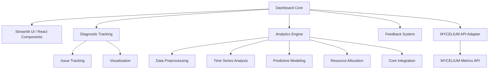

  - docs/dashboard/ROADMAP.md

# EGOS Dashboard Subsystem Roadmap

**Status:** Active
**Last Updated:** 2024-07-30

## 1. Vision & Goals

The EGOS Dashboard subsystem aims to be a comprehensive, real-time monitoring, diagnostic, and analytics platform. It provides critical insights into EGOS operations, enabling proactive issue resolution, resource optimization, and informed decision-making. The dashboard will adhere to EGOS principles of Conscious Modularity, Systemic Cartography, and Evolutionary Preservation, offering a clear, intuitive, and powerful interface for understanding system health and performance.

**Key Goals:**

*   Provide a centralized view of all EGOS subsystems and their operational status.
*   Enable rapid diagnostics and troubleshooting through detailed metrics and visualizations.
*   Support predictive analytics for resource management and anomaly detection.
*   Facilitate seamless integration with other EGOS subsystems, particularly MYCELIUM for metrics data.
*   Offer a user-configurable and extensible interface to meet diverse operational needs.

## 2. System Architecture Overview

The Dashboard subsystem follows a modular architecture with distinct but interconnected components:

## 3. Current Major Initiatives & Short-Term Enhancements

This section outlines active development priorities and near-term goals for the dashboard.

### 3.1. Integration with MYCELIUM Metrics Subsystem (DASHBOARD-MYC-001)

**Status:** Planned / In Progress
**Priority:** High
**Description:** Connect the EGOS dashboard with the MYCELIUM metrics collection system to replace mock data with real-time metrics. This is a critical step towards operationalizing the dashboard.

**Integration Components & Steps:**

1.  **MYCELIUM Backend Readiness (MYC-VIZ-02):**
    *   Ensure the metrics collection system in MYCELIUM is complete and stable.
    *   Verify that metrics capture all essential MYCELIUM operations.
    *   Finalize a stable API for metrics retrieval from MYCELIUM.
2.  **API Adapter Layer Implementation:**
    *   Create Next.js API routes (or equivalent) to connect to MYCELIUM's metrics API.
    *   Develop data transformation logic to map MYCELIUM data to dashboard component expectations.
    *   Implement robust error handling, fallbacks, and authentication mechanisms.
3.  **Dashboard Component Integration:**
    *   Update existing dashboard components (e.g., MetricChart, ResourceUsage, NetworkVisualization) to consume data from the API adapter.
    *   Develop MYCELIUM-specific visualization components if unique data attributes require them.
    *   Implement user configuration options related to MYCELIUM data display.
4.  **Testing & Optimization:**
    *   Conduct thorough testing with simulated and real MYCELIUM data.
    *   Optimize data refresh rates, payload sizes, and component rendering performance.
    *   Implement caching strategies where appropriate to enhance responsiveness.

**Technical Considerations:**

*   **Authentication & Security:** Secure access to metrics API endpoints.
*   **Performance:** Minimize dashboard performance impact when fetching and displaying metrics.
*   **Fallbacks & Resilience:** Ensure graceful degradation if MYCELIUM metrics are temporarily unavailable.
*   **Extensibility:** Design the integration to easily accommodate future metrics from MYCELIUM.

### 3.2. Short-Term Dashboard Enhancements (Ongoing)

*   **Replace iframe-based dashboard elements with native React components** (Status: In Progress / Partially Completed)
*   **Refine dashboard layout components** (e.g., DashboardGrid, DashboardCard) for improved usability and aesthetics (Status: Ongoing)
*   **Enhance interactive controls** for time-based filtering, data drill-down, and user customization (Status: Planned)
*   **Implement simple state tracking for system evolution visualization** (Status: Planned)
*   **Connect dashboard to actual EGOS monitoring backend components** (beyond MYCELIUM, as applicable) (Status: Planned)

## 4. Mid-Term Goals (Next 2-3 Sprints)

*   Implement user preferences for dashboard layout and content customization.
*   Develop a more detailed subsystem status reporting module, integrating data from various EGOS components.
*   Create a robust alert system for critical issues, with notifications and escalation paths.
*   Implement dashboard access controls and role-based views.

## 5. Key Accomplishments & Completed Milestones

This section summarizes significant features and components already developed for the dashboard.

### 5.1. Core Dashboard & UI (DASH-UI-001)
*   **Description:** Implemented the core Streamlit/React dashboard structure with sidebar navigation, module selection, and EGOS-themed styling. Established the foundational framework for adding diverse dashboard components.
*   **Key Achievements:** Modular UI structure, page organization, navigation flow, placeholder sections.

### 5.2. Diagnostic Tracking System (DASH-DIAG-001)
*   **Description:** Implemented the core diagnostic tracking system for monitoring issues across EGOS components.
*   **Key Achievements:** System for tracking and managing diagnostic issues, data models and storage, visualization components, Mycelium integration for collaboration, notification system.

### 5.3. Diagnostic Analytics Engine (DASH-ANA-001, DASH-ANA-002, DASH-ANA-003)
*   **Data Preprocessor (DASH-ANA-001):** Developed data loading, cleaning, feature engineering, encoding, and caching for analytics.
*   **Time Series Analysis (DASH-ANA-002):** Implemented time series data analysis, trend identification, and forecasting API.
*   **Predictive Modeling (DASH-ANA-003):** Developed predictive models for anomaly detection and resource allocation, including model training, evaluation, and deployment pipelines.

### 5.4. Enhanced Network Visualization & Mock API (Completed 2025-05-01)
*   **Network Visualization:** Implemented time-based filtering, temporal metadata, interactive controls, and dynamic filtering for network graph.
*   **Mock API Infrastructure:** Created simulated historical snapshots, filterable endpoints, and type-safe interfaces for development and testing.

### 5.5. Detailed Subsystem Status Reporting (Initial Version - Completed 2025-05-01)
*   **API & UI:** Developed API for rich subsystem data and a tabbed UI for display.
*   **Alerts & Dependencies:** Implemented basic alert management and dependency mapping visualization.

## 6. Long-Term Vision

### 6.1. Temporal Knowledge Graph Integration (DASHBOARD-VISION-001)
*   **Concept:** Integrate the dashboard with a temporal knowledge graph (e.g., built with Chronosync) to provide deep, context-aware insights into system evolution, component relationships, and historical performance trends.
*   **Potential Features:** Dynamic visualization of system changes over time, impact analysis based on historical data, advanced anomaly detection using graph patterns.

### 6.2. Proactive & Prescriptive Analytics
*   Evolve beyond descriptive and diagnostic analytics to offer proactive warnings and prescriptive recommendations for system optimization and issue avoidance.

### 6.3. Self-Healing & Automated Response Capabilities
*   Explore integration with automation frameworks to enable the dashboard to trigger automated responses to certain classes of detected issues, aligning with the Evolutionary Preservation principle.

## 7. Backlog & Future Enhancements

*(This section will be populated with more granular tasks as initiatives are broken down.)*

*   [ ] DASH-INT-001: Full Dashboard & Analytics Integration (ongoing refinement post-MYCELIUM)
*   [ ] DASH-FEEDBACK-001: Implement User Feedback Collection System within the dashboard.
*   [ ] ... (Further tasks to be identified)

---
*Document End*