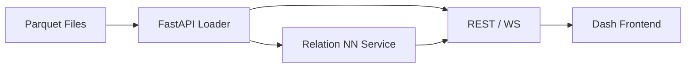

# 1. Overview
The Incident Pattern Analysis Dashboard provides interactive visual analytics for ATRiAN-enriched incident data, ROI outcomes, and detector events. It enables rapid identification of hidden relationships, bias trends, and high-risk sectors through neural-network powered relation extraction and graph exploration.

# 2. Objectives
1. Surface key KPIs (incident volume, severity distribution, ROI) at a glance.
2. Enable drill-down by sector, severity, timeframe, and detector type.
3. Present graph-based relationships (incident → root-cause → mitigation) generated by an internal NN service.
4. Stream real-time detector events once live connectors are active.
5. Support export of filtered data (CSV/JSON) for ad-hoc analysis.

# 3. Target Users
| Role | Goal |
|------|------|
| Data Scientist | Explore incident clusters, validate detector efficacy |
| Risk Manager   | Monitor ROI & high-severity events across sectors |
| Exec / Stakeholder | High-level ROI & risk posture overview |
| Ethics Officer | Track bias metrics & fairness KPIs |

# 4. Key KPIs & Metrics
| KPI | Description | Source |
|-----|-------------|--------|
| Total Incidents (period) | Count of incidents within selected timeframe | `master_incidents.parquet` |
| Severity Mix | % incidents by `severity_score` | same |
| Average Avoided Cost (ROI) | From latest simulation JSON | `data/roi/latest_roi.json` |
| ROI % by Sector | Sector-level ROI (sim results) | same |
| Bias Disparity Index | From fairness detector metrics | detector event stream |
| Detector Alert Rate | Alerts per 1k incidents | detector stream |

# 5. Visual Components
1. **ROI Summary Cards** – Overall ROI %, average avoided cost, total costs.
2. **Sector Breakdown Bar** – ROI % per sector.
3. **Incident Heatmap** – Incidents by sector × severity over time.
4. **Relation Graph** – Force-directed graph of incidents → causes → mitigations (NN-derived).
5. **Bias Trend Line** – Disparity index over time (public_safety sector focus).
6. **Live Alerts Table** – Streaming detector alerts (status, severity, link to docs).

# 6. Tech Stack Proposal
| Layer | Technology | Rationale |
|-------|------------|-----------|
| Backend API | FastAPI | Python-native, async, easy OpenAPI docs |
| Data Layer | Pandas + Parquet | Existing format; memory-mapped reads |
| Real-Time | Redis Streams (later Kafka) | Lightweight pub/sub for events |
| Relation NN | spaCy + sentence-transformers | NER + similarity for entity/edge extraction |
| Graph Store | Neo4j (optional) or in-memory NetworkX | Depends on scale |
| Frontend | Plotly Dash (Phase-1) → React + Plotly + D3 (Phase-2) | Dash for rapid MVP; migrate to richer UI later |
| Auth | FastAPI Users JWT | Consistent with EGOS services |

# 7. API Endpoints (FastAPI)
| Method | Path | Description |
|--------|------|-------------|
| GET | `/api/kpis/summary` | Overall ROI & incident stats |
| GET | `/api/incidents` | Query incidents table (filters) |
| GET | `/api/incidents/{id}` | Incident detail incl. relations |
| GET | `/api/graph` | Return relation graph (JSON nodes & edges) |
| WS  | `/ws/alerts` | WebSocket stream of detector alerts |

# 8. Data Flow


# 9. Wireframes (ASCII)
```
+---------------------------------------------------------------+
| ROI SUMMARY   | Sector Breakdown (Bar)                       |
|  ROI 1015%    | #####################################        |
|  Avg $1.2M    |                                            |
+-----------------+---------------------------------------------+
| Incident Heatmap                                             |
|                                                              |
+---------------------------------------------------------------+
| Relation Graph        | Bias Trend Line | Live Alerts Table  |
| (interactive canvas)  |               |                     |
+---------------------------------------------------------------+
```

# 10. Phased Implementation
1. **Phase-1 (MVP)** – Plotly Dash single-page app; static reload every 5 min; KPI & heatmap.
2. **Phase-2** – Add FastAPI backend; separate Dash front-end fetching JSON.
3. **Phase-3** – Integrate NN relation extraction + graph view.
4. **Phase-4** – Live WebSocket alerts; Redis Streams connector.

# 11. Testing & CI
- Unit tests for each FastAPI route (`tests/api/test_kpis.py` …)
- Cypress (or Playwright) e2e tests for dashboard UI.
- Performance test: load 10k incidents, ensure <200 ms API latency.

# 12. Security & Compliance
- JWT auth, role-based access (viewer, analyst, admin).
- CORS restricted to EGOS domains.
- GDPR: anonymise PII in incident table by default.

# 13. Open Questions / TODO
- Choose between Neo4j vs in-memory graph for relation view.
- Confirm preferred front-end framework for long-term (React?).
- Decide refresh cadence for heavy NN relation extraction (batch vs on-demand).
- Map bias KPIs to public_safety detectors (exact metric names).

---
*End of spec*
