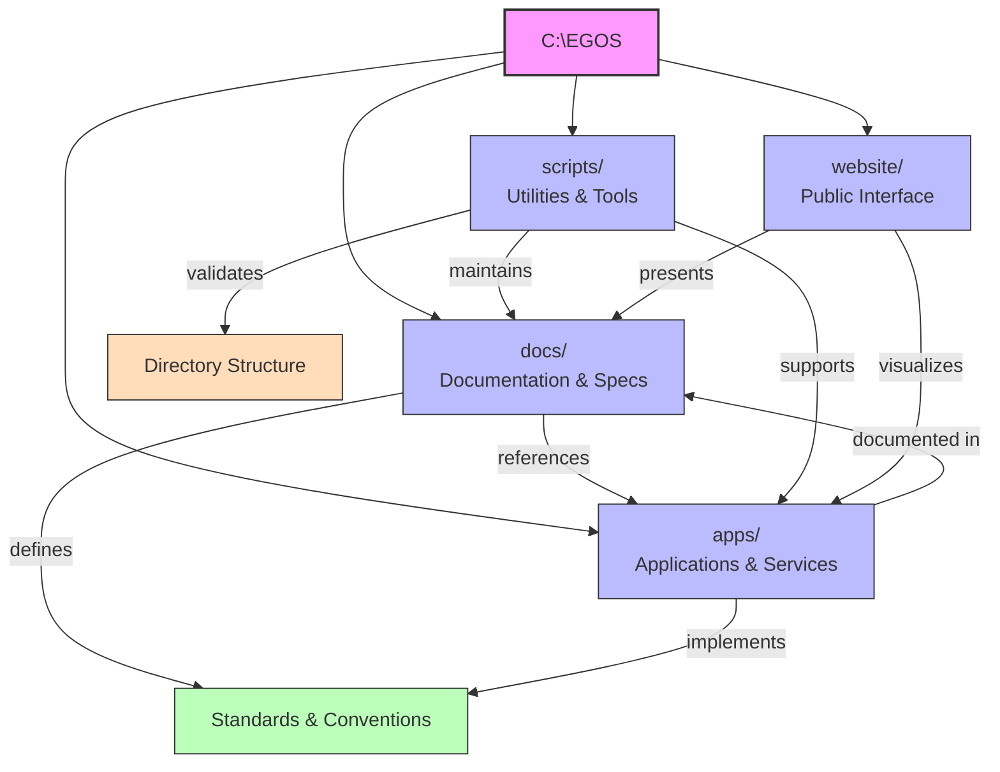
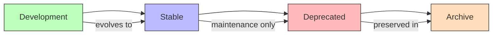

@references:
- .windsurfrules
- CODE_OF_CONDUCT.md
- MQP.md
- README.md
- ROADMAP.md
- CROSSREF_STANDARD.md

  - docs/directory_structure.md

# EGOS Directory Structure Visualization

This document provides a visual representation of the EGOS canonical directory structure as defined in the central configuration.

## Root Directory Structure

```mermaid
graph TD
    Root[C:\EGOS] --> README[README.md]
    Root --> CHANGELOG[CHANGELOG.md]
    Root --> COC[CODE_OF_CONDUCT.md]
    Root --> CONTRIB[CONTRIBUTING.md]
    Root --> LICENSE[LICENSE]
    Root --> ROADMAP[ROADMAP.md]
    Root --> MQP[MQP.md]
    Root --> ARCHIVE_POLICY[ARCHIVE_POLICY.md]
    
    %% Main directories
    Root --> Apps[apps/]
    Root --> Docs[docs/]
    Root --> Scripts[scripts/]
    Root --> Tests[tests/]
    Root --> Archive[archive/]
    Root --> Website[website/]
    Root --> Config[config/]
    Root --> Reports[reports/]
    
    %% Subdirectories
    Docs --> Guides[guides/]
    Docs --> API[api/]
    Docs --> Tutorials[tutorials/]
    Docs --> Standards[standards/]
    Docs --> Templates[templates/]
    Docs --> Resources[resources/]
    Docs --> Process[process/]
    
    Scripts --> Maintenance[maintenance/]
    Scripts --> Analysis[analysis/]
    Scripts --> CrossReference[cross_reference/]
    Scripts --> Validation[validation/]
    
    Website --> Src[src/]
    Website --> Public[public/]
    Website --> WebsiteDocs[docs/]

    style Root fill:#f9f,stroke:#333,stroke-width:2px
    style Docs fill:#bbf,stroke:#333,stroke-width:1px
    style Scripts fill:#bbf,stroke:#333,stroke-width:1px
    style Apps fill:#bbf,stroke:#333,stroke-width:1px
    style Website fill:#bbf,stroke:#333,stroke-width:1px
    style Tests fill:#bbf,stroke:#333,stroke-width:1px
    style Archive fill:#fbb,stroke:#333,stroke-width:1px
    style Config fill:#bfb,stroke:#333,stroke-width:1px
    style Reports fill:#fdb,stroke:#333,stroke-width:1px
```

## Directory Purpose and Relationships

## Component Evolution Path

This diagram visualizes the EGOS directory structure and component lifecycle as defined in `C:\EGOS\config\directory_structure_config.json`. Use this as a reference when organizing new components and files within the ecosystem.

✧༺❀༻∞ EGOS ∞༺❀༻✧