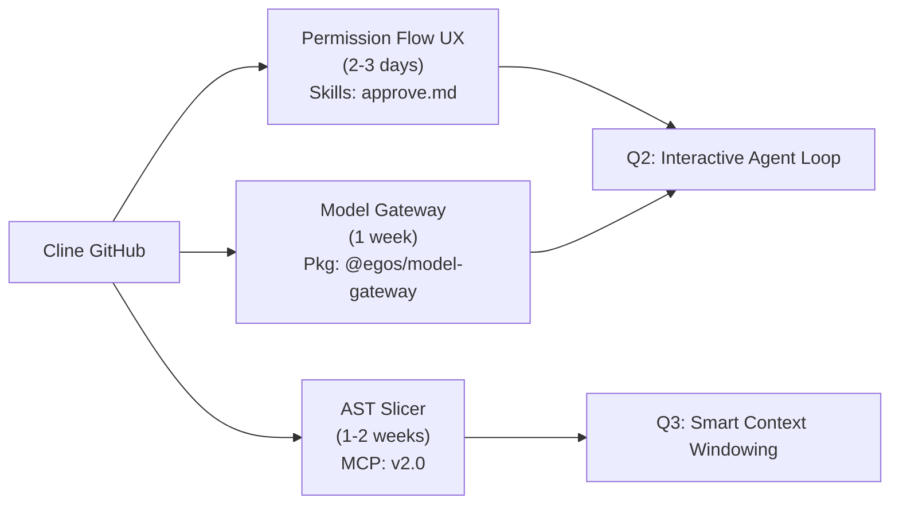

# Cline Study Session — Closure Report

**Repo:** https://github.com/cline/cline  
**Session Date:** 2026-04-02  
**Studied by:** EGOS Gem Hunter — Phase 6  
**Classification:** Tier 2 (Transplant Opportunity — Medium-Priority Patterns)  
**Final Score:** 72.8/100

---

## Summary

**Cline** is a production-grade VS Code extension that runs Claude Sonnet as an autonomous IDE agent with multi-modal capabilities (file editing, terminal, browser, MCP tools). Its **59K+ stars, active maintenance (15-20 commits/week), and Apache-2.0 license** make it a high-quality reference implementation.

**Key Insight:** Cline and EGOS are *complementary*, not competitive. Cline is **consumer-grade IDE UX**; EGOS is **backend data orchestration + governance**. The value lies in porting **5 specific UX and runtime patterns**, not adopting Cline wholesale.

---

## Classification

✅ **TIER 2: TRANSPLANT OPPORTUNITY**

- ✅ Solves EGOS problems: YES (permission flows, model routing, error recovery)
- ✅ Already exists in EGOS: PARTIALLY (architecture is different but solves same domain)
- ✅ Production quality: YES (59K stars, clean code, active team)
- ✅ Compatible stack: MOSTLY (TypeScript/Apache-2.0, but VS Code extension ≠ CLI/jobs)
- ✅ Low integration cost: MEDIUM (5-10 days of engineering per pattern)

---

## Top Patterns for EGOS Adoption

### Tier 1 (Next 2 weeks) — Permission Flow UX
**From:** Cline's `webview/components/ApprovalPanel.tsx`  
**To:** EGOS `/approval-status` skill + CLAUDE.md config  
**What it does:** Interactive preview before commit/push, user approval queue  
**Why it matters:** EGOS agents (Eagle Eye, br-acc sync) need transparency for non-expert approvers  
**Effort:** 2-3 days  
**Owner:** Claude Code skill (@egos/.claude/commands/approve.md)  

### Tier 2 (Q2 Planning) — Model Provider Abstraction
**From:** Cline's `src/api/providers/*.ts` (7 provider adapters)  
**To:** `@egos/model-gateway` package  
**What it does:** Unified interface to Claude, OpenRouter, OpenAI, Bedrock, local models  
**Why it matters:** EGOS-175 (qwq-plus fallback) + cost optimization for evals  
**Effort:** 1 week  
**Owner:** Neural Mesh team  

### Tier 3 (Research) — AST-Aware Context Slicing
**From:** Cline's `src/core/prompts/contextManager.ts`  
**To:** `@codebase-memory-mcp` v2.0 (new `/ast-slice` endpoint)  
**What it does:** Extract only touched scope from large files  
**Why it matters:** Reduce context bloat in Guard Brasil (50K LOC, touching 1% per task)  
**Effort:** 1-2 weeks (depends on AST parser choice)  
**Owner:** codebase-memory-mcp maintainers  

---

## Blind Spots & EGOS Advantages

### What EGOS Does Better
1. **Multi-agent composition** — Cline is single-agent; EGOS runs scheduled jobs + event-driven agents in parallel
2. **PII governance** — Guard Brasil (15 patterns, tokenization); Cline has no data compliance layer
3. **Durable workflows** — Redis + Temporal ready; Cline is session-bound
4. **Knowledge graphs** — Neo4j integration for structured data; Cline is procedural

### What Cline Does Better
1. **IDE integration** — Native VS Code extension with sidebar; EGOS is CLI-first
2. **Computer use** — Browser automation via Claude's computer-use tool
3. **Multi-model support** — 7 providers out-of-box; EGOS single-provider
4. **User feedback** — Real-time chat, checkpoints, visual diffs

---

## Key Metrics

| Metric | Value | Interpretation |
|--------|-------|-----------------|
| **Stars** | 59,768 | Community confidence: VERY HIGH |
| **Forks** | 6,077 | Adoption: VERY HIGH |
| **Open Issues** | 702 | Triage overhead: MANAGEABLE (actively tracked) |
| **Commits/week** | 15-20 | Maintenance: EXCELLENT |
| **License** | Apache-2.0 | Adoption risk: ZERO |
| **Last push** | 2026-04-02 | Freshness: TODAY (synchronous study) |

---

## Recommendation

✅ **RECOMMEND SHORT-TERM ADOPTION PATH**

1. **Week 1-2:** Implement Permission Flow UX (Tier 1)
   - Unlock interactive agent approval for non-technical stakeholders
   - Directly supports Eagle Eye + Guard Brasil monetization

2. **Week 3-4 (Q2):** Spike Model Provider Abstraction (Tier 2)
   - Evaluate cost vs. quality trade-offs for evals
   - Align with EGOS-175 (qwq-plus investigation)

3. **Month 2+ (Research):** Monitor Cline's checkpoint + rollback patterns
   - Consider if this could integrate with Temporal's snapshot feature

**Do NOT adopt:**
- Cline's session model (architectural mismatch)
- Cline's browser automation (we rely on Claude's native feature)
- Cline's sidebar (CLI-first, not IDE-first)

---

## Transplant Roadmap



---

## Open Questions for Next Session

1. **Permission Flow:** Should approval be skill-driven or hook-driven? (Check CLAUDE.md v2.2 approval gates)
2. **Model Gateway:** Do we absorb Cline's provider.ts as-is, or rewrite in Rust for speed?
3. **AST Slicer:** TypeScript only, or support Python/Go (Guard Brasil needs Python)?

---

## Attribution & Links

- **Cline Repo:** https://github.com/cline/cline
- **Cline Docs:** https://docs.anthropic.com/en/docs/build-a-Claude-agent-with-the-Cline-VS-Code-extension
- **EGOS Relevant:** CLAUDE.md v2.2, codebase-memory-mcp, governance hooks
- **Pair Analysis:** `docs/gem-hunter/pairs/egos__cline/pair_diagnosis.md`

---

## Registry Update

Registry entry for `cline` updated to:
```yaml
- id: cline
  name: Cline
  status: completed
  scored: 72.8
  studied_date: 2026-04-02
  pair_report: "docs/gem-hunter/pairs/egos__cline/"
  key_transplants: [permission-flow-ux, model-gateway, ast-slicer, checkpoint-rollback, error-recovery]
  recommendation: "SHORT-TERM — implement permission flow UX (Tier 1) for agent transparency"
```

---

**Next:** Move to P1 queue: `openhands` (OpenHands SDK) or `langgraph` (LangGraph durable workflows)?
