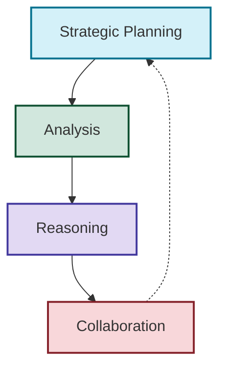
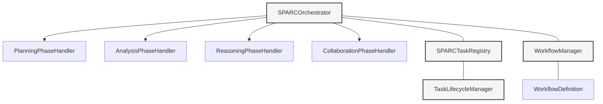
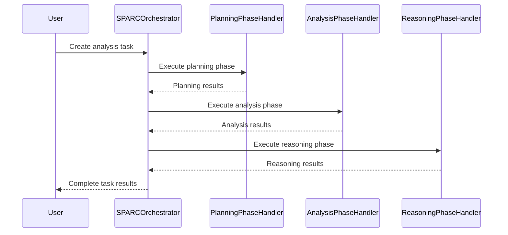
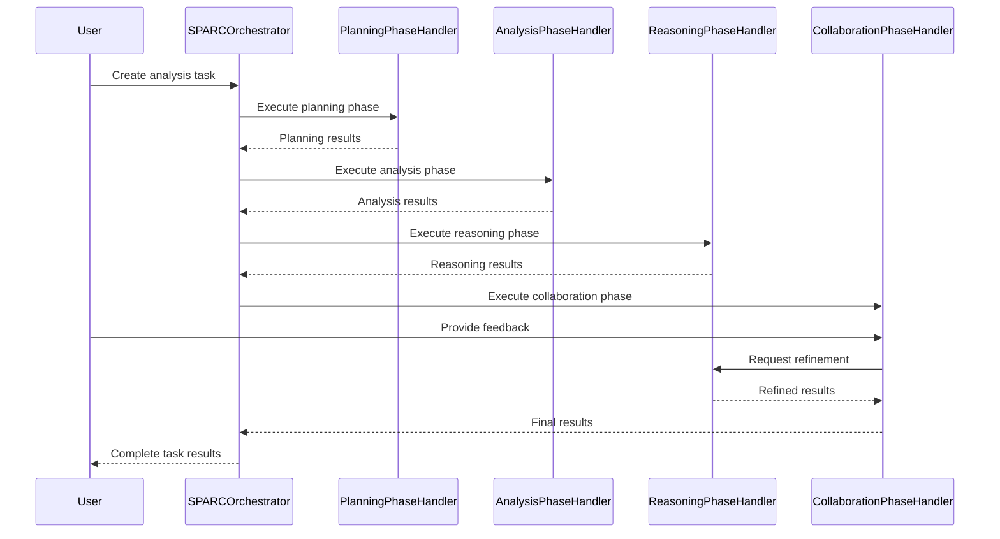

---
title: SPARC_methodology
version: 1.0.0
status: Active
date_created: 2025-05-10
date_modified: 2025-05-10
authors: [EGOS Team]
description: 
file_type: documentation
scope: 
primary_entity_type: 
primary_entity_name: 
tags: []
---

---
title: SPARC_methodology
version: 1.0.0
status: Active
date_created: 2025-05-10
date_modified: 2025-05-10
authors: [EGOS Team]
description: 
file_type: documentation
scope: 
primary_entity_type: 
primary_entity_name: 
tags: []
---

---
title: SPARC Methodology
version: 1.0.0
status: Active
date: 2025-05-15
subsystem: CORUJA
tags: [documentation, methodology, sparc, reasoning, ai, orchestration]
@references:
- .windsurfrules
- CODE_OF_CONDUCT.md
- MQP.md
- README.md
- ROADMAP.md
- CROSSREF_STANDARD.md

@references(level=1):
  - reference/global_rules.mdc

  - [MQP](..\reference\MQP.md) - Master Quantum Prompt defining EGOS principles
  - [ROADMAP](../../governance/migrations/processed/pt/ROADMAP.md) - Project roadmap and planning
  - [global_rules](../../reference/global_rules.mdc) - Global EGOS rules
- Subsystem:
  - [README](../../governance/business/github_updates/README.md) - CORUJA Overview
  - [CORUJA/sparc/sparc_orchestrator.py](../../..\..\..\subsystems\CORUJA\sparc\sparc_orchestrator.py) - SPARC Orchestrator
  - [CORUJA/sparc/workflow_manager.py](../../..\..\..\subsystems\CORUJA\sparc\workflow_manager.py) - Workflow Manager
---
  - docs/governance/SPARC_methodology.md

# SPARC Methodology

**ID:** METHOD-SPARC-001  
**Version:** 1.0.0  
**Last Updated:** 2025-05-15  
**Status:** ✅ Active  

## 1. Introduction

The **SPARC Methodology** (Strategic Planning, Analysis, Reasoning, and Collaboration) is a comprehensive framework for AI-driven problem-solving and decision-making developed for the EGOS ecosystem. It provides a structured approach to organizing complex cognitive workflows involving multiple AI models, human input, and system integrations. The SPARC methodology enables sophisticated, traceable, and reliable reasoning across distributed systems.

## 2. SPARC Philosophy

SPARC is founded on the principle that complex reasoning tasks benefit from a structured, phase-based approach that mirrors effective human thinking processes. By breaking down reasoning into distinct phases and coordinating these phases through explicit workflows, SPARC enables:

- **Traceable decisions**: All steps in the reasoning process are documented and can be traced back to their origins
- **Transparent reasoning**: The logic and evidence behind decisions are explicitly articulated
- **Distributed cognition**: Complex tasks can be distributed across multiple AI models or subsystems
- **Collaborative refinement**: Results can be iteratively improved through feedback and collaboration
- **Ethical alignment**: Each phase can incorporate ethical validation (ETHIK integration) and guardrails

## 3. The Four SPARC Phases

SPARC divides cognitive workflows into four distinct but interconnected phases:

### 3.1 Strategic Planning

The Strategic Planning phase establishes the foundation for the cognitive workflow. It involves:

- **Goal Definition**: Clearly articulating the specific objectives of the reasoning task
- **Task Decomposition**: Breaking down complex problems into manageable sub-tasks
- **Approach Design**: Determining the most appropriate methods, models, and data sources
- **Context Collection**: Gathering and organizing relevant context information
- **Success Criteria**: Defining explicit metrics or criteria for evaluating outcomes

**Key Components**: `PlanningPhaseHandler`, `TaskDecomposer`, `ApproachDesigner`

### 3.2 Analysis

The Analysis phase involves gathering, organizing, and interpreting information relevant to the task. It includes:

- **Data Collection**: Gathering information from specified sources
- **Data Cleaning**: Preprocessing and normalizing information
- **Pattern Recognition**: Identifying relevant patterns, trends, and relationships
- **Context Building**: Creating a comprehensive understanding of the problem space
- **Feature Extraction**: Identifying the most salient aspects of the information

**Key Components**: `AnalysisPhaseHandler`, `DataProcessor`, `PatternRecognizer`

### 3.3 Reasoning

The Reasoning phase applies logical thinking to the analyzed information to derive conclusions or make decisions. It involves:

- **Hypothesis Generation**: Formulating potential explanations or solutions
- **Evidence Evaluation**: Assessing the strength and relevance of supporting evidence
- **Logic Application**: Applying deductive, inductive, and abductive reasoning
- **Counterfactual Analysis**: Considering alternative interpretations or scenarios
- **Conclusion Derivation**: Reaching justified conclusions based on evidence and logic

**Key Components**: `ReasoningPhaseHandler`, `HypothesisGenerator`, `LogicalReasoner`

### 3.4 Collaboration

The Collaboration phase involves refining and validating results through feedback integration and collaborative refinement. It includes:

- **Result Presentation**: Clearly communicating findings and their justifications
- **Feedback Integration**: Incorporating input from users, other AI systems, or subsystems
- **Refinement**: Iteratively improving results based on feedback
- **Consensus Building**: Reconciling different perspectives or analyses
- **Result Finalization**: Producing final outputs with appropriate confidence levels

**Key Components**: `CollaborationPhaseHandler`, `FeedbackProcessor`, `RefinementEngine`

## 4. SPARC Implementation Architecture

The SPARC methodology is implemented in CORUJA through a modular architecture with the following key components:

### 4.1 Core Components

- **SPARCOrchestrator**: Coordinates the execution of SPARC workflows, managing phase transitions and task delegation.
- **PhaseHandlers**: Specialized components for each SPARC phase (Planning, Analysis, Reasoning, Collaboration).
- **SPARCTaskRegistry**: Manages task instances, including creation, tracking, and state management.
- **TaskLifecycleManager**: Handles task state transitions and events throughout the task lifecycle.
- **WorkflowManager**: Manages workflow definitions, instances, and execution logic.
- **WorkflowDefinition**: Defines the structure and sequencing of SPARC phases for specific use cases.

### 4.2 Task Model

SPARC tasks follow a structured model with the following key attributes:

- **Task ID**: Unique identifier for the task
- **Task Type**: The type of task (e.g., Planning, Analysis, Reasoning, Collaboration)
- **Status**: Current status of the task (e.g., Pending, In Progress, Completed, Failed)
- **Inputs**: Structured inputs required for the task
- **Outputs**: Structured outputs produced by the task
- **Context**: Additional context information relevant to the task
- **Metadata**: Task creation time, owner, priority, etc.
- **Dependencies**: Other tasks that must be completed before this task can start

### 4.3 Workflow Management

SPARC workflows are managed through the WorkflowManager, which handles:

- **Workflow Definition**: Structure and sequencing of SPARC phases
- **Workflow Instantiation**: Creating instances of workflows for specific tasks
- **Workflow Execution**: Coordinating the execution of workflow phases
- **Workflow Monitoring**: Tracking the status and progress of workflows
- **Workflow Persistence**: Storing workflow definitions and instances

## 5. Integration with EGOS Subsystems

SPARC integrates with other EGOS subsystems through standard interfaces and messaging:

### 5.1 MYCELIUM Integration

SPARC communicates with other subsystems through MYCELIUM messaging:

- **Task Creation**: Publishing task creation requests to other subsystems
- **Task Status**: Publishing task status updates
- **Task Results**: Publishing task results
- **Task Requests**: Receiving task requests from other subsystems

### 5.2 ETHIK Integration

SPARC incorporates ethical validation through ETHIK integration:

- **Input Validation**: Validating task inputs for ethical concerns
- **Process Validation**: Ensuring reasoning processes adhere to ethical principles
- **Output Validation**: Validating task outputs for ethical implications

### 5.3 KOIOS Integration

SPARC follows KOIOS standards for documentation, logging, and structured data:

- **Standardized Logging**: Using KoiosLogger for structured logging
- **Documentation**: Following KOIOS documentation standards
- **Metadata**: Using standardized metadata formats

## 6. Advanced SPARC Features

### 6.1 Model Selection

SPARC can select appropriate AI models for different phases based on task requirements:

- **Reasoning Model Selection**: Using models optimized for logical reasoning
- **Analysis Model Selection**: Using models optimized for data analysis
- **Planning Model Selection**: Using models optimized for strategic planning
- **Collaboration Model Selection**: Using models optimized for feedback integration

### 6.2 Boomerang Tasks

SPARC supports "boomerang" tasks that delegate specific reasoning subtasks to other subsystems:

- **Task Delegation**: Sending tasks to other subsystems for processing
- **Context Isolation**: Providing only necessary context for delegated tasks
- **Result Integration**: Incorporating results from delegated tasks back into the workflow

### 6.3 CrewManager Integration

SPARC can integrate with the CrewManager for agent-based task execution:

- **Agent Delegation**: Delegating tasks to specialized agents
- **Agent Coordination**: Coordinating multiple agents for complex tasks
- **Result Aggregation**: Combining results from multiple agents

## 7. SPARC Workflow Examples

### 7.1 Basic Analysis Workflow

### 7.2 Collaborative Refinement Workflow

## 8. Best Practices

### 8.1 Task Design

- **Clear Objectives**: Tasks should have clear, explicit objectives
- **Structured Inputs**: Provide structured inputs with necessary context
- **Output Specification**: Clearly specify expected output formats
- **Error Handling**: Include error handling mechanisms in workflows
- **Progress Tracking**: Monitor and track task progress

### 8.2 Workflow Design

- **Appropriate Phases**: Include only necessary phases for the workflow
- **Clear Transitions**: Define explicit conditions for phase transitions
- **Error Recovery**: Include mechanisms for recovering from errors
- **Parallel Processing**: Utilize parallel processing where appropriate
- **Feedback Loops**: Incorporate feedback loops for iterative improvement

### 8.3 Integration Guidelines

- **Standard Interfaces**: Use standard interfaces for subsystem integration
- **Message Contracts**: Define clear message contracts for MYCELIUM integration
- **Error Handling**: Implement robust error handling for integration points
- **Timeouts**: Set appropriate timeouts for cross-subsystem communication
- **Traceability**: Maintain traceability across subsystem boundaries

## 9. Future Directions

SPARC methodology continues to evolve with the following future directions:

- **Enhanced Distributed Reasoning**: More sophisticated models for distributed reasoning across subsystems
- **Learning from Feedback**: Incorporating learning mechanisms to improve reasoning based on feedback
- **Dynamic Workflows**: Supporting dynamic workflow adaptation based on task contexts
- **Specialized Reasoning Modules**: Developing specialized modules for different types of reasoning
- **Explainable Reasoning**: Enhancing explainability of reasoning processes and decisions

## 10. Conclusion

The SPARC methodology provides a comprehensive framework for AI-driven problem-solving and decision-making within the EGOS ecosystem. By structuring cognitive workflows into explicit phases and managing their execution through the SPARCOrchestrator, it enables sophisticated, traceable, and reliable reasoning that can be distributed across multiple subsystems and integrated with other EGOS capabilities.

✧༺❀༻∞ EGOS ∞༺❀༻✧ 