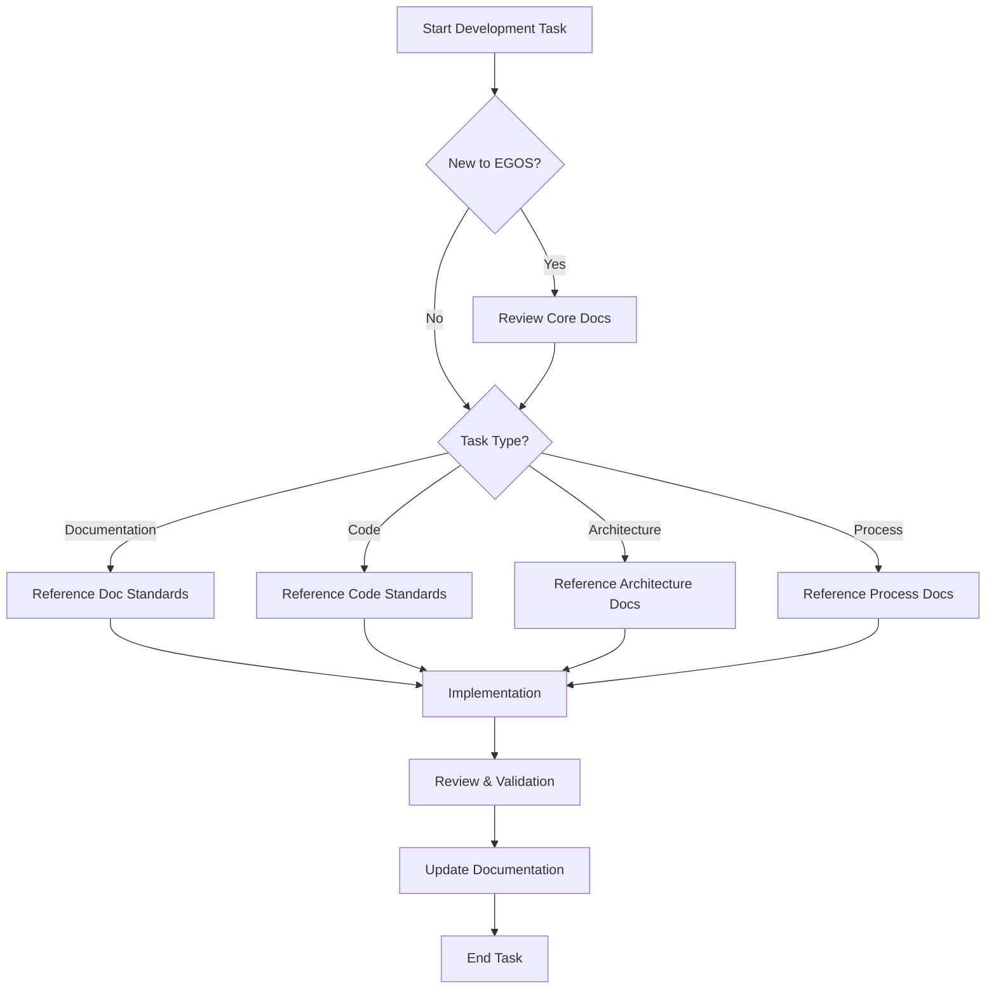

  - docs/governance/processes/documentation_triggers.md

# EGOS Documentation Triggers and Visibility Guidelines

**Version:** 1.0.0  
**Status:** Active  
**Last Updated:** 2025-05-18  
**Owner:** KOIOS Subsystem

## Overview

This document defines when and how critical documentation files should be surfaced during development, ensuring that important standards and processes are visible and accessible at the right times. By following these guidelines, we can ensure that documentation remains an integral part of the development workflow and that all team members (both human and AI) are aware of and adhere to established standards.

## Documentation User Journey

The following diagram illustrates the typical user journey for interacting with documentation in the EGOS project:



## Critical Documentation Files

The following documentation files are considered critical and should be surfaced at specific trigger points:

| Document | Location | Trigger Points |
|----------|----------|----------------|
| Documentation Structure Standard | [docs/project_documentation/standards/documentation_structure_standard.md](../standards/documentation_structure_standard.md) | Creating/editing documentation, reorganizing files, onboarding new team members |
| File Size & Modularity Standard | [docs/project_documentation/guides/standards/file_size_modularity_standard.md](../guides/standards/file_size_modularity_standard.md) | Creating new code files, refactoring existing code, code reviews |
| Cross-Reference Best Practices | [docs/project_documentation/process/cross_reference_best_practices.md](cross_reference_best_practices.md) | Adding references between documents, creating new documentation |
| Documentation Index | [docs/DOCUMENTATION_INDEX.md](../../DOCUMENTATION_INDEX.md) | Searching for documentation, onboarding new team members, planning documentation work |
| Universal Migration Framework | [docs/project_documentation/governance/migrations/universal_migration_framework.md](../governance/migrations/universal_migration_framework.md) | Planning migrations or reorganizations, moving files or content |

## Trigger Implementation

To ensure these documents are surfaced at the appropriate times, the following implementation approaches are recommended:

### 1. IDE Integration

Configure your IDE (such as Windsurf) to suggest relevant documentation based on the current context:

```json
{
  "documentationTriggers": [
    {
      "filePattern": "*.md",
      "suggestDocs": [
        "docs/project_documentation/standards/documentation_structure_standard.md",
        "docs/project_documentation/process/cross_reference_best_practices.md"
      ]
    },
    {
      "filePattern": "*.py",
      "suggestDocs": [
        "docs/project_documentation/guides/standards/file_size_modularity_standard.md"
      ]
    },
    {
      "action": "fileMove",
      "suggestDocs": [
        "docs/project_documentation/governance/migrations/universal_migration_framework.md"
      ]
    }
  ]
}
```

### 2. Documentation Headers

Include standard headers in all documentation files that reference the Documentation Structure Standard:

```markdown
---
title: "Document Title"
...
@references:
- Standards:
  - [Documentation Structure Standard](mdc:project_documentation/standards/documentation_structure_standard.md)
---
```

### 3. Code File Templates

Include standard headers in code file templates that reference relevant standards:

```python
"""
Module Name: example_module.py

Description: Brief description of the module

@references:
- Standards:
  - File Size & Modularity Standard (docs/project_documentation/guides/standards/file_size_modularity_standard.md)
"""
```

### 4. Automated Checks

Implement automated checks in the CI/CD pipeline to verify compliance with documentation standards:

- Check that all documentation files reference the Documentation Structure Standard
- Verify that file sizes comply with the File Size & Modularity Standard
- Ensure cross-references are valid and follow best practices

### 5. Documentation Review Checklist

Include a standard checklist in the documentation review process that references critical standards:

```markdown
## Documentation Review Checklist

- [ ] Follows [Documentation Structure Standard](../standards/documentation_structure_standard.md)
- [ ] Includes proper cross-references as per [Cross-Reference Best Practices](cross_reference_best_practices.md)
- [ ] Added to [Documentation Index](../../DOCUMENTATION_INDEX.md) if applicable
```

## AI Assistant Configuration

For AI assistants working within the EGOS project, the following prompt should be used to ensure awareness of documentation standards:

```markdown
As a contributor or AI agent working within the EGOS system, whenever you are creating or editing documentation, or defining new module architecture, you must reference the file:

📄 [documentation_structure_standard.md](docs/project_documentation/standards/documentation_structure_standard.md)

To ensure visibility:
- Check the root `README.md` for a full index of standards and key files
- Follow the user journey guide to understand when this file is relevant
- Reference the [Documentation Index](docs/DOCUMENTATION_INDEX.md) for a comprehensive list of all documentation

Ensure that all modules and scripts reference the documentation they follow or contribute to.
```

## Documentation Maintenance

To keep documentation alive and relevant:

1. **Regular Reviews**: Schedule quarterly reviews of all critical documentation
2. **Update Triggers**: When standards are updated, trigger notifications to all team members
3. **Documentation Health Metrics**: Track documentation health metrics such as:
   - Percentage of files that reference appropriate standards
   - Number of broken cross-references
   - Documentation coverage (percentage of code/features with documentation)
4. **Documentation Champions**: Assign documentation champions for each subsystem who are responsible for maintaining documentation quality

## Cross-Linking Implementation

Implement cross-linking between code and documentation:

1. **Code to Documentation**: Include references to relevant documentation in code comments
2. **Documentation to Code**: Include references to relevant code in documentation
3. **Bidirectional Links**: Ensure links work in both directions
4. **Contextual Links**: Provide context for why a link is relevant

## Conclusion

By implementing these documentation triggers and visibility guidelines, we can ensure that critical documentation remains visible, accessible, and integrated into the development workflow. This will help both human developers and AI assistants find and use the right documentation at the right time, leading to more consistent and high-quality outputs.

---

**@references:**
- mdc:project_documentation/standards/documentation_structure_standard.md
- mdc:DOCUMENTATION_INDEX.md
- mdc:project_documentation/process/human_ai_collaboration_guidelines.md
- mdc:project_documentation/process/documentation_review_process.md