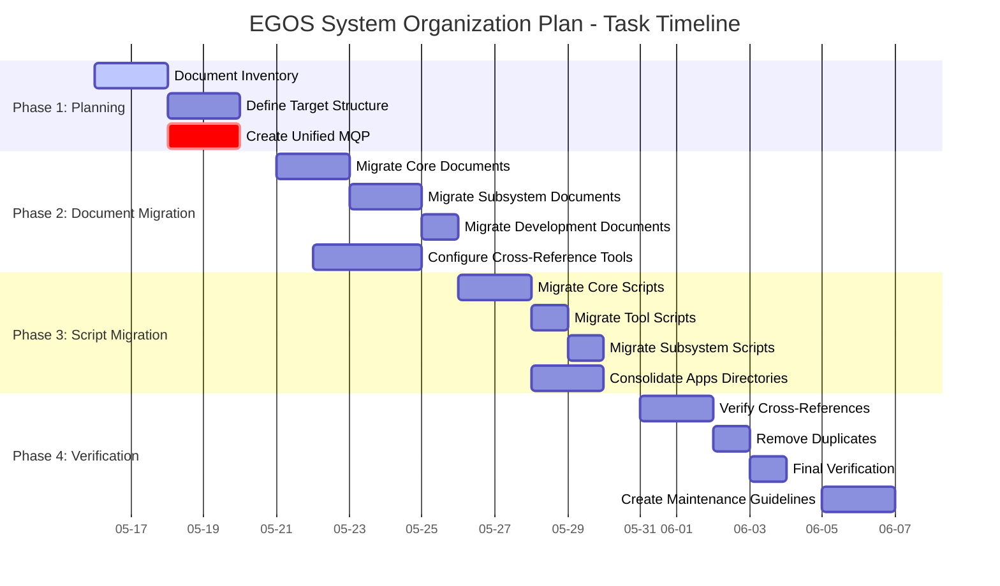
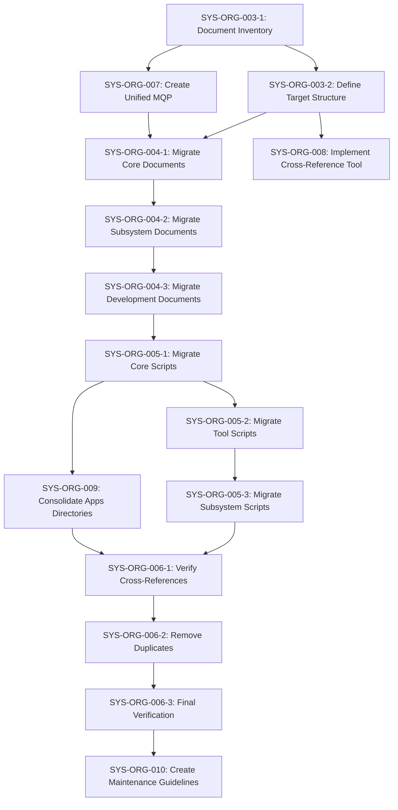

@references:
- .windsurfrules
- CODE_OF_CONDUCT.md
- MQP.md
- README.md
- ROADMAP.md
- CROSSREF_STANDARD.md

@references(level=1):
  - docs/SYSTEM_ORGANIZATION_PLAN.md
  - docs/governance/system_organization_implementation_guide.md
  - docs/guides/development/script_versioning_standards.md
  - scripts/core_ci_validate_cross_references.py
  - scripts/core_maint_cross_reference_analyzer.py
  - scripts/core_maint_cross_reference_executor.py
  - scripts/tools/koios_cross_reference_manager.py

  - docs/governance/reorganization/SYSTEM_ORGANIZATION_TASKS.md

# EGOS System Organization Tasks

## References

- Core References:
  - [MQP.md](../../core/MQP.md) - Master Quantum Prompt defining EGOS principles
  - [ROADMAP.md](../../../ROADMAP.md) - Project roadmap and planning
  - [SYSTEM_ORGANIZATION_PLAN.md](../../SYSTEM_ORGANIZATION_PLAN.md) - Comprehensive system organization plan
- Process Documentation:
  - [system_organization_implementation_guide.md](../system_organization_implementation_guide.md) - Implementation guide for the system organization plan
  - [script_versioning_standards.md](../../guides/development/script_versioning_standards.md) - Script versioning standards
- Cross-Reference Tools:
  - [koios_cross_reference_manager.py](../../../scripts/tools/koios_cross_reference_manager.py) - Standardizes cross-references across documentation
  - [core_maint_cross_reference_analyzer.py](../../../scripts/core_maint_cross_reference_analyzer.py) - Analyzes cross-references
  - [core_maint_cross_reference_executor.py](../../../scripts/core_maint_cross_reference_executor.py) - Comprehensive interface for managing cross-references
  - [core_ci_validate_cross_references.py](../../../scripts/core_ci_validate_cross_references.py) - CI validation script for cross-references

## Overview

This document tracks all tasks related to the EGOS system organization plan. It provides detailed information about each task, including description, status, assignee, due date, and dependencies. The tasks are organized by phase and category, following the structure defined in the system organization plan.

## Task Status Overview

## Task Details

### Phase 1: Planning and Preparation (2025-05-16 to 2025-05-20)

#### Task SYS-ORG-003-1: Document Inventory

- **Description**: Create a complete inventory of all documentation files in the system
- **Status**: Active
- **Assignee**: KOIOS Team
- **Start Date**: 2025-05-16
- **Due Date**: 2025-05-17
- **Dependencies**: None
- **Deliverable**: `C:\EGOS\docs\inventory\document_inventory.xlsx`
- **Acceptance Criteria**:
  - Complete list of all documentation files
  - Identification of duplicate documents
  - Identification of outdated documents
  - Identification of documents that need to be migrated
  - Identification of documents that need to be updated

#### Task SYS-ORG-003-2: Define Target Structure

- **Description**: Define the target directory structure for documents and scripts
- **Status**: Planned
- **Assignee**: KOIOS Team
- **Start Date**: 2025-05-18
- **Due Date**: 2025-05-19
- **Dependencies**: SYS-ORG-003-1
- **Deliverable**: `C:\EGOS\docs\governance\directory_structure_specification.md`
- **Acceptance Criteria**:
  - Directory structure diagrams for documentation, scripts, and applications
  - Directory templates with README.md files
  - Documentation of the purpose and organization of each directory

#### Task SYS-ORG-007: Create Unified MQP

- **Description**: Create a unified MQP.md that serves as the central reference point for the entire system
- **Status**: Planned
- **Assignee**: KOIOS Team
- **Start Date**: 2025-05-18
- **Due Date**: 2025-05-19
- **Dependencies**: SYS-ORG-003-1
- **Deliverable**: `C:\EGOS\docs\reference\MQP.md`
- **Acceptance Criteria**:
  - Merged content from existing MQP files
  - Comprehensive system documentation
  - Updated cross-references to the unified MQP

### Phase 2: Document Migration (2025-05-21 to 2025-05-25)

#### Task SYS-ORG-004-1: Migrate Core Documents

- **Description**: Migrate core governance and reference documents to their target locations
- **Status**: Planned
- **Assignee**: KOIOS Team
- **Start Date**: 2025-05-21
- **Due Date**: 2025-05-22
- **Dependencies**: SYS-ORG-003-2, SYS-ORG-007
- **Deliverable**: Migrated core documents with updated cross-references
- **Acceptance Criteria**:
  - All core documents migrated to their target locations
  - Updated cross-references in all documents
  - Verified links and references

#### Task SYS-ORG-004-2: Migrate Subsystem Documents

- **Description**: Migrate subsystem-specific documentation to their target locations
- **Status**: Planned
- **Assignee**: Subsystem Teams
- **Start Date**: 2025-05-23
- **Due Date**: 2025-05-24
- **Dependencies**: SYS-ORG-004-1
- **Deliverable**: Migrated subsystem documents with updated cross-references
- **Acceptance Criteria**:
  - All subsystem documents migrated to their target locations
  - Updated cross-references in all documents
  - Verified links and references

#### Task SYS-ORG-004-3: Migrate Development Documents

- **Description**: Migrate development guides and tutorials to their target locations
- **Status**: Planned
- **Assignee**: Development Team
- **Start Date**: 2025-05-25
- **Due Date**: 2025-05-25
- **Dependencies**: SYS-ORG-004-2
- **Deliverable**: Migrated development documents with updated cross-references
- **Acceptance Criteria**:
  - All development documents migrated to their target locations
  - Updated cross-references in all documents
  - Verified links and references

#### Task SYS-ORG-008: Configure and Enhance Cross-Reference Verification

- **Description**: Configure and enhance existing cross-reference tools to support the system organization plan
- **Status**: Planned
- **Assignee**: Development Team
- **Start Date**: 2025-05-22
- **Due Date**: 2025-05-24
- **Dependencies**: SYS-ORG-003-2
- **Deliverable**: Configuration files and documentation for cross-reference tools
- **Acceptance Criteria**:
  - Configure `core_maint_cross_reference_executor.py` to verify cross-references in the new directory structure
  - Update `koios_cross_reference_manager.py` configuration to enforce the two cross-reference minimum rule
  - Create a custom configuration for `core_ci_validate_cross_references.py` to ensure MQP.md is referenced in all important files
  - Document the cross-reference verification workflow for the system organization plan
  - Create integration scripts to run the tools as part of the verification phase

### Phase 3: Script Migration (2025-05-26 to 2025-05-30)

#### Task SYS-ORG-005-1: Migrate Core Scripts

- **Description**: Migrate core system scripts to their target locations
- **Status**: Planned
- **Assignee**: Development Team
- **Start Date**: 2025-05-26
- **Due Date**: 2025-05-27
- **Dependencies**: SYS-ORG-004-3
- **Deliverable**: Migrated core scripts with updated references
- **Acceptance Criteria**:
  - All core scripts migrated to their target locations
  - Updated references and imports in all scripts
  - Verified functionality in new locations

#### Task SYS-ORG-005-2: Migrate Tool Scripts

- **Description**: Migrate utility tools and scripts to their target locations
- **Status**: Planned
- **Assignee**: Development Team
- **Start Date**: 2025-05-28
- **Due Date**: 2025-05-28
- **Dependencies**: SYS-ORG-005-1
- **Deliverable**: Migrated tool scripts with updated references
- **Acceptance Criteria**:
  - All tool scripts migrated to their target locations
  - Updated references and imports in all scripts
  - Verified functionality in new locations

#### Task SYS-ORG-005-3: Migrate Subsystem Scripts

- **Description**: Migrate subsystem-specific scripts to their target locations
- **Status**: Planned
- **Assignee**: Subsystem Teams
- **Start Date**: 2025-05-29
- **Due Date**: 2025-05-29
- **Dependencies**: SYS-ORG-005-2
- **Deliverable**: Migrated subsystem scripts with updated references
- **Acceptance Criteria**:
  - All subsystem scripts migrated to their target locations
  - Updated references and imports in all scripts
  - Verified functionality in new locations

#### Task SYS-ORG-009: Consolidate Apps Directories

- **Description**: Consolidate the apps directories to create a clear separation between applications and utility scripts
- **Status**: Planned
- **Assignee**: Development Team
- **Start Date**: 2025-05-28
- **Due Date**: 2025-05-30
- **Dependencies**: SYS-ORG-005-1
- **Deliverable**: Consolidated apps structure
- **Acceptance Criteria**:
  - Clear separation between applications and utility scripts
  - All scripts moved to their target locations
  - Updated references and imports
  - Verified functionality of all applications

### Phase 4: Verification and Cleanup (2025-05-31 to 2025-06-04)

#### Task SYS-ORG-006-1: Verify Cross-References

- **Description**: Verify that all important files have at least two cross-references and that MQP.md is referenced in all important files
- **Status**: Planned
- **Assignee**: KOIOS Team
- **Start Date**: 2025-05-31
- **Due Date**: 2025-06-01
- **Dependencies**: SYS-ORG-005-3, SYS-ORG-009
- **Deliverable**: Verified cross-references across the codebase
- **Acceptance Criteria**:
  - All important files have at least two cross-references
  - MQP.md is referenced in all important files
  - All cross-references are valid

#### Task SYS-ORG-006-2: Remove Duplicates

- **Description**: Remove duplicate documents and scripts after successful migration
- **Status**: Planned
- **Assignee**: Development Team
- **Start Date**: 2025-06-02
- **Due Date**: 2025-06-02
- **Dependencies**: SYS-ORG-006-1
- **Deliverable**: Cleaned codebase with no duplicate files
- **Acceptance Criteria**:
  - All duplicate files identified
  - Migrated versions verified
  - Duplicate files backed up
  - Duplicate files removed
  - Inventory spreadsheet updated

#### Task SYS-ORG-006-3: Final Verification

- **Description**: Perform a final verification of the entire system
- **Status**: Planned
- **Assignee**: KOIOS Team
- **Start Date**: 2025-06-03
- **Due Date**: 2025-06-04
- **Dependencies**: SYS-ORG-006-2
- **Deliverable**: Final verification report
- **Acceptance Criteria**:
  - All verification tools run
  - Navigation and understanding tested with both humans and AIs
  - Remaining issues or improvements documented

#### Task SYS-ORG-010: Create Documentation Maintenance Guidelines

- **Description**: Create guidelines for maintaining documentation and scripts
- **Status**: Planned
- **Assignee**: KOIOS Team
- **Start Date**: 2025-06-05
- **Due Date**: 2025-06-06
- **Dependencies**: SYS-ORG-006-3
- **Deliverable**: `C:\EGOS\docs\governance\documentation_maintenance_guidelines.md`
- **Acceptance Criteria**:
  - Best practices documented for creating, updating, and archiving documents and scripts
  - Templates created for different types of documents and scripts
  - Governance process documented for changes to the system

## Task Dependencies

## Task Assignment by Team

### KOIOS Team

- SYS-ORG-003-1: Document Inventory
- SYS-ORG-003-2: Define Target Structure
- SYS-ORG-007: Create Unified MQP
- SYS-ORG-004-1: Migrate Core Documents
- SYS-ORG-006-1: Verify Cross-References
- SYS-ORG-006-3: Final Verification
- SYS-ORG-010: Create Documentation Maintenance Guidelines

### Development Team

- SYS-ORG-004-3: Migrate Development Documents
- SYS-ORG-008: Implement Cross-Reference Verification Tool
- SYS-ORG-005-1: Migrate Core Scripts
- SYS-ORG-005-2: Migrate Tool Scripts
- SYS-ORG-009: Consolidate Apps Directories
- SYS-ORG-006-2: Remove Duplicates

### Subsystem Teams

- SYS-ORG-004-2: Migrate Subsystem Documents
- SYS-ORG-005-3: Migrate Subsystem Scripts

## Progress Tracking

Progress will be tracked using the following metrics:

1. **Task Completion**: Number of tasks completed vs. total tasks
2. **Document Migration**: Number of documents migrated vs. total documents
3. **Script Migration**: Number of scripts migrated vs. total scripts
4. **Cross-Reference Compliance**: Percentage of important files with proper cross-references
5. **Duplicate Reduction**: Number of duplicate files removed

Progress reports will be generated weekly and shared with the team.

## Risk Management

### Identified Risks

1. **Broken References**: Migration may break existing references
   - Mitigation: Use the cross-reference verification tool to identify and fix broken references
   - Contingency: Maintain backups of all files before migration

2. **Functionality Disruption**: Script migration may disrupt functionality
   - Mitigation: Test all scripts in their new locations before removing the originals
   - Contingency: Maintain backups of all scripts before migration

3. **Incomplete Inventory**: Some files may be missed in the inventory
   - Mitigation: Use automated tools to generate the inventory
   - Contingency: Conduct manual reviews to identify missed files

4. **Team Availability**: Team members may not be available for assigned tasks
   - Mitigation: Assign backup resources for critical tasks
   - Contingency: Adjust the timeline as needed

## Conclusion

This document provides detailed tracking of all tasks related to the EGOS system organization plan. By following this plan, we will create a clean, well-organized system where both AIs and humans can easily navigate and understand the codebase, preventing duplication and ensuring consistent development practices.

---

✧༺❀༻∞ EGOS ∞༺❀༻✧