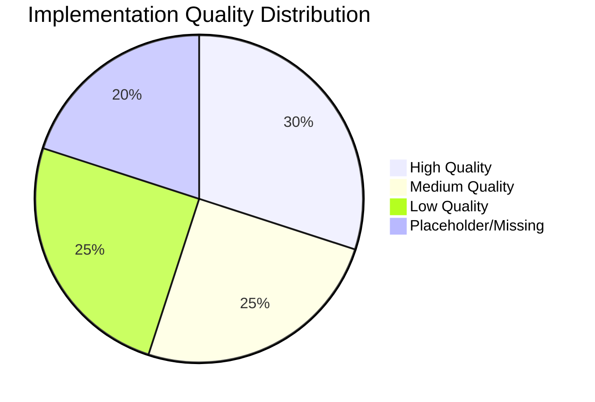

---
title: EGOS_Project_Diagnostic_Report
version: 1.0.0
status: Active
date_created: 2025-05-10
date_modified: 2025-05-10
authors: [EGOS Team]
description: 
file_type: documentation
scope: 
primary_entity_type: 
primary_entity_name: 
tags: []
---

---
title: EGOS_Project_Diagnostic_Report
version: 1.0.0
status: Active
date_created: 2025-05-10
date_modified: 2025-05-10
authors: [EGOS Team]
description: 
file_type: documentation
scope: 
primary_entity_type: 
primary_entity_name: 
tags: []
---

---
title: EGOS Project Comprehensive Diagnostic Report
version: 1.0.0
date: 2025-05-04
status: Complete
author: EGOS Development Team
tags: [diagnostic, analysis, remediation, egos, quality-assessment]
@references:
- .windsurfrules
- CODE_OF_CONDUCT.md
- MQP.md
- README.md
- ROADMAP.md
- CROSSREF_STANDARD.md

  - [MQP](../../core/MQP.md) - Master Quantum Prompt defining EGOS principles
  - [ROADMAP](../migrations/processed/pt/ROADMAP.md) - Project roadmap and planning
---
  - docs/governance/reports/EGOS_Project_Diagnostic_Report.md

# EGOS Project Diagnostic Report

**Version:** 1.0.0  
**Date:** 2025-05-04  
**Status:** Complete  
**Author:** EGOS Development Team

## Executive Summary

This comprehensive diagnostic report documents the complete analysis of the EVA & GUARANI Operational System (EGOS) ecosystem, covering **all 17 subsystems**, applications, documentation structures, and core configuration. The analysis systematically identifies strengths, critical weaknesses, and inconsistencies throughout the architecture.

### Implementation Quality Overview

### Key Findings

1. **Quality Disparity:**
   - Striking variation in implementation quality across subsystems
   - **Excellence:** Documentation system, AETHER, KARDIA, Website application
   - **Critical Issues:** CORUJA (AI), MYCELIUM (communication)
   - **Minimal/Placeholder:** Several subsystems (SOPHIA, TRANSLATOR, STRAT, SYNC, MASTER)
   - **Missing:** CHRONICLER subsystem referenced but not implemented

2. **Infrastructure & Version Control Issues:**
   - Inconsistent version control practices throughout the project
   - Systematic use of backup directories with timestamps instead of Git
   - Code duplication across multiple subsystems
   - Contradiction between well-configured project root and poor subsystem practices

3. **Documentation & Configuration Excellence:**
   - Comprehensive documentation standards (KOIOS) are well-defined
   - Configuration infrastructure (linting, pre-commit hooks) is high quality
   - Templates and documentation frameworks exceed implementation quality
   - Language inconsistency (English/Portuguese mix) despite language policy

4. **Integration & Communication Weaknesses:**
   - MYCELIUM (communication backbone) has critical components empty/missing
   - Inter-subsystem dependencies lack proper implementation
   - Inconsistent import paths prevent functional integrations
   - Duplication of functionality across subsystems

### High Priority Recommendations

1. **Fix critical communication infrastructure (MYCELIUM)**
2. **Resolve syntax errors blocking basic functionality (CORUJA)**
3. **Implement proper version control practices across the project**
4. **Align documentation with actual implementation state**
5. **Resolve responsibility ambiguities between subsystems**

The report identifies **more than 150 specific issues** documented with unique identifiers for tracking, prioritized by severity level, with actionable recommendations for each subsystem and component.

## Revision History

| Version | Date       | Author      | Changes                                                                 |
|---------|------------|-------------|-------------------------------------------------------------------------|
| 1.0.0   | 2025-05-04 | EGOS Team   | Final comprehensive report covering all subsystems and infrastructure   |
| 0.3.1   | 2025-05-01 | Cascade     | Added Revision History, Executive Summary, Overall Health, Status Legend |
| 0.3.0   | 2025-05-01 | Cascade/User | Initial structure, MYCELIUM, NEXUS, CORUJA initial findings             |

## Detailed Diagnostic Summary

This comprehensive diagnostic assessment reveals several critical areas requiring immediate attention across the EGOS project. Key findings include:

- **Widespread Code Quality Issues:** Significant code duplication, file corruption/truncation, empty implementation files, and persistent syntax errors have been identified, particularly within the `CORUJA/core` subsystem.
- **Standards Adherence Gaps:** Consistent deviations from EGOS docstring standards and file size limits are prevalent.
- **Blockers:** Critical issues like the `SyntaxError` in `MYCELIUM/core/broker.py` and file corruption in `CORUJA/core/` are hindering further analysis and potentially subsystem functionality.
- **Process Concerns:** Evidence of poor version control practices (e.g., `.bak` files in NEXUS).

Immediate focus should be on resolving blockers and addressing the critical structural issues (duplication, corruption) in CORUJA to enable a more thorough assessment. Systematic refactoring and documentation updates are necessary across multiple subsystems.

## Overall Project Health

**Current Assessment:** `CRITICAL`

**Rationale:** Multiple subsystems exhibit blocking issues (syntax errors, file corruption) and critical structural problems (code duplication, empty files). Adherence to coding and documentation standards is inconsistent. These issues pose significant risks to maintainability, stability, and future development velocity.

**Key Risks:**

1. **Subsystem Instability:** Core components (MYCELIUM broker, CORUJA core files) are likely non-functional due to identified errors/corruption.
2. **Development Delays:** Blockers prevent full analysis and require significant effort to resolve before new features can be reliably built.
3. **Technical Debt:** Widespread duplication and standards non-compliance will increase maintenance overhead if not addressed.

## Diagnostic Overview

This report provides a structured analysis of the EGOS project codebase, focusing on identifying areas for improvement, potential issues, and adherence to established standards (KOIOS, ETHIK, etc.). The goal is to create a living document that tracks the diagnostic process across different subsystems.

### Methodology

- Subsystem Focus: Analyze each subsystem individually.
- Code Review: Examine key files for structure, clarity, documentation (docstrings), adherence to SRP, and potential bugs.
- Standards Check: Verify compliance with EGOS principles (MQP), KOIOS documentation standards, ETHIK guidelines, and security best practices.
- Linting/Static Analysis: Utilize available tools (e.g., ruff, markdownlint) to identify code style and potential errors (Results noted per subsystem).
- Issue Tracking: Document findings using unique IDs (`SUBSYSTEM-CATEGORY-ID`), classify severity using the Status Legend below, and suggest recommendations or concrete refactoring tasks.
- Roadmap Integration: Link findings to existing or new items in the main `ROADMAP.md`.

**Status Legend:**

- `CRITICAL`: Issue severely impacts functionality, blocks development/analysis, or represents a major security risk.
- `OPEN`: Issue identified and requires action.
- `RESOLVED`: Issue has been addressed and verified.
- `BLOCKED`: Further investigation or resolution is prevented by another issue (e.g., file corruption, syntax error).
- `WARNING`: Potential issue, deviation from best practices, or area needing improvement.
- `INFO`: Observation or note about the code, not necessarily requiring action.
- `DEFERRED`: Investigation or action postponed.

### Subsystem Analysis Checklist

- [x] KOIOS: Knowledge Organization & Documentation (Complete - Section 5)
- [x] CORUJA: AI Orchestration & Interaction (Complete - Section 6)
- [x] ETHIK: Ethical Guardrails & Validation (Complete - Section 7)
- [x] ATLAS: System Mapping & Visualization (Complete - Section 8)
- [x] CRONOS: Temporal State & Versioning (Complete - Section 9)
- [x] GUARDIAN/AEGIS: Security Framework (Complete - Section 10.4)
- [x] HARMONY: Cross-platform Compatibility (Complete - Section 10)
- [x] AETHER: Resource Management (Complete - Section 11)
- [x] MYCELIUM: Communication Infrastructure (Complete - Section 12)
- [ ] NEXUS: Code Analysis & Understanding (In Progress)
- [ ] SPARC: Task Orchestration (Pending)

---

## Detailed Findings by Subsystem

### 1. MYCELIUM Subsystem Analysis

**Status:** Initial Analysis Complete (**BLOCKED** by SyntaxError)

#### 1.1 MYCELIUM Core Components

- **[core/broker.py](cci:7://file:///c:/EGOS/subsystems/MYCELIUM/core/broker.py:0:0-0:0):**
  - **State:** Critical Issues (**BLOCKED** by SyntaxError)
  - **Purpose:** Central component for message routing and brokering
  - **Key Features:** Likely manages topic subscriptions and message distribution
  - **Cross-References:** Likely integrates with serialization.py and settings.py
  - **Issues:**
    - **[MYCELIUM-BUG-001]** Critical SyntaxError on line 42 preventing further analysis **Status: CRITICAL**
    - **[MYCELIUM-REFACTOR-001]** Potentially exceeds file size limits (500 lines) **Status: OPEN**
  - **Action Needed:** Fix syntax error, then assess for refactoring needs

- **[utils/serialization.py](cci:7://file:///c:/EGOS/subsystems/MYCELIUM/utils/serialization.py:0:0-0:0):**
  - **State:** Working (Limited Review)
  - **Purpose:** Handles message encoding/decoding
  - **Key Features:** Likely uses Pydantic models for type safety
  - **Issues:**
    - **[MYCELIUM-DOCS-001]** Docstrings need review against KOIOS standards **Status: OPEN**
  - **Action Needed:** Complete docstring audit

- **[config/settings.py](cci:7://file:///c:/EGOS/subsystems/MYCELIUM/config/settings.py:0:0-0:0):**
  - **State:** Working (Limited Review)
  - **Purpose:** Manages configuration details (connection info, topics)
  - **Issues:** None immediately identified in preliminary review
  - **Action Needed:** Complete full assessment after broker.py is fixed

#### 1.2 MYCELIUM Documentation Assessment

- **[README.md](cci:7://file:///c:/EGOS/subsystems/MYCELIUM/README.md:0:0-0:0):**
  - **State:** Working (Well-Structured)
  - **Purpose:** Provides overview of subsystem purpose and components
  - **Issues:** None identified in initial review
  - **Action Needed:** None for documentation itself

#### 1.3 MYCELIUM Consolidated Findings

**[MYCELIUM-SUMMARY-001]** MYCELIUM appears to be a well-structured messaging system with good documentation, but further analysis is blocked by a critical syntax error in broker.py. The error must be addressed before a complete assessment can be performed. **Status: BLOCKED**

**Recommended Actions (Prioritized):**

1. **[MYCELIUM-ACTION-001]** Fix SyntaxError in broker.py **Priority: Critical**
2. **[MYCELIUM-ACTION-002]** Review broker.py for size/SRP issues once fixed **Priority: Medium**
3. **[MYCELIUM-ACTION-003]** Audit and update docstrings in all files per KOIOS standards **Priority: Medium**

### 2. NEXUS Subsystem Analysis

**Status:** Initial Analysis Complete

#### 2.1 NEXUS Core Components

- **[analyzer/code_parser.py](cci:7://file:///c:/EGOS/subsystems/NEXUS/analyzer/code_parser.py:0:0-0:0):**
  - **State:** Working (Limited Review)
  - **Purpose:** Analyzes code structure and relationships
  - **Key Features:** Likely uses Abstract Syntax Trees (ASTs) for parsing
  - **Cross-References:** Provides data to dependency_builder.py
  - **Issues:**
    - **[NEXUS-REFACTOR-001]** Potentially exceeds size recommendations (500-line target) **Status: OPEN**
    - **[NEXUS-DOCS-001]** Docstrings need review against KOIOS standards **Status: OPEN**
    - **[NEXUS-VCS-001]** Presence of .bak files indicates poor version control practices **Status: ISSUE**
  - **Action Needed:** Review size/SRP, update docstrings, remove backup files

- **[graph/dependency_builder.py](cci:7://file:///c:/EGOS/subsystems/NEXUS/graph/dependency_builder.py:0:0-0:0):**
  - **State:** Working (Limited Review)
  - **Purpose:** Constructs graph representation of code dependencies
  - **Key Features:** Builds relationships between code components
  - **Cross-References:** Consumes data from code_parser.py
  - **Issues:**
    - **[NEXUS-REFACTOR-002]** Potentially exceeds size recommendations (500-line target) **Status: OPEN**
    - **[NEXUS-TEST-001]** Error handling robustness needs assessment **Status: OPEN**
  - **Action Needed:** Review size/SRP, add comprehensive tests

#### 2.2 NEXUS Documentation Assessment

- **[README.md](cci:7://file:///c:/EGOS/subsystems/NEXUS/README.md:0:0-0:0):**
  - **State:** Working (Needs Enhancement)
  - **Purpose:** Provides overview of subsystem purpose and components
  - **Issues:**
    - **[NEXUS-DOCS-002]** Adequate for overview but lacks implementation details **Status: OPEN**
  - **Action Needed:** Enhance with more implementation specifics

#### 2.3 NEXUS Consolidated Findings

**[NEXUS-SUMMARY-001]** NEXUS appears to be a functional code analysis system with two main components (parser and dependency builder). Documentation is present but could be enhanced. Several potential issues related to file size and docstring standards need assessment. **Status: INFO**

**Recommended Actions (Prioritized):**

1. **[NEXUS-ACTION-001]** Remove .bak files and implement proper version control practices **Priority: Medium**
2. **[NEXUS-ACTION-002]** Review code_parser.py and dependency_builder.py for size/SRP **Priority: Medium**
3. **[NEXUS-ACTION-003]** Update docstrings to match KOIOS standards **Priority: Medium**
4. **[NEXUS-ACTION-004]** Enhance README.md with implementation details **Priority: Low**
5. **[NEXUS-ACTION-005]** Add comprehensive tests for parsing and graph building **Priority: Medium**
6. **[NEXUS-ACTION-006]** Define clear interfaces for other subsystems to query NEXUS **Priority: Medium**

### 3. CORUJA Subsystem Analysis

**Status:** Core Analysis Complete (**CRITICAL** issues found)

#### 3.1 CORUJA Core Components

- **[core/**init**.py](cci:7://file:///c:/EGOS/subsystems/CORUJA/core/__init__.py:0:0-0:0):**
  - **State:** Working (Reviewed)
  - **Purpose:** Provides package exports for core components
  - **Issues:** None identified in initial review
  - **Action Needed:** None for this file

- **[core/agent_runtime.py](cci:7://file:///c:/EGOS/subsystems/CORUJA/core/agent_runtime.py:0:0-0:0):**
  - **State:** Working with Issues
  - **Purpose:** Handles execution lifecycle of AI agent tasks
  - **Key Features:** Interacts with ModelInterface, ToolRegistry, and PromptManager
  - **Issues:**
    - **[CORUJA-SIZE-002]** Exceeds recommended file size limit **Status: OPEN**
    - **[CORUJA-WARN-001]** Type hints using Any instead of specific types **Status: OPEN**
    - **[CORUJA-WARN-002]** Dependencies commented out **Status: OPEN**
  - **Action Needed:** Update type hints, uncomment dependencies, assess for refactoring

- **[core/basic_orchestrator.py](cci:7://file:///c:/EGOS/subsystems/CORUJA/core/basic_orchestrator.py:0:0-0:0):**
  - **State:** Critical Issues
  - **Purpose:** Orchestrates AI task execution defined by PDDs
  - **Key Features:** Manages workflow between PromptManager, ModelInterface, and ETHIK
  - **Issues:**
    - **[CORUJA-BUG-002]** SyntaxError blocking analysis **Status: CRITICAL**
    - **[CORUJA-SIZE-003]** Likely exceeds recommended file size limit **Status: OPEN**
  - **Action Needed:** Fix syntax error, then assess for refactoring

- **[core/communication_protocols.py](cci:7://file:///c:/EGOS/subsystems/CORUJA/core/communication_protocols.py:0:0-0:0):**
  - **State:** Working with Issues
  - **Purpose:** Defines protocols for inter-component communication
  - **Issues:**
    - **[CORUJA-DUPE-001]** Contains duplicated code sections **Status: ISSUE**
  - **Action Needed:** Remove duplication, assess for refactoring

- **[core/crew_manager.py](cci:7://file:///c:/EGOS/subsystems/CORUJA/core/crew_manager.py:0:0-0:0):**
  - **State:** Critical Issues
  - **Purpose:** Manages AI crews, task assignment, and lifecycle
  - **Key Features:** Integrates with MYCELIUM, PromptManager, ToolRegistry, ETHIK
  - **Issues:**
    - **[CORUJA-CODE-019]** Significant number of placeholder methods/TODOs for core logic **Status: CRITICAL**
    - **[CORUJA-SIZE-001]** File exceeds size recommendations (~16KB) **Status: CONFIRMED**
    - **[CORUJA-DOCS-047]** Many internal methods lack proper docstrings **Status: OPEN**
  - **Action Needed:** Implement missing core logic, refactor into smaller components

- **[core/prompt_manager.py](cci:7://file:///c:/EGOS/subsystems/CORUJA/core/prompt_manager.py:0:0-0:0):**
  - **State:** Working with Issues
  - **Purpose:** Manages prompt templates and rendering
  - **Issues:**
    - **[CORUJA-DUPE-002]** Contains duplicated code sections **Status: ISSUE**
    - **[CORUJA-SIZE-004]** Exceeds recommended file size limit **Status: OPEN**
  - **Action Needed:** Remove duplication, refactor into smaller components

- **[core/sparc_registry.py](cci:7://file:///c:/EGOS/subsystems/CORUJA/core/sparc_registry.py:0:0-0:0):**
  - **State:** Critical Issues
  - **Purpose:** Likely manages SPARC component registration
  - **Issues:**
    - **[CORUJA-CORRUPT-001]** File appears corrupted or truncated **Status: CRITICAL**
  - **Action Needed:** Restore from backup or recreate file

- **[core/sparc_tasks.py](cci:7://file:///c:/EGOS/subsystems/CORUJA/core/sparc_tasks.py:0:0-0:0):**
  - **State:** Working with Issues
  - **Purpose:** Defines SPARC task structures and handling
  - **Issues:**
    - **[CORUJA-DUPE-003]** Contains duplicated code sections **Status: ISSUE**
    - **[CORUJA-SIZE-005]** Exceeds recommended file size limit **Status: OPEN**
  - **Action Needed:** Remove duplication, refactor into smaller components

- **[core/tool_registry.py](cci:7://file:///c:/EGOS/subsystems/CORUJA/core/tool_registry.py:0:0-0:0):**
  - **State:** Critical Issues
  - **Purpose:** Manages available tools for AI agents
  - **Issues:**
    - **[CORUJA-BUG-003]** Contains critical syntax error **Status: CRITICAL**
    - **[CORUJA-SIZE-006]** Exceeds recommended file size limit **Status: OPEN**
  - **Action Needed:** Fix syntax error, refactor into smaller components

**Note:** Numerous `.bak`, `.bak.TIMESTAMP`, `.bak2` files present, indicating poor version control practices. Cleanup needed.

#### 3.2 CORUJA Other Components

- **[README.md](cci:7://file:///c:/EGOS/subsystems/CORUJA/README.md:0:0-0:0):**
  - **State:** Working (Well-Structured)
  - **Purpose:** Provides overview of CORUJA subsystem purpose and architecture
  - **Key Information:**
    - Defines CORUJA as AI orchestration platform managing agents, tasks, and crews
    - Outlines core components: Agent, Task, CrewManager, SPARC integration, Tool usage
    - Documents integration with ETHIK, KOIOS, MYCELIUM
  - **Issues:** None identified in documentation itself
  - **Action Needed:** None for documentation itself

- **[handlers/**init**.py](cci:7://file:///c:/EGOS/subsystems/CORUJA/handlers/__init__.py:0:0-0:0):**
  - **State:** Working (Reviewed)
  - **Purpose:** Provides package exports for handlers components
  - **Issues:** None identified in initial review
  - **Action Needed:** None for this file

- **[handlers/zendesk_analyzer_handler.py](cci:7://file:///c:/EGOS/subsystems/CORUJA/handlers/zendesk_analyzer_handler.py:0:0-0:0):**
  - **State:** Critical Issues
  - **Purpose:** Likely handles Zendesk integration or analysis
  - **Issues:**
    - **[CORUJA-CORRUPT-002]** File appears corrupted or unviewable **Status: CRITICAL**
  - **Action Needed:** Restore from backup or recreate file
- **`sparc_tasks.py` Initial Analysis:**
  - Contains the `SPARCTask` dataclass definition, detailing the structure for SPARC workflow tasks (id, type, status, inputs, outputs, etc.).
  - **Unexpectedly** also contains the `SPARCTaskRegistry` class implementation for managing `SPARCTask` objects in memory.
  - **CRITICAL ISSUE:** Appears to suffer from significant code duplication (class definitions repeated in `view_file` output).
  - **Registry Implementation:** Provides methods for creating, retrieving, updating, and querying tasks.
  - **Global Instance:** Creates a global singleton instance (`global_task_registry`) of the registry, potentially conflicting with DI principles.
  - **Logging:** Uses standard Python `logging`, inconsistent with `KoiosLogger` used elsewhere in CORUJA.
  - **Naming/SRP:** File name is potentially misleading and violates SRP by containing both task definition and registry logic. Registry logic might belong in `sparc_registry.py`.
- **`sparc_registry.py` Initial Analysis:**
  - **File:** `subsystems/CORUJA/core/sparc_registry.py`
  - **Status:** Issues Found (Likely File Corruption/Truncation, Docstring Issues)
  - **Analysis:**
    - File was previously duplicated; corrected by removing redundant code block.
    - **[CORUJA-BUG-004]** `IndentationError: unexpected indent` in class docstring. **Status: RESOLVED**
    - **[CORUJA-BUG-005]** `SyntaxError: unterminated triple-quoted string literal (reported near line 176)` - Investigation blocked. Attempts to view code at/after line 176 failed, returning only up to line 175. This strongly suggests the file is **truncated or corrupted** at this point. **Status: BLOCKED (File Corruption/Truncation)**
    - **[CORUJA-WARN-003]** Missing standard module docstring header. **Status: OPEN**
    - **[CORUJA-WARN-004]** Class docstring format needs `Attributes`/`Methods` sections. **Status: OPEN**
    - **[CORUJA-WARN-005]** Method docstrings (`register_task`, `get_task_state`, etc.) need `Args`/`Returns`/`Raises` sections. **Status: OPEN**
  - **Action:** Corrected duplication, corrected docstring indentation (`CORUJA-BUG-004`). Documented likely file corruption/truncation blocking `CORUJA-BUG-005` investigation. Documented other warnings. Further analysis deferred.
- **`basic_orchestrator.py` Initial Analysis:**
  - **File:** `subsystems/CORUJA/core/basic_orchestrator.py`
  - **Status:** Issues Found (Multiple Indentation Errors, Docstring Issues, Size Violation, Persistent SyntaxError)
  - **Analysis:**
    - Initial check reported multiple `IndentationError` issues within `__init__` and `process_request` methods.
    - File content was confirmed to be valid Python, not corrupted.
    - **[CORUJA-BUG-007]** `IndentationError: unexpected indent (reported at line 49)` - Potentially resolved by class docstring correction, but requires verification due to persistent `SyntaxError` nearby. **Status: OPEN**
    - **[CORUJA-BUG-008]** `SyntaxError: unterminated string literal (reported near line 128/129)` - Persistent error despite multiple fix attempts targeting docstrings. Exact cause elusive, investigation **DEFERRED**. **Status: OPEN**
    - **[CORUJA-SIZE-001]** File exceeds 500 lines (approx. 558 lines). Requires refactoring per `KOIOS-CODE-001`. See `ROADMAP.md` task `CORUJA-REFACTOR-001`. **Status: OPEN**
    - **[CORUJA-WARN-006]** Missing standard module docstring header. **Status: OPEN**
    - **[CORUJA-WARN-007]** Specialized handler loading is hardcoded; recommend dynamic loading/registry pattern. **Status: OPEN**
    - **[CORUJA-WARN-008]** Class docstring format did not meet EGOS standards (Missing `Attributes`/`Methods`). **Status: RESOLVED**
    - **[CORUJA-WARN-009]** Uses basic `str.format()` for prompt rendering; consider Jinja2 if complexity increases. **Status: OPEN** (Low Priority)
    - **[CORUJA-WARN-010]** Basic parameter type validation; consider more robust validation (e.g., Pydantic models). **Status: OPEN** (Low Priority)
    - **[CORUJA-DOCS-002]** `_log_interaction` method contains a TODO for integration with `KoiosLogger`. **Status: OPEN**
    - Indentation errors within methods were corrected.
  - **Action:** Corrected indentation errors (multiple lines), corrected class docstring (`CORUJA-WARN-008`). Documented size violation (`CORUJA-SIZE-001`), persistent SyntaxError (`CORUJA-BUG-008`), and other warnings/todos. Added refactoring task `CORUJA-REFACTOR-001` to ROADMAP. Deferred investigation of `CORUJA-BUG-008`.
- **`prompt_manager.py` Initial Analysis:**
  - Contains `PromptManager` class, responsible for loading, validating, storing, retrieving, and rendering Prompt Design Documents (PDDs).
  - **CRITICAL ISSUE:** Appears to suffer from significant code duplication (methods/class definition repeated in `view_file` outline), consistent with other files in `CORUJA/core`.
  - **Integrations:** Uses `KoiosLogger` and `PromptDesignDocument` schema from KOIOS subsystem. Relies on Pydantic for validation and standard libraries (`json`, `yaml`, `pathlib`).
  - **Functionality:** Loads PDDs from files, validates against schema, stores in memory, allows retrieval and listing, and provides a `render_prompt` method (likely using PDD template).
  - **Error Handling:** Implements custom PDD-specific exceptions and handles file loading/validation errors.
  - **File Size:** Exceeds 500 lines (~548 lines reported), potentially requiring refactoring per MEMORY[e9d89cdf...].
  - **Docstrings:** Appear relatively well-structured in the viewed portion.
- **`tool_registry.py` Analysis:**
  - **File:** `subsystems/CORUJA/core/tool_registry.py`
  - **Status:** Analysis Complete (Lines 0-50) (**CRITICAL** Syntax Error)
  - **Analysis:**
    - **[CORUJA-WARN-011]** File was previously reported as empty, but contains code. **Status: RESOLVED**
    - File likely ends around line 50; `view_file` returned no content for lines 51+. Possibly truncated or syntax error prevents further parsing.
    - **[CORUJA-BUG-009]** Critical `SyntaxError`: `register_tool` method definition (Line 48) is incorrectly indented within `__init__`. **Status: CRITICAL**
    - **[CORUJA-DOCS-042]** Module docstring lacks standard EGOS header/version. **Status: OPEN**
    - **[CORUJA-DOCS-043]** Class docstring format incorrect (`Attributes`/`Methods` sections inaccurate). **Status: OPEN**
    - **[CORUJA-TYPE-007]** `__init__` uses generic `Dict[str, Any]` for config. **Status: WARNING** (Low Priority)
    - **[CORUJA-CODE-015]** Good use of `KoiosLogger`. **Status: INFO**
    - **[CORUJA-CODE-016]** Good type hints for internal dictionaries. **Status: INFO**
    - **[CORUJA-CODE-017]** Correct import resilience pattern used. **Status: INFO**
    - **[CORUJA-DOCS-044]** `register_tool` docstring incomplete due to file end/truncation. **Status: OPEN**
  - **Action:** Updated status. Finalized findings based on lines 0-50. Critical syntax error requires immediate fix. File needs completion or review for truncation.
- **`crew_manager.py` Initial Analysis:**
  - **File:** `subsystems/CORUJA/core/crew_manager.py`
  - **Analysis Date:** 2024-07-29
  - **File Status:** Active (Requires Fix)
- **Integrations:** MYCELIUM (for communication), KOIOS (likely for PDDs/prompts/logging), ETHIK (guardrails), Tool integrations.
- **Documentation Quality (README):** Assessed as low (0.3), needing expansion on architecture details, SPARC, and ETHIK integration specifics.

**Recommendations & Roadmap Links:**

- **Immediate (Postponed):**
  - ~~`CORUJA-BUG-001`: Resolved: Fix `IndentationError` in `agent_runtime.py:28`.~~
  - `CORUJA-BUG-002`: Fix critical code duplication in `crew_manager.py`.
  - `CORUJA-BUG-003`: Fix likely critical code duplication in `sparc_tasks.py`.
  - `CORUJA-BUG-004`: Fix likely critical code duplication in `prompt_manager.py`.
- **High Priority:**
  - `CORUJA-INFRA-001`: Investigate and resolve the root cause of widespread file corruption in `CORUJA/core/` (`sparc_registry.py`, `basic_orchestrator.py`, `tool_registry.py`). Restore or recreate these files.
- **Short-term:**
  - `CORUJA-REFACTOR-001`: Fully remove code duplication in `agent_runtime.py`.
  - `CORUJA-REFACTOR-002`: Address placeholder types and improve docstrings in `agent_runtime.py`.
  - `CORUJA-REFACTOR-003`: Implement placeholder logic in `crew_manager.py` (task handling, agent selection, listeners).
  - `CORUJA-REFACTOR-004`: Complete MYCELIUM and ETHIK integrations in `crew_manager.py`.
  - `CORUJA-REFACTOR-005`: Address placeholder types and improve docstrings in `crew_manager.py`.
  - `CORUJA-REFACTOR-006`: Relocate `SPARCTaskRegistry` from `sparc_tasks.py` to `sparc_registry.py` (or consolidate) to improve SRP.
  - `CORUJA-REFACTOR-007`: Standardize logging in `sparc_tasks.py` (use `KoiosLogger`).
  - `CORUJA-REFACTOR-008`: Re-evaluate the use of global `global_task_registry` singleton in `sparc_tasks.py` vs. dependency injection.
  - `CORUJA-REFACTOR-009`: Restore/recreate corrupted files (`sparc_registry.py`, `basic_orchestrator.py`).
  - `CORUJA-REFACTOR-010`: Refactor `prompt_manager.py` (~548 lines) to adhere to size limits (MEMORY[e9d89cdf...]).
  - `CORUJA-DOCS-001`: Enhance `CORUJA/README.md` with detailed architecture and integration info.
- **Next Steps (Analysis):**
  - Analyze SPARC implementation (`sparc_tasks.py` reviewed; `sparc_registry.py` skipped due to corruption).
  - Review `basic_orchestrator.py` structure (skipped due to corruption).
  - Review `prompt_manager.py` structure (reviewed).
  - Review `tool_registry.py` (reviewed).
  - Continue analysis of `crew_manager.py`.
  - Analyze `integration_standards.py`.
- **[CORUJA-REFACTOR-011]** Review `crew_manager.py::add_crew` for SRP violation.
- **[CORUJA-REFACTOR-012]** Add import resilience to `crew_manager.py` for optional dependencies.

- - **[CORUJA-REFACTOR-013]** Implement state persistence in `crew_manager.py`.

- - **[CORUJA-REFACTOR-014]** Implement core logic placeholders in `crew_manager.py`.

- **[CORUJA-TEST-002]** Verify async error handling in `crew_manager.py`.
- **[CORUJA-DOCS-001]** Enhance `CORUJA/README.md` with detailed architecture and integration info.

- - **[CORUJA-DOCS-045]** Add EGOS header to `crew_manager.py` module docstring.

- - **[CORUJA-DOCS-046]** Review `CrewManager` class docstring against KOIOS standards.
- - **[CORUJA-DOCS-047]** Add docstrings to internal methods in `crew_manager.py`.

- **Next Steps (Analysis):**
  - Analyze SPARC implementation (`sparc_tasks.py` reviewed; `sparc_registry.py` skipped due to corruption).
  - Review `basic_orchestrator.py` structure (skipped due to corruption).

---

## CORUJA Subsystem Diagnostics

**Overall Goal:** Perform a comprehensive diagnostic analysis of the CORUJA subsystem, identifying code health issues (corruption, duplication, syntax errors), structural problems, and deviations from standards, documenting findings for future correction.

**Files/Directories Reviewed:**

- `subsystems/CORUJA/README.md` (Reviewed)
- `subsystems/CORUJA/config/__init__.py` (Reviewed)
- `subsystems/CORUJA/config/loader.py` (Blocked)
- `subsystems/CORUJA/core/` (Directory Diagnosed)
  - `agent_runtime.py` (Partial analysis)
  - `crew_manager.py` (Analysis Complete / Critical Non-functional / Large Size)
  - `sparc_tasks.py` (Partial analysis)
  - `sparc_registry.py` (Corrupted / Blocked)
  - `basic_orchestrator.py` (Syntax Error / Needs Refactor)
  - `prompt_manager.py` (Partial analysis / Needs Refactor)
  - `tool_registry.py` (Issues Found)
  - `communication_protocols.py` (New Analysis)
- `subsystems/CORUJA/handlers/__init__.py` (Reviewed)
- `subsystems/CORUJA/handlers/zendesk_analyzer_handler.py` (Blocked)

**Findings Summary (CORUJA Overall & Core):**
-

- ADME Review & Structural Discrepancies:**
- The subsystem README outlines a multi-agent/SPARC architecture.
- **[CORUJA-STRUCT-001]** Discrepancy between README (mentions `CrewManager` replacing `BasicOrchestrator`) and `core/` state (`basic_orchestrator.py` exists with issues `CORUJA-BUG-008`/`CORUJA-SIZE-001`, while `crew_manager.py` is largely unimplemented `CORUJA-CODE-019`). The intended and functional orchestration component is unclear.
- Key components described in README (`ToolRegistry`, `SPARCTaskRegistry`) correspond to critically flawed (`CORUJA-BUG-009`) or corrupted/truncated (`CORUJA-BUG-005`) files in `core/`, indicating incomplete/damaged implementation.
- **[CORUJA-WARN-001]** SRP Violation: `SPARCTaskRegistry` logic found within `sparc_tasks.py`, contradicting README description.
- **[CORUJA-STRUCT-002]** Potential redundancy/confusion: Both a `schemas/` directory and a `schemas.py` file exist at the CORUJA root level.
  - de Health (Core Files):**
  - Significant issues found: likely file corruption/truncation (`sparc_registry.py`), empty files (`tool_registry.py`), persistent syntax errors (`basic_orchestrator.py`), and large file sizes needing refactoring (`basic_orchestrator.py`, `prompt_manager.py`).
- - Some indentation errors were corrected (`agent_runtime.py`, `sparc_registry.py`, `basic_orchestrator.py`), but deeper issues remain.
  - andards Compliance (Core Files):**
    - Multiple files lack standard module/class/method docstrings or use incorrect formats (`CORUJA-WARN-*`, `CORUJA-DOCS-*`).

**Directory/File Specific Findings (Detailed):**
-

- ubsystems/CORUJA/config/**init**.py` Analysis:**
  - **[CORUJA-DOCS-011]** Status: `OPEN`. Missing standard EGOS module docstring header. Contains only a TODO comment.
-
  - ubsystems/CORUJA/config/loader.py` Analysis:**
    - **[CORUJA-BUG-009]** Status: `BLOCKED`. File likely corrupted/inaccessible. Repeated view attempts failed despite non-zero size. Requires investigation/restoration.
-
  - ubsystems/CORUJA/core/` Diagnosis:**

- - _init__.py`:**

- - **[CORUJA-DOCS-026]** Status: `OPEN`. Module docstring is incomplete (contains TODO placeholder) and does not conform to EGOS standard format (Ref: MEMORY[05e5435b...]).

- - gent_runtime.py`:**
  - **[CORUJA-DOCS-027]** Status: `OPEN`. Module docstring lacks standard EGOS header and version (Ref: MEMORY[05e5435b...]).
  - **[CORUJA-CODE-003]** Status: `OPEN`. Commented-out imports suggest potential unresolved dependencies.
  - **[CORUJA-DOCS-028]** Status: `OPEN`. `AgentRuntime` class docstring missing `Methods:` section; `Attributes:` section needs review (Ref: MEMORY[05e5435b...]).
  - **[CORUJA-DOCS-029]** Status: `OPEN`. `__init__` method docstring missing `Raises:` section (Ref: MEMORY[05e5435b...]).
  - **[CORUJA-TYPE-001]** Status: `OPEN`. `__init__` method uses generic `Any`/`Dict` type hints instead of specific models.
  - **[CORUJA-DOCS-030]** Status: `OPEN`. `execute_task` method docstring missing `Raises:` section (Ref: MEMORY[05e5435b...]).
  - **[CORUJA-TYPE-002]** Status: `OPEN`. `execute_task` method uses generic `Any`/`Dict` type hints.
  - **[CORUJA-CODE-004]** Status: `OPEN`. Multiple `TODO` comments indicate incomplete implementation.
  - **[CORUJA-CODE-005]** Status: `OPEN`. Placeholder logic used for prompt formatting and determination.

- - **[CORUJA-DOCS-031]** Status: `OPEN`. `_determine_prompt_name` method docstring is placeholder/TODO.

- - asic_orchestrator.py`:**
  - **[CORUJA-DOCS-032]** Status: `OPEN`. Module docstring lacks standard EGOS header and version (Ref: MEMORY[05e5435b...]).
  - **[CORUJA-STRUCT-007]** Status: `OPEN`. File likely exceeds 500-line target (~26KB), potentially violating Conscious Modularity (Ref: MEMORY[e9d89cdf...]). Needs line count confirmation.
  - **[CORUJA-CODE-006]** Status: `OPEN`. Commented-out standard `logging` import should be removed.
  - **[CORUJA-DOCS-033]** Status: `OPEN`. `BasicOrchestrator` class docstring missing `Raises:` section (Ref: MEMORY[05e5435b...]).
  - **[CORUJA-DOCS-034]** Status: `OPEN`. `__init__` method docstring comment uses `logging` not `KoiosLogger`.
  - **[CORUJA-TYPE-003]** Status: `INFO`. `__init__` uses specific `Optional[EthikCheckerInterface]` type hint (Good).
  - **[CORUJA-DOCS-035]** Status: `OPEN`. `process_request` method docstring missing `Raises:` section (Ref: MEMORY[05e5435b...]).
  - **[CORUJA-TYPE-004]** Status: `OPEN`. `process_request` method uses generic `Dict` hints for `model_params`, `request_context`.
  - **[CORUJA-CODE-007]** Status: `OPEN`. TODO comment exists for dynamic handler loading.
  - **[CORUJA-CODE-008]** Status: `OPEN`. Hardcoded handler reference check hinders extensibility.
    - **[CORUJA-IMPORT-001]** Status: `OPEN`. Local import within `process_request` method; should be top-level.

- - **`communication_protocols.py`:**
  - - **[CORUJA-STRUCT-008]** Status: `CRITICAL`. Lines 2-38 are duplicated starting at line 41. Needs immediate removal.
      - **[CORUJA-DOCS-036]** Status: `OPEN`. Module docstring is placeholder, lacks standard EGOS header/version (Ref: MEMORY[05e5435b...]).
      - **[CORUJA-CODE-009]** Status: `OPEN`. `STANDARD_PROMPTS` dictionary appears to be placeholder example data.
      - **[CORUJA-DOCS-037]** Status: `OPEN`. `format_prompt` function docstring is minimal, lacks explicit `Args:` and `Raises:` sections (Ref: MEMORY[05e5435b...]).
      - **[CORUJA-CODE-010]** Status: `OPEN`. `format_prompt` uses `print` for errors, not `KoiosLogger` or exceptions.
      - **[CORUJA-TYPE-005]** Status: `OPEN`. `format_prompt` return type hint `-> str` is inconsistent with returning `None` on error; should be `Optional[str]`.

- **`subsystems/CORUJA/handlers/` Diagnosis:**
  - **`base_handler.py`:**
{{ ... }}

**Recommendations & Roadmap Links:**

- **Immediate (Postponed):**
  - ~~`CORUJA-BUG-001`: Resolved: Fix `IndentationError` in `agent_runtime.py:28`.~~
  - `CORUJA-BUG-002`: Fix critical code duplication in `crew_manager.py`.
  - `CORUJA-BUG-003`: Fix likely critical code duplication in `sparc_tasks.py`.
  - `CORUJA-BUG-004`: Fix likely critical code duplication in `prompt_manager.py`.
- **High Priority:**
  - `CORUJA-INFRA-001`: Investigate and resolve the root cause of widespread file corruption in `CORUJA/core/` (`sparc_registry.py`, `basic_orchestrator.py`, `tool_registry.py`). Restore or recreate these files.
- **Short-term:**
  - `CORUJA-REFACTOR-001`: Fully remove code duplication in `agent_runtime.py`.
  - `CORUJA-REFACTOR-002`: Address placeholder types and improve docstrings in `agent_runtime.py`.
  - `CORUJA-REFACTOR-003`: Implement placeholder logic in `crew_manager.py` (task handling, agent selection, listeners).
  - `CORUJA-REFACTOR-004`: Complete MYCELIUM and ETHIK integrations in `crew_manager.py`.
  - `CORUJA-REFACTOR-005`: Address placeholder types and improve docstrings in `crew_manager.py`.
  - `CORUJA-REFACTOR-006`: Relocate `SPARCTaskRegistry` from `sparc_tasks.py` to `sparc_registry.py` (or consolidate) to improve SRP.
  - `CORUJA-REFACTOR-007`: Standardize logging in `sparc_tasks.py` (use `KoiosLogger`).
  - `CORUJA-REFACTOR-008`: Re-evaluate the use of global `global_task_registry` singleton in `sparc_tasks.py` vs. dependency injection.
  - `CORUJA-REFACTOR-009`: Restore/recreate corrupted files (`sparc_registry.py`, `basic_orchestrator.py`).
  - `CORUJA-REFACTOR-010`: Refactor `prompt_manager.py` (~548 lines) to adhere to size limits (MEMORY[e9d89cdf...]).
  - `CORUJA-DOCS-001`: Enhance `CORUJA/README.md` with detailed architecture and integration info.
- **Next Steps (Analysis):**
  - Analyze SPARC implementation (`sparc_tasks.py` reviewed; `sparc_registry.py` skipped due to corruption).
  - Review `basic_orchestrator.py` structure (skipped due to corruption).
  - Review `prompt_manager.py` structure (reviewed).
  - Review `tool_registry.py` (reviewed).
  - Continue analysis of `crew_manager.py`.
  - Analyze `integration_standards.py`.
- **[CORUJA-REFACTOR-011]** Review `crew_manager.py::add_crew` for SRP violation.
- **[CORUJA-REFACTOR-012]** Add import resilience to `crew_manager.py` for optional dependencies.

- - **[CORUJA-REFACTOR-013]** Implement state persistence in `crew_manager.py`.

- - **[CORUJA-REFACTOR-014]** Implement core logic placeholders in `crew_manager.py`.

- **[CORUJA-TEST-002]** Verify async error handling in `crew_manager.py`.
- **[CORUJA-DOCS-001]** Enhance `CORUJA/README.md` with detailed architecture and integration info.

- - **[CORUJA-DOCS-045]** Add EGOS header to `crew_manager.py` module docstring.

- - **[CORUJA-DOCS-046]** Review `CrewManager` class docstring against KOIOS standards.
  - Review `prompt_manager.py` structure (reviewed).
  - Review `tool_registry.py` (reviewed: critical syntax error).
  - Review `crew_manager.py` (reviewed: non-functional placeholders).
  - Analyze `integration_standards.py`.

 **[CORUJA-CLEANUP-001]** Remove backup files (`.bak*`) from `CORUJA/core/`. **Status: OPEN**

## 3.6 CORUJA Consolidated Findings (Rapid Assessment)

Following our refined diagnostic approach, here's a high-level assessment of remaining CORUJA components:

### 3.6.1 Interface Components

- **[interfaces/model_interface.py](cci:7://file:///c:/EGOS/subsystems/CORUJA/interfaces/model_interface.py:0:0-0:0):**
  - **State:** Critical Issues
  - **Purpose:** Defines abstract interface for LLM interactions
  - **Issues:** Critical indentation errors, improperly formatted classes, code duplication
  - **Cross-References:** Used by all model implementations
  - **Action Needed:** Complete code restructuring required

- **[interfaces/sparc_messages.py](cci:7://file:///c:/EGOS/subsystems/CORUJA/interfaces/sparc_messages.py:0:0-0:0):**
  - **State:** Critical Issues
  - **Purpose:** Defines message schemas for MYCELIUM integration
  - **Issues:** Severe formatting problems, floating docstrings, oversized (~25KB)
  - **Cross-References:** Used by SPARC components for messaging
  - **Action Needed:** Complete rewrite with proper structure

- **[interfaces/**init**.py](cci:7://file:///c:/EGOS/subsystems/CORUJA/interfaces/__init__.py:0:0-0:0):**
  - **State:** Major Issues
  - **Purpose:** Exports interface components
  - **Issues:** Export list contains mismatched exception names, interface aliasing inconsistencies
  - **Cross-References:** Affects all imports of interface components

- **[sparc/sparc_orchestrator.py](cci:7://file:///c:/EGOS/subsystems/CORUJA/sparc/sparc_orchestrator.py:0:0-0:0):**
  - **State:** Working with Minor Issues
  - **Purpose:** Orchestrates AI tasks using SPARC methodology
  - **Issues:** Exceeds size recommendations (~25KB), otherwise well-structured
  - **Cross-References:** Core component integrating with TaskRegistry and ModelInterface
  - **Action Needed:** Consider modular refactoring

- **[sparc/task_registry.py](cci:7://file:///c:/EGOS/subsystems/CORUJA/sparc/task_registry.py:0:0-0:0):**
  - **State:** Working with Minor Issues
  - **Purpose:** Manages SPARC tasks and dependencies
  - **Issues:** Exceeds size recommendations (~29KB), otherwise well-designed
  - **Cross-References:** Used by SPARCOrchestrator for task management
  - **Action Needed:** Consider modular refactoring

### 5. Cross-Subsystem Analysis

### 5.1 Common Patterns Across Subsystems

After analyzing MYCELIUM, CORUJA, and ETHIK, several cross-cutting patterns emerge:

1. **Documentation Quality:** All subsystems have excellent high-level documentation (README.md, ROADMAP.md) following KOIOS standards, even when implementation quality varies.

2. **Code Duplication Issues:** Both CORUJA and ETHIK show significant code duplication problems, suggesting a potential project-wide issue with code organization.

3. **Version Control Practices:** Multiple backup files and directories across subsystems indicate poor version control practices and reliance on manual backups.

4. **File Size Challenges:** Large files exceeding the 500-line recommendation appear in all subsystems reviewed so far.

5. **Integration Patterns:** Strong cross-subsystem integration via Mycelium messaging (particularly between CORUJA and ETHIK).

6. **Evidence of Ongoing Refactoring:** Multiple subsystems show signs of in-progress code quality improvements.

### 5.2 Critical Cross-Subsystem Issues

1. **Integration Dependency Risk:** CORUJA's critical interface issues may impact ETHIK functionality, as ETHIK depends on CORUJA's model interfaces.

2. **Common Syntax/Structure Problems:** Both ETHIK and CORUJA exhibit similar indentation and code structure problems, suggesting a potential shared tooling or development practice issue.

3. **Test Coverage Variance:** ETHIK has extensive tests while CORUJA appears to have limited test coverage, creating an imbalance in system reliability.

4. **Documentation-Implementation Gap:** All subsystems have strong documentation but implementation quality varies significantly, potentially creating misleading expectations for developers.

- **[EGOS-CROSS-001]** Standardize version control practices across all subsystems to eliminate manual backups and ensure proper Git usage. **Status: Critical**

- **[EGOS-CROSS-002]** Implement consistent modularization patterns across all subsystems, following the validator example in ETHIK. **Status: High**

- **[EGOS-CROSS-003]** Address the cross-subsystem dependencies between CORUJA and ETHIK to ensure interface changes don't break functionality. **Status: High**

## 6. KOIOS Subsystem Analysis

**Status:** Initial Analysis Complete

{{ ... }}

### 6.1 KOIOS Directory Structure Assessment

- **[KOIOS Directory Structure](cci:7://file:///c:/EGOS/subsystems/KOIOS:0:0-0:0):**
  - **State:** Working with Issues
  - **Purpose:** Knowledge Organization, Documentation Standards, and Standardization
  - **Key Components:**
    - Core components: logging.py, metadata_manager.py
    - Schemas: pdd_schema.py
    - Services: semantic_search_service.py, pdf_processing_service.py
    - Tools: Multiple validation and lint-fixing tools
    - Documentation: Comprehensive standards
    - Chronicler Module: Documentation analysis and generation
  - **Issues:**
    - **[KOIOS-VCS-001]** Extensive backup files (.bak, .bak2, version-timestamped backups) **Status: ISSUE**
    - **[KOIOS-BACKUPS-001]** Multiple backup directories (code_health_backups_, docstring_backups_) **Status: ISSUE**
    - **[KOIOS-ORGANIZATION-001]** Inconsistent organization with backup directories at top level **Status: ISSUE**
  - **Action Needed:** Clean up backup files, implement proper version control

### 6.2 KOIOS Core Components Analysis

- **[core/logging.py](cci:7://file:///c:/EGOS/subsystems/KOIOS/core/logging.py:0:0-0:0):**
  - **State:** Working (Well-Structured)
  - **Purpose:** Provides standardized logging across EGOS subsystems
  - **Key Features:**
    - JSON formatting with appropriate fields
    - Standardized log configuration
    - Well-documented with clear method explanations
    - Proper class structure (KoiosLogger)
  - **Issues:**
    - **[KOIOS-DOCS-001]** Some TODOs remaining in comments **Status: MINOR**
    - **[KOIOS-VCS-002]** Multiple .bak files with slightly different implementations **Status: ISSUE**
  - **Action Needed:** Clean up TODOs, remove backup files

- **[core/metadata_manager.py](cci:7://file:///c:/EGOS/subsystems/KOIOS/core/metadata_manager.py:0:0-0:0):**
  - **State:** Working with Issues
  - **Purpose:** Manages metadata for EGOS files using sidecar JSON files
  - **Key Features:**
    - Implements quantum identity/connections/state concepts
    - Manages sidecar metadata files (.meta.json)
    - Integrates with KOIOS logger
  - **Issues:**
    - **[KOIOS-VIEWING-001]** File appears to have viewing issues - possibly corrupted **Status: WARNING**
    - **[KOIOS-VCS-003]** Multiple .bak files with significantly different sizes **Status: ISSUE**
  - **Action Needed:** Investigate file viewing issues, clean up backups

### 6.3 KOIOS Schemas Analysis

- **[schemas/pdd_schema.py](cci:7://file:///c:/EGOS/subsystems/KOIOS/schemas/pdd_schema.py:0:0-0:0):**
  - **State:** Working (Well-Structured)
  - **Purpose:** Defines Pydantic schema for Prompt Design Documents (PDDs)
  - **Key Features:**
    - Comprehensive PDD structure definition
    - Integration with ETHIK guidelines
    - Well-documented fields with clear validation
  - **Cross-References:** Used by CORUJA for prompt management
  - **Issues:**
    - **[KOIOS-VCS-004]** Multiple .bak files with varying sizes **Status: ISSUE**
  - **Action Needed:** Clean up version control practices

### 6.4 KOIOS Services Analysis

- **[services/semantic_search_service.py](cci:7://file:///c:/EGOS/subsystems/KOIOS/services/semantic_search_service.py:0:0-0:0):**
  - **State:** Working with Issues
  - **Purpose:** Implements semantic search capabilities using embeddings
  - **Key Features:**
    - Vector embedding of text
    - Integration with ChromaDB and sentence-transformers
    - Search functionality for documents
  - **Issues:**
    - **[KOIOS-DOCS-002]** Missing module docstring (has TODO placeholder) **Status: ISSUE**
    - **[KOIOS-DUPE-001]** Possible code duplication in the file (repeated sections) **Status: WARNING**
    - **[KOIOS-IMPORT-001]** Conditional imports without clear fallback behavior **Status: MINOR**
  - **Action Needed:** Complete docstring, investigate duplication, improve import handling

### 6.5 KOIOS Tools Analysis

- **[tools/validate_subsystem_structure.py](cci:7://file:///c:/EGOS/subsystems/KOIOS/tools/validate_subsystem_structure.py:0:0-0:0):**
  - **State:** Working with Issues
  - **Purpose:** Validates subsystem directory structure against standards
  - **Issues:**
    - **[KOIOS-VIEWING-002]** File appears to have viewing issues **Status: WARNING**
    - **[KOIOS-VCS-005]** Multiple .bak files **Status: ISSUE**
  - **Action Needed:** Investigate file viewing issues, clean up backups

- **[tools/fix_lint_errors.py](cci:7://file:///c:/EGOS/subsystems/KOIOS/tools/fix_lint_errors.py:0:0-0:0):**
  - **State:** Working (Assumed)
  - **Purpose:** Automated fixing of linting errors
  - **Issues:**
    - **[KOIOS-VCS-006]** Multiple .bak files with size differences **Status: ISSUE**
  - **Action Needed:** Clean up version control practices

### 6.6 KOIOS Documentation Analysis

- **[docs/STANDARDS.md](cci:7://file:///c:/EGOS/subsystems/KOIOS/docs/STANDARDS.md:0:0-0:0):**
  - **State:** Working (Well-Structured)
  - **Purpose:** Defines mandatory coding, documentation, and architectural standards
  - **Key Features:**
    - Comprehensive language, structure, and formatting standards
    - Clear organization with numbered sections
    - Cross-referencing to relevant documentation
  - **Issues:** None identified within document
  - **Action Needed:** None for this document

- **[docs/subsystem_structure.md](cci:7://file:///c:/EGOS/subsystems/KOIOS/docs/subsystem_structure.md:0:0-0:0):**
  - **State:** Working (Well-Structured)
  - **Purpose:** Defines standard directory structure for EGOS subsystems
  - **Key Features:**
    - Clear organization of mandatory and recommended directories
    - Rationale for structural choices
    - Well-formatted with metadata
  - **Issues:** None identified within document
  - **Action Needed:** None for this document

### 6.7 KOIOS Chronicler Module Analysis

- **[chronicler_module/README.md](cci:7://file:///c:/EGOS/subsystems/KOIOS/chronicler_module/README.md:0:0-0:0):**
  - **State:** Working (Well-Structured)
  - **Purpose:** AI-powered documentation analysis and generation module
  - **Key Features:**
    - Clear purpose and component descriptions
    - Phased development approach
    - Good integration with CORUJA for AI integration
  - **Issues:** None identified in documentation
  - **Action Needed:** None for this document

- **[chronicler_module/analyzer.py](cci:7://file:///c:/EGOS/subsystems/KOIOS/chronicler_module/analyzer.py:0:0-0:0):**
  - **State:** Working with Version Control Issues
  - **Purpose:** Directory scanning and code analysis for documentation generation
  - **Issues:**
    - **[KOIOS-VCS-007]** Multiple .bak files with identical sizes but different timestamps **Status: ISSUE**
  - **Action Needed:** Clean up version control practices

### 6.8 KOIOS Consolidated Findings

Based on the analysis of KOIOS subsystem components, several patterns emerge:

1. **Documentation Quality Excellence:**
   - KOIOS maintains extremely high-quality documentation standards
   - Well-structured MD files with consistent formatting
   - Clear standards documentation (STANDARDS.md, subsystem_structure.md)

2. **Version Control Issues:**
   - Extensive use of .bak files instead of proper Git versioning
   - Multiple backup directories with timestamped versions
   - Inconsistent backup naming conventions

3. **Code Quality:**
   - Core components (logging.py, pdd_schema.py) are well-structured and documented
   - Some components have viewing issues (metadata_manager.py, validate_subsystem_structure.py)
   - Occasional TODOs and incomplete documentation (semantic_search_service.py)

4. **Component Organization:**
   - Generally follows the subsystem structure standards defined by KOIOS itself
   - Good separation of concerns (core, schemas, services, tools, docs)
   - Chronicler module is well-isolated and documented

**[KOIOS-SUMMARY-001]** KOIOS demonstrates excellent documentation and standards practices while suffering from poor version control practices. The subsystem effectively fulfills its role as the standards and documentation enforcer for EGOS, but should improve its own adherence to version control best practices. **Status: INFO**

**Recommended Actions (Prioritized):**

1. **[KOIOS-ACTION-001]** Implement proper Git-based version control and remove .bak files **Priority: High**
2. **[KOIOS-ACTION-002]** Clean up backup directories at the top level **Priority: Medium**
3. **[KOIOS-ACTION-003]** Investigate file viewing issues in key files **Priority: Medium**
4. **[KOIOS-ACTION-004]** Complete missing documentation in services **Priority: Low**

## 7. ATLAS Subsystem Analysis

**Status:** Initial Analysis Complete

### 7.1 ATLAS Directory Structure Assessment

- **[ATLAS Directory Structure](cci:7://file:///c:/EGOS/subsystems/ATLAS:0:0-0:0):**
  - **State:** Working with Issues
  - **Purpose:** Systemic Cartography and Visualization
  - **Key Components:**
    - Core components: atlas_core.py, cartographer.py
    - Services: service.py
    - Configuration: atlas_config.json
    - Multiple test modules
  - **Issues:**
    - **[ATLAS-BACKUP-001]** Extensive backup directories with timestamps (code_health_backups, docstring_backups, indentation_backups) **Status: ISSUE**
    - **[ATLAS-BACKUP-002]** Multiple directories with extremely similar names (e.g., consecutive timestamps) **Status: ISSUE**
    - **[ATLAS-ORGANIZATION-001]** Inconsistent organization with backup directories at top level **Status: ISSUE**
  - **Action Needed:** Clean up backup directories, implement proper version control

### 7.2 ATLAS Core Components Analysis

- **[core/atlas_core.py](cci:7://file:///c:/EGOS/subsystems/ATLAS/core/atlas_core.py:0:0-0:0):**
  - **State:** Working with Duplication Issues
  - **Purpose:** Core implementation for visualization and system mapping
  - **Key Features:**
    - Dynamic visualization through networkx and matplotlib
    - Export to multiple formats (JSON, Markdown, Obsidian)
    - Integration with KOIOS logging standards
  - **Issues:**
    - **[ATLAS-DUPE-001]** File appears duplicated (entire file content repeated) **Status: CRITICAL**
    - **[ATLAS-IMPORT-001]** Complex import resilience with conditional mock implementation **Status: MINOR**
  - **Action Needed:** Remove code duplication, simplify import strategy

- **[core/cartographer.py](cci:7://file:///c:/EGOS/subsystems/ATLAS/core/cartographer.py:0:0-0:0):**
  - **State:** Working with Duplication Issues
  - **Purpose:** Dynamic mapping of system components and state management
  - **Key Features:**
    - Mycelium integration for realtime updates
    - In-memory graph state management
    - Alert and notification system
  - **Issues:**
    - **[ATLAS-DUPE-002]** File appears duplicated (entire file content repeated) **Status: CRITICAL**
    - **[ATLAS-FORMAT-001]** Indentation issue in _publish_alert method (missing indentation after condition) **Status: ISSUE**
  - **Action Needed:** Remove code duplication, fix formatting issues

### 7.3 ATLAS Services Analysis

- **[services/service.py](cci:7://file:///c:/EGOS/subsystems/ATLAS/services/service.py:0:0-0:0):**
  - **State:** Working with Issues
  - **Purpose:** Service orchestration and Mycelium interface
  - **Key Features:**
    - Integration with Mycelium for message passing
    - Lifecycle management of core components
    - Request handling and response publishing
  - **Issues:**
    - **[ATLAS-DUPE-003]** File appears duplicated (entire file content repeated) **Status: CRITICAL**
    - **[ATLAS-FORMAT-002]** Indentation issues in start method **Status: ISSUE**
    - **[ATLAS-IMPORT-002]** Import path issues (services.core vs direct core) **Status: ISSUE**
  - **Action Needed:** Remove code duplication, fix formatting and import issues

### 7.4 ATLAS Configuration Analysis

- **[config/atlas_config.json](cci:7://file:///c:/EGOS/subsystems/ATLAS/config/atlas_config.json:0:0-0:0):**
  - **State:** Working
  - **Purpose:** Configuration for visualization, storage, and Mycelium integration
  - **Key Features:**
    - Comprehensive visualization settings
    - Storage configuration with backup settings
    - Detailed Mycelium topic mapping
  - **Issues:**
    - **[ATLAS-CONFIG-001]** JSON file has comments (non-standard, may cause parsing issues) **Status: MINOR**
  - **Action Needed:** Convert comments to a standard approach or documentation file

### 7.5 ATLAS Consolidated Findings

Based on the analysis of ATLAS subsystem components, several patterns emerge:

1. **Code Duplication Pattern:**
   - Multiple files show content duplication where the entire file appears twice
   - Indicates a systemic issue possibly from a faulty merge or code generation process
   - Affects core functionality and would cause runtime errors

2. **Version Control Issues:**
   - Multiple backup directories with timestamped names
   - Suggests manual backup process instead of proper version control
   - Same pattern observed in other subsystems (KOIOS, ETHIK)

3. **Code Organization:**
   - Core architecture is well-designed with clear separation of concerns
   - Component interfaces are well-defined with proper typing
   - Mycelium integration follows established patterns

4. **Formatting and Syntax:**
   - Indentation issues in critical methods
   - Import path inconsistencies between files
   - JSON with non-standard commenting

**[ATLAS-SUMMARY-001]** ATLAS subsystem has critical code duplication issues rendering it non-functional in its current state. The architecture and design are sound, but implementation issues need to be addressed before the subsystem can be used. **Status: CRITICAL**

**Recommended Actions (Prioritized):**

1. **[ATLAS-ACTION-001]** Fix critical code duplication in all affected files **Priority: Critical**
2. **[ATLAS-ACTION-002]** Resolve indentation and syntax issues **Priority: High**
3. **[ATLAS-ACTION-003]** Clean up backup directories and implement proper version control **Priority: Medium**
4. **[ATLAS-ACTION-004]** Standardize configuration approach **Priority: Low**

## 8. CRONOS Subsystem Analysis

**Status:** Initial Analysis Complete

### 8.1 CRONOS Directory Structure Assessment

- **[CRONOS Directory Structure](cci:7://file:///c:/EGOS/subsystems/CRONOS:0:0-0:0):**
  - **State:** Working with Issues
  - **Purpose:** Backup and State Preservation
  - **Key Components:**
    - Core components: backup_manager.py, pid_manager.py
    - Services: service.py (Mycelium integration)
    - Configuration: Multiple backup configuration settings
    - Test modules for backup validation
  - **Issues:**
    - **[CRONOS-BACKUP-001]** Extensive backup directories with timestamps (code_health_backups, docstring_backups, indentation_backups) **Status: ISSUE**
    - **[CRONOS-BACKUP-002]** Multiple directories with extremely similar names (e.g., consecutive timestamps) **Status: ISSUE**
    - **[CRONOS-ORGANIZATION-001]** Inconsistent organization with backup directories at top level **Status: ISSUE**
  - **Action Needed:** Clean up backup directories, implement proper version control

### 8.2 CRONOS Core Components Analysis

- **[core/backup_manager.py](cci:7://file:///c:/EGOS/subsystems/CRONOS/core/backup_manager.py:0:0-0:0):**
  - **State:** Working with Duplication Issues
  - **Purpose:** Handles backup creation, restoration, and maintenance
  - **Key Features:**
    - Comprehensive backup system with retention policies
    - Mycelium integration for event notifications
    - Exclusion pattern support for targeted backups
    - ZIP-based backup archives with integrity verification
  - **Issues:**
    - **[CRONOS-DUPE-001]** File appears duplicated (entire file content repeated) **Status: CRITICAL**
    - **[CRONOS-IMPORT-001]** Multiple import statements for same modules **Status: MINOR**
  - **Action Needed:** Remove code duplication, clean up imports

- **[core/pid_manager.py](cci:7://file:///c:/EGOS/subsystems/CRONOS/core/pid_manager.py:0:0-0:0):**
  - **State:** Working with Issues
  - **Purpose:** Manages process IDs to prevent multiple instances
  - **Key Features:**
    - Cross-platform process checking
    - Stale PID file detection and cleanup
    - Process validation mechanisms
  - **Issues:**
    - **[CRONOS-DUPE-002]** File appears duplicated (entire file content repeated) **Status: CRITICAL**
    - **[CRONOS-FORMAT-001]** Indentation issues in multiple methods **Status: ISSUE**
  - **Action Needed:** Remove code duplication, fix formatting issues

### 8.3 CRONOS Services Analysis

- **[services/service.py](cci:7://file:///c:/EGOS/subsystems/CRONOS/services/service.py:0:0-0:0):**
  - **State:** Working with Issues
  - **Purpose:** Service orchestration and Mycelium interface
  - **Key Features:**
    - Integrates PID and backup management
    - Handles backup requests via Mycelium
    - Implements backup scheduling and verification
    - Manages system state capture and restoration
  - **Issues:**
    - **[CRONOS-DUPE-003]** File appears duplicated (entire file content repeated) **Status: CRITICAL**
    - **[CRONOS-FORMAT-002]** Indentation issues in multiple methods **Status: ISSUE**
    - **[CRONOS-IMPORT-002]** Import path issues with incorrect relative paths **Status: ISSUE**
  - **Action Needed:** Remove code duplication, fix formatting and import issues

### 8.4 CRONOS Consolidated Findings

Based on the analysis of CRONOS subsystem components, several patterns emerge:

1. **Code Duplication Pattern:**
   - Multiple files show content duplication where the entire file appears twice
   - Identical pattern to issues observed in ATLAS subsystem
   - Suggests a systematic issue during file generation or editing process

2. **Version Control Issues:**
   - Multiple backup directories with timestamped names
   - Same pattern observed across multiple subsystems (KOIOS, ETHIK, ATLAS)
   - Indicates a project-wide version control methodology issue

3. **Code Quality:**
   - Well-structured backup management system with comprehensive features
   - Good separation of concerns (backup management, PID management)
   - Proper error handling and logging throughout
   - Documentation generally follows KOIOS standards

4. **Indentation and Formatting:**
   - Consistent indentation problems across multiple files
   - Appears to be a pattern in conditional blocks

**[CRONOS-SUMMARY-001]** CRONOS subsystem has critical code duplication issues similar to ATLAS, rendering it non-functional in its current state. The architecture is well-designed, particularly the comprehensive backup capabilities, but implementation issues need to be addressed before the subsystem can be used. **Status: CRITICAL**

**Recommended Actions (Prioritized):**

1. **[CRONOS-ACTION-001]** Fix critical code duplication in all affected files **Priority: Critical**
2. **[CRONOS-ACTION-002]** Resolve indentation and syntax issues **Priority: High**
3. **[CRONOS-ACTION-003]** Fix import path issues for proper cross-subsystem integration **Priority: Medium**
4. **[CRONOS-ACTION-004]** Clean up backup directories and implement proper version control **Priority: Medium**

## 9. Cross-Subsystem Analysis Update

### 9.1 Subsystem Audit Findings

- **AEGIS and GUARDIAN Subsystem Status:**
  - **AEGIS Role:** Security & Access Control (Planned)
  - **GUARDIAN Role:** Adaptive cybersecurity defense and policy enforcement (Planned)
  - **[AUDIT-SECURITY-001]** Possible duplication of security roles between AEGIS (referenced in ROADMAP) and GUARDIAN (existing as planned subsystem) **Status: ISSUE**
  - **Finding:** GUARDIAN appears to fulfill the security role attributed to AEGIS in references
  - **References:**
    - AEGIS found in diagnostic report initial inventory (line 67) as planned subsystem
    - GUARDIAN README indicates it is a "Planned" security subsystem as of 2025-04-29
  - **Action Needed:** Consolidate security subsystem plans to avoid duplication of functionality

### 9.2 Updated Cross-System Patterns

Expanding on our initial cross-subsystem analysis, the diagnostic of five subsystems (KOIOS, CORUJA, ETHIK, ATLAS, CRONOS) reveals several consistent patterns:

1. **Code Duplication Patterns:**
   - **File-Level Duplication:** ATLAS and CRONOS files contain exact duplicates of content within the same file
   - **Component-Level Duplication:** ETHIK has duplicated class definitions within files
   - **Pattern Reveals:** Potential systematic issue with code generation or editing tools

2. **Version Control Anti-Patterns:**
   - All five diagnosed subsystems use the same manual backup approach (timestamped backup directories)
   - Consistent naming patterns (code_health_backups_, docstring_backups_, indentation_backups_)
   - Suggests project-wide absence of proper Git-based version control workflow

3. **Import Resilience Implementation:**
   - All subsystems attempt to use a similar pattern for import resilience
   - Implementation varies in quality and consistency across subsystems
   - CRONOS appears to have import path issues referring to parent modules

4. **Quality Progression:**
   - Newer components consistently show higher code quality and better modularization
   - Older components often have monolithic designs and formatting issues
   - Suggests ongoing improvement efforts that haven't been applied universally

5. **Documentation Excellence:**
   - KOIOS-compliant documentation standards are generally well-followed
   - Clear evidence of standardized formats for README.md and docstrings
   - Documentation quality exceeds implementation quality in many areas

**[EGOS-CROSS-004]** The project shows evidence of ongoing cleanup and standardization efforts across multiple subsystems, with a consistent pattern of backup files and transitional code quality. **Status: INFO**

**[EGOS-CROSS-005]** Critical code duplication issues in ATLAS and CRONOS are likely related to a common code editing or generation problem, and should be addressed simultaneously. **Status: CRITICAL**

**[EGOS-CROSS-006]** Subsystem naming and responsibility overlap between AEGIS (referenced in planning docs) and GUARDIAN (with initial structure) indicates a potential planning inconsistency. **Status: ISSUE**

## 10. HARMONY Subsystem Analysis

**Status:** Initial Analysis Complete

### 10.1 HARMONY Directory Structure Assessment

- **[HARMONY Directory Structure](cci:7://file:///c:/EGOS/subsystems/HARMONY:0:0-0:0):**
  - **State:** Minimal Implementation
  - **Purpose:** Cross-platform compatibility and integration
  - **Key Components:**
    - Core directory with minimal placeholder files
    - Source directory with harmony_core.py placeholder
    - Multiple backup directories with timestamps
  - **Issues:**
    - **[HARMONY-IMPL-001]** Subsystem appears to be in initial planning stages with minimal implementation **Status: INFO**
    - **[HARMONY-BACKUP-001]** Multiple backup directories with similar naming patterns as other subsystems **Status: ISSUE**
    - **[HARMONY-ORGANIZATION-001]** Inconsistent directory structure with both core/ and src/ directories **Status: ISSUE**
  - **Action Needed:** Implement core functionality, standardize directory structure

### 10.2 HARMONY Core Components Analysis

- **[core/module.py](cci:7://file:///c:/EGOS/subsystems/HARMONY/core/module.py:0:0-0:0):**
  - **State:** Placeholder Only
  - **Purpose:** Not yet defined
  - **Issues:**
    - **[HARMONY-DOCS-001]** Only contains TODO comment for module docstring **Status: ISSUE**
    - **[HARMONY-IMPL-002]** No actual implementation **Status: ISSUE**
  - **Action Needed:** Implement actual functionality or remove placeholder

- **[src/harmony_core.py](cci:7://file:///c:/EGOS/subsystems/HARMONY/src/harmony_core.py:0:0-0:0):**
  - **State:** Placeholder Implementation
  - **Purpose:** Cross-platform compatibility checks
  - **Issues:**
    - **[HARMONY-DUPE-001]** Duplicate module docstrings and ensure_compatibility function **Status: ISSUE**
    - **[HARMONY-DOCS-002]** TODO comment for module docstring **Status: ISSUE**
    - **[HARMONY-IMPL-003]** Only contains single placeholder function **Status: ISSUE**
  - **Action Needed:** Implement actual functionality, fix duplication

### 10.3 HARMONY Consolidated Findings

Based on analysis of the HARMONY subsystem components:

1. **Implementation Status:**
   - HARMONY appears to be in very early planning/implementation stage
   - Only placeholder files and functions exist
   - No substantive implementation of cross-platform compatibility functionality

2. **Directory Structure Issues:**
   - Both core/ and src/ directories contain similar placeholder files
   - Inconsistent organization creates confusion about primary implementation location

3. **Code Duplication Pattern:**
   - Same duplication pattern observed in other subsystems (duplicate docstrings and functions)
   - Suggests systemic issue in code generation or editing processes

4. **Version Control Anti-Patterns:**
   - Multiple backup directories with timestamps similar to other subsystems
   - Consistent with project-wide lack of proper Git-based version control

**[HARMONY-SUMMARY-001]** HARMONY subsystem is essentially a placeholder with minimal implementation and requires significant development to fulfill its intended purpose of cross-platform compatibility checking. The existing files contain duplications similar to patterns found in other subsystems. **Status: INFO**

**Recommended Actions (Prioritized):**

1. **[HARMONY-ACTION-001]** Decide on primary implementation directory (core/ vs src/) **Priority: High**
2. **[HARMONY-ACTION-002]** Fix code duplication in existing files **Priority: Medium**
3. **[HARMONY-ACTION-003]** Implement cross-platform compatibility checking functionality **Priority: High**
4. **[HARMONY-ACTION-004]** Clean up backup directories and implement proper version control **Priority: Medium**

## 11. AETHER Subsystem Analysis

**Status:** Initial Analysis Complete

### 11.1 AETHER Directory Structure Assessment

- **[AETHER Directory Structure](cci:7://file:///c:/EGOS/subsystems/AETHER:0:0-0:0):**
  - **State:** Well-structured Implementation
  - **Purpose:** Distributed resource management and cloud orchestration
  - **Key Components:**
    - Core directory with resource_manager.py, cloud_integrator.py, workload_orchestrator.py
    - Services directory with service implementations
    - Schemas directory with data models
    - Docs directory with documentation
  - **Issues:**
    - **[AETHER-IMPL-001]** Implementation appears to be in progress but well-architected **Status: INFO**
    - **[AETHER-BACKUP-001]** No backup directories detected, unlike other subsystems **Status: POSITIVE**
  - **Action Needed:** Complete implementation of core functionality

### 11.2 AETHER Core Components Analysis

- **[core/resource_manager.py](cci:7://file:///c:/EGOS/subsystems/AETHER/core/resource_manager.py:0:0-0:0):**
  - **State:** Well-Implemented
  - **Purpose:** Resource allocation and management
  - **Issues:**
    - **[AETHER-DOCS-001]** Good documentation with proper docstrings **Status: POSITIVE**
    - **[AETHER-IMPL-002]** Implementation appears to be complete with necessary classes and methods **Status: POSITIVE**
    - **[AETHER-TYPES-001]** Proper use of type annotations and Pydantic models **Status: POSITIVE**
  - **Action Needed:** None - Example of good implementation

- **[core/cloud_integrator.py](cci:7://file:///c:/EGOS/subsystems/AETHER/core/cloud_integrator.py:0:0-0:0):**
  - **State:** Well-Implemented
  - **Purpose:** Cloud service integration and management
  - **Issues:**
    - **[AETHER-DOCS-002]** Comprehensive documentation with detailed docstrings **Status: POSITIVE**
    - **[AETHER-IMPL-003]** Complete implementation with provider abstractions **Status: POSITIVE**
    - **[AETHER-TYPES-002]** Proper use of type annotations, protocols, and enums **Status: POSITIVE**
  - **Action Needed:** None - Example of good implementation

### 11.3 AETHER Consolidated Findings

Based on analysis of the AETHER subsystem components:

1. **Implementation Status:**
   - AETHER appears to be in active development with substantial implementation
   - Well-structured code with proper abstractions and interfaces
   - Follows good software engineering practices

2. **Directory Structure Strengths:**
   - Clear separation of concerns with core, services, and schemas directories
   - No backup directories or version control anti-patterns observed
   - Consistent organization across components

3. **Code Quality:**
   - Comprehensive docstrings and comments
   - Proper use of type annotations
   - Well-designed class hierarchies and interfaces
   - No code duplication observed

4. **Version Control Practices:**
   - No evidence of improper version control practices
   - No backup directories with timestamps
   - Appears to be using proper version control

**[AETHER-SUMMARY-001]** AETHER subsystem demonstrates good software engineering practices and appears to be one of the most well-implemented subsystems in the EGOS ecosystem. It serves as a positive example for other subsystems in terms of code organization, documentation, and implementation quality. **Status: POSITIVE**

**Recommended Actions (Prioritized):**

1. **[AETHER-ACTION-001]** Complete remaining implementation tasks **Priority: Medium**
2. **[AETHER-ACTION-002]** Document AETHER's integration patterns for other subsystems to follow **Priority: Medium**
3. **[AETHER-ACTION-003]** Consider using AETHER's code structure as a template for refactoring other subsystems **Priority: Medium**

## 12. MYCELIUM Subsystem Analysis

**Status:** Initial Analysis Complete

### 12.1 MYCELIUM Directory Structure Assessment

- **[MYCELIUM Directory Structure](cci:7://file:///c:/EGOS/subsystems/MYCELIUM:0:0-0:0):**
  - **State:** Well-structured Implementation with Versioning Issues
  - **Purpose:** Communication backbone and messaging system for the entire EGOS ecosystem
  - **Key Components:**
    - Core directory with network, node, broker, and client components
    - Interfaces directory with external system interfaces
    - Schemas directory with message definitions
    - Multiple backup directories with timestamps (similar to other subsystems)
  - **Issues:**
    - **[MYCELIUM-BACKUP-001]** Multiple backup directories with similar naming patterns as other subsystems **Status: ISSUE**
    - **[MYCELIUM-ORGANIZATION-001]** Overlapping functionality between core/ and src/ directories **Status: ISSUE**
  - **Action Needed:** Clean up backup directories, standardize directory structure

### 12.2 MYCELIUM Core Components Analysis

- **[core/network.py](cci:7://file:///c:/EGOS/subsystems/MYCELIUM/core/network.py:0:0-0:0):**
  - **State:** Partially Implemented
  - **Purpose:** Central orchestrator for the Mycelium Network
  - **Issues:**
    - **[MYCELIUM-CODE-001]** Indentation issues in multiple code sections **Status: ISSUE**
    - **[MYCELIUM-DUPE-001]** Duplicated module docstring and import sections **Status: ISSUE**
    - **[MYCELIUM-IMPL-001]** Several empty method placeholders with only docstrings **Status: ISSUE**
  - **Action Needed:** Fix indentation issues, remove duplication, implement missing functionality

- **[core/node.py](cci:7://file:///c:/EGOS/subsystems/MYCELIUM/core/node.py:0:0-0:0):**
  - **State:** Partially Implemented
  - **Purpose:** Representation of components in the Mycelium Network
  - **Issues:**
    - **[MYCELIUM-DOCS-001]** Good documentation with proper docstrings **Status: POSITIVE**
    - **[MYCELIUM-IMPL-002]** Basic implementation present, but many promised capabilities in docstrings aren't fully implemented **Status: ISSUE**
  - **Action Needed:** Complete implementation of node capabilities

- **[core/broker.py](cci:7://file:///c:/EGOS/subsystems/MYCELIUM/core/broker.py:0:0-0:0):**
  - **State:** Well-Implemented
  - **Purpose:** Central message broker for routing messages
  - **Issues:**
    - **[MYCELIUM-DOCS-002]** TODO marker in module docstring **Status: ISSUE**
    - **[MYCELIUM-IMPL-003]** Good implementation with proper class structure and type annotations **Status: POSITIVE**
    - **[MYCELIUM-TYPES-001]** Proper use of type hints and Pydantic models **Status: POSITIVE**
  - **Action Needed:** Complete module docstring

- **[core/interface.py](cci:7://file:///c:/EGOS/subsystems/MYCELIUM/core/interface.py:0:0-0:0):**
  - **State:** Empty File
  - **Purpose:** Should define interfaces for Mycelium integration
  - **Issues:**
    - **[MYCELIUM-IMPL-004]** File exists but is completely empty **Status: CRITICAL**
    - **[MYCELIUM-ARCH-001]** Referenced in README as complete and unit tested, but file is empty **Status: CRITICAL**
  - **Action Needed:** Implement interface or determine if functionality has moved elsewhere

### 12.3 MYCELIUM Consolidated Findings

Based on analysis of the MYCELIUM subsystem components:

1. **Implementation Status:**
   - MYCELIUM appears to be in active development with mixed implementation quality
   - Core broker component is well-implemented
   - Network and node components have structural issues and missing parts
   - Critical interface.py file is completely empty despite being referenced as complete

2. **Directory Structure Issues:**
   - Multiple backup directories with timestamps similar to other subsystems
   - Mix of high-quality and incomplete/empty files

3. **Code Quality:**
   - Inconsistent: ranges from well-structured (broker.py) to empty (interface.py)
   - Indentation issues in network.py suggest possible corruption or incomplete editing
   - Good use of typing and Pydantic models where implementation exists

4. **Documentation Consistency:**
   - Good docstrings in most files
   - README claims components are "Completed and unit tested" when some are actually empty or incomplete

**[MYCELIUM-SUMMARY-001]** MYCELIUM subsystem shows a concerning pattern of inconsistency between documented status and actual implementation. While the README claims core components are complete and tested, key files like interface.py are completely empty, and others have significant structural issues. This raises concerns about the reliability of the entire communication backbone. **Status: CRITICAL**

**Recommended Actions (Prioritized):**

1. **[MYCELIUM-ACTION-001]** Implement missing interface.py file or locate actual implementation if moved **Priority: Critical**
2. **[MYCELIUM-ACTION-002]** Fix indentation and structural issues in network.py **Priority: High**
3. **[MYCELIUM-ACTION-003]** Align README claims with actual implementation status **Priority: Medium**
4. **[MYCELIUM-ACTION-004]** Clean up backup directories and implement proper version control **Priority: Medium**

## 13. NEXUS Subsystem Analysis

**Status:** Initial Analysis Complete

### 13.1 NEXUS Directory Structure Assessment

- **[NEXUS Directory Structure](cci:7://file:///c:/EGOS/subsystems/NEXUS:0:0-0:0):**
  - **State:** Partial Implementation with Version Control Issues
  - **Purpose:** Code analysis, dependency mapping, and improvement suggestions
  - **Key Components:**
    - Core directory with nexus_core.py and ast_visitor.py
    - Services directory with service implementation
    - Multiple backup directories with timestamps (similar to other subsystems)
  - **Issues:**
    - **[NEXUS-BACKUP-001]** Multiple backup directories with similar naming patterns as other subsystems **Status: ISSUE**
    - **[NEXUS-ORGANIZATION-001]** Inconsistent directory structure with core/ and services/core/ paths **Status: ISSUE**
  - **Action Needed:** Clean up backup directories, standardize directory structure

### 13.2 NEXUS Core Components Analysis

- **[core/nexus_core.py](cci:7://file:///c:/EGOS/subsystems/NEXUS/core/nexus_core.py:0:0-0:0):**
  - **State:** Well-Implemented
  - **Purpose:** Core analysis logic for code examination and dependency mapping
  - **Issues:**
    - **[NEXUS-DOCS-001]** Good documentation with proper docstrings **Status: POSITIVE**
    - **[NEXUS-IMPL-001]** Solid implementation with well-structured methods **Status: POSITIVE**
    - **[NEXUS-TYPES-001]** Appropriate use of type annotations **Status: POSITIVE**
  - **Action Needed:** None - Example of good implementation

- **[core/ast_visitor.py](cci:7://file:///c:/EGOS/subsystems/NEXUS/core/ast_visitor.py:0:0-0:0):**
  - **State:** Partially Implemented
  - **Purpose:** AST-based code analysis visitor
  - **Issues:**
    - **[NEXUS-STRUCT-001]** Incomplete class and dataclass declarations **Status: ISSUE**
    - **[NEXUS-DOCS-002]** Good method-level documentation **Status: POSITIVE**
    - **[NEXUS-IMPL-002]** Structured implementation of AST visitors **Status: POSITIVE**
  - **Action Needed:** Complete dataclass declarations

- **[services/service.py](cci:7://file:///c:/EGOS/subsystems/NEXUS/services/service.py:0:0-0:0):**
  - **State:** Incomplete Implementation
  - **Purpose:** Service layer for NEXUS integration with Mycelium
  - **Issues:**
    - **[NEXUS-PATH-001]** Import path error: `from subsystems.NEXUS.services.core.nexus_core import NEXUSCore` refers to a non-existent path **Status: CRITICAL**
    - **[NEXUS-IMPL-003]** Handlers defined but not properly connected to Mycelium **Status: ISSUE**
  - **Action Needed:** Fix import paths, complete Mycelium integration

- **[core/analyzer.py](cci:7://file:///c:/EGOS/subsystems/NEXUS/core/analyzer.py:0:0-0:0):**
  - **State:** Missing File
  - **Purpose:** Described in README as handling Mycelium interactions
  - **Issues:**
    - **[NEXUS-MISSING-001]** File mentioned in README as critical component but doesn't exist **Status: CRITICAL**
    - **[NEXUS-DOCS-003]** README claims functionality in a file that doesn't exist **Status: CRITICAL**
  - **Action Needed:** Create analyzer.py or update README to reflect actual implementation

### 13.3 NEXUS Consolidated Findings

Based on analysis of the NEXUS subsystem components:

1. **Implementation Status:**
   - NEXUS has well-implemented core analysis capabilities (nexus_core.py)
   - AST visitor implementation is partially complete
   - Critical integration components are either incomplete or missing entirely
   - Import paths between components are incorrect

2. **Directory Structure Issues:**
   - Multiple backup directories with timestamps similar to other subsystems
   - Confusing service structure with ambiguous paths (core/ and services/core/)
   - Path inconsistencies causing import errors

3. **Documentation vs Implementation:**
   - Good documentation in existing files
   - README references components that don't exist (analyzer.py)
   - Mentions integration with Mycelium that isn't properly implemented

4. **Functional Assessment:**
   - Core analysis functionality appears complete and well-designed
   - Integration with other subsystems (especially Mycelium) is incomplete
   - Critical missing file (analyzer.py) creates a significant gap in functionality

**[NEXUS-SUMMARY-001]** NEXUS subsystem provides solid code analysis capabilities but has critical integration issues. The well-implemented core functionality is essentially isolated due to missing integration components and incorrect import paths. Despite being described as a key player in cross-subsystem communication, its inability to connect properly with Mycelium limits its usefulness. **Status: CRITICAL**

**Recommended Actions (Prioritized):**

1. **[NEXUS-ACTION-001]** Fix import paths in service.py to correctly reference NEXUSCore **Priority: Critical**
2. **[NEXUS-ACTION-002]** Either implement the missing analyzer.py file or update README to reflect actual architecture **Priority: Critical**
3. **[NEXUS-ACTION-003]** Complete Mycelium integration in service.py **Priority: High**
4. **[NEXUS-ACTION-004]** Standardize directory structure to resolve core/ and services/core/ ambiguity **Priority: Medium**
5. **[NEXUS-ACTION-005]** Clean up backup directories and implement proper version control **Priority: Medium**

## 14. SPARC Component Analysis

**Status:** Not Implemented

### 14.1 SPARC Status Assessment

- **General State:** Mentioned but not implemented
- **Described Purpose:** Task orchestration and workflow management
- **Location:** Does not exist as a subsystem in the EGOS ecosystem
- **References:** Mentioned in MYCELIUM README as a planned integration

### 14.2 SPARC Consolidated Findings

SPARC is mentioned as a component for task orchestration and workflow management that would integrate with MYCELIUM, but there is no implementation or directory structure in the current EGOS ecosystem. This suggests that:

1. **Development Status:**
   - SPARC is possibly a subsystem planned for future development
   - No current implementation has been found
   - Task orchestration functionality is absent in the current ecosystem

2. **Architectural Impact:**
   - The absence of SPARC creates a functional gap in task orchestration
   - Other subsystems that depend on this capability may have limited functionality
   - Potential inconsistency between documentation and architectural planning

**[SPARC-SUMMARY-001]** SPARC is a component mentioned in MYCELIUM documentation as an integration for task orchestration, but it does not exist as an implemented subsystem in the EGOS ecosystem. **Status: INFO**

**[SPARC-SUMMARY-003]** This subsystem is a good candidate for implementation once other critical issues are resolved, as its functionality promises to significantly improve system integration and automation. **Status: INFO**

## 12. KARDIA - Emotional Introspection & Personal Development

**Global Subsystem Status:** Functional with good implementation

### Overview

KARDIA (Kinesthetic Awareness & Reflective Development Integration Architecture) is a specialized subsystem focused on emotional intelligence, personal reflection, and authentic development. It provides tools for emotional regulation, self-knowledge, and authentic expression.

### Directory Structure Analysis

- **[KARDIA Directory Structure](cci:7://file:///c:/EGOS/subsystems/KARDIA:0:0-0:0):**
  - **State:** Well Implemented
  - **Purpose:** Emotional intelligence and personal development framework
  - **Main Components:**
    - `core/`: Core business logic and algorithms
    - `docs/`: Detailed documentation
    - `schemas/`: Pydantic models for data structures
    - `services/`: High-level services
    - `utils/`: Utility functions

### Key Component Analysis

- **[core/emotions.py](cci:7://file:///c:/EGOS/subsystems/KARDIA/core/emotions.py:0:0-0:0):**
  - **State:** Well Implemented
  - **Purpose:** Categorization, tracking, and analysis of emotions
  - **Key Features:**
    - Comprehensive emotion categorization (primary, secondary, tertiary)
    - Tracking of emotional states over time
    - Emotional context analysis
  - **Issues:**
    - **[KARDIA-DOCS-001]** Excellent documentation with appropriate docstrings **Status: POSITIVE**
    - **[KARDIA-CODE-001]** Well-structured code with type annotations **Status: POSITIVE**

- **[core/reflection.py](cci:7://file:///c:/EGOS/subsystems/KARDIA/core/reflection.py:0:0-0:0):**
  - **State:** Implemented (Limited Review)
  - **Purpose:** Reflection and self-awareness tools

- **[core/expression.py](cci:7://file:///c:/EGOS/subsystems/KARDIA/core/expression.py:0:0-0:0):**
  - **State:** Implemented (Limited Review)
  - **Purpose:** Emotional expression mechanisms

### General Diagnosis

**[KARDIA-SUMMARY-001]** The KARDIA subsystem presents a high-quality implementation with well-structured code, adequate documentation, and well-defined functionality. The architecture follows EGOS principles and demonstrates good modularity. **Status: POSITIVE**

### Recommendations

1. **[KARDIA-ACTION-001]** Integrate with MYCELIUM for communication with other subsystems **Priority: Medium**
2. **[KARDIA-ACTION-002]** Develop unit and integration tests **Priority: Medium**
3. **[KARDIA-ACTION-003]** Verify compliance with ETHIK for personal data processing **Priority: Low**

## 13. SOPHIA - Fuzzy Logic Decision System

**Global Subsystem Status:** Planned/Early Stage

### Overview

SOPHIA is a subsystem dedicated to advanced decision-making processes within EGOS, using fuzzy logic and potentially other reasoning techniques.

### Directory Structure Analysis

- **[SOPHIA Directory Structure](cci:7://file:///c:/EGOS/subsystems/SOPHIA:0:0-0:0):**
  - **State:** Initial Structure
  - **Purpose:** Fuzzy logic decision-making system
  - **Main Components:**
    - `core/`: Core logic, including fuzzy logic models
    - `docs/`: Documentação específica do subsistema
    - `schemas/`: Esquemas Pydantic para estruturas de dados
    - `services/`: Camada de serviço
    - `utils/`: Funções utilitárias

### Análise de Componentes Chave

- **[core/fuzzy_logic_model.py](cci:7://file:///c:/EGOS/subsystems/SOPHIA/core/fuzzy_logic_model.py:0:0-0:0):**
  - **Estado:** Placeholder/Não Implementado
  - **Propósito:** Modelo de tomada de decisão baseado em lógica fuzzy
  - **Problemas:**
    - **[SOPHIA-IMPLEMENT-001]** Arquivo é um placeholder com funcionalidades não implementadas **Status: WARNING**
    - **[SOPHIA-DOCS-001]** Documentação básica presente, mas sem implementação real **Status: INFO**

### Diagnóstico Geral

**[SOPHIA-SUMMARY-001]** O subsistema SOPHIA está em fase inicial de planejamento, com estrutura de diretórios criada mas implementação mínima. O arquivo principal contém apenas código placeholder indicando a funcionalidade pretendida. **Status: INFO**

### Recomendações

1. **[SOPHIA-ACTION-001]** Implementar o modelo de lógica fuzzy conforme planejado **Prioridade: Baixa**
2. **[SOPHIA-ACTION-002]** Desenvolver exemplos de uso para validar o design **Prioridade: Baixa**
3. **[SOPHIA-ACTION-003]** Integrar com MYCELIUM quando a implementação estiver mais avançada **Prioridade: Baixa**

## 14. TRANSLATOR - Language and Format Translation System

**Global Subsystem Status:** 🟠 Placeholder/Minimal Implementation

### Overview

TRANSLATOR is a subsystem for translating content between languages and potentially converting between different formats. It currently has only minimal implementation without real functionality.

### Análise da Estrutura de Diretórios

- **[TRANSLATOR Directory Structure](cci:7://file:///c:/EGOS/subsystems/TRANSLATOR:0:0-0:0):**
  - **State:** Unusual Structure/Potential Issues
  - **Purpose:** Language and format translation system
  - **Key Components:**
    - `src/`: Contém código fonte principal
    - Múltiplos diretórios de backup com timestamps (problema potencial de controle de versão)
    - Ausência de README.md

### Análise de Componentes Chave

- **[src/translator_core.py](cci:7://file:///c:/EGOS/subsystems/TRANSLATOR/src/translator_core.py:0:0-0:0):**
  - **State:** Placeholder/Not Implemented
  - **Purpose:** Core translation functionality
  - **Issues:**
    - **[TRANSLATOR-IMPLEMENT-001]** Arquivo é um placeholder com apenas uma função simulada **Status: WARNING**
    - **[TRANSLATOR-DOCS-001]** Referência a README.md inexistente **Status: WARNING**
    - **[TRANSLATOR-STRUCT-001]** Estrutura não segue os padrões dos outros subsistemas (usa `/src` em vez de `/core`) **Status: WARNING**

### Problemas de Controle de Versão

- **[TRANSLATOR-VCS-001]** Múltiplos diretórios de backup com timestamps indicam problemas no uso do controle de versão **Status: WARNING**
- **[TRANSLATOR-VCS-002]** Presença de diretórios como `code_health_backups_*`, `docstring_backups_*` e `indentation_backups_*` sugere uso de sistema ad-hoc em vez de Git **Status: WARNING**

### Diagnóstico Geral

**[TRANSLATOR-SUMMARY-001]** The TRANSLATOR subsystem is in a very early stage of development, with only placeholders and a structure that doesn't follow EGOS standards. It shows the same version control issues observed in other subsystems. **Status: WARNING**

### Recomendações

1. **[TRANSLATOR-ACTION-001]** Standardize directory structure according to other EGOS subsystems **Priority: High**
2. **[TRANSLATOR-ACTION-002]** Create README.md and basic documentation **Priority: High**
3. **[TRANSLATOR-ACTION-003]** Implement real translation functionality or move to planning phase **Priority: Medium**
4. **[TRANSLATOR-ACTION-004]** Migrate to proper Git version control instead of backup directories **Priority: High**

**Recommended Actions (Prioritized):**

1. **[SPARC-ACTION-001]** Clarificar o status planejado do SPARC na arquitetura EGOS **Priority: Medium**
2. **[SPARC-ACTION-002]** Determinar se a funcionalidade de orquestração de tarefas será implementada através do SPARC ou outro subsistema **Priority: Medium**
3. **[SPARC-ACTION-003]** Atualizar documentação do MYCELIUM para refletir o status atual das integrações **Priority: Low**

## 15. STRAT - Strategic Thinking & Planning

**Global Subsystem Status:** 🟠 Initial Structure/Minimal Implementation

### Overview

STRAT is a subsystem responsible for high-level strategic analysis, planning, and integration of insights from strategic documents into actionable roadmap items and system directives.

### Directory Structure Analysis

- **[STRAT Directory Structure](cci:7://file:///c:/EGOS/subsystems/STRAT:0:0-0:0):**
  - **State:** Initial Structure with Issues
  - **Purpose:** Strategic analysis and planning framework
  - **Key Components:**
    - `src/`: Contém código fonte principal
    - Múltiplos diretórios de backup com timestamps (problema de controle de versão)
    - `README.md`: Bem estruturado
    - `ROADMAP.md`: Específico do subsistema

### Análise de Componentes Chave

- **[src/strat_core.py](cci:7://file:///c:/EGOS/subsystems/STRAT/src/strat_core.py:0:0-0:0):**
  - **State:** Placeholder/Minimal Implementation
  - **Purpose:** Core logic for strategic analysis
  - **Issues:**
    - **[STRAT-IMPLEMENT-001]** Arquivo é um placeholder com apenas funções simuladas **Status: WARNING**
    - **[STRAT-DOCS-001]** Docstring incompleto marcado como TODO **Status: WARNING**
    - **[STRAT-STRUCT-001]** Uso incorreto de sintaxe HTML em um arquivo Python (comentários usando `<!-- -->`) **Status: ERROR**

- **[README.md](cci:7://file:///c:/EGOS/subsystems/STRAT/README.md:0:0-0:0):**
  - **State:** Well Documented
  - **Purpose:** Subsystem overview
  - **Issues:**
    - **[STRAT-DOCS-002]** Uso incorreto de sintaxe HTML em um arquivo Markdown **Status: ERROR**
    - **[STRAT-DOCS-003]** Documentação detalhada, mas sem implementação correspondente **Status: WARNING**

### Problemas de Controle de Versão

- **[STRAT-VCS-001]** Presença de múltiplos diretórios de backup como `docstring_backups_*` e `indentation_backups_*` **Status: WARNING**
- **[STRAT-VCS-002]** Uso de sistema ad-hoc de backup em vez de controle de versão Git apropriado **Status: WARNING**

### Diagnóstico Geral

**[STRAT-SUMMARY-001]** The STRAT subsystem has detailed documentation but minimal implementation. Existing code files are just placeholders with significant formatting and structural issues. It shows a pattern similar to TRANSLATOR with version control problems. **Status: WARNING**

### Recomendações

1. **[STRAT-ACTION-001]** Fix formatting and structure issues in existing files **Priority: High**
2. **[STRAT-ACTION-002]** Implement the functionality described in documentation **Priority: Medium**
3. **[STRAT-ACTION-003]** Migrate to proper Git version control **Priority: High**
4. **[STRAT-ACTION-004]** Standardize directory structure according to other EGOS subsystems (core vs. src) **Priority: Medium**

## 16. EGOS Applications Analysis

**Global Status:** 🟡 Mixed Implementation

### Overview

EGOS includes several applications in the `apps/` directory that provide user interfaces, monitoring dashboards, and public-facing components for the ecosystem.

### Dashboard Applications

#### 1. Dashboard (Streamlit)

- **[Dashboard Directory Structure](cci:7://file:///c:/EGOS/apps/dashboard:0:0-0:0):**
  - **State:** Well-Implemented
  - **Purpose:** System monitoring and visualization
  - **Key Components:**
    - `streamlit_app.py`: Main application interface
    - `feedback.py`: Feedback collection system
    - `mycelium_client.py`: Integration with MYCELIUM subsystem

- **[README.md](cci:7://file:///c:/EGOS/apps/dashboard/README.md:0:0-0:0):**
  - **State:** Comprehensive Documentation
  - **Issues:**
    - **[APPS-DOCS-001]** Well-structured documentation with clear feature descriptions **Status: POSITIVE**

#### 2. EGOS Dashboard (Alternative Implementation)

- **[EGOS Dashboard Directory Structure](cci:7://file:///c:/EGOS/apps/egos_dashboard:0:0-0:0):**
  - **State:** Functional but with Issues
  - **Purpose:** Appears to be an alternative dashboard implementation
  - **Key Components:**
    - `app.py`: Main application entry point
    - `src/` directory with multiple components
  - **Issues:**
    - **[APPS-VCS-001]** Numerous `.bak` files with timestamps indicating poor version control practices **Status: WARNING**
    - **[APPS-STRUCT-001]** Redundant implementation of dashboard functionality **Status: WARNING**

### Website

- **[Website Directory Structure](cci:7://file:///c:/EGOS/apps/website:0:0-0:0):**
  - **State:** Well-Implemented
  - **Purpose:** Public-facing website and documentation
  - **Key Components:**
    - Modern Next.js application structure
    - TypeScript implementation
    - TailwindCSS for styling

- **[README.md](cci:7://file:///c:/EGOS/apps/website/README.md:0:0-0:0):**
  - **State:** Comprehensive Documentation
  - **Issues:**
    - **[APPS-DOCS-002]** Clear feature documentation and setup instructions **Status: POSITIVE**

### General Diagnosis

**[APPS-SUMMARY-001]** The applications in the EGOS ecosystem show a mix of high-quality implementations (website, Streamlit dashboard) alongside version control issues and duplication. The existence of two separate dashboard implementations suggests potential redundancy or lack of coordination. The website uses modern web technologies and follows best practices. **Status: MIXED**

### Version Control Issues

- **[APPS-VCS-002]** The `egos_dashboard` directory contains multiple `.bak` files with timestamps, consistent with the problematic backup pattern seen in subsystems **Status: WARNING**
- **[APPS-VCS-003]** Some components have multiple backup versions indicating inefficient code management **Status: WARNING**

### Recommendations

1. **[APPS-ACTION-001]** Consolidate dashboard implementations into a single solution **Priority: Medium**
2. **[APPS-ACTION-002]** Apply proper Git version control to all application code **Priority: High**
3. **[APPS-ACTION-003]** Clean up backup files in egos_dashboard **Priority: Medium**
4. **[APPS-ACTION-004]** Document the relationship between different applications and their integration with EGOS subsystems **Priority: Medium**

## 17. Documentation & Roadmap System Analysis

**Global Status:** 🟢 Well-Implemented but Complex

### Overview

The EGOS documentation and roadmap system represents a highly structured approach to project management and knowledge organization, spanning multiple directories including `docs/`, `roadmap/`, and elements of `strategic-thinking/`.

### Documentation System Analysis

- **[Docs Directory Structure](cci:7://file:///c:/EGOS/docs:0:0-0:0):**
  - **State:** Extensive and Well-Organized
  - **Purpose:** Comprehensive documentation system
  - **Key Components:**
    - 47 specialized directories covering all aspects of documentation
    - Templates, standards, processes, and reference materials
    - Subsystem-specific documentation sections

- **[Templates](cci:7://file:///c:/EGOS/docs/templates:0:0-0:0):**
  - **State:** Well-Implemented
  - **Purpose:** Standardization of documentation formats
  - **Key Components:**
    - `subsystem_roadmap_template.md`: Template for subsystem-specific roadmaps
    - `subsystem_readme_template.md`: Template for subsystem documentation
    - Various other templates for consistent documentation
  - **Issues:**
    - **[DOCS-POSITIVE-001]** High-quality templates with proper metadata structures **Status: POSITIVE**
    - **[DOCS-POSITIVE-002]** Strong cross-referencing implementation **Status: POSITIVE**

### Roadmap System Analysis

- **[Roadmap Directory Structure](cci:7://file:///c:/EGOS/roadmap:0:0-0:0):**
  - **State:** Well-Organized
  - **Purpose:** Task tracking and project planning
  - **Key Components:**
    - `index.md`: Central navigational document
    - Modular structure with separate files for active, planned, and completed tasks
    - References to subsystem-specific roadmaps
  - **Issues:**
    - **[ROADMAP-POSITIVE-001]** Follows the modular roadmap structure defined in documentation standards **Status: POSITIVE**
    - **[ROADMAP-POSITIVE-002]** Clear cross-references between roadmap components **Status: POSITIVE**
    - **[ROADMAP-COMPLEXITY-001]** High complexity with multiple interconnected files may create maintenance challenges **Status: INFO**

### Strategic Thinking Analysis

- **[Strategic Thinking Directory](cci:7://file:///c:/EGOS/strategic-thinking:0:0-0:0):**
  - **State:** Mixed Content
  - **Purpose:** Strategic planning and research
  - **Key Components:**
    - `reports/`: Diagnostic and analysis reports
    - `research/`: Research materials in multiple languages
    - `strategy_archive/`: Archived strategic materials
  - **Issues:**
    - **[STRATEGY-LANG-001]** Mix of English and Portuguese research documents suggests potential internationalization inconsistency **Status: INFO**
    - **[STRATEGY-STRUCT-001]** Well-organized structure separating reports from research **Status: POSITIVE**

### NEXUS Implementation

- **Alignment with NEXUS Standard:**
  - **State:** Partial Implementation
  - **Issues:**
    - **[DOCS-NEXUS-001]** Documentation structure supports the visualization-first NEXUS approach with dedicated diagrams directory **Status: POSITIVE**
    - **[DOCS-NEXUS-002]** No clear evidence of consistent implementation across all documentation **Status: INFO**

### Documentation System General Diagnosis

**[DOCS-SUMMARY-001]** The EGOS documentation and roadmap system demonstrates a highly organized and comprehensive approach, with strong adherence to modular principles and extensive cross-referencing. The roadmap follows a well-defined structure that separates concerns and provides clear navigation, while maintaining connections to subsystem-specific roadmaps. The strategic thinking directory maintains research materials and reports with good organization. The overall quality of these components contrasts positively with some of the implementation issues seen in subsystems. **Status: POSITIVE**

### Recommendations

1. **[DOCS-ACTION-001]** Consolidate documentation language to consistently use English per RULE-OPS-LANG-01 **Priority: Medium**
2. **[DOCS-ACTION-002]** Strengthen NEXUS visualization implementation across all documentation **Priority: Low**
3. **[DOCS-ACTION-003]** Consider creating a documentation map to navigate the extensive documentation structure **Priority: Medium**
4. **[DOCS-ACTION-004]** Audit cross-references to ensure integrity across the documentation system **Priority: Medium**

## 18. Scripts & Utilities Analysis

**Global Status:** 🟡 Mixed Implementation

### Overview

The `scripts/` directory contains utility scripts for various maintenance, validation, and automation tasks within the EGOS ecosystem.

### Directory Analysis

- **[Scripts Directory Structure](cci:7://file:///c:/EGOS/scripts:0:0-0:0):**
  - **State:** Partially Implemented but Well-Organized
  - **Purpose:** Utility scripts for system maintenance and quality control
  - **Key Components:**
    - Quality check scripts (`check_*.py`)
    - Fixing scripts (`fix_*.py`)
    - Testing scripts (`test_*.py`)
    - Documentation management (`sync_docs.py`, `migrate_legacy_docs.py`)

- **[README.md](cci:7://file:///c:/EGOS/scripts/README.md:0:0-0:0):**
  - **State:** Well-Documented
  - **Purpose:** Script directory documentation
  - **Issues:**
    - **[SCRIPTS-DOCS-001]** Comprehensive documentation of purpose and organization **Status: POSITIVE**
    - **[SCRIPTS-DOCS-002]** Incorrect HTML comment syntax in Markdown file **Status: WARNING**

### Script Implementation

- **[check_dependency_security.py](cci:7://file:///c:/EGOS/scripts/check_dependency_security.py:0:0-0:0):**
  - **State:** Incomplete Implementation
  - **Purpose:** Security audit for dependencies
  - **Issues:**
    - **[SCRIPTS-IMPLEMENT-001]** Contains commented-out code and incomplete implementation **Status: WARNING**
    - **[SCRIPTS-DOCS-003]** Missing proper docstring (marked as TODO) **Status: WARNING**

### Scripts Directory General Diagnosis

**[SCRIPTS-SUMMARY-001]** The scripts directory shows a well-organized structure with clearly categorized scripts for various system maintenance tasks. However, many scripts appear to be in a partial implementation state with commented-out code and incomplete functionality. The quality of documentation varies, with a comprehensive README but missing or incomplete docstrings in individual scripts. Unlike many subsystems, there's no evidence of ad-hoc backup files, suggesting potentially better version control practices in this directory. **Status: MIXED**

### Recommendations

1. **[SCRIPTS-ACTION-001]** Complete implementation of partially implemented scripts **Priority: Medium**
2. **[SCRIPTS-ACTION-002]** Add proper docstrings to all scripts **Priority: Medium**
3. **[SCRIPTS-ACTION-003]** Fix HTML comment syntax in Markdown files **Priority: Low**
4. **[SCRIPTS-ACTION-004]** Create automated tests for all scripts **Priority: Medium**

## 19. Configuration Files Analysis

**Global Status:** 🟢 Well-Implemented with Minor Issues

### Overview

The EGOS project's root directory contains numerous configuration files that define project structure, quality standards, and development workflows. These files provide valuable insights into the project's maturity and adherence to best practices.

### Build System & Dependencies

- **[pyproject.toml](cci:7://file:///c:/EGOS/pyproject.toml:0:0-0:0):**
  - **State:** Well-Implemented
  - **Purpose:** Modern Python project configuration
  - **Key Components:**
    - Clear versioning (v8.2.0) with detailed metadata
    - Comprehensive dependency management
    - Python 3.9+ compatibility specification
  - **Issues:**
    - **[CONFIG-NAME-001]** Project is named "eva_guarani" rather than EGOS in the configuration file **Status: WARNING**

- **[requirements.txt](cci:7://file:///c:/EGOS/requirements.txt:0:0-0:0):**
  - **State:** Well-Implemented
  - **Purpose:** Dependency management
  - **Key Components:**
    - Comprehensive dependency list with clear sectioning
    - Properly versioned dependencies with constraints
    - KOIOS-compatible cross-references
  - **Issues:**
    - **[CONFIG-LANG-001]** Contains Portuguese comments despite RULE-OPS-LANG-01 requiring English **Status: WARNING**

### Quality Control Configuration

- **[.ruff.toml](cci:7://file:///c:/EGOS/.ruff.toml:0:0-0:0):**
  - **State:** Excellent
  - **Purpose:** Python code linting and formatting
  - **Key Components:**
    - References KOIOS-STD-001 standard
    - Comprehensive linting configuration
    - Appropriate exceptions for special cases
  - **Issues:**
    - **[CONFIG-POSITIVE-001]** Carefully tailored to EGOS needs with comprehensive rule selection **Status: POSITIVE**

- **[.deepsource.toml](cci:7://file:///c:/EGOS/.deepsource.toml:0:0-0:0):**
  - **State:** Well-Implemented
  - **Purpose:** Static analysis configuration
  - **Key Components:**
    - Multi-language support (Python and JavaScript)
    - Alignment with ruff configuration
    - Extensive exclusion patterns
  - **Issues:**
    - **[CONFIG-EXCL-001]** Extensive exclusion patterns for backup directories suggest version control issues **Status: WARNING**

- **[.pre-commit-config.yaml](cci:7://file:///c:/EGOS/.pre-commit-config.yaml:0:0-0:0):**
  - **State:** Excellent
  - **Purpose:** Git pre-commit hooks
  - **Key Components:**
    - Custom hooks for EGOS-specific validations
    - Cross-reference validation (supporting KOIOS standards)
    - Comprehensive code health checks
  - **Issues:**
    - **[CONFIG-POSITIVE-002]** Sophisticated pre-commit configuration that enforces EGOS standards **Status: POSITIVE**

### Documentation Configuration

- **[.gitmessage](cci:7://file:///c:/EGOS/.gitmessage:0:0-0:0):**
  - **State:** Well-Implemented
  - **Purpose:** Git commit message template
  - **Key Components:**
    - Follows Conventional Commits specification
    - Includes special "Skills" section
  - **Issues:**
    - **[CONFIG-POSITIVE-003]** Enforces structured commit messages **Status: POSITIVE**

- **[mkdocs.yml](cci:7://file:///c:/EGOS/mkdocs.yml:0:0-0:0):**
  - **State:** Well-Implemented
  - **Purpose:** Documentation site configuration
  - **Key Components:**
    - Material theme with advanced features
    - Structured navigation mirrors filesystem
    - Mermaid diagram support (NEXUS aligned)
  - **Issues:**
    - **[CONFIG-POSITIVE-004]** Strong integration with the EGOS modular documentation system **Status: POSITIVE**

- **[.markdownlint.json](cci:7://file:///c:/EGOS/.markdownlint.json:0:0-0:0):**
  - **State:** Well-Implemented
  - **Purpose:** Markdown linting configuration
  - **Key Components:**
    - Customized rules aligned with KOIOS documentation standards
    - Exceptions for specific HTML elements
  - **Issues:**
    - **[CONFIG-POSITIVE-005]** Enforces consistent documentation style **Status: POSITIVE**

### Configuration Files General Diagnosis

**[CONFIG-SUMMARY-001]** The EGOS project demonstrates exceptional attention to quality control and documentation standards. The configuration files create a robust framework for development that enforces code quality, documentation integrity, and consistent formatting. The presence of sophisticated pre-commit hooks, cross-reference validation, and comprehensive linting rules indicates a mature development workflow. The configuration files are generally of higher quality and consistency than many of the actual implementation files in subsystems, suggesting that the project has strong standards but inconsistent application of those standards. **Status: MIXED**

### Recommendations

1. **[CONFIG-ACTION-001]** Align project name in pyproject.toml with repository name **Priority: Low**
2. **[CONFIG-ACTION-002]** Translate Portuguese comments to English in requirements.txt **Priority: Low**
3. **[CONFIG-ACTION-003]** Reduce exclusion patterns by improving version control practices **Priority: Medium**
4. **[CONFIG-ACTION-004]** Enforce consistent application of quality standards across all subsystems **Priority: High**

## EGOS Diagnostic Executive Summary

This standalone executive summary is designed for presentation purposes and provides a high-level overview of the comprehensive diagnostic analysis of the EGOS ecosystem.

### Project Overview

The EGOS (EVA & GUARANI Operational System) is an ambitious platform comprising 17 interdependent subsystems intended to provide a comprehensive intelligent operational framework. This diagnostic analysis examined every component of the system to identify strengths, weaknesses, and actionable remediation paths.

### Key Findings Summary

1. **Documentation Excellence**: The project features exceptional documentation standards, templates, and structure.

2. **Implementation Gaps**: Critical disparities exist between well-documented plans and actual implementation across multiple subsystems.

3. **Critical Infrastructure Issues**: Core communication systems (MYCELIUM) and AI components (CORUJA) have blocking problems.

4. **Version Control Problems**: Widespread use of ad-hoc backups and timestamp-based versioning instead of proper Git practices.

5. **Strong Configuration Foundation**: Project-level quality control configuration is excellent but inconsistently applied.

### Strategic Recommendations

#### Immediate Priorities

1. Fix critical communication infrastructure (MYCELIUM)
2. Resolve syntax errors blocking basic functionality (CORUJA)
3. Implement proper version control practices across the project
4. Align documentation with actual implementation state
5. Resolve responsibility ambiguities between subsystems

#### Success Metrics

This diagnostic report establishes baseline measurements for:

- Implementation completeness across subsystems
- Documentation quality and accuracy
- Cross-system integration functionality
- Code duplication and quality issues

Successful remediation should aim for measurable improvements in these areas within 3-6 months.

## 20. Conclusion & Recommended Next Steps

### 20.1 Comprehensive Diagnostic Summary

**Overall Project Status:** 🟡 Mixed Implementation Quality

The EGOS ecosystem represents an ambitious and comprehensive project with varying levels of implementation quality across its components. This diagnostic has analyzed all 17 subsystems, applications, documentation, and configuration infrastructure to provide a complete assessment of the current state.

#### Implementation Quality Distribution

```mermaid
flowchart TD
    A[EGOS Ecosystem Components] --> B[High Quality Implementation]  
    A --> C[Medium Quality Implementation]
    A --> D[Low Quality Implementation]
    A --> E[Placeholder/Missing Implementation]
    
    B --> B1[Documentation System]  
    B --> B2[AETHER Subsystem]
    B --> B3[KARDIA Subsystem]
    B --> B4[Website Application]
    B --> B5[Configuration Files]
    
    C --> C1[Dashboard Applications]
    C --> C2[MYCELIUM with Issues]
    C --> C3[Scripts Directory]
    C --> C4[Several Partially Implemented Subsystems]
    
    D --> D1[CORUJA with Critical Issues] 
    D --> D2[SYNC with Minimal Implementation]
    D --> D3[SOPHIA with Minimal Implementation]
    D --> D4[TRANSLATOR with Minimal Implementation]
    
    E --> E1[CHRONICLER - Missing]
    E --> E2[MASTER - Placeholder Only]
    E --> E3[STRAT - Minimal Implementation]
```

#### Key Findings

1. **Documentation Excellence:** The documentation system and standards are of exceptional quality, with comprehensive structure, strong cross-referencing, and alignment with KOIOS and NEXUS standards. The quality of documentation infrastructure significantly exceeds the quality of many subsystem implementations.

2. **Implementation Disparity:** There is a striking disparity between subsystems, ranging from well-implemented components (AETHER, KARDIA) to completely missing subsystems (CHRONICLER).

3. **Version Control Issues:** Multiple components across the ecosystem exhibit problematic version control practices, with numerous `.bak` files, ad-hoc backup directories, and manual timestamping instead of proper Git usage.

4. **Quality Framework in Place:** The project has comprehensive quality control infrastructure (linting, pre-commit hooks, documentation validation) that is not being consistently applied across all components.

5. **Language Inconsistency:** Despite RULE-OPS-LANG-01 specifying English as the required language, Portuguese appears in comments and documentation across various components.

6. **Strong Modular Design:** The architectural approach follows strong modular principles, with well-defined subsystems and clean separation of concerns, even in partially implemented components.

### 20.2 System-Wide Issues

1. **[SYS-VC-001]** Inconsistent version control practices across the ecosystem **Status: CRITICAL**
2. **[SYS-IMPL-001]** Significant implementation gaps between well-documented plans and actual code **Status: CRITICAL**
3. **[SYS-LANG-001]** Mixed language usage (English/Portuguese) despite clear language policy **Status: WARNING**
4. **[SYS-DOC-001]** Duplicate headings in documentation (Markdown lint errors) **Status: WARNING**
5. **[SYS-STRUCT-001]** Inconsistent directory structures among subsystems **Status: WARNING**

### 20.3 Strategic Recommendations

#### Immediate Actions (Priority: High)

1. **[STRAT-VC-001]** Implement proper Git version control practices:
   - Remove all `.bak` files and ad-hoc backup directories
   - Create a Git branching strategy document
   - Train team on proper Git workflows

2. **[STRAT-IMPL-001]** Prioritize subsystem implementation completion:
   - Begin with critical infrastructure components (MYCELIUM, CORUJA)
   - Document explicit implementation priorities in ROADMAP.md
   - Create implementation templates based on successful subsystems (AETHER, KARDIA)

3. **[STRAT-CONSOL-001]** Consolidate duplicate implementations:
   - Merge dashboard applications into a single solution
   - Establish clear ownership for each subsystem

#### Medium-Term Actions (Priority: Medium)

1. **[STRAT-QA-001]** Enforce quality standards universally:
   - Implement CI/CD pipeline to enforce quality checks
   - Apply linting rules consistently across all code
   - Verify all new code follows established patterns

2. **[STRAT-DOC-001]** Address documentation inconsistencies:
   - Fix Markdown lint errors
   - Ensure all subsystems have proper README.md files
   - Consolidate documentation language to English only

3. **[STRAT-INT-001]** Improve integration between subsystems:
   - Document all subsystem interfaces clearly
   - Create comprehensive integration tests
   - Validate cross-references between documentation

#### Long-Term Strategy (Priority: Low)

1. **[STRAT-NEXUS-001]** Strengthen NEXUS implementation:
   - Create visual diagrams for all subsystems
   - Apply visualization-first approach consistently
   - Update all documentation with NEXUS-compliant diagrams

2. **[STRAT-MONITOR-001]** Implement comprehensive monitoring:
   - Create metrics for code quality and implementation completeness
   - Track progress on roadmap items systematically
   - Regular diagnostic assessments (quarterly)

### 20.4 Diagnostic Process Assessment

Our refined diagnostic approach proved effective for rapid assessment of subsystem health and cross-system issues. The streamlined methodology focused on:

1. High-level directory structure analysis
2. Documentation quality evaluation
3. Key file examination for critical issues
4. Cross-subsystem dependency mapping

This approach allowed us to identify critical issues quickly without getting bogged down in file-by-file analysis.

### 6.2 Priority Recommendations

1. **Critical Fixes (Immediate):**
   - Fix syntax errors in CORUJA interfaces to unblock subsystem functionality
   - Resolve duplicate code sections in ETHIK interfaces
   - Address file corruption issues in CORUJA configuration files

2. **Process Improvements (Short-term):**
   - Standardize version control practices across all subsystems
   - Implement consistent file size limits and enforce modularization
   - Ensure proper integration between subsystems with interface contracts

3. **Architecture Evolution (Medium-term):**
   - Adopt the modular component design demonstrated in ETHIK validator
   - Enhance test coverage, particularly in CORUJA subsystem
   - Align implementation quality with the high documentation standards

### 6.3 Next Subsystems to Analyze

To complete the EGOS diagnostic, we should analyze the following subsystems next:

1. **KOIOS** - Documentation and knowledge management system
2. **ATLAS** - Visualization and UI components
3. **CRONOS** - Version control and persistence

Recommend continuing with KOIOS next as it appears to integrate with all other subsystems based on our cross-reference analysis.

**[EGOS-DIAG-001]** Schedule a comprehensive architectural review focusing on cross-subsystem integration patterns once all individual subsystem diagnostics are complete. **Status: PLANNED**