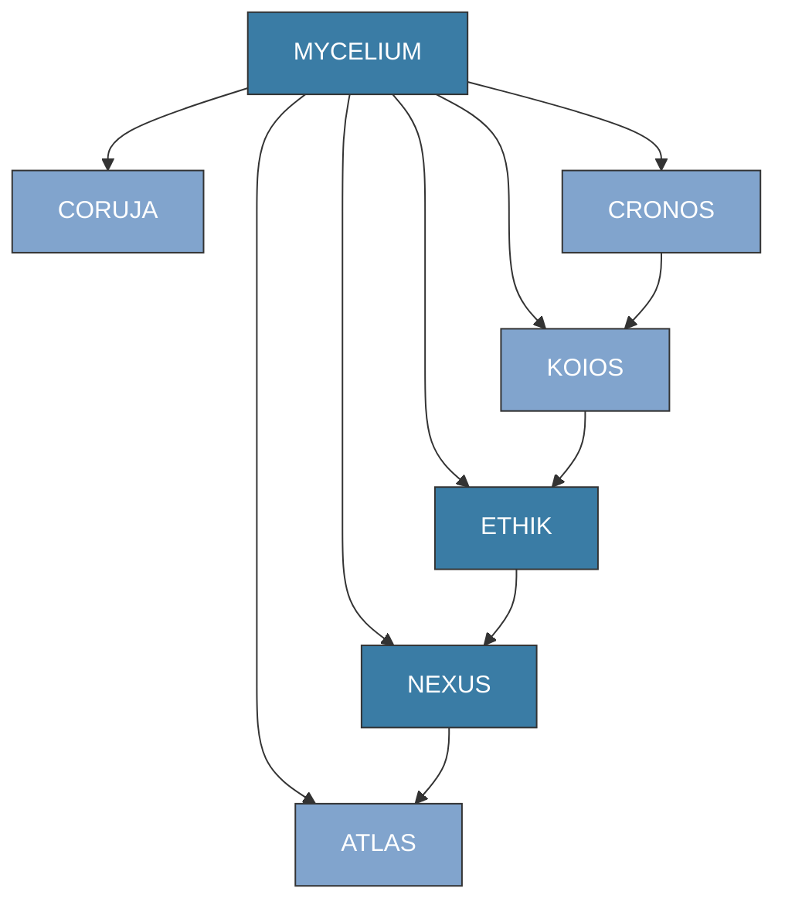
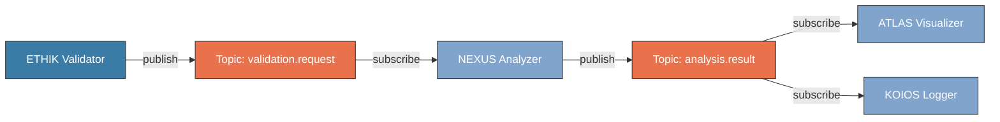
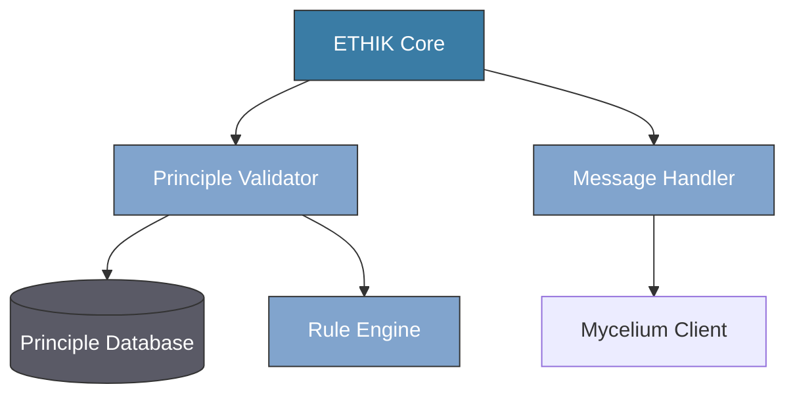
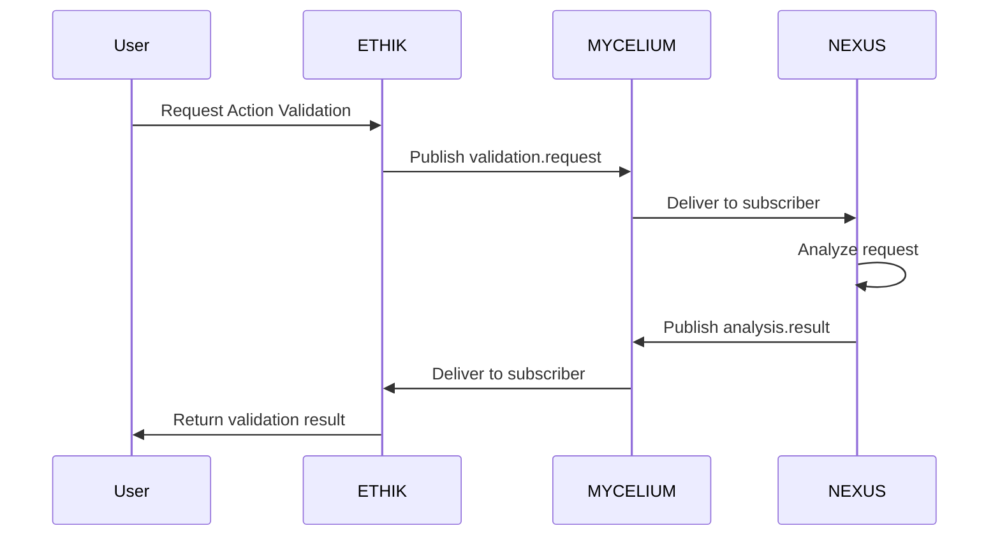
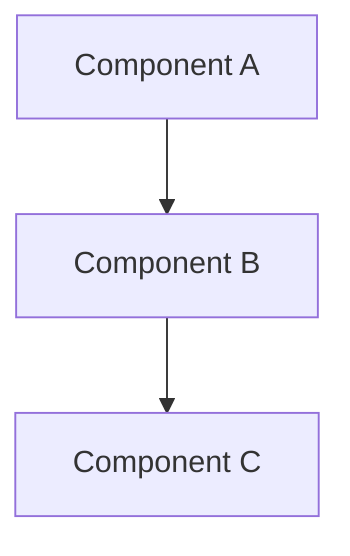
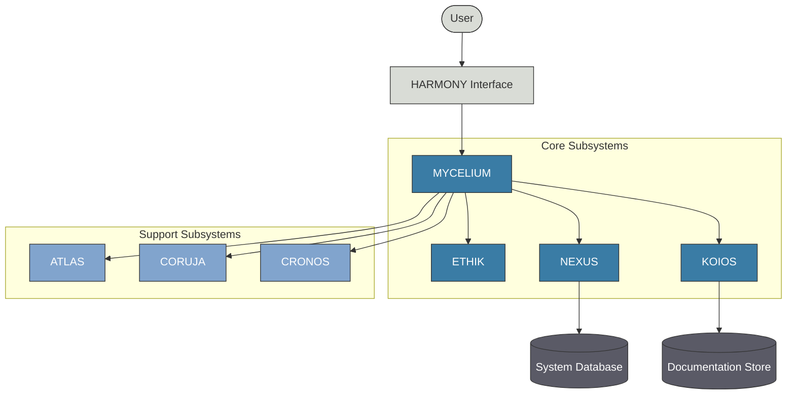
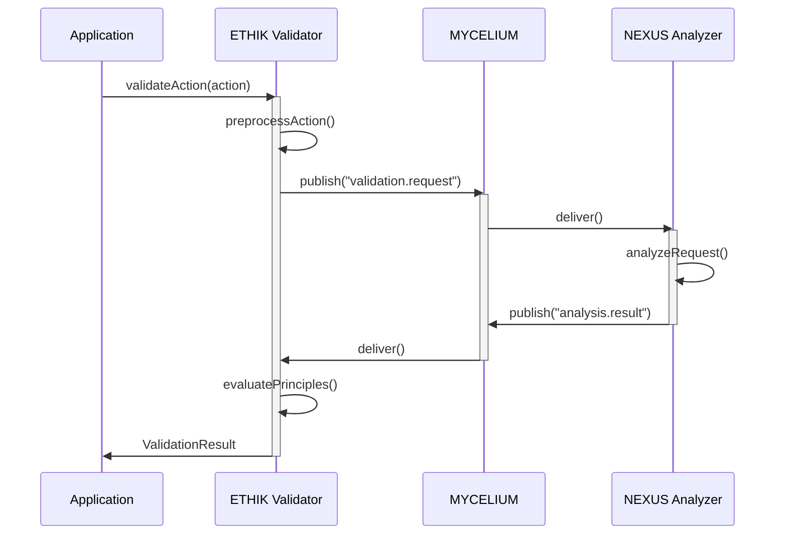
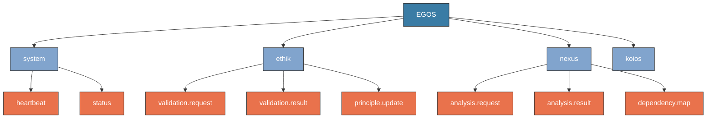

---
title: SYSTEM_VISUALIZATION_GUIDE
version: 1.0.0
status: Active
date_created: 2025-05-10
date_modified: 2025-05-10
authors: [EGOS Team]
description: 
file_type: documentation
scope: 
primary_entity_type: 
primary_entity_name: 
tags: []
---

---
title: SYSTEM_VISUALIZATION_GUIDE
version: 1.0.0
status: Active
date_created: 2025-05-10
date_modified: 2025-05-10
authors: [EGOS Team]
description: 
file_type: documentation
scope: 
primary_entity_type: 
primary_entity_name: 
tags: []
---

<!-- 
@references:
- .windsurfrules
- CODE_OF_CONDUCT.md
- MQP.md
- README.md
- ROADMAP.md
- CROSSREF_STANDARD.md

@references(level=1):
  - docs/assets/diagrams/ethik_architecture.drawio
  - docs/assets/images/ethik_architecture.png
  - docs/governance/business/external_docs/ARCHITECTURE.md
  - docs/governance/cross_reference_best_practices.md
  - docs/reference/documentation_standards.md


  - [MQP](../core/MQP.md) - Master Quantum Prompt defining EGOS principles
  - [ROADMAP](../governance/migrations/processed/pt/ROADMAP.md) - Project roadmap and planning
- Process Documentation:
  - [cross_reference_best_practices](../governance/cross_reference_best_practices.md)
  - docs/guides/SYSTEM_VISUALIZATION_GUIDE.md


**Document ID:** DOCS-GUIDE-005  
**Version:** 1.0.0  
**Last Updated:** 2025-04-19  
**Status:** Active

## Overview

This guide provides standardized approaches for visually documenting complex system interactions within EGOS. Visual documentation is essential for understanding the relationships between subsystems, data flows, and execution paths. Following these guidelines ensures consistency across all EGOS documentation while upholding the principles of Systemic Cartography and Conscious Modularity.

## Table of Contents

1. [Visualization Types](#visualization-types)
2. [Standards and Conventions](#standards-and-conventions)
3. [Subsystem Interaction Diagrams](#subsystem-interaction-diagrams)
4. [Mycelium Message Flow Diagrams](#mycelium-message-flow-diagrams)
5. [Component Architecture Diagrams](#component-architecture-diagrams)
6. [Sequence Diagrams](#sequence-diagrams)
7. [Tools and Resources](#tools-and-resources)
8. [Example Visualizations](#example-visualizations)

## Visualization Types

EGOS uses different types of diagrams for specific documentation purposes:

| Diagram Type | Purpose | When to Use |
|--------------|---------|-------------|
| Subsystem Interaction | Show high-level connections between EGOS subsystems | System architecture documentation, onboarding materials |
| Mycelium Message Flow | Illustrate message pathways and topic relationships | Messaging architecture, event flow documentation |
| Component Architecture | Document internal structure of a subsystem | Subsystem documentation, development references |
| Sequence Diagrams | Show the temporal flow of operations | Process documentation, interaction specifications |
| State Diagrams | Show possible states and transitions | State management documentation, user workflows |
| Data Model Diagrams | Visualize data structures and relationships | Database schemas, object modeling |

## Standards and Conventions

### Color Scheme

EGOS visualizations follow a consistent color palette aligned with the EGOS principles:

- Primary Subsystems: `#3A7CA5` (Blue)
- Supporting Subsystems: `#81A4CD` (Light Blue)
- External Systems: `#D9DCD6` (Light Gray)
- Critical Paths: `#E9724C` (Orange)
- Data Storage: `#5A5A66` (Dark Gray)
- User Interactions: `#8F3985` (Purple)

### Naming Conventions

- Use full subsystem names in capitals (e.g., "ETHIK", "NEXUS", "KOIOS")
- For components, use PascalCase (e.g., "ValidatorCore", "MessageRouter")
- For operations, use camelCase (e.g., "validatePrinciple", "routeMessage")

### Layout Guidelines

- Flow direction: Generally top-to-bottom or left-to-right
- Minimize line crossings for clarity
- Group related components
- Include a legend for custom symbols
- Use consistent node shapes:
  - Rectangles for processes/components
  - Cylinders for data stores
  - Hexagons for decision points
  - Rounded rectangles for external systems

## Subsystem Interaction Diagrams

Subsystem Interaction Diagrams show the high-level relationships between EGOS subsystems. They focus on the primary communication pathways and dependencies.

### Example (Mermaid Syntax)



### Required Elements

- All primary EGOS subsystems
- Direction of data flow or dependency
- Legend explaining node and edge types
- Brief textual description of key relationships

### Documentation Template

```markdown
## Subsystem Interaction Diagram

This diagram illustrates the interactions between EGOS subsystems.

[Insert diagram here]

### Key Interactions

- **MYCELIUM → ETHIK**: Message routing for principle validation
- **ETHIK → NEXUS**: Validated operations for system analysis
- **KOIOS → ETHIK**: Documentation references for principle alignment
- **NEXUS → ATLAS**: Analysis results for visualization

### Notes

[Additional context about interactions, constraints, or special considerations]
```

## Mycelium Message Flow Diagrams

Mycelium Message Flow Diagrams visualize the event-driven communication within the EGOS system, showing topics, publishers, and subscribers.

### Example (Mermaid Syntax)



### Required Elements

- Publishers and subscribers (labeled with subsystem name)
- Topic names
- Message direction
- Optional: message payload summary

### Documentation Template

```markdown
## Mycelium Message Flow

This diagram shows the message flow between components via the Mycelium messaging system.

[Insert diagram here]

### Topics

| Topic Name | Publishers | Subscribers | Payload Description |
|------------|------------|-------------|---------------------|
| `validation.request` | ETHIK | NEXUS | Validation request with action details |
| `analysis.result` | NEXUS | ATLAS, KOIOS | Analysis results with metrics |

### Message Schemas

```python
# Example message schema for validation.request
class ValidationRequest(BaseModel):
    action_id: str
    context: Dict[str, Any]
    principles: List[str]
    source_subsystem: str
```
```

## Component Architecture Diagrams

Component Architecture Diagrams illustrate the internal structure of an EGOS subsystem, showing its components, their relationships, and responsibilities.

### Example (Mermaid Syntax)



### Required Elements

- Core component(s)
- Modules and subcomponents
- Data stores
- External interfaces
- Component dependency flow

### Documentation Template

```markdown
## [Subsystem] Component Architecture

This diagram shows the internal components of the [Subsystem] subsystem and their relationships.

[Insert diagram here]

### Components

| Component | Responsibility | Interfaces With |
|-----------|----------------|----------------|
| Core | Central coordination | All components |
| Validator | Principle compliance checks | Rule Engine, DB |
| Message Handler | Process Mycelium messages | Mycelium Client, Core |

### Implementation Files

- `subsystems/[SUBSYSTEM]/core.py`: Core implementation
- `subsystems/[SUBSYSTEM]/validator.py`: Validator implementation
- `subsystems/[SUBSYSTEM]/message_handler.py`: Message handling logic
```

## Sequence Diagrams

Sequence Diagrams show the temporal sequence of interactions between components, useful for documenting complex processes.

### Example (Mermaid Syntax)



### Required Elements

- All participating components/actors
- Temporal sequence of messages
- Message content summary
- Optional: activation periods, parallel activities

### Documentation Template

```markdown
## [Process Name] Sequence Diagram

This diagram illustrates the sequence of operations during [process name].

[Insert diagram here]

### Process Description

1. User initiates a validation request to ETHIK
2. ETHIK publishes the request to Mycelium
3. NEXUS receives the request and performs analysis
4. Analysis results are published back through Mycelium
5. ETHIK delivers the final validation result to the user

### Error Handling

[Describe any error or exception paths not shown in the main diagram]
```

## Tools and Resources

### Recommended Visualization Tools

1. **Mermaid.js** (Preferred)
   - Directly supported in Markdown
   - Version control friendly
   - Supported in most EGOS documentation platforms
   
2. **Draw.io / diagrams.net**
   - For complex diagrams beyond Mermaid capabilities
   - Export as PNG and SVG for documentation
   - Store source XML in the repository

3. **PlantUML**
   - For detailed UML diagrams
   - Good for sequence and state diagrams
   - Text-based format for version control

### Integration with Documentation

#### Markdown Integration (Mermaid)

````markdown

````

#### Image Integration (other tools)

```markdown


*Figure 1: ETHIK Component Architecture ([source](../assets/diagrams/ethik_architecture.drawio))*
```

### Accessibility Considerations

- Provide alt text for all diagram images
- Ensure color contrast meets accessibility standards
- Include textual descriptions alongside diagrams
- Use patterns in addition to colors for distinction

## Example Visualizations

### Core EGOS Architecture



### ETHIK Validation Process



### Mycelium Topic Structure



## Next Steps

To improve the visual documentation across EGOS:

1. Create standardized component architecture diagrams for each subsystem
2. Develop message flow diagrams for all primary Mycelium topics
3. Generate sequence diagrams for critical operations
4. Integrate diagrams into existing documentation
5. Establish a review process for ensuring diagram accuracy and compliance with standards

## References

- [Mermaid.js Documentation](https://mermaid.js.org/intro/)
- [KOIOS Documentation Standards](../reference/documentation_standards.md)
- [ARCHITECTURE](../governance/business/external_docs/ARCHITECTURE.md)
- [MEMORY[05e5435b-eb1a-44e9-905e-467e701bdecf]](MEMORY[05e5435b-eb1a-44e9-905e-467e701bdecf]) (Docstring Standards)
- [MEMORY[310463f3-4d36-4077-b4a8-87060d0f78b1]](MEMORY[310463f3-4d36-4077-b4a8-87060d0f78b1]) (Process Generalization)

✧༺❀༻∞ EGOS ∞༺❀༻✧