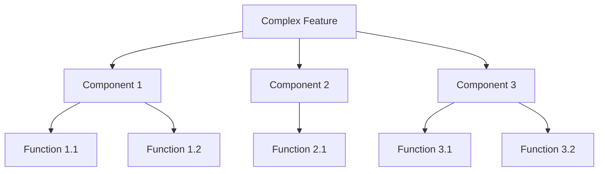
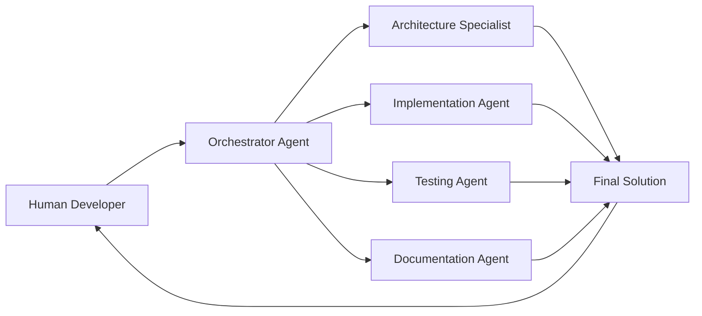

---
title: VIBE_CODING_GUIDE
version: 1.0.0
status: Active
date_created: 2025-05-10
date_modified: 2025-05-10
authors: [EGOS Team]
description: 
file_type: documentation
scope: 
primary_entity_type: 
primary_entity_name: 
tags: []
---

---
title: VIBE_CODING_GUIDE
version: 1.0.0
status: Active
date_created: 2025-05-10
date_modified: 2025-05-10
authors: [EGOS Team]
description: 
file_type: documentation
scope: 
primary_entity_type: 
primary_entity_name: 
tags: []
---

<!-- 
@references:
- .windsurfrules
- CODE_OF_CONDUCT.md
- MQP.md
- README.md
- ROADMAP.md
- CROSSREF_STANDARD.md

@references(level=1):
  - docs/governance/cross_reference_best_practices.md


  - [MQP](../core/MQP.md) - Master Quantum Prompt defining EGOS principles
  - [ROADMAP](../governance/migrations/processed/pt/ROADMAP.md) - Project roadmap and planning
- Process Documentation:
  - [cross_reference_best_practices](../governance/cross_reference_best_practices.md)
  - docs/guides/VIBE_CODING_GUIDE.md


**Document ID:** DOCS-GUIDE-004  
**Version:** 1.0.0  
**Last Updated:** 2025-04-19  
**Status:** Active

## Overview

This guide provides a comprehensive framework for implementing "vibe coding" practices within the EGOS ecosystem. Vibe coding refers to the approach of leveraging AI tools and generative models to enhance developer productivity while maintaining alignment with EGOS principles. This methodology embraces the creative, exploratory aspects of development while ensuring rigorous quality standards are maintained.

This approach aligns with several EGOS Principles:
- **Conscious Modularity:** Breaking development into distinct, manageable steps
- **Reciprocal Trust:** Building symbiotic relationships between human developers and AI systems
- **Evolutionary Preservation:** Maintaining system integrity while embracing new development paradigms
- **Integrated Ethics:** Ensuring ethical considerations are embedded in the development process

## Table of Contents

1. [Model Selection & Optimization](#model-selection--optimization)
2. [Documentation & Context Management](#documentation--context-management)
3. [Coding Workflows & Practices](#coding-workflows--practices)
4. [Token Economy & Resource Management](#token-economy--resource-management)
5. [Quality Assurance & Verification](#quality-assurance--verification)
6. [EGOS-Specific Integrations](#egos-specific-integrations)
7. [Common Patterns & Templates](#common-patterns--templates)

## Model Selection & Optimization

### Strategic Model Utilization

EGOS employs a tiered approach to AI model utilization, aligning specific models with appropriate tasks:

#### Architectural Planning & System Design
- **Recommended: Gemini 2.5 Pro** (32K context window)
  - Ideal for high-level system architecture, EGOS subsystem integration planning, and reviewing large codebases
  - Use for initial project mapping and understanding complex system relationships
  - Enable trace_id visualization and complex dependency mapping

```python
# Example workflow for architectural understanding using Gemini
import gemini_client

# Initialize context with EGOS principles and system requirements
context = """
EGOS principles:
- Universal Redemption
- Compassionate Temporality
- Sacred Privacy
[...]
"""

# Query for architectural insights
response = gemini_client.generate_text(
    prompt=f"{context}\n\nAnalyze how the KOIOS and ETHIK subsystems should interact to maintain Sacred Privacy principles.",
    max_output_tokens=4096,
    model="gemini-2.5-pro"
)
```

#### Intelligent Code Implementation
- **Recommended: Claude 3.7 Opus** (Integration via Windsurf/Cursor)
  - Superior for complex coding tasks, refactoring, test generation, and implementing EGOS subsystems
  - Excels at understanding and following EGOS standards and principles
  - Supports agentic workflows through the EGOS Mycelium integration
  
```python
# Using Mycelium to integrate Claude with EGOS workflows
from subsystems.MYCELIUM.client import mycelium_client
from subsystems.MYCELIUM.schema import Topic, Message

@mycelium_client.subscribe(Topic("ai.code_completion.request"))
async def handle_code_completion(message: Message):
    """Handle code completion requests via Mycelium.
    
    Routes the request to Claude 3.7 and publishes the response.
    
    Args:
        message: Mycelium message containing the code completion request.
            Expected format: {
                "code_context": str,
                "request": str,
                "subsystem": str,
                "principles": List[str]
            }
    """
    # Process with Claude API
    completion = await claude_client.complete(
        message.data["code_context"],
        message.data["request"],
        principles=message.data["principles"]
    )
    
    # Publish result
    await mycelium_client.publish(
        Topic(f"ai.code_completion.response.{message.id}"),
        {"completion": completion, "request_id": message.id}
    )
```

#### Everyday Development Tasks
- **Recommended: Open-Source Models** (Mistral, CodeLlama, StarCoder2)
  - Use for routine code documentation, simple refactoring, and everyday development tasks
  - Deploy locally or via cost-effective APIs to minimize token expenses
  - Ideal for preliminary draft generation before refinement

#### Documentation and Knowledge Management
- **Recommended: Command-R + RAG** or **EGOS KOIOS Integration**
  - Leverage KOIOS documentation indexes for context-aware assistance
  - Implement retrieval-augmented generation for documentation tasks
  - Create and maintain documentation with accurate system references

### Context Window Management

To effectively utilize long-context models:

1. **Hierarchical Chunking:** Organize code and documentation into semantically coherent chunks:
   ```
   - System Level (highest abstraction)
     - Subsystem Level
       - Module Level
         - Class/Function Level (lowest abstraction)
   ```

2. **Context Pruning:** Strategically filter irrelevant information:
   ```python
   # EGOS context pruning example
   from subsystems.NEXUS.analysis import DependencyAnalyzer
   
   def prune_context_for_completion(file_path, function_name, context_size=8192):
       """Prune context to most relevant code for completion.
       
       Args:
           file_path: Path to the source file
           function_name: Function requiring completion
           context_size: Maximum context size in tokens
           
       Returns:
           Pruned context containing only relevant dependencies
       """
       analyzer = DependencyAnalyzer()
       dependencies = analyzer.get_dependencies(file_path, function_name)
       
       return "\n\n".join([
           dep.get_content() for dep in 
           dependencies.sort_by_relevance()[:context_size]
       ])
   ```

3. **Semantic Anchoring:** Use clear section markers and identifiers:
   ```
   ### EGOS Subsystem: ETHIK
   ### Module: validation_core
   ### Function: validate_principle_compliance
   ```

## Documentation & Context Management

### Pre-Implementation Documentation

EGOS mandates creating documentation before implementation to reduce hallucinations and ensure system alignment:

1. **Specification First:** Create clear specifications for new components:
   - Input/output signatures
   - Expected behavior and edge cases
   - Integration points with other subsystems
   - Alignment with EGOS principles

2. **Structured Planning Templates:**
   ```markdown
   # Feature Implementation Plan
   
   ## Overview
   [Brief description of the feature]
   
   ## EGOS Principles Alignment
   - [Relevant principle]: [How this feature aligns]
   
   ## Requirements
   - [Specific requirement 1]
   - [Specific requirement 2]
   
   ## Technical Approach
   [Architectural and implementation details]
   
   ## Integration Points
   - [Subsystem 1]: [Integration details]
   - [Subsystem 2]: [Integration details]
   
   ## Testing Strategy
   [Approach to validation]
   ```

3. **RAG Integration with KOIOS:**
   - Index all EGOS documentation, principles, and code
   - Retrieve relevant context during AI-assisted development
   - Ground all AI outputs in factual system knowledge

### Version-Controlled Prompts

Maintain prompts as code artifacts:

```bash
# Recommended directory structure
prompts/
├── subsystems/
│   ├── ETHIK/
│   │   ├── validation_prompts.md
│   │   └── refactoring_prompts.md
│   └── NEXUS/
│       └── analysis_prompts.md
├── workflows/
│   ├── documentation_generation.md
│   └── code_review.md
└── templates/
    ├── class_template.md
    └── function_template.md
```

Example prompt template:

```markdown
# EGOS Function Implementation Prompt

## Context
I'm implementing a new function in the {{subsystem}} subsystem.

## Function Specification
- Name: {{function_name}}
- Purpose: {{purpose}}
- Inputs: {{inputs}}
- Outputs: {{outputs}}
- Edge Cases: {{edge_cases}}

## EGOS Principles to Consider
{{principles}}

## Related Code
```{{language}}
{{related_code}}
```

## Request
Please implement this function following EGOS coding standards, with proper docstrings, type hints, and error handling. Ensure it aligns with the specified EGOS principles.
```

## Coding Workflows & Practices

### AI-Assisted Development Workflow

EGOS recommends a structured workflow for AI-assisted coding:

1. **Planning Phase:**
   - Document requirements and specifications
   - Identify relevant EGOS principles and standards
   - Map dependencies and integration points

2. **Implementation Phase:**
   - Generate initial code with AI assistance
   - Review and refine generated code for alignment
   - Implement tests and validation

3. **Verification Phase:**
   - Validate against EGOS principles (ETHIK)
   - Review for security and performance (NEXUS)
   - Ensure proper documentation (KOIOS)

4. **Integration Phase:**
   - Connect to other subsystems via Mycelium
   - Run integration tests
   - Document system relationships

### Decomposing Complex Tasks

Break complex implementations into manageable units:



Example implementation approach:

```python
# Step 1: Define the interface and core structure
class EthikValidator:
    """ETHIK validation core for principle compliance.
    
    Responsible for validating system actions against EGOS principles.
    """
    
    def __init__(self, principles_config: Dict[str, Any]):
        """Initialize the ETHIK validator with principles configuration.
        
        Args:
            principles_config: Configuration dictionary defining principle 
                parameters and validation thresholds.
        """
        self.principles = principles_config
        self.validation_functions = self._load_validation_functions()
    
    # Step 2: Implement core functionality
    def validate_action(self, action: Action) -> ValidationResult:
        """Validate an action against all applicable principles.
        
        Args:
            action: The system action to validate.
            
        Returns:
            ValidationResult containing compliance status and violations.
        """
        # Implementation with AI assistance
    
    # Step 3: Implement supporting functions
    def _load_validation_functions(self) -> Dict[str, Callable]:
        """Load principle-specific validation functions.
        
        Returns:
            Dictionary mapping principle names to validation functions.
        """
        # Implementation with AI assistance
```

## Token Economy & Resource Management

### Understanding Token Usage

In EGOS, tokens are the atomic units of AI model interaction:

- Each token represents approximately ¾ of a word
- Both input and output consume tokens
- Costs accrue based on total tokens processed

### Optimization Strategies

1. **Prompt Engineering:**
   - Use concise, specific prompts
   - Employ clear delimiters and section markers
   - Leverage type hints and metadata instead of verbose descriptions

2. **Batching Similar Requests:**
   ```python
   # Inefficient: Multiple separate requests
   for function in functions:
       docstring = generate_docstring(function)  # Separate API call
       
   # Efficient: Batch processing
   functions_batch = functions[:25]  # Reasonable batch size
   docstrings = generate_docstrings_batch(functions_batch)  # Single API call
   ```

3. **Tiered Model Approach:**
   - Use lightweight models for drafting and initial passes
   - Reserve high-powered models for complex tasks and refinement
   - Implement local inference for routine tasks

4. **Caching and Memoization:**
   ```python
   from functools import lru_cache
   
   @lru_cache(maxsize=1000)
   def get_ai_completion(prompt, model="lightweight"):
       """Get AI completion with caching for identical prompts.
       
       Args:
           prompt: The prompt text for completion
           model: Model identifier to use
           
       Returns:
           Completion text from AI model
       """
       # AI model call implementation
   ```

5. **Content Filtering:**
   - Remove unnecessary boilerplate before sending to models
   - Filter out non-essential imports and comments
   - Focus context on semantically relevant content

### Resource Monitoring

EGOS provides tools for tracking token usage and optimizing costs:

```python
# Example token usage tracker
from subsystems.CRONOS.metrics import TokenUsageTracker

tracker = TokenUsageTracker()

async def track_model_usage(model, prompt, completion):
    """Track token usage for AI operations.
    
    Args:
        model: Model identifier
        prompt: Input prompt text
        completion: Output completion text
    """
    input_tokens = tracker.count_tokens(prompt)
    output_tokens = tracker.count_tokens(completion)
    
    await tracker.log_usage(
        model=model,
        input_tokens=input_tokens,
        output_tokens=output_tokens,
        estimated_cost=tracker.calculate_cost(model, input_tokens, output_tokens)
    )
```

## Quality Assurance & Verification

### Preventing Hallucinations

EGOS implements several strategies to minimize AI hallucinations:

1. **Fact Grounding:**
   - Index all system documentation in vector database
   - Retrieve relevant facts before generation
   - Verify outputs against trusted sources

2. **Clear Input Boundaries:**
   - Specify exact requirements in prompts
   - Provide explicit constraints and limitations
   - Use structured templates for consistency

3. **Human-in-the-Loop Verification:**
   - All AI-generated code requires human review
   - Implement the "MANDATORY: Human developer reviews ALL AI output" rule
   - Document review process and outcome

4. **Progressive Refinement:**
   - Generate initial drafts with clear indicators of uncertainty
   - Iteratively refine outputs with additional context
   - Track confidence levels for different components

### ETHIK Validation Integration

All vibe coding must pass ETHIK validation:

```python
# Example ETHIK integration
from subsystems.ETHIK.validator import PrincipleValidator

async def validate_generated_code(code, subsystem, principles):
    """Validate AI-generated code against EGOS principles.
    
    Args:
        code: Generated code to validate
        subsystem: Target subsystem
        principles: List of principles to check
        
    Returns:
        ValidationResult with detailed compliance information
    """
    validator = PrincipleValidator()
    
    # Run principle-specific validation
    result = await validator.validate(
        code=code,
        subsystem=subsystem,
        principles=principles,
        context="ai_generation"
    )
    
    if not result.compliant:
        # Handle compliance issues
        issue_report = create_compliance_report(result)
        await log_compliance_issue(issue_report)
        
    return result
```

## EGOS-Specific Integrations

### Windsurf Integration

EGOS recommends Windsurf as the primary IDE for vibe coding:

1. **Memory System Configuration:**
   - Create subsystem-specific memories for context
   - Establish principle memories for guidance
   - Maintain project-specific memories for current initiatives

2. **Rule System Setup:**
   - Import EGOS rules into Windsurf
   - Categories include code quality, documentation, ethics, security
   - Rules enforce EGOS principles automatically

3. **AI Assistant Configuration:**
   - Set temperature to 0.2 for deterministic outputs
   - Enable "Provide Context from Project" option
   - Configure maximum token limits appropriately

### Multi-Agent Workflows

EGOS supports orchestrated multi-agent development:



Implementation through CORUJA:

```python
# Multi-agent orchestration
from subsystems.CORUJA.orchestrator import AgentOrchestrator
from subsystems.CORUJA.agents import ArchitectureAgent, ImplementationAgent, TestingAgent

async def orchestrate_development(task, context):
    """Orchestrate multi-agent development workflow.
    
    Args:
        task: Development task description
        context: Project and subsystem context
        
    Returns:
        Completed development artifacts
    """
    orchestrator = AgentOrchestrator()
    
    # Register specialized agents
    orchestrator.register_agent("architecture", ArchitectureAgent())
    orchestrator.register_agent("implementation", ImplementationAgent())
    orchestrator.register_agent("testing", TestingAgent())
    
    # Execute workflow with appropriate delegation
    result = await orchestrator.execute_workflow(
        task=task,
        context=context,
        workflow="standard_development"
    )
    
    return result
```

## Common Patterns & Templates

### Prompt Libraries

EGOS maintains standardized prompt libraries:

```
prompts/
├── patterns/
│   ├── documentation_generation.md
│   ├── interface_design.md
│   └── refactoring.md
├── subsystems/
│   └── [subsystem-specific prompts]
└── workflows/
    └── [workflow-specific prompts]
```

Example documentation generation prompt:

```markdown
# EGOS Documentation Generation

## Context
{{context}}

## Target
- Type: {{type}} (module/class/function)
- Name: {{name}}
- Purpose: {{purpose}}

## Relevant EGOS Principles
{{principles}}

## Code to Document
```{{language}}
{{code}}
```

## Request
Generate comprehensive documentation for this {{type}} following EGOS documentation standards. Include:
- Brief description
- Detailed explanation
- Parameter/attribute descriptions with types
- Return value description with type
- Example usage demonstrating the {{type}} in action
- EGOS principle alignment notes
```

### VS Code Snippets

EGOS provides custom VS Code snippets for common patterns:

```json
{
  "EGOS Module Docstring": {
    "prefix": "egosmod",
    "body": [
      "\"\"\"",
      "EGOS - ${1:Subsystem} ${2:Component Name}",
      "===================================",
      "",
      "${3:Brief description of the module's purpose and functionality.}",
      "${4:Additional details about usage, context, or implementation notes.}",
      "",
      "Version: ${5:X.Y.Z} (${6:Status})",
      "\"\"\""
    ],
    "description": "EGOS module docstring"
  }
}
```

## Appendix: Case Study - Vibe Coding in Practice

### Example: Creating a New EGOS Subsystem Component

1. **Specification Phase:**
   - Document the component's purpose and requirements
   - Identify relevant EGOS principles
   - Define integration points with other subsystems

2. **Architecture Phase:**
   - Use Gemini 2.5 Pro to explore design alternatives
   - Select optimal architectural approach
   - Document design decisions with principle alignment

3. **Implementation Phase:**
   - Use Claude 3.7 to assist with code generation
   - Review and refine code for quality and alignment
   - Implement tests and validation

4. **Documentation Phase:**
   - Generate comprehensive documentation
   - Create visual diagrams of component interactions
   - Update system documentation to include new component

---

## Next Steps

### Additional Documentation Enhancement
- Extend docstring content generation to remaining subsystems
- Implement visual documentation for complex system interactions
- Create subsystem-specific quick reference guides

### Developer Guidance
- Distribute the quick reference guide to all developers
- Ensure VS Code snippets are available in all development environments

### Further Process Improvement
- Fine-tune docstring metrics thresholds based on initial analysis
- Implement automatic fix suggestions for common docstring issues
- Create dashboards to track documentation quality over time

---

✧༺❀༻∞ EGOS ∞༺❀༻✧