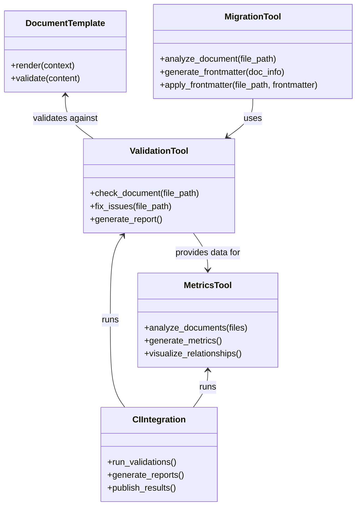

@references:
- .windsurfrules
- CODE_OF_CONDUCT.md
- MQP.md
- README.md
- ROADMAP.md
- CROSSREF_STANDARD.md

  - docs/guides/developer_guide.md

---
title: developer_guide
version: 1.0.0
status: Active
date_created: 2025-05-10
date_modified: 2025-05-10
authors: [EGOS Team]
description: 
file_type: documentation
scope: 
primary_entity_type: 
primary_entity_name: 
tags: []
---

---
schema_version: "1.0"
title: "Documentation System Developer Guide"
id: "DOC-SYS-003"
status: "active"
date_created: "2025-04-30"
date_updated: "2025-04-30"
subsystem: "KOIOS"
author: "EGOS Team"
document_type: "developer_guide"
audience: "System Developers"
tags: ["documentation", "system", "developer guide", "KOIOS"]
principles: ["Conscious Modularity", "Systemic Cartography", "Integrated Ethics"]
related_documents:
  - id: "DOC-SYS-001"
    title: "EGOS Documentation System Overview"
    relationship: "parent"
  - id: "DOC-SYS-002"
    title: "Documentation System User Guide"
    relationship: "related"
---

# Documentation System Developer Guide

This developer guide provides technical details and guidance for developers who want to extend, modify, or maintain the EGOS Documentation System.

## System Architecture

The documentation system follows a modular architecture with the following core components:



## Core Components Implementation

### sync_docs.py

The primary validation tool with these key functions:

```python
def process_markdown_file(file_path, schema, check_only=False):
    """Extract and validate frontmatter"""
    
def validate_frontmatter(frontmatter, schema):
    """Validate frontmatter against schema"""
    
def render_and_update_sections(data, check_only=False):
    """Update sections in documents based on templates"""
```

### documentation_metrics.py

Generates metrics on documentation quality:

```python
def analyze_documentation(files):
    """Analyze documentation quality"""
    
def generate_network_data(metrics):
    """Generate visualization data for document relationships"""
    
def generate_dashboard(metrics, output_path):
    """Generate HTML dashboard with metrics"""
```

### migrate_legacy_docs.py

Migrates legacy documentation to current standards:

```python
def analyze_document(file_path):
    """Analyze document for existing metadata formats"""
    
def extract_tasks_from_content(content):
    """Extract tasks defined in markdown"""
    
def generate_frontmatter(doc_info, file_path):
    """Generate YAML frontmatter based on document analysis"""
```

## Extending the System

### Adding New Templates

To add a new document template:

1. Create a new Jinja2 template file in `scripts/templates/`
2. Follow the existing structure with frontmatter and content sections
3. Update the template registry in `sync_docs.py`:

```python
TEMPLATES = {
    "markdown_document": "markdown_document.j2",
    "api_documentation": "api_documentation.j2",
    # Add your new template here
    "your_template": "your_template.j2"
}
```

### Modifying Validation Rules

To modify validation rules:

1. Update the schema in `docs/schemas/frontmatter_schema.json`
2. Update validation functions in `sync_docs.py` if necessary
3. Update test cases in `test_documentation_system.py`

### Adding New Metrics

To add new documentation metrics:

1. Define your metric calculation in `documentation_metrics.py`
2. Add visualization in the dashboard template
3. Update test cases in `test_documentation_system.py`

## Template Development

### Jinja2 Template Syntax

Templates use Jinja2 syntax with these key features:

```jinja2
{# This is a comment #}

{# Variables #}
{{ variable_name }}

{# Conditionals #}

  Content if true

  Content if false


{# Loops #}

  {{ item }}

```

### Template Context Variables

When adding templates, use these standard context variables:

| Variable | Description | Type |
|----------|-------------|------|
| title | Document title | string |
| id | Document ID | string |
| status | Document status | string |
| date_created | Creation date | string |
| date_updated | Last update date | string |
| subsystem | Related subsystem | string |
| author | Document author | string |
| document_type | Type of document | string |
| tags | Document tags | array |
| principles | EGOS principles | array |
| related_documents | Related documents | array |

### Custom Template Functions

You can add custom template functions in `sync_docs.py`:

```python
# Add a custom function to the Jinja2 environment
env.filters['your_function'] = your_function

def your_function(value):
    """Your custom template function"""
    # Process value
    return processed_value
```

## Testing the System

### Unit Tests

The system includes comprehensive unit tests in `test_documentation_system.py`:

- Template rendering tests
- Frontmatter validation tests
- Document relationship tests

To run unit tests:

```bash
pytest scripts/test_documentation_system.py -v
```

### Integration Tests

Integration tests validate the entire system:

```bash
python scripts/test_documentation_system.py --integration
```

### Performance Testing

For large documentation sets, monitor performance:

```bash
python scripts/test_documentation_system.py --performance
```

## CI/CD Integration

### GitHub Actions Workflow

The `.github/workflows/documentation-validation.yml` workflow:

1. Validates documentation on PRs and pushes
2. Generates metrics reports
3. Uploads reports as artifacts

### Pre-commit Hooks

The system uses pre-commit hooks for local validation:

```yaml
# .pre-commit-config.yaml
-   repo: local
    hooks:
    -   id: doc-validation
        name: Documentation Validation
        entry: python scripts/sync_docs.py --check
        language: system
        files: \.(md|mdc)$
        pass_filenames: false
```

## Troubleshooting Development Issues

### Common Errors

| Error | Cause | Solution |
|-------|-------|----------|
| Template rendering failure | Invalid Jinja2 syntax | Check template syntax and context variables |
| Schema validation failure | Schema doesn't match validation logic | Ensure schema and validation logic are in sync |
| Performance issues | Large number of documents | Implement pagination or filtering in metrics generation |

### Debugging

Enable verbose logging for debugging:

```bash
python scripts/sync_docs.py --check --verbose
```

## Security Considerations

1. **Input Validation**: Always validate user input when processing documents
2. **External Content**: Be cautious when rendering external content
3. **File Access**: Use safe methods for file access

## Performance Optimizations

1. **Caching**: Cache validation results for unchanged documents
2. **Parallelization**: Process documents in parallel for large repositories
3. **Incremental Updates**: Only process modified documents

## Future Development Roadmap

1. **Real-time Validation**: Integrate with editors for real-time feedback
2. **Advanced Analytics**: AI-powered document quality analysis
3. **Natural Language Processing**: Automatic cross-reference suggestions
4. **Quality Prediction**: Predict documentation quality trends

## Contributing

To contribute to the documentation system:

1. Follow the EGOS code and documentation standards
2. Add appropriate tests for new features
3. Update the relevant documentation
4. Submit a PR with a clear description of changes

## Conclusion

This developer guide provides the technical information needed to understand, extend, and maintain the EGOS Documentation System. By following these guidelines, you can contribute to a robust, efficient, and high-quality documentation infrastructure.