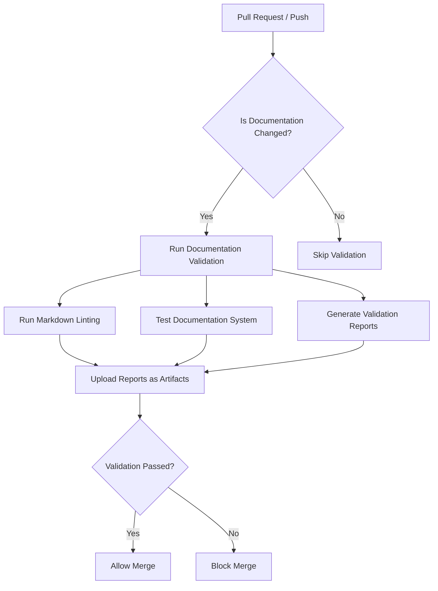

@references:
- .windsurfrules
- CODE_OF_CONDUCT.md
- MQP.md
- README.md
- ROADMAP.md
- CROSSREF_STANDARD.md

  - docs/guides/integration_guide.md

---
title: integration_guide
version: 1.0.0
status: Active
date_created: 2025-05-10
date_modified: 2025-05-10
authors: [EGOS Team]
description: 
file_type: documentation
scope: 
primary_entity_type: 
primary_entity_name: 
tags: []
---

---
schema_version: "1.0"
title: "Documentation System Integration Guide"
id: "DOC-SYS-004"
status: "active"
date_created: "2025-04-30"
date_updated: "2025-04-30"
subsystem: "KOIOS"
author: "EGOS Team"
document_type: "integration_guide"
audience: "DevOps, CI/CD Engineers"
tags: ["documentation", "system", "integration", "CI/CD", "KOIOS"]
principles: ["Conscious Modularity", "Systemic Cartography", "Evolutionary Preservation"]
related_documents:
  - id: "DOC-SYS-001"
    title: "EGOS Documentation System Overview"
    relationship: "parent"
  - id: "DOC-SYS-003"
    title: "Documentation System Developer Guide"
    relationship: "related"
---

# Documentation System Integration Guide

This guide provides instructions for integrating the EGOS Documentation System with CI/CD pipelines, development workflows, and other tools to ensure consistent documentation quality across the project.

## CI/CD Integration

### GitHub Actions

The documentation system includes a ready-to-use GitHub Actions workflow in `.github/workflows/documentation-validation.yml`. This workflow:

1. Validates documentation on PRs and pushes
2. Runs lint checks on markdown files
3. Generates documentation quality metrics
4. Creates reports on legacy document compliance



#### Customizing the Workflow

You can customize the workflow by editing `.github/workflows/documentation-validation.yml`:

```yaml
# Example: Adding notification on failure
- name: Notify on failure
  if: failure()
  uses: some-notification-action@v1
  with:
    message: "Documentation validation failed!"
    channel: "#documentation-alerts"
```

### GitLab CI

To integrate with GitLab CI, create a `.gitlab-ci.yml` file:

```yaml
documentation:
  stage: test
  script:
    - pip install -r requirements.txt
    - python scripts/test_documentation_system.py
    - python scripts/test_legacy_docs.py --output reports/legacy_quality.md
  artifacts:
    paths:
      - reports/
    expire_in: 1 week
  only:
    changes:
      - "**/*.md"
      - "**/*.mdc"
      - "scripts/sync_docs.py"
      - "scripts/test_*.py"
```

### Jenkins

For Jenkins integration, create a `Jenkinsfile`:

```groovy
pipeline {
    agent any
    
    stages {
        stage('Documentation Validation') {
            when {
                changeset "**/*.md"
                changeset "**/*.mdc"
                changeset "scripts/sync_docs.py"
                changeset "scripts/test_*.py"
            }
            steps {
                sh 'pip install -r requirements.txt'
                sh 'python scripts/test_documentation_system.py'
                sh 'python scripts/test_legacy_docs.py --output reports/legacy_quality.md'
            }
            post {
                always {
                    archiveArtifacts artifacts: 'reports/*', fingerprint: true
                }
            }
        }
    }
}
```

## Pre-commit Hooks Integration

### Installation

To integrate with pre-commit hooks, add the following to `.pre-commit-config.yaml`:

```yaml
repos:
  - repo: local
    hooks:
      - id: documentation-validation
        name: Documentation Validation
        entry: python scripts/sync_docs.py --check
        language: python
        types: [markdown]
        pass_filenames: true
        
      - id: markdown-lint
        name: Markdown Linting
        entry: python scripts/fix_documentation_linting.py --check
        language: python
        types: [markdown]
        pass_filenames: true
```

Install the hooks:

```bash
pip install pre-commit
pre-commit install
```

### Custom Pre-commit Scripts

You can create custom pre-commit scripts for specific validation needs:

```python
#!/usr/bin/env python
# pre_commit_hooks/check_doc_ids.py

import sys
import re
import os

def main(files):
    success = True
    for file_path in files:
        if not file_path.endswith('.md'):
            continue
            
        with open(file_path, 'r') as f:
            content = f.read()
            
        # Check for document ID format
        if not re.search(r'id: "DOC-[A-Z]+-\d{3}"', content):
            print(f"Error: {file_path} has invalid document ID format")
            success = False
    
    return 0 if success else 1

if __name__ == '__main__':
    sys.exit(main(sys.argv[1:]))
```

Add it to the pre-commit config:

```yaml
  - id: check-doc-ids
    name: Check Document IDs
    entry: python pre_commit_hooks/check_doc_ids.py
    language: python
    types: [markdown]
    pass_filenames: true
```

## IDE Integration

### Visual Studio Code

Create a `.vscode/settings.json` file to integrate with VS Code:

```json
{
  "markdown.validate.enabled": true,
  "markdownlint.config": {
    "MD013": false,
    "MD033": false
  },
  "task.tasks": [
    {
      "label": "Validate Documentation",
      "type": "shell",
      "command": "python scripts/sync_docs.py --check --files ${file}",
      "problemMatcher": []
    },
    {
      "label": "Fix Documentation Linting",
      "type": "shell",
      "command": "python scripts/fix_documentation_linting.py --specific-file ${file}",
      "problemMatcher": []
    }
  ]
}
```

### JetBrains IDEs (PyCharm, IntelliJ)

Create a `.run/Documentation Validation.run.xml` file:

```xml
<component name="ProjectRunConfigurationManager">
  <configuration default="false" name="Documentation Validation" type="ShConfigurationType">
    <option name="SCRIPT_TEXT" value="python scripts/sync_docs.py --check" />
    <option name="INDEPENDENT_SCRIPT_PATH" value="true" />
    <option name="SCRIPT_PATH" value="" />
    <option name="SCRIPT_OPTIONS" value="" />
    <option name="INDEPENDENT_SCRIPT_WORKING_DIRECTORY" value="true" />
    <option name="SCRIPT_WORKING_DIRECTORY" value="$PROJECT_DIR$" />
    <option name="INDEPENDENT_INTERPRETER_PATH" value="true" />
    <option name="INTERPRETER_PATH" value="/bin/bash" />
    <option name="INTERPRETER_OPTIONS" value="" />
    <option name="EXECUTE_IN_TERMINAL" value="true" />
    <option name="EXECUTE_SCRIPT_FILE" value="false" />
    <envs />
    <method v="2" />
  </configuration>
</component>
```

## Automation Server Integration

### Documentation Quality Dashboard

To deploy an automated documentation quality dashboard:

```bash
# Run periodically as a scheduled job
python scripts/metrics/documentation_metrics.py --dashboard reports/dashboard.html --network reports/network.html
```

Example deployment script:

```python
#!/usr/bin/env python
# scripts/deploy_docs_dashboard.py

import os
import shutil
import subprocess

def main():
    # Generate metrics
    subprocess.run([
        "python", "scripts/metrics/documentation_metrics.py",
        "--dashboard", "reports/dashboard.html",
        "--network", "reports/network.html",
        "--json", "reports/metrics.json"
    ])
    
    # Generate legacy report
    subprocess.run([
        "python", "scripts/test_legacy_docs.py",
        "--output", "reports/legacy_report.md",
        "--json", "reports/legacy_data.json"
    ])
    
    # Deploy to server or static site
    os.makedirs("docs_dashboard", exist_ok=True)
    shutil.copy("reports/dashboard.html", "docs_dashboard/index.html")
    shutil.copy("reports/network.html", "docs_dashboard/network.html")
    shutil.copy("reports/metrics.json", "docs_dashboard/metrics.json")
    
    # Add historical data for time-series tracking
    timestamp = subprocess.check_output(["date", "+%Y-%m-%d"]).decode().strip()
    os.makedirs(f"docs_dashboard/historical/{timestamp}", exist_ok=True)
    shutil.copy("reports/metrics.json", f"docs_dashboard/historical/{timestamp}/metrics.json")
    
    print("Documentation dashboard deployed successfully")

if __name__ == "__main__":
    main()
```

## Notification Integrations

### Slack Notifications

Create a script for Slack notifications on documentation issues:

```python
#!/usr/bin/env python
# scripts/notify_doc_issues.py

import json
import requests
import os
import argparse

def main():
    parser = argparse.ArgumentParser()
    parser.add_argument("--metrics-file", default="reports/metrics.json")
    parser.add_argument("--threshold", type=float, default=80.0)
    parser.add_argument("--webhook-url", required=True)
    args = parser.parse_args()
    
    with open(args.metrics_file, 'r') as f:
        metrics = json.load(f)
    
    # Find documents below quality threshold
    low_quality_docs = [
        doc for doc in metrics["documents"]
        if doc["compliance_score"] < args.threshold
    ]
    
    if low_quality_docs:
        message = {
            "text": f"⚠️ Found {len(low_quality_docs)} documents below quality threshold",
            "blocks": [
                {
                    "type": "section",
                    "text": {
                        "type": "mrkdwn",
                        "text": f"*⚠️ Documentation Quality Alert*\n\nFound {len(low_quality_docs)} documents below the {args.threshold}% quality threshold."
                    }
                },
                {
                    "type": "divider"
                }
            ]
        }
        
        # Add the first 5 documents as examples
        for doc in low_quality_docs[:5]:
            message["blocks"].append({
                "type": "section",
                "text": {
                    "type": "mrkdwn",
                    "text": f"*{doc['path']}*\nScore: {doc['compliance_score']:.1f}%\nIssues: {', '.join(doc['frontmatter_issues'] + doc['content_issues'])}"
                }
            })
        
        # Send to Slack
        response = requests.post(
            args.webhook_url,
            json=message
        )
        print(f"Notification sent: {response.status_code}")
    else:
        print("No documents below quality threshold")

if __name__ == "__main__":
    main()
```

### Email Reports

For email reports on documentation quality:

```python
#!/usr/bin/env python
# scripts/email_doc_report.py

import json
import smtplib
from email.mime.multipart import MIMEMultipart
from email.mime.text import MIMEText
import argparse
import datetime

def main():
    parser = argparse.ArgumentParser()
    parser.add_argument("--metrics-file", default="reports/metrics.json")
    parser.add_argument("--recipients", required=True)
    parser.add_argument("--smtp-server", default="smtp.example.com")
    parser.add_argument("--smtp-port", type=int, default=587)
    parser.add_argument("--smtp-user", required=True)
    parser.add_argument("--smtp-password", required=True)
    args = parser.parse_args()
    
    with open(args.metrics_file, 'r') as f:
        metrics = json.load(f)
    
    # Create email content
    html = f"""
    <html>
    <head>
        <style>
            body {{ font-family: Arial, sans-serif; }}
            table {{ border-collapse: collapse; width: 100%; }}
            th, td {{ border: 1px solid #ddd; padding: 8px; text-align: left; }}
            th {{ background-color: #f2f2f2; }}
            .good {{ color: green; }}
            .warning {{ color: orange; }}
            .bad {{ color: red; }}
        </style>
    </head>
    <body>
        <h1>Documentation Quality Report</h1>
        <p>Generated on {datetime.datetime.now().strftime('%Y-%m-%d')}</p>
        
        <h2>Summary</h2>
        <ul>
            <li>Total Documents: {metrics['total_documents']}</li>
            <li>Average Compliance: {metrics['average_compliance']:.1f}%</li>
            <li>Documents with Issues: {metrics['documents_with_issues']}</li>
        </ul>
        
        <h2>Documents Requiring Attention</h2>
        <table>
            <tr>
                <th>Document</th>
                <th>Compliance</th>
                <th>Issues</th>
            </tr>
    """
    
    # Add problematic documents
    for doc in sorted(metrics['documents'], key=lambda x: x['compliance_score'])[:10]:
        compliance_class = "good"
        if doc['compliance_score'] < 70:
            compliance_class = "bad"
        elif doc['compliance_score'] < 90:
            compliance_class = "warning"
            
        html += f"""
            <tr>
                <td>{doc['path']}</td>
                <td class="{compliance_class}">{doc['compliance_score']:.1f}%</td>
                <td>{', '.join(doc['frontmatter_issues'] + doc['content_issues'])}</td>
            </tr>
        """
    
    html += """
        </table>
    </body>
    </html>
    """
    
    # Send email
    msg = MIMEMultipart()
    msg['Subject'] = 'Documentation Quality Report'
    msg['From'] = args.smtp_user
    msg['To'] = args.recipients
    
    msg.attach(MIMEText(html, 'html'))
    
    server = smtplib.SMTP(args.smtp_server, args.smtp_port)
    server.starttls()
    server.login(args.smtp_user, args.smtp_password)
    server.send_message(msg)
    server.quit()
    
    print("Email report sent successfully")

if __name__ == "__main__":
    main()
```

## Time-Series Metrics Integration

### Storing Historical Metrics

Create a script to track documentation metrics over time:

```python
#!/usr/bin/env python
# scripts/track_metrics_history.py

import json
import os
import datetime
import matplotlib.pyplot as plt
import numpy as np

def main():
    today = datetime.datetime.now().strftime('%Y-%m-%d')
    
    # Generate current metrics
    os.system('python scripts/metrics/documentation_metrics.py --json reports/metrics.json')
    
    # Create historical directory if it doesn't exist
    os.makedirs('reports/historical', exist_ok=True)
    
    # Save today's metrics
    with open('reports/metrics.json', 'r') as f:
        metrics = json.load(f)
    
    with open(f'reports/historical/metrics_{today}.json', 'w') as f:
        json.dump(metrics, f, indent=2)
    
    # Load all historical data
    history = []
    for filename in os.listdir('reports/historical'):
        if filename.startswith('metrics_') and filename.endswith('.json'):
            date_str = filename[8:-5]  # Extract date from filename
            try:
                with open(f'reports/historical/{filename}', 'r') as f:
                    data = json.load(f)
                    history.append({
                        'date': date_str,
                        'total_documents': data['total_documents'],
                        'average_compliance': data['average_compliance'],
                        'documents_with_issues': data['documents_with_issues']
                    })
            except (json.JSONDecodeError, KeyError):
                print(f"Error loading {filename}")
    
    # Sort by date
    history.sort(key=lambda x: x['date'])
    
    # Generate visualization
    if len(history) > 1:
        dates = [item['date'] for item in history]
        compliance = [item['average_compliance'] for item in history]
        issues = [item['documents_with_issues'] for item in history]
        
        plt.figure(figsize=(10, 6))
        
        plt.subplot(2, 1, 1)
        plt.plot(dates, compliance, 'b-', marker='o')
        plt.title('Documentation Quality Over Time')
        plt.ylabel('Average Compliance (%)')
        plt.xticks(rotation=45)
        plt.grid(True)
        
        plt.subplot(2, 1, 2)
        plt.plot(dates, issues, 'r-', marker='s')
        plt.xlabel('Date')
        plt.ylabel('Documents with Issues')
        plt.xticks(rotation=45)
        plt.grid(True)
        
        plt.tight_layout()
        plt.savefig('reports/quality_trend.png')
        
        print(f"Generated time-series metrics visualization: reports/quality_trend.png")
    else:
        print("Not enough historical data for visualization")

if __name__ == "__main__":
    main()
```

## Conclusion

This integration guide provides comprehensive instructions for integrating the EGOS Documentation System with various tools and workflows. By following these guidelines, you can ensure consistent documentation quality across your project while automating validation and reporting processes.

For further assistance, refer to the Troubleshooting Guide or contact the EGOS team.