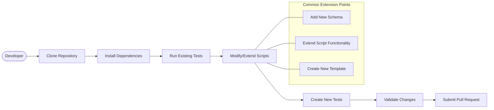
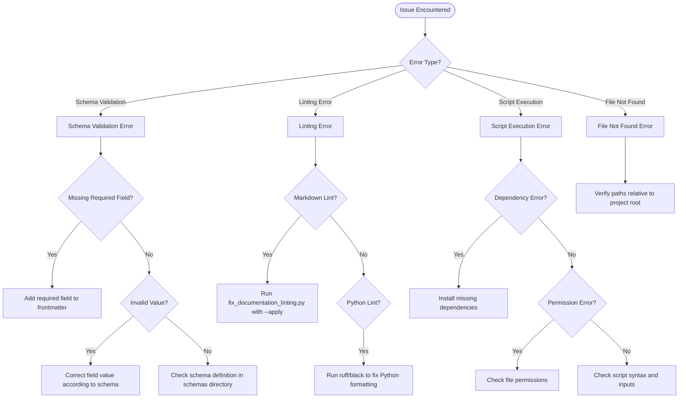

@references:
- .windsurfrules
- CODE_OF_CONDUCT.md
- MQP.md
- README.md
- ROADMAP.md
- CROSSREF_STANDARD.md

@references(level=1):
  - docs/guides/archive/developer_guide.md
  - docs/guides/archive/system_overview.md
  - docs/guides/archive/user_guide.md


  - docs/guides/reference_guide.md

---
title: reference_guide
version: 1.0.0
status: Active
date_created: 2025-05-10
date_modified: 2025-05-10
authors: [EGOS Team]
description: 
file_type: documentation
scope: 
primary_entity_type: 
primary_entity_name: 
tags: []
---

---
title: EGOS Documentation Automation System Reference Guide
description: A comprehensive guide to using and extending the EGOS Documentation Automation System
type: reference
status: active
version: 0.1.0
created: 2025-04-30
modified: 2025-04-30
authors:
  - EGOS Team
tags:
  - documentation
  - automation
  - koios
  - reference
related:
  - "[[system_overview.md]]"
  - "[[user_guide.md]]"
  - "[[developer_guide.md]]"
---

**Cross-References:**

- [[ROADMAP]]

> **Note**: This guide consolidates and replaces the following legacy documentation:
>
> - [System Overview](archive/system_overview.md) (Archived)
> - [User Guide](archive/user_guide.md) (Archived)
> - [Developer Guide](archive/developer_guide.md) (Archived)
>
- [[KOIOS Documentation Standards]]
- [[EGOS Core Principles]]

## 1. Introduction & Purpose

This guide provides a practical reference for using and maintaining the EGOS Documentation Automation System. It consolidates essential information previously found in the System Overview, User Guide, and Developer Guide, focusing on an 80/20 approach: 80% practical implementation guidance and 20% essential documentation.

The primary goal of this system is to automate documentation validation, linting, synchronization, and metrics generation, ensuring consistency and quality across the EGOS project while minimizing manual effort.

**Target Audience:** EGOS Developers, Contributors, AI Assistants.

**(Note: Once this guide is finalized, the following files will be archived: `system_overview.md`, `user_guide.md`, `developer_guide.md`)**

## 2. Quick Start (5-Minute Setup)

Follow these steps to get the documentation automation tools ready for use:

1. **Prerequisites:**
    - Ensure you have Python 3.9+ installed and available in your PATH.
    - Ensure `pip` (Python package installer) is installed and up-to-date.

1. **Navigate to Project Root:**
    Open your terminal or command prompt and navigate to the root directory of the EGOS project:

```bash
cd c:\EGOS
```

1. **Install Dependencies:**
    Install the necessary Python packages required by the scripts. It's recommended to use a virtual environment.

```bash
# Optional: Create and activate a virtual environment
# python -m venv .venv
# .\.venv\Scripts\activate

# Install dependencies (adjust path to requirements if needed)
pip install -r requirements.txt
# Or potentially: pip install -r scripts/requirements.txt if specific
```

### Note on Requirements

Verify the exact location and name of the relevant requirements file for your installation.

1. **Run a Basic Validation Check:**
    Verify that the documentation structure and frontmatter are compliant using `sync_docs.py`:

```bash
python scripts/sync_docs.py --check-only docs/
```

Look for output indicating success or listing specific errors to address.

This completes the basic setup. You can now use the individual tools as described in the next section.

## 3. Core Tools & Usage

This section details the primary scripts and their common use cases.

### 3.1. `sync_docs.py`: Validation & Synchronization

- **Purpose:** Validates Markdown frontmatter against schemas, checks for broken links, and potentially synchronizes content based on frontmatter directives (synchronization feature TBD/experimental).
- **Key Commands:**

```bash
# Validate documentation structure and frontmatter.
python scripts/sync_docs.py --check-only [path/to/docs]

# Apply synchronization rules (Use with caution).
python scripts/sync_docs.py --apply [path/to/docs]
```

- **Examples:**

```bash
# Check all documents within the main docs directory
python scripts/sync_docs.py --check-only docs/

# Check only documents within a specific subsystem's docs
python scripts/sync_docs.py --check-only docs/koios/
```

- **Configuration:** Relies on schemas defined in `docs/schemas/`.
- **Outputs:** Console output detailing errors or successful validation.

### 3.2. `fix_documentation_linting.py`: Automated Linting Fixes

- **Purpose:** Automatically applies formatting and linting rules (e.g., using Black, Ruff, markdownlint) to Python scripts and Markdown documents within the documentation system and potentially the wider project docs.
- **Key Commands:**

```bash
# Report linting issues without fixing.
python scripts/fix_documentation_linting.py --check-only [path]

# Automatically fix identified linting issues.
python scripts/fix_documentation_linting.py --apply [path]
```

- **Examples:**

```bash
# Check for linting issues in all Markdown files in the docs directory
python scripts/fix_documentation_linting.py --check-only docs/**/*.md

# Apply fixes to all Python scripts in the scripts directory
python scripts/fix_documentation_linting.py --apply scripts/**/*.py

# Apply fixes to a specific file
python scripts/fix_documentation_linting.py --apply docs/koios/standards.md
```

- **Configuration:** Uses configurations from `pyproject.toml`, `.markdownlint.jsonc` (or similar).
- **Outputs:** Console output detailing files checked and fixed.

### 3.3. `migrate_legacy_docs.py`: Legacy Content Migration

- **Purpose:** Assists in migrating older documentation formats to the current KOIOS standards, primarily by analyzing content and suggesting or applying appropriate frontmatter.
- **Key Commands:** (Details TBD - focus on analysis first)

```bash
python scripts/migrate_legacy_docs.py --analyze [path/to/legacy/docs]
python scripts/migrate_legacy_docs.py --apply-frontmatter [path/to/legacy/docs]
```

- **Examples:**

```bash
# Analyze potential legacy documents in a specific directory
python scripts/migrate_legacy_docs.py --analyze archive/old_system_docs/

# (Hypothetical) Apply suggested frontmatter to the analyzed documents
# python scripts/migrate_legacy_docs.py --apply-frontmatter archive/old_system_docs/
```

- **Configuration:** May use heuristics or specific rules defined within the script.
- **Outputs:** Reports suggesting frontmatter, or modified files if applying changes.

### 3.4. `documentation_metrics.py`: Quality & Health Metrics

- **Purpose:** Generates metrics on documentation quality, coverage, and health (e.g., frontmatter completeness, link validity ratios, content staleness - future).
- **Key Commands:**

```bash
python scripts/documentation_metrics.py --generate [path/to/docs]
```

- **Examples:**

```bash
# Generate metrics for the entire docs directory
python scripts/documentation_metrics.py --generate docs/

# (Hypothetical) Generate metrics and output to a JSON file
# python scripts/documentation_metrics.py --generate docs/ --output metrics_report.json
```

- **Configuration:** TBD.
- **Outputs:** Metrics report (e.g., JSON or console output, potentially feeding a dashboard - Phase 4).

## 4. Core Concepts

- **Frontmatter & Schemas:** All standard EGOS documents require YAML frontmatter validated against schemas (`docs/schemas/`). This metadata drives automation.
- **KOIOS Standards:** All documentation and the system itself must adhere to KOIOS principles (structure, naming, cross-referencing).
- **Cross-Referencing (`[[link]]`)**: Use standard wiki-style links for internal references. Validation is performed by `sync_docs.py`.
- **Configuration Files:** Key tools rely on `pyproject.toml` and potentially `.markdownlint.jsonc`/`.deepsource.toml` for linting rules.

## 5. Contribution & Extension

### Overview

This section outlines how to contribute to the documentation automation system or extend its functionality for new use cases.



### 5.1. Setting Up a Development Environment

1. Clone the EGOS repository (if not already done):

   ```bash
   git clone <repository-url>
   cd EGOS
   ```

2. Create a virtual environment and install development dependencies:

   ```bash
   python -m venv .venv
   .\.venv\Scripts\activate  # On Windows
   pip install -r requirements-dev.txt  # Includes testing packages
   ```

3. Run the test suite to ensure everything is working correctly:

   ```bash
   pytest scripts/test_documentation_system.py
   ```

### 5.2. Common Extension Points

#### Adding a New Schema

Documentation schemas define the required and optional frontmatter fields for different document types:

1. Identify the new document type that needs a schema
2. Create a new schema file in `docs/schemas/` (use existing schemas as templates)
3. Define the Cerberus validation rules for required and optional fields
4. Update `sync_docs.py` to recognize the new schema (if necessary)
5. Test the schema with example documents

Example new schema file (`docs/schemas/tutorial_schema.yaml`):

```yaml
# Schema for tutorial documents
type: dict
required: true
schema:
  title:
    type: string
    required: true
  description:
    type: string
    required: true
  author:
    type: string
    required: true
  difficulty:
    type: string
    required: true
    allowed: ['beginner', 'intermediate', 'advanced']
  tags:
    type: list
    required: false
    schema:
      type: string
```

#### Extending Script Functionality

To extend an existing script with new features:

1. Understand the current implementation and architecture
2. Add new functionality following the existing patterns and coding standards
3. Write tests for the new functionality
4. Document the changes in both code (docstrings) and user-facing documentation

Common extension points include:

- Adding new command-line options to `sync_docs.py`
- Implementing additional metrics in `documentation_metrics.py`
- Adding new linting rules or fixers to `fix_documentation_linting.py`
- Creating new migration strategies in `migrate_legacy_docs.py`

#### Creating New Templates

To add new document templates:

1. Create the template in `docs/templates/` with appropriate frontmatter
2. Document the template's purpose and usage
3. Consider adding template generation capabilities to the scripts

### 5.3. Testing

The documentation system uses pytest for testing:

- **Unit Tests**: Test individual functions and classes
- **Integration Tests**: Test interactions between components
- **End-to-End Tests**: Test entire workflows with sample documents

Write tests for any new functionality. Keep test files alongside the code they test when possible.

Example test structure:

```python
def test_schema_validation_new_type():
    """Test that the new document type validates correctly."""
    # Arrange
    test_doc = {"title": "Test", "description": "Test desc", "author": "Tester"}
    schema = load_schema("tutorial_schema.yaml")
    
    # Act
    result, errors = validate_against_schema(test_doc, schema)
    
    # Assert
    assert result is False
    assert "difficulty" in errors  # Missing required field
```

### 5.4. Reporting Issues

When reporting issues with the documentation system:

1. Check existing issues first to avoid duplicates
2. Include the exact command you ran and the full error output
3. Provide examples of documents that cause issues
4. If possible, suggest a fix or workaround

### 5.5. Pull Request Process

When submitting changes:

1. Create a feature branch from the main branch
2. Make your changes following the EGOS code standards
3. Update documentation to reflect your changes
4. Add tests for new functionality
5. Ensure all tests pass and linting checks succeed
6. Submit a pull request with a clear description of your changes

## 6. Troubleshooting

### 6.1. Issue Identification Flowchart

Use this decision tree to identify and resolve common documentation system issues:



### 6.2. Common Issues and Solutions

#### Schema Validation Errors

**Symptoms:**

- Error messages like "Required field 'title' is missing" or "Expected type 'string' for field 'X'"
- Script exits with validation errors when running `sync_docs.py`

**Solutions:**

1. **Missing Required Fields:**
   - Check the error message to identify which field is missing
   - Add the required field to the document's frontmatter (YAML section at the top)
   - Reference the appropriate schema in `docs/schemas/` to see all required fields

   ```markdown
   ---
   title: Your Document Title  # Added missing field
   description: Brief description
   ---
   ```

2. **Invalid Field Values:**
   - Ensure field values match the expected type (string, number, list, etc.)
   - For fields with restricted values, check the schema for allowed options
   - Fix array/list formatting if they're improperly structured

3. **Schema Errors:**
   - If you believe the schema itself has an issue, examine the schema definition
   - Consider updating the schema if the validation rule doesn't match current standards

#### Linting Errors

**Symptoms:**

- Errors about markdown formatting, indentation, or structure
- Python code style issues (whitespace, imports, line length)

**Solutions:**

1. **Automated Fixes:**

   ```bash
   # For Markdown files
   python scripts/fix_documentation_linting.py --apply docs/path/to/file.md
   
   # For Python files
   python -m black scripts/your_script.py
   python -m ruff scripts/your_script.py --fix
   ```

2. **Common Markdown Issues:**
   - **MD031**: Ensure code blocks have blank lines before and after
   - **MD013**: Long lines (consider reformatting paragraphs)
   - **MD030**: Spaces after list markers (ensure consistent indentation)
   - **MD025**: Multiple top-level headings (ensure only one H1 per document)

3. **Configuration Conflicts:**
   - Review linting rules in `.markdownlint.jsonc` and `pyproject.toml`
   - If a rule is causing problems, consider discussing adjustment with the team

#### Script Execution Errors

**Symptoms:**

- Python errors when running documentation scripts
- ImportError, ModuleNotFoundError, or other exceptions

**Solutions:**

1. **Dependency Issues:**
   - Ensure all required packages are installed:

     ```bash
     pip install -r requirements.txt
     ```

   - Check for version conflicts between packages
   - Consider using a fresh virtual environment if conflicts persist

2. **Script Configuration:**
   - Verify script arguments and options are correct
   - Check if configuration files exist and have correct format/permissions
   - Look for hardcoded paths that might be environment-specific

3. **Permission Issues:**
   - Ensure your user account has read/write access to relevant directories
   - On Windows, check if administrator privileges are needed

#### File Not Found Errors

**Symptoms:**

- FileNotFoundError in Python scripts
- Scripts cannot locate documentation files or schemas

**Solutions:**

1. **Path Verification:**
   - Always run scripts from the project root (`c:\EGOS`)
   - Use absolute paths or paths relative to project root, not the script location
   - Double-check path separators (`/` or `\`) are correct for your OS

2. **Directory Structure:**
   - Verify the expected directory structure exists
   - Check if files have been moved or renamed
   - Make sure all paths are correctly specified in configuration files

### 6.3. Getting Help

If troubleshooting steps don't resolve your issue:

1. **Check Existing Issues:**
   - Review project issue tracker for similar problems
   - Search documentation for known limitations

2. **Create a Detailed Report:**
   - Document exact steps to reproduce the issue
   - Include full error messages and script output
   - Specify your environment (OS, Python version, package versions)

3. **Request Team Support:**
   - For EGOS team members, use the internal support channels
   - For external contributors, file an issue with the information above

---