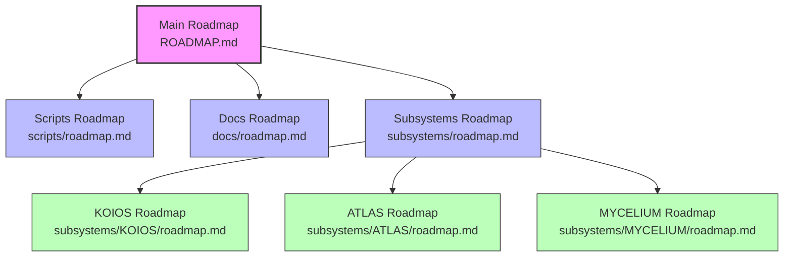
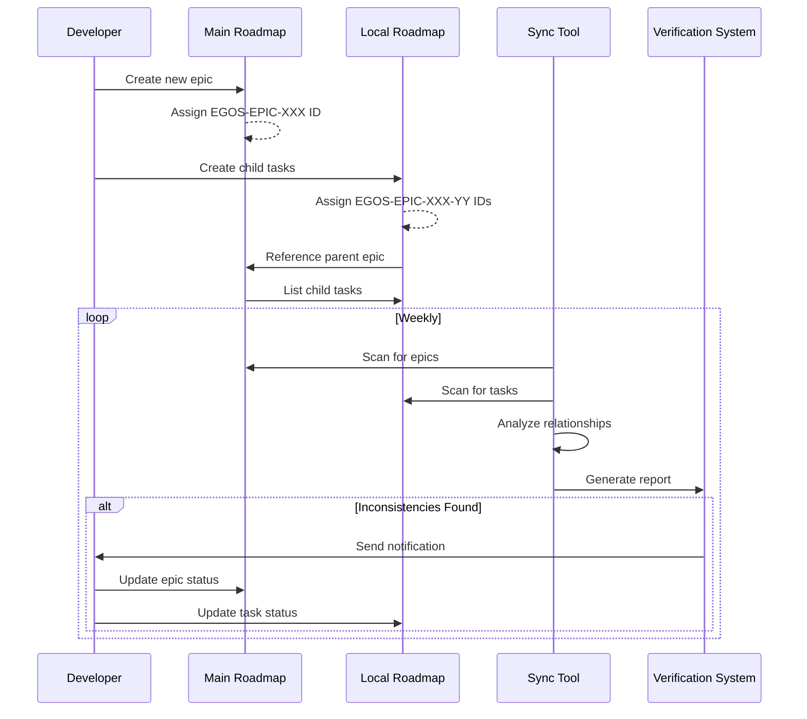

@references:
- .windsurfrules
- CODE_OF_CONDUCT.md
- MQP.md
- README.md
- ROADMAP.md
- CROSSREF_STANDARD.md

@references(level=1):
  - docs/audits/index.md
  - docs/governance/cross_reference_priority_list.md
  - docs/governance/development_standards.md
  - docs/governance/documentation_health_analysis.md
  - docs/governance/file_lifecycle_management.md
  - docs/governance/roadmap_hierarchy.md
  - docs/governance/roadmap_standardization.md
  - docs/templates/main_roadmap_template.md
  - docs/templates/roadmap_template.md
  - scripts/maintenance/automation/setup_roadmap_sync.ps1
  - scripts/maintenance/roadmap_sync.py


  - docs/guides/roadmap_hierarchy_implementation.md

---
title: EGOS Roadmap Hierarchy Implementation Guide
version: 1.0.0
status: Active
date_created: 2025-05-18
date_modified: 2025-05-18
authors: [EGOS Development Team]
description: Comprehensive implementation guide for the EGOS roadmap hierarchy system
file_type: documentation
scope: project-wide
primary_entity_type: reference
primary_entity_name: roadmap_hierarchy_implementation
tags: [documentation, roadmap, standardization, governance, planning, hierarchy, implementation]
---
## Cross References

- [EGOS ROADMAP](../../ROADMAP.md)
- [Roadmap Hierarchy](../governance/roadmap_hierarchy.md)
- [Roadmap Standardization](../governance/roadmap_standardization.md)
- [Development Standards](../governance/development_standards.md)
- [Audit Dashboard](../audits/index.md)

# EGOS Roadmap Hierarchy Implementation Guide

## Overview

This document provides a comprehensive implementation guide for the EGOS roadmap hierarchy system, which establishes clear relationships between the main project roadmap and local (folder- or subsystem-level) roadmaps. It details the technical implementation, automation tools, and integration with the cross-reference system.

## Implementation Architecture



### Core Components

1. **Main Roadmap (`ROADMAP.md`)**
   - Located in the project root
   - Contains high-level epics and initiatives
   - Serves as the central reference for all planning

2. **Local Roadmaps (`roadmap.md`)**
   - Located in major directories and subsystems
   - Contain detailed tasks and implementation specifics
   - Link back to parent epics in the main roadmap

3. **Synchronization System**
   - Python script for analyzing and synchronizing roadmap statuses
   - PowerShell automation for scheduled verification
   - Notification system for inconsistencies

4. **Templates and Standards**
   - Standardized formats for main and local roadmaps
   - Consistent task ID structure and status definitions
   - Clear parent-child relationship conventions

## Implementation Steps

### 1. Establish Roadmap Structure

#### Main Roadmap Structure

The main roadmap (`ROADMAP.md`) should be structured as follows:

1. **Metadata Header**: Standard KOIOS metadata
2. **Overview**: Brief project summary
3. **Status Legend**: Consistent status definitions
4. **Strategic Initiatives**: Grouped by major project areas
5. **Epics**: High-level tasks with unique IDs
6. **Roadmap Governance**: Explanation of hierarchy and synchronization
7. **Related Documents**: Links to relevant documentation

#### Local Roadmap Structure

Each local roadmap (`roadmap.md`) should be structured as follows:

1. **Metadata Header**: Standard KOIOS metadata
2. **Overview**: Brief directory/subsystem summary
3. **Status Legend**: Consistent status definitions
4. **Current Priorities**: Focus areas specific to this directory
5. **Tasks**: Detailed tasks with parent epic references
6. **Completed Tasks**: Archive of finished work
7. **Dependencies**: Task dependencies and blockers
8. **Related Documents**: Links to relevant documentation

### 2. Implement Task Identification System

#### ID Structure

```
[Project]-[Type]-[Number]-[Subtask]
```

- **Project**: `EGOS` for all tasks
- **Type**: `EPIC` for main roadmap, subsystem code for local roadmaps
- **Number**: Sequential number (e.g., `001`, `002`)
- **Subtask**: Sequential subtask number for local roadmap tasks

#### Examples

- Main Roadmap Epic: `EGOS-EPIC-003`
- Local Task in Scripts: `EGOS-EPIC-003-01`
- Local Task in KOIOS: `EGOS-EPIC-003-02`

### 3. Set Up Cross-Reference Links

#### From Child to Parent

In local roadmaps, each task should reference its parent epic:

```markdown
**Parent Epic:** [EGOS-EPIC-003](../../ROADMAP.md#egos-epic-003-cross-reference-system-enhancement)
```

#### From Parent to Children

In the main roadmap, each epic should list its child tasks:

```markdown
**Child Tasks:**
- [EGOS-EPIC-003-01] Refactor cross-reference management system (`scripts/roadmap.md`)
- [EGOS-EPIC-003-02] Implement configuration system (`scripts/roadmap.md`)
```

### 4. Deploy Synchronization Tools

#### Python Synchronization Script

The `roadmap_sync.py` script performs the following functions:

1. Scans all roadmap files in the project
2. Identifies parent-child relationships
3. Analyzes status consistency
4. Generates detailed reports
5. Optionally updates statuses based on child task completion

#### PowerShell Automation

The `setup_roadmap_sync.ps1` script:

1. Creates a scheduled task for weekly synchronization
2. Sets up notification system for inconsistencies
3. Generates standardization reports
4. Provides manual override options

### 5. Integrate with Cross-Reference System

The roadmap hierarchy system integrates with the cross-reference system in several ways:

1. **Metadata Standards**: Both systems use the same KOIOS metadata format
2. **Verification Process**: Cross-reference verification includes roadmap files
3. **Reporting**: Roadmap status reports include cross-reference metrics
4. **Automation**: Both systems use the same automation framework

## Implementation Workflow



## Status Synchronization Rules

### Status Propagation

Child task statuses propagate to parent epics according to these rules:

1. **Done**: All child tasks must be marked "Done"
2. **Blocked**: Any critical child task marked "Blocked"
3. **In Progress**: At least one child task "In Progress" or "Review"
4. **Backlog**: All child tasks in "Backlog" or "Deferred"
5. **Deferred**: All child tasks marked "Deferred"

### Status Conflicts

When child tasks have conflicting statuses:

1. "Blocked" takes precedence over "In Progress"
2. "In Progress" takes precedence over "Backlog"
3. "Review" is treated as "In Progress" for the parent epic

## Edge Cases and Solutions

### Shared Tasks Between Subsystems

For tasks that span multiple subsystems:

1. Create the task in the primary owner's local roadmap
2. Add cross-references to the task in other relevant local roadmaps
3. Clearly indicate shared ownership in the task description

Example:
```markdown
**Shared With:** [KOIOS](../../subsystems/KOIOS/roadmap.md#egos-epic-003-04)
```

### Emergent Tasks

For tasks that emerge during development:

1. Add the task to the appropriate local roadmap
2. Link it to the most relevant parent epic
3. If no suitable parent exists, create a new epic

### Changing Priorities

When priorities change:

1. Update the status in both main and local roadmaps
2. Document the reason for the change
3. Update any affected dependencies

## Integration with Development Workflow

### Creating New Features

1. Create an epic in the main roadmap with a unique ID
2. Break down the epic into tasks in local roadmaps
3. Establish clear parent-child relationships
4. Set initial statuses (typically "Backlog")

### Tracking Progress

1. Update task statuses in local roadmaps as work progresses
2. Run the synchronization tool to update epic statuses
3. Review the roadmap hierarchy report for inconsistencies
4. Address any status conflicts or missing relationships

### Completing Work

1. Mark tasks as "Done" in local roadmaps when completed
2. Run the synchronization tool to update epic statuses
3. Review the completed work in the main roadmap
4. Archive completed initiatives as needed

## Tools and Resources

### Scripts

- [`roadmap_sync.py`](../../scripts/maintenance/roadmap_sync.py): Synchronization tool
- [`setup_roadmap_sync.ps1`](../../scripts/maintenance/automation/setup_roadmap_sync.ps1): Automation setup

### Templates

- [`main_roadmap_template.md`](../templates/main_roadmap_template.md): Template for main roadmap
- [`roadmap_template.md`](../templates/roadmap_template.md): Template for local roadmaps

### Documentation

- [`roadmap_hierarchy.md`](../governance/roadmap_hierarchy.md): Hierarchy guidelines
- [`roadmap_standardization.md`](../governance/roadmap_standardization.md): Standardization guidelines

## Future Enhancements

### Planned Improvements

1. **Visual Dashboard**: Interactive visualization of roadmap hierarchy
2. **CI/CD Integration**: Automated verification in continuous integration
3. **Impact Analysis**: Tools to assess the impact of status changes
4. **Dependency Tracking**: Advanced tracking of inter-task dependencies

### Research Areas

1. **Machine Learning**: Predictive analytics for task completion
2. **Natural Language Processing**: Automated task creation from requirements
3. **Graph Database**: Enhanced relationship modeling and querying

## Related Documents

- [Development Standards](../governance/development_standards.md)
- [File Lifecycle Management](../governance/file_lifecycle_management.md)
- [Cross-Reference Priority List](../governance/cross_reference_priority_list.md)
- [Documentation Health Analysis](../governance/documentation_health_analysis.md)
- [Audit Dashboard](../audits/index.md)