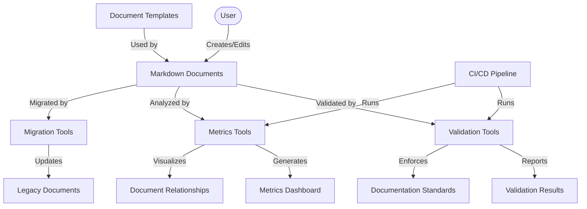
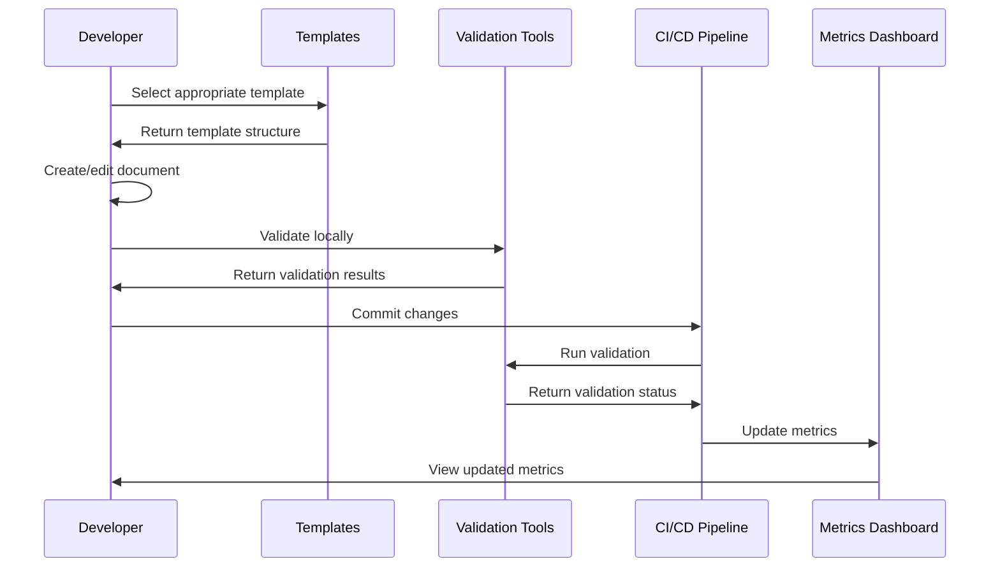

@references:
- .windsurfrules
- CODE_OF_CONDUCT.md
- MQP.md
- README.md
- ROADMAP.md
- CROSSREF_STANDARD.md

  - docs/guides/system_overview.md

---
title: system_overview
version: 1.0.0
status: Active
date_created: 2025-05-10
date_modified: 2025-05-10
authors: [EGOS Team]
description: 
file_type: documentation
scope: 
primary_entity_type: 
primary_entity_name: 
tags: []
---

---
schema_version: "1.0"
title: "EGOS Documentation System Overview"
id: "DOC-SYS-001"
status: "active"
date_created: "2025-04-30"
date_updated: "2025-04-30"
subsystem: "KOIOS"
author: "EGOS Team"
document_type: "system_documentation"
enforcement_level: "required"
tags: ["documentation", "system", "overview", "KOIOS"]
principles: ["Conscious Modularity", "Systemic Cartography", "Universal Accessibility"]
related_documents:
  - id: "DOC-SYS-002"
    title: "Documentation System User Guide"
    relationship: "child"
  - id: "DOC-SYS-003"
    title: "Documentation System Developer Guide"
    relationship: "child"
  - id: "DOC-SYS-004"
    title: "Documentation System Integration Guide"
    relationship: "child"
  - id: "DOC-SYS-005"
    title: "Documentation System Troubleshooting Guide"
    relationship: "child"
---

# EGOS Documentation System Overview

This document provides a comprehensive overview of the EGOS Documentation System, its architecture, components, and how they work together to ensure high-quality, consistent documentation across the project.

## Introduction

The EGOS Documentation System is built on the principles of Conscious Modularity and Systemic Cartography, providing a structured approach to creating, maintaining, and validating project documentation. The system ensures that all documentation follows consistent standards, contains required metadata, and maintains relationships with other relevant documents.

## System Architecture

The documentation system follows a modular architecture with clearly defined components and responsibilities:



## Core Components

### 1. Document Templates

Templates provide standardized structures for different types of documentation:

- **Markdown Document**: General-purpose document template
- **API Documentation**: For documenting APIs and interfaces
- **Architecture Documentation**: For system architecture documentation
- **User Guide**: For end-user documentation
- **Development Standard**: For development guidelines and standards

Each template includes standardized frontmatter metadata and document structure.

### 2. Validation Tools

The system includes tools to validate documentation against established standards:

- **sync_docs.py**: Core validation tool for frontmatter and content
- **fix_documentation_linting.py**: Automatically fixes common linting issues
- **test_documentation_system.py**: Tests the documentation system itself

### 3. Metrics and Analysis

Tools that analyze the documentation and provide insights:

- **documentation_metrics.py**: Generates metrics on documentation quality and coverage
- **test_legacy_docs.py**: Analyzes existing documentation for compliance with current standards

### 4. Migration Tools

Tools to update legacy documentation to current standards:

- **migrate_legacy_docs.py**: Migrates legacy documentation to current frontmatter format

### 5. CI/CD Integration

The documentation system integrates with CI/CD pipelines:

- **GitHub Actions Workflow**: Automatically validates documentation
- **Pre-commit Hooks**: Validates documentation before commits

## Documentation Workflow



## Standards Enforcement

The documentation system enforces standards through multiple mechanisms:

1. **Template-based Creation**: All new documents start from standardized templates
2. **Local Validation**: Authors can validate documents before committing
3. **Automated Linting**: Tools automatically fix common issues
4. **CI/CD Validation**: Prevents merging of non-compliant documentation
5. **Quality Metrics**: Track documentation quality over time

## File Organization

The documentation system files are organized as follows:

```
EGOS/
├── docs/                     # Main documentation directory
│   ├── schemas/              # JSON schemas for frontmatter validation
│   └── documentation_system/ # System documentation
├── scripts/                  # Automation scripts
│   ├── sync_docs.py          # Core documentation validation
│   ├── migrate_legacy_docs.py # Legacy documentation migration
│   ├── fix_documentation_linting.py # Linting fixes
│   ├── test_documentation_system.py # System tests
│   ├── test_legacy_docs.py   # Legacy documentation tests
│   ├── templates/            # Document templates
│   │   ├── markdown_document.j2
│   │   ├── api_documentation.j2
│   │   ├── architecture_documentation.j2
│   │   ├── user_guide.j2
│   │   └── development_standard.j2
│   └── metrics/              # Metrics generation
│       └── documentation_metrics.py
├── .github/                  # GitHub configuration
│   └── workflows/            # CI/CD workflows
│       └── documentation-validation.yml
├── .deepsource.toml          # DeepSource configuration
└── pyproject.toml            # Linting configuration
```

## Integration with Other Systems

The documentation system integrates with:

1. **Version Control**: Git for document versioning
2. **Continuous Integration**: GitHub Actions for automated validation
3. **Code Analysis**: DeepSource for quality checks
4. **Development Workflow**: Pre-commit hooks for local validation

## Metrics and Reporting

The system provides comprehensive metrics on documentation quality:

- **Coverage**: Percentage of components with proper documentation
- **Compliance**: Adherence to documentation standards
- **Relationships**: Visualizations of document relationships
- **Trends**: Changes in documentation quality over time

## Implementation Status

| Component | Status | Description |
|-----------|--------|-------------|
| Core Templates | Complete | Basic document templates implemented |
| Specialized Templates | Complete | Templates for specific document types |
| Validation Tools | Complete | Tools for validating documentation |
| Metrics Generation | Complete | Tools for generating documentation metrics |
| Legacy Document Analysis | Complete | Tools for analyzing legacy documents |
| CI/CD Integration | Complete | Integration with GitHub Actions |
| Relationship Visualization | Complete | Visualization of document relationships |
| Time-series Metrics | Planned | Tracking documentation quality over time |

## Next Steps

1. **Enhance Template System**:
   - Add validation for required fields
   - Create additional specialized templates

2. **Improve Metrics Dashboard**:
   - Add time-series tracking of quality metrics
   - Enhance relationship visualization

3. **Automated Alerting**:
   - Detect outdated documents
   - Identify missing cross-references

## Conclusion

The EGOS Documentation System provides a comprehensive framework for creating, maintaining, and validating project documentation. By following the standards and using the provided tools, the project ensures consistent, high-quality documentation that enhances understanding and maintainability.