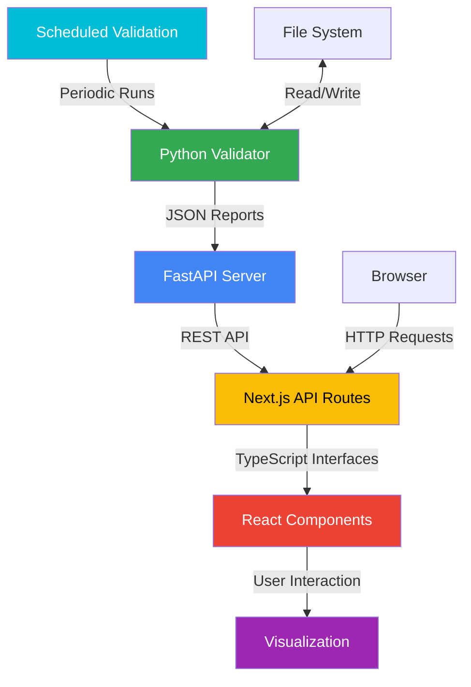

# Cross-Reference Validation System: Python-Next.js Integration

**@references: MQP.md (Conscious Modularity, Systemic Cartography), scripts/cross_reference/api/validation_api.py, website/src/lib/api/validationRunner.ts, ROADMAP.md#cref-backend-connect-01**

## Overview

This document outlines the integration architecture between the Python Cross-Reference Validation backend and the Next.js frontend for the EGOS Cross-Reference Visualization System. The integration follows the Conscious Modularity principle, allowing each component to operate independently while providing seamless communication through well-defined interfaces.

## Architecture

The integration architecture connects the Python-based validation system with the Next.js web application through a REST API. This approach allows for:

1. **Decoupling**: The backend and frontend can evolve independently
2. **Scalability**: The Python API can be deployed separately from the web application
3. **Technology-Agnostic**: The REST API allows for potential future implementations in different languages

### System Components



## Backend Components

### 1. UnifiedValidator (Python)

The `UnifiedValidator` class in `scripts/cross_reference/validator/unified_validator.py` performs the core validation functions:

- Detecting orphaned files
- Checking for broken references
- Generating comprehensive validation reports

### 2. Validation API (FastAPI)

The `validation_api.py` module provides a RESTful API using FastAPI with the following endpoints:

| Endpoint | Method | Description | Parameters |
|----------|--------|-------------|------------|
| `/api/run-validation` | POST | Triggers a validation run | ValidationRequest JSON |
| `/api/validation-status` | GET | Gets current validation status | None |
| `/api/validation-report` | GET | Gets latest validation report | None |
| `/api/schedule-validation` | POST | Schedules a validation run | ScheduleRequest JSON |
| `/api/cancel-scheduled-validation/{time}` | DELETE | Cancels scheduled run | schedule_time (path) |
| `/healthcheck` | GET | Simple health check | None |

### 3. Scheduled Validation Service

The scheduled validation service (`scheduled_validation.py`) runs validation at defined intervals:

- Daily validations (configurable time)
- Weekly validations (configurable day and time)
- Maintains a history of validation reports
- Automatic cleanup of old reports

## Frontend Components

### 1. API Bridge (TypeScript)

The `validationRunner.ts` module provides a TypeScript interface to the Python API:

```typescript
// Example: Triggering validation
const result = await triggerValidation({
  orphaned_files: true,
  reference_check: true,
  include_patterns: ['**/*.md', '**/*.py']
});
```

### 2. Type Definitions

The `validation.ts` file contains TypeScript interfaces that mirror the Python data models:

- `ValidationConfig`: Configuration for validation runs
- `ValidationStatus`: Current status of the validation service
- `UnifiedValidationReport`: Complete validation results
- `OrphanedFilesReport`: Report on orphaned files
- `ReferenceCheckReport`: Report on reference checking

### 3. Next.js API Routes

The Next.js API routes provide proxying and additional processing:

- `/api/validation/unified-report`: Gets the latest validation report
- `/api/validation/run`: Triggers a validation run
- `/api/validation/status`: Gets validation status

## Integration Flow

### 1. Initial Setup

1. The Python validation API is started:
   ```bash
   cd scripts/cross_reference/api
   python validation_api.py
   ```

2. The scheduled validation service is started:
   ```bash
   cd scripts/cross_reference/api
   python scheduled_validation.py
   ```

3. The Next.js application is configured with the API URL:
   ```bash
   # .env.local
   NEXT_PUBLIC_VALIDATION_API_URL=http://localhost:8000
   ```

### 2. Validation Flow

1. **On-Demand Validation**:
   
   ```mermaid
   sequenceDiagram
       participant User as User
       participant UI as React UI
       participant NextAPI as Next.js API
       participant Python as Python API
       participant Validator as UnifiedValidator
       
       User->>UI: Click "Run Validation"
       UI->>NextAPI: POST /api/validation/run
       NextAPI->>Python: POST /api/run-validation
       Python->>Validator: Run validation in background
       Python-->>NextAPI: Return status (started)
       NextAPI-->>UI: Return status
       UI->>UI: Show "Validation in progress"
       
       loop Until complete
           UI->>NextAPI: GET /api/validation/status
           NextAPI->>Python: GET /api/validation-status
           Python-->>NextAPI: Return status
           NextAPI-->>UI: Return status
       end
       
       UI->>NextAPI: GET /api/validation/unified-report
       NextAPI->>Python: GET /api/validation-report
       Python-->>NextAPI: Return report
       NextAPI-->>UI: Return report
       UI->>User: Display validation results
   ```

2. **Scheduled Validation**:

   ```mermaid
   sequenceDiagram
       participant Schedule as Scheduler
       participant Validator as UnifiedValidator
       participant FS as File System
       participant Python as Python API
       participant UI as React UI
       
       Schedule->>Schedule: Trigger at scheduled time
       Schedule->>Validator: Run validation
       Validator->>FS: Read files
       Validator->>Validator: Perform validation
       Validator->>FS: Write report
       
       Note over Python,UI: Later, when user visits dashboard
       
       UI->>Python: GET /api/validation-report
       Python->>FS: Read latest report
       Python-->>UI: Return report
       UI->>UI: Display validation results
   ```

## Error Handling

The integration includes comprehensive error handling:

1. **Backend Errors**:
   - Validation errors are logged and reported
   - API errors return appropriate HTTP status codes and error messages
   - Background tasks capture and log exceptions

2. **Frontend Errors**:
   - API request errors are caught and displayed to the user
   - React ErrorBoundary components catch rendering errors
   - Fallback UI is shown when errors occur

3. **Network Errors**:
   - Timeout handling for long-running operations
   - Retry logic for transient failures
   - Offline mode detection and appropriate messaging

## Security Considerations

1. **API Security**:
   - In production, CORS settings should be restricted to specific origins
   - API key authentication should be implemented for sensitive endpoints
   - Rate limiting should be applied to prevent abuse

2. **Data Validation**:
   - All inputs are validated using Pydantic models in the backend
   - TypeScript interfaces ensure type safety in the frontend

3. **Error Exposure**:
   - Detailed error information is logged but not exposed to clients
   - Generic error messages are shown to users to prevent information leakage

## Configuration

### Backend Configuration

```json
{
  "daily_schedule": "00:00",
  "weekly_schedule": "monday 02:00",
  "reports_dir": "./reports",
  "max_reports": 10,
  "validation_config": {
    "orphaned_files": true,
    "reference_check": true,
    "include_patterns": [],
    "exclude_patterns": ["**/node_modules/**", "**/venv/**", "**/.git/**"]
  }
}
```

### Frontend Configuration

```typescript
// Environment variables
NEXT_PUBLIC_VALIDATION_API_URL=http://localhost:8000

// Default configuration
const DEFAULT_CONFIG: ValidationConfig = {
  orphaned_files: true,
  reference_check: true,
  include_patterns: [],
  exclude_patterns: ["**/node_modules/**", "**/venv/**", "**/.git/**"]
};
```

## Deployment Considerations

### Development Environment

In development, both the Python API and Next.js application run locally:
- Python API: `http://localhost:8000`
- Next.js: `http://localhost:3000`

### Production Environment

In production, several deployment options are available:

1. **Co-located Deployment**:
   - Python API and Next.js app on the same server
   - Internal communication via localhost

2. **Separate Deployment**:
   - Python API on dedicated server
   - Next.js app on web server or serverless platform
   - Secure communication via HTTPS

3. **Containerized Deployment**:
   - Docker containers for Python API and Next.js app
   - Orchestration with Docker Compose or Kubernetes

## Monitoring and Maintenance

1. **Logging**:
   - Python backend logs to `validation_api.log` and `scheduled_validation.log`
   - Next.js logs to standard output or application monitoring service

2. **Health Checks**:
   - `/healthcheck` endpoint for monitoring API availability
   - `checkAPIAvailability()` function for frontend health checks

3. **Performance Monitoring**:
   - Execution time tracking for validation runs
   - API response time monitoring
   - Frontend performance metrics

## Future Enhancements

1. **Real-time Updates**:
   - WebSocket integration for live validation updates
   - Progress reporting during validation runs

2. **Enhanced Authentication**:
   - User-specific validation configurations
   - Role-based access to validation features

3. **Integration with CI/CD**:
   - Trigger validation on code commits
   - Block merges with validation failures

## Conclusion

The integration between the Python Cross-Reference Validation system and the Next.js frontend demonstrates the Conscious Modularity principle in action, creating a cohesive system from independent components. The well-defined API and type interfaces ensure reliable communication while allowing each component to evolve independently.

This architecture provides a foundation for future enhancements to the Cross-Reference Visualization System, supporting both the immediate needs and long-term goals of the EGOS project.

✧༺❀༻∞ EGOS ∞༺❀༻✧
