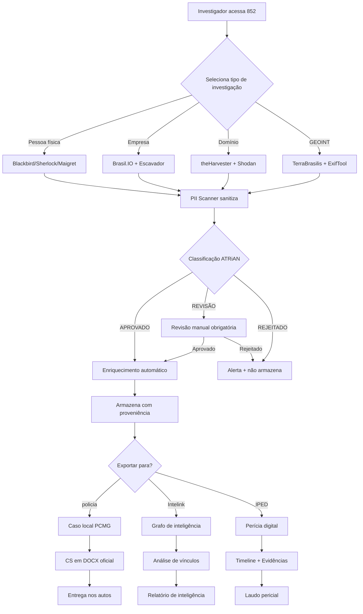

# Especificação Técnica: Integração OSINT + Inteligência Policial

> **Versão:** 1.1.0 | **Data:** 2026-04-08 | **Status:** Revisado
> **Escopo:** Intelink (Investigação) + 852 (Social/Triagem) + policia (PCMG) + IPED
> **Autor:** EGOS Intelligence Team
> **Nota:** OSINT investigativo integrado ao Intelink (evolução do Intelink Cortex), não Eagle Eye (que mantém foco GovTech/licitações)

---

## 1. Visão Geral

### 1.1 Objetivo

Criar uma arquitetura completa de integração entre ferramentas OSINT gratuitas e o ecossistema de inteligência policial, maximizando a interoperabilidade com IPED e estabelecendo fluxos claros para ingestão, triagem, análise e perícia digital.

### 1.2 Princípios Fundamentais

1. **Separação de Domínios:** Dado público ≠ dado institucional ≠ dado probatório
2. **Proveniência Obrigatória:** Toda evidência deve ter origem, timestamp e cadeia de custódia
3. **LGPD Compliance:** Anonimização automática de PII em dados públicos
4. **Auditabilidade:** Trilha completa de auditoria para todas as operações
5. **Extensibilidade:** Arquitetura plugin-based para novas fontes OSINT

---

## 2. Arquitetura de Integração

### 2.1 Camadas da Arquitetura (REVISADA v1.1)

```
┌─────────────────────────────────────────────────────────────────────────────┐
│                    CAMADA 5: PERÍCIA DIGITAL (IPED)                          │
│  ┌─────────────┐  ┌─────────────┐  ┌─────────────┐  ┌─────────────────────┐ │
│  │ IPED Core   │  │ Graph       │  │ Timeline    │  │ Report Export       │ │
│  │ (Java)      │  │ Analytics   │  │ View        │  │ (PDF/HTML)          │ │
│  └──────┬──────┘  └─────────────┘  └─────────────┘  └─────────────────────┘ │
└───────┬─────────────────────────────────────────────────────────────────────┘
        │ IPED-Adapter (REST/WebSocket)
┌───────▼─────────────────────────────────────────────────────────────────────┐
│         CAMADA 4: INTELINK v3 — GRAFO DE INTELIGÊNCIA + OSINT                 │
│  ┌─────────────┐  ┌─────────────┐  ┌─────────────┐  ┌─────────────────────┐ │
│  │ OSINT       │  │ Entity      │  │ Cross-Case  │  │ Graph Algorithms    │ │
│  │ Bridge      │  │ Resolution  │  │ Detection   │  │ (centrality, paths) │ │
│  │ (Blackbird, │  │ (6-level)   │  │             │  │                     │ │
│  │  Sherlock,  │  │             │  │             │  │                     │ │
│  │  Brasil.IO) │  │             │  │             │  │                     │ │
│  └──────┬──────┘  └─────────────┘  └─────────────┘  └─────────────────────┘ │
│         │                                                                      │
│  ┌──────┴────────────────────────────────────────────────────────────────┐  │
│  │  FUSÃO: Dados OSINT públicos + Dados BR-ACC (Neo4j 83M nós)             │  │
│  │  • CNPJ, PEPs, Sanções, Sócios (BR-ACC)                                │  │
│  │  • Username, Domínio, GEOINT (OSINT Bridge)                            │  │
│  └────────────────────────────────────────────────────────────────────────┘  │
└───────┬─────────────────────────────────────────────────────────────────────┘
        │ Intelink-Adapter (GraphQL/REST)
┌───────▼─────────────────────────────────────────────────────────────────────┐
│                    CAMADA 3: TRIAGEM ANALÍTICA (policia)                     │
│  ┌─────────────┐  ┌─────────────┐  ┌─────────────┐  ┌─────────────────────┐ │
│  │ OVM Transc. │  │ CS Generator│  │ Case Mgmt   │  │ Docx Export         │ │
│  │ (Python)    │  │ (Python)     │  │ (File-based)│  │ (Templates)         │ │
│  └──────┬──────┘  └─────────────┘  └─────────────┘  └─────────────────────┘ │
└───────┬─────────────────────────────────────────────────────────────────────┘
        │ Policia-Adapter (File sync + API)
┌───────▼─────────────────────────────────────────────────────────────────────┐
│                    CAMADA 2: INTAKE INSTITUCIONAL (852)                        │
│  ┌─────────────┐  ┌─────────────┐  ┌─────────────┐  ┌─────────────────────┐ │
│  │ Chat/Agent  │  │ PII Scanner │  │ ATRiAN      │  │ Issue/Report        │ │
│  │ (Next.js)   │  │ (TS)        │  │ Guardrails  │  │ System              │ │
│  └──────┬──────┘  └─────────────┘  └─────────────┘  └─────────────────────┘ │
└───────┬─────────────────────────────────────────────────────────────────────┘
        │ OSINT-Bridge (TypeScript/Python)
┌───────▼─────────────────────────────────────────────────────────────────────┐
│                    CAMADA 1: FERRAMENTAS OSINT                                │
│  ┌─────────────┐ ┌─────────────┐ ┌─────────────┐ ┌─────────────┐ ┌────────┐ │
│  │ Blackbird   │ │ Sherlock    │ │ Maigret     │ │ theHarvester│ │ Shodan │ │
│  │ (Username)  │ │ (Username)  │ │ (Username)  │ │ (Domain)    │ │ (Infra)│ │
│  ├─────────────┤ ├─────────────┤ ├─────────────┤ ├─────────────┤ ├────────┤ │
│  │ Brasil.IO   │ │ Portal Trans│ │ Querido Dia │ │ Escavador   │ │ INPE   │ │
│  │ (Dados)     │ │ (Contratos) │ │ (DO)        │ │ (Jurídico)  │ │ (GEO)  │ │
│  └─────────────┘ └─────────────┘ └─────────────┘ └─────────────┘ └────────┘ │
└─────────────────────────────────────────────────────────────────────────────┘
```

### 2.2 Componentes da Arquitetura

#### 2.2.1 OSINT-Bridge (TypeScript/Python)

```typescript
// Interface principal para integração de ferramentas OSINT
interface OSINTBridge {
  // Discovery de ferramentas disponíveis
  listTools(): OSINTTool[];
  
  // Execução de query em ferramenta específica
  execute<T extends OSINTQuery>(
    toolId: string,
    query: T,
    options?: ExecutionOptions
  ): Promise<OSINTResult<T>>;
  
  // Pipeline de enriquecimento
  enrich(entity: Entity, sources: string[]): Promise<EnrichedEntity>;
  
  // Proveniência e auditoria
  getProvenance(resultId: string): ProvenanceRecord;
}

// Configuração de ferramenta
interface OSINTTool {
  id: string;
  name: string;
  category: 'username' | 'domain' | 'data' | 'geo' | 'email' | 'phone';
  capabilities: Capability[];
  rateLimits: RateLimitConfig;
  auth?: AuthConfig;
}
```

#### 2.2.2 IPED-Adapter

```java
// Serviço de integração com IPED (Java/Spring ou Python wrapper)
public interface IPEDAdapter {
    // Importar evidência digital para caso IPED
    EvidenceImportResult importEvidence(
        CaseId caseId,
        DigitalEvidence evidence,
        ImportOptions options
    );
    
    // Criar vínculos no grafo IPED
    GraphLink createGraphLink(
        NodeId source,
        NodeId target,
        LinkType type,
        LinkMetadata metadata
    );
    
    // Exportar visualização para relatório
    VisualizationExport exportVisualization(
        CaseId caseId,
        ExportFormat format,
        FilterCriteria filter
    );
    
    // Sincronizar com Intelink
    SyncResult syncWithIntelink(
        CaseId caseId,
        IntelinkConfig config
    );
}
```

---

## 3. Fluxo do Usuário (UX)

### 3.1 Fluxo Principal: Investigação OSINT → Relatório



### 3.2 Telas e Interações

#### 3.2.1 Dashboard OSINT (852)

```
┌─────────────────────────────────────────────────────────────────┐
│  🔍 OSINT Dashboard                    [Novo] [Templates] [?]   │
├─────────────────────────────────────────────────────────────────┤
│  ┌─────────────────────────────────────────────────────────┐    │
│  │  Busca única por: [username ▼] [_______________] [🔍]  │    │
│  │  Fontes: ☑ Blackbird ☑ Sherlock ☐ Maigret ☑ Escavador │    │
│  └─────────────────────────────────────────────────────────┘    │
│                                                                  │
│  ┌─────────────────┐ ┌─────────────────┐ ┌─────────────────┐   │
│  │ 📊 Username     │ │ 🏢 Empresa      │ │ 🌐 Domínio      │   │
│  │ @username       │ │ CNPJ: xxx       │ │ example.com     │   │
│  │ Redes: 12       │ │ Sócios: 3       │ │ Subdomains: 8   │   │
│  │ [Ver grafo]     │ │ [Ver vínculos]  │ │ [Ver infra]     │   │
│  └─────────────────┘ └─────────────────┘ └─────────────────┘   │
│                                                                  │
│  Histórico de buscas:                                           │
│  • [09:45] @suspect123 → 15 resultados → Exportado Intelink     │
│  • [09:30] CNPJ 12.345... → 8 sócios → Em revisão              │
│  • [09:15] domain.com → 23 subdomains → Arquivado              │
└─────────────────────────────────────────────────────────────────┘
```

#### 3.2.2 Visualização de Grafo (IPED/Intelink)

```
┌─────────────────────────────────────────────────────────────────┐
│  🕸️ Análise de Vínculos - Caso #2024-001234                    │
├─────────────────────────────────────────────────────────────────┤
│  ┌─────────────────────────────────────────────────────────┐    │
│  │                                                         │    │
│  │              [João Silva]───telefone──►[11999999999]   │    │
│  │                  │                                    │    │
│  │             sócio de                                  │    │
│  │                  │                                    │    │
│  │                  ▼                                    │    │
│  │    [Empresa XYZ Ltda]◄────CNPJ────►[Contrato #1234]   │    │
│  │                  │                      │             │    │
│  │            domínio                      │             │    │
│  │                  │                      │             │    │
│  │                  ▼                      │             │    │
│  │           [xyz.com.br]◄────IP────►[192.168.x.x]       │    │
│  │                                                         │    │
│  └─────────────────────────────────────────────────────────┘    │
│  [Pan] [Zoom] [Layout: Force] [Exportar] [Adicionar nó]           │
│  Legenda: 🟦 Pessoa 🟧 Empresa 🟨 Telefone 🟩 Domínio 🟥 IP      │
└─────────────────────────────────────────────────────────────────┘
```

---

## 4. Fluxo de Desenvolvimento (Sprints)

### 4.1 Roadmap de Sprints

| Sprint | Foco | Entregáveis | Dependências |
|--------|------|-------------|--------------|
| **Sprint 1** | Foundation | OSINT-Bridge v0.1, 2 tools (Blackbird, Brasil.IO) | - |
| **Sprint 2** | Username OSINT | Sherlock, Maigret, UI dashboard | Sprint 1 |
| **Sprint 3** | Domain/Infra | theHarvester, Shodan, GEOINT base | Sprint 2 |
| **Sprint 4** | Data Sources | Portal Transparência, Escavador, Querido Diário | Sprint 3 |
| **Sprint 5** | Policia Integration | File sync, CS generator bridge | Sprint 4 |
| **Sprint 6** | Intelink Integration | Entity resolution, graph export | Sprint 5 |
| **Sprint 7** | IPED Integration | IPED-Adapter v0.1, evidence import | Sprint 6 |
| **Sprint 8** | Advanced Analytics | Timeline, cross-case, AI insights | Sprint 7 |

### 4.2 Detalhamento por Sprint

#### Sprint 1: Foundation (2 semanas)

**Objetivo:** Estabelecer arquitetura base e integrar 2 ferramentas OSINT.

**Tasks:**
- OSINT-101: Criar pacote `@egos/osint-bridge` com interfaces TypeScript
- OSINT-102: Implementar Blackbird wrapper (username search)
- OSINT-103: Implementar Brasil.IO wrapper (dados públicos)
- OSINT-104: Criar sistema de rate limiting e cache
- OSINT-105: Adicionar proveniência básica (timestamp, source, query)

**Entregável:** `bunx @egos/osint-bridge query --tool blackbird --target username123`

#### Sprint 2: Username OSINT (2 semanas)

**Objetivo:** Expandir ferramentas de username e criar UI dashboard.

**Tasks:**
- OSINT-201: Implementar Sherlock wrapper
- OSINT-202: Implementar Maigret wrapper
- OSINT-203: Criar UI dashboard OSINT no 852 (`/osint`)
- OSINT-204: Implementar PII scanner em resultados
- OSINT-205: Adicionar ATRiAN validation para resultados

#### Sprint 7: IPED Integration (2 semanas)

**Objetivo:** Conectar com IPED para perícia digital.

**Tasks:**
- OSINT-701: Estudar IPED Java API e GraphConfig.json
- OSINT-702: Criar IPED-Adapter (Java ou Python wrapper)
- OSINT-703: Implementar importEvidence() para arquivos digitais
- OSINT-704: Sincronização de grafo IPED ↔ Intelink
- OSINT-705: Export de timeline para IPED

---

## 5. Integração Técnica com IPED

### 5.1 IPED Overview

**IPED (Índice e Processamento de Evidências Digitais)** é a ferramenta forense digital brasileira desenvolvida pelo LAP-PF/DF. Características:

- **Linguagem:** Java (JDK 11+)
- **Interface:** Swing/Desktop + modos CLI
- **Funcionalidades:** Indexação, busca, visualização, grafo, timeline
- **Extensibilidade:** Plugins Java, configuração JSON

### 5.2 Métodos de Integração

#### 5.2.1 Opção A: Java Native Integration (Recomendado)

```java
// Dependência Maven
<dependency>
    <groupId>dpf.inc</groupId>
    <artifactId>iped-api</artifactId>
    <version>4.2.0</version>
</dependency>

// Serviço de integração
@Service
public class IPEDIntegrationService {
    
    @Autowired
    private CaseManager caseManager;
    
    public EvidenceImportResult importExternalEvidence(
        String casePath,
        ExternalEvidence evidence
    ) {
        // Criar ou abrir caso IPED
        IPEDCase ipedCase = caseManager.openCase(casePath);
        
        // Importar evidência com metadados
        EvidenceImporter importer = new EvidenceImporter(ipedCase);
        ImportOptions options = ImportOptions.builder()
            .sourceUrl(evidence.getSourceUrl())
            .collectedAt(evidence.getCollectedAt())
            .provenanceHash(evidence.getHash())
            .osintTool(evidence.getToolId())
            .build();
        
        return importer.importEvidence(evidence.getFile(), options);
    }
    
    public GraphVisualization createGraphFromOSINT(
        String casePath,
        List<OSINTEntity> entities
    ) {
        IPEDCase ipedCase = caseManager.openCase(casePath);
        GraphManager graph = ipedCase.getGraphManager();
        
        // Criar nós
        for (OSINTEntity entity : entities) {
            GraphNode node = graph.addNode(
                entity.getType(),
                entity.getId(),
                entity.getProperties()
            );
        }
        
        // Criar arestas (vínculos)
        for (OSINTLink link : extractLinks(entities)) {
            graph.addEdge(
                link.getSource(),
                link.getTarget(),
                link.getType(),
                link.getMetadata()
            );
        }
        
        return graph.getVisualization();
    }
}
```

#### 5.2.2 Opção B: Python Wrapper (Alternativa)

```python
# iped_adapter.py
import subprocess
import json
from dataclasses import dataclass
from typing import List, Optional

@dataclass
class IPEDConfig:
    iped_path: str = "/opt/iped/iped.jar"
    java_path: str = "/usr/bin/java"
    case_template: str = "/templates/iped-case-template"

class IPEDAdapter:
    def __init__(self, config: IPEDConfig):
        self.config = config
    
    def create_case(self, case_name: str, output_path: str) -> str:
        """Cria novo caso IPED via CLI"""
        cmd = [
            self.config.java_path,
            "-jar", self.config.iped_path,
            "--createCase",
            "--caseName", case_name,
            "--output", output_path
        ]
        result = subprocess.run(cmd, capture_output=True, text=True)
        return result.stdout.strip()
    
    def import_evidence(self, case_path: str, evidence_path: str, 
                        metadata: dict) -> dict:
        """Importa evidência com metadados OSINT"""
        # Criar arquivo de configuração temporário
        config = {
            "evidencePath": evidence_path,
            "metadata": metadata,
            "sourceType": "osint",
            "provenance": metadata.get("provenance", {})
        }
        
        config_file = f"/tmp/iped_import_{uuid4()}.json"
        with open(config_file, 'w') as f:
            json.dump(config, f)
        
        cmd = [
            self.config.java_path,
            "-jar", self.config.iped_path,
            "--import",
            "--case", case_path,
            "--config", config_file
        ]
        
        result = subprocess.run(cmd, capture_output=True, text=True)
        return json.loads(result.stdout)
    
    def export_graph(self, case_path: str, format: str = "graphml") -> str:
        """Exporta grafo para Intelink ou outras ferramentas"""
        cmd = [
            self.config.java_path,
            "-jar", self.config.iped_path,
            "--exportGraph",
            "--case", case_path,
            "--format", format
        ]
        result = subprocess.run(cmd, capture_output=True, text=True)
        return result.stdout.strip()
```

#### 5.2.3 Opção C: REST API Bridge (Futuro)

```typescript
// IPED REST API Wrapper (quando houver API oficial)
class IPEDRestClient {
  private baseUrl: string;
  private apiKey: string;

  constructor(config: IPEDRestConfig) {
    this.baseUrl = config.baseUrl;
    this.apiKey = config.apiKey;
  }

  async createCase(caseData: CreateCaseRequest): Promise<Case> {
    return fetch(`${this.baseUrl}/cases`, {
      method: 'POST',
      headers: {
        'Authorization': `Bearer ${this.apiKey}`,
        'Content-Type': 'application/json'
      },
      body: JSON.stringify(caseData)
    }).then(r => r.json());
  }

  async importEvidence(caseId: string, evidence: EvidenceFile): Promise<ImportResult> {
    const formData = new FormData();
    formData.append('file', evidence.file);
    formData.append('metadata', JSON.stringify(evidence.metadata));
    
    return fetch(`${this.baseUrl}/cases/${caseId}/evidence`, {
      method: 'POST',
      headers: { 'Authorization': `Bearer ${this.apiKey}` },
      body: formData
    }).then(r => r.json());
  }

  async getGraph(caseId: string, filters?: GraphFilters): Promise<GraphData> {
    const params = new URLSearchParams();
    if (filters) {
      Object.entries(filters).forEach(([k, v]) => params.append(k, String(v)));
    }
    
    return fetch(`${this.baseUrl}/cases/${caseId}/graph?${params}`, {
      headers: { 'Authorization': `Bearer ${this.apiKey}` }
    }).then(r => r.json());
  }
}
```

### 5.3 Configuração do Grafo IPED

```json
// GraphConfig.json — Configuração de nós e arestas
{
  "nodeTypes": {
    "person": {
      "label": "Pessoa",
      "icon": "person.png",
      "color": "#4A90D9",
      "properties": ["name", "cpf", "birth_date", "aliases"]
    },
    "company": {
      "label": "Empresa",
      "icon": "company.png",
      "color": "#F5A623",
      "properties": ["name", "cnpj", "situation", "address"]
    },
    "phone": {
      "label": "Telefone",
      "icon": "phone.png",
      "color": "#7ED321",
      "properties": ["number", "carrier", "type"]
    },
    "domain": {
      "label": "Domínio",
      "icon": "domain.png",
      "color": "#BD10E0",
      "properties": ["name", "registration_date", "owner"]
    },
    "ip_address": {
      "label": "IP",
      "icon": "ip.png",
      "color": "#D0021B",
      "properties": ["address", "geolocation", "asn"]
    }
  },
  "edgeTypes": {
    "owns": {
      "label": "Possui/É dono de",
      "color": "#333333",
      "directed": true
    },
    "communicates_with": {
      "label": "Comunica-se com",
      "color": "#50E3C2",
      "directed": false
    },
    "related_to": {
      "label": "Relacionado a",
      "color": "#B8B8B8",
      "directed": false
    },
    "works_at": {
      "label": "Trabalha em",
      "color": "#9013FE",
      "directed": true
    }
  },
  "layouts": {
    "force": {
      "gravity": -300,
      "linkDistance": 100,
      "linkStrength": 0.5
    },
    "hierarchical": {
      "rankDirection": "TB",
      "rankSeparation": 100,
      "nodeSeparation": 50
    }
  }
}
```

---

## 6. Mapeamento de Ferramentas OSINT

### 6.1 Ferramentas Tier S (Essenciais)

| Ferramenta | Categoria | Integração | Status |
|------------|-----------|------------|--------|
| **Blackbird** | Username | API/Python CLI | 🔴 Não iniciado |
| **Sherlock** | Username | Python subprocess | 🔴 Não iniciado |
| **Maigret** | Username | Python subprocess | 🔴 Não iniciado |
| **Brasil.IO** | Dados Públicos | API REST | 🟡 Parcial (egos-lab) |
| **Portal da Transparência** | Gov Data | API/Scraping | 🔴 Não iniciado |
| **Querido Diário** | DO | API REST | 🟡 Parcial (egos-lab) |
| **Escavador** | Jurídico | API REST | 🔴 Não iniciado |
| **Receita Federal** | CNPJ/CPF | API/Portal | 🟡 Parcial (br-acc) |
| **Registro.br** | Domínio | RDAP/WHOIS | 🔴 Não iniciado |
| **theHarvester** | Domain/Email | Python subprocess | 🔴 Não iniciado |
| **Shodan** | Infra | API REST | 🔴 Não iniciado |
| **ExifTool** | GEOINT/Metadata | CLI wrapper | 🔴 Não iniciado |
| **TerraBrasilis (INPE)** | GEOINT | API REST | 🔴 Não iniciado |
| **Wayback Machine** | Web Archive | API REST | 🔴 Não iniciado |

### 6.2 Ferramentas Tier A (Importantes)

| Ferramenta | Categoria | Integração | Status |
|------------|-----------|------------|--------|
| **HIBP** | Email/Breach | API REST | 🟡 Parcial (Guard Brasil) |
| **Holehe** | Email | Python subprocess | 🔴 Não iniciado |
| **PhoneInfoga** | Phone | Python subprocess | 🔴 Não iniciado |
| **SpiderFoot** | All-in-one | Self-hosted API | 🔴 Não iniciado |
| **Recon-ng** | Framework | Python module | 🔴 Não iniciado |
| **Maltego** | Visualization | API (paid) | 🔴 Não iniciado |

---

## 7. Governança e Compliance

### 7.1 Separação de Dados

```
┌─────────────────────────────────────────────────────────────────┐
│                    CLASSIFICAÇÃO DE DADOS                      │
├─────────────────────────────────────────────────────────────────┤
│  🔴 DADO PROBATÓRIO                                             │
│     • Origem: Investigação policial formal                     │
│     • Local: repo policia (PCMG)                               │
│     • Acesso: Restrito (delegado + equipe)                     │
│     • Retenção: Lei 12.414/2021 (5-20 anos)                    │
│                                                                  │
│  🟡 DADO INSTITUCIONAL                                         │
│     • Origem: 852 + Intelink (triagem)                         │
│     • Local: Supabase + Intelink grafo                         │
│     • Acesso: Inteligência policial autorizada                 │
│     • Retenção: Normas internas PCMG                         │
│                                                                  │
│  🟢 DADO PÚBLICO (OSINT)                                        │
│     • Origem: Portais públicos, redes sociais                  │
│     • Local: EGOS Intelligence + cache                         │
│     • Acesso: Qualquer investigador autorizado                 │
│     • Retenção: LGPD (mínimo necessário)                        │
└─────────────────────────────────────────────────────────────────┘
```

### 7.2 LGPD Compliance Checklist

- [ ] **Anonimização automática** em dados públicos (CPF/CNPJ parcial)
- [ ] **Consentimento implícito** verificado para dados públicos
- [ ] **Finalidade específica** documentada para cada coleta OSINT
- [ ] **Retenção mínima** — purge automático após caso encerrado
- [ ] **Direito ao esquecimento** — procedimento para remoção
- [ ] **Registro de operações** — trilha de auditoria completa
- [ ] **Segurança** — criptografia em trânsito e repouso

### 7.3 Cadeia de Custódia Digital

```typescript
interface CustodyChain {
  // Identificação da evidência
  evidenceId: string;
  hash: string;  // SHA-256 do conteúdo original
  
  // Origem
  source: {
    tool: string;      // ex: "blackbird"
    query: string;     // ex: "@username"
    url: string;       // URL original
    collectedAt: ISO8601;
    collectedBy: string; // MASP do investigador
  };
  
  // Histórico de custódia
  custodyLog: Array<{
    timestamp: ISO8601;
    action: 'collected' | 'transferred' | 'analyzed' | 'exported';
    from?: string;
    to?: string;
    hash: string;  // hash do estado após ação
    signature: string;  // assinatura digital
  }>;
  
  // Status atual
  currentLocation: string;
  integrityVerified: boolean;
}
```

---

## 8. API Specification

### 8.1 Endpoints REST

```yaml
# OSINT Bridge API
openapi: 3.0.0
info:
  title: EGOS OSINT Bridge API
  version: 1.0.0

paths:
  /osint/tools:
    get:
      summary: Lista ferramentas OSINT disponíveis
      responses:
        200:
          content:
            application/json:
              schema:
                type: array
                items:
                  $ref: '#/components/schemas/OSINTTool'

  /osint/query:
    post:
      summary: Executa query OSINT
      requestBody:
        content:
          application/json:
            schema:
              type: object
              properties:
                tool:
                  type: string
                  enum: [blackbird, sherlock, maigret, ...]
                target:
                  type: string
                options:
                  type: object
      responses:
        200:
          content:
            application/json:
              schema:
                $ref: '#/components/schemas/OSINTResult'
        429:
          description: Rate limit exceeded

  /osint/enrich:
    post:
      summary: Enriquece entidade com múltiplas fontes
      requestBody:
        content:
          application/json:
            schema:
              type: object
              properties:
                entity:
                  $ref: '#/components/schemas/Entity'
                sources:
                  type: array
                  items:
                    type: string
      responses:
        200:
          content:
            application/json:
              schema:
                $ref: '#/components/schemas/EnrichedEntity'

  /iped/cases:
    post:
      summary: Cria caso no IPED
      requestBody:
        content:
          application/json:
            schema:
              type: object
              properties:
                name:
                  type: string
                description:
                  type: string
      responses:
        201:
          content:
            application/json:
              schema:
                $ref: '#/components/schemas/IPEDCase'

  /iped/cases/{caseId}/evidence:
    post:
      summary: Importa evidência para caso IPED
      requestBody:
        content:
          multipart/form-data:
            schema:
              type: object
              properties:
                file:
                  type: string
                  format: binary
                metadata:
                  type: string  # JSON string
      responses:
        201:
          description: Evidence imported
```

---

## 9. Referências

### 9.1 Documentos SSOT

- `docs/knowledge/OSINT_BRASIL_TOOLKIT.md` — Curadoria de ferramentas
- `docs/knowledge/OSINT_BRASIL_MATRIX.md` — Matriz operacional
- `docs/social/X_MOAT_KEYWORDS.md` — Keywords para monitoramento
- `scripts/x-opportunity-alert.ts` — Sistema de alertas OSINT
- `/home/enio/852/docs/ROADMAP_INTELIGENCIA_POLICIAL_INTEGRADA.md` — Roadmap integrado

### 9.2 Referências Externas

- **IPED:** https://github.com/lfcnassif/IPED
- **LGPD:** Lei 13.709/2018
- **Marco Civil:** Lei 12.965/2014
- **LAI:** Lei 12.527/2011
- **Cadeia de Custódia:** Lei 12.414/2021

---

## 10. Próximos Passos

1. **Validar especificação** com stakeholders técnicos
2. **Priorizar ferramentas** Sprint 1 baseado em necessidade operacional
3. **Configurar ambiente IPED** para desenvolvimento e testes
4. **Criar protótipo** OSINT-Bridge v0.1 com 2 ferramentas
5. **Integrar ao 852** com UI de dashboard

---

*Documento gerado em conformidade com EGOS Governance v2.49.0*
