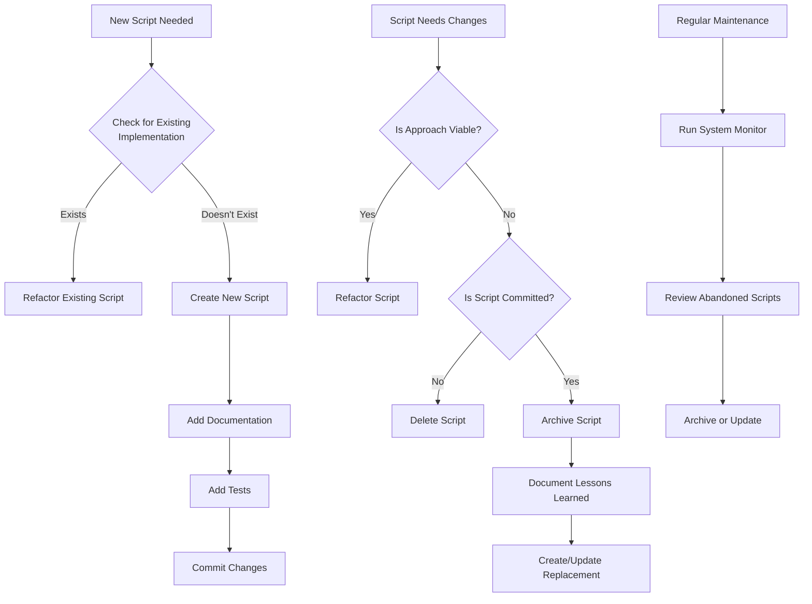

# Script Management Best Practices

## Overview

This document outlines the standardized practices for managing scripts within the EGOS ecosystem. Following these guidelines ensures a clean, maintainable codebase with clear documentation and prevents script duplication and abandonment.

## Core Principles

1. **Single Source of Truth**: Each functionality should have exactly one implementation.
2. **Clean Repository**: Avoid abandoned or obsolete scripts in active directories.
3. **Clear Documentation**: All scripts must have clear purpose, usage, and status documentation.
4. **Conscious Modularity**: Scripts should follow a single responsibility principle.
5. **Evolutionary Preservation**: Preserve valuable code while allowing for evolution.

## Guidelines for Script Development

### Iterative Development

1. **Refactor, Don't Duplicate**:
   - When a script requires significant rework, don't create a new file.
   - Instead, refactor the existing file with clear commit messages.
   - Use version control features (branches) for experimental changes.

2. **Proper Testing**:
   - Create comprehensive test cases in a dedicated `tests` directory.
   - Use pytest or unittest for structured testing.
   - Test all new functionality before committing.

3. **Documentation Requirements**:
   - All scripts must include a header comment with:
     ```python
     #!/usr/bin/env python3
     # -*- coding: utf-8 -*-
     """
     EGOS [Component Name] - [Script Purpose]

     [Detailed description of what the script does]

     STATUS: [Active|Deprecated|Experimental]

     @references: 
     <!-- @references: -->
     - .windsurfrules
     - CODE_OF_CONDUCT.md
     - MQP.md
     - README.md
     - ROADMAP.md
     - CROSSREF_STANDARD.md

@references(level=1):
  - WORK_2025_05_21.md
  - docs/01_subsystems/component_centralization/index.md
  - scripts/system_monitor/egos_system_monitor.py


  - docs/processes/script_management/script_management_best_practices.md

     Author: EGOS Development Team
     Created: [YYYY-MM-DD]
     Version: [X.Y.Z]
     """
     ```

### Handling Failed Attempts

If a script approach is determined to be unviable, follow one of these approaches:

1. **Delete Uncommitted Files**:
   - If the file is not yet committed/shared, delete it.

2. **Archive with Documentation**:
   - Move to an archive directory with clear documentation of lessons learned.
   - Add a prefix indicating status (e.g., `deprecated_`, `obsolete_`).
   - Document why it was archived and what replaced it.

3. **Refactor Existing File**:
   - Refactor the existing file to the new approach.
   - Clearly document the changes and reasoning.

## Archiving Process

1. **Directory Structure**:
   - Create an `/archive` directory within the relevant subsystem.
   - For nested directories, maintain the same structure within the archive.

2. **File Naming**:
   - Add a prefix indicating status:
     - `deprecated_`: Still functional but being phased out.
     - `obsolete_`: No longer functional or relevant.
     - `experimental_`: Experimental code that didn't work as expected.

3. **Documentation**:
   - Add a comment block at the top explaining:
     - Why it was archived
     - When it was archived
     - What replaced it (if applicable)
     - Lessons learned
     - Any valuable code snippets to preserve

4. **Cross-References**:
   - Update any documentation or cross-references to point to the new implementation.
   - Ensure the archived script references its replacement.

## Implementation in EGOS System Monitor

The EGOS System Monitor includes functionality to identify potentially abandoned or problematic scripts:

1. **Script Status Checks**:
   - Identifies scripts without proper documentation headers.
   - Flags scripts that haven't been modified in 90+ days.
   - Detects duplicate functionality across scripts.

2. **Health Report Metrics**:
   - Script management metrics are included in system health reports.
   - Provides recommendations for scripts that need attention.

3. **Regular Cleanup**:
   - Schedule regular cleanup sprints to address technical debt.
   - Document all cleanup activities in the system health report.

## Example: Archiving a Script

### Before Archiving

```
/scripts/system_monitor/test_time_filtering.py
```

### After Archiving

```
/scripts/system_monitor/archive/deprecated_test_time_filtering.py
```

With updated header documentation:

```python
#!/usr/bin/env python3
"""
EGOS System Monitor - Time Filtering Test Script [DEPRECATED]

This script was intended to create test files with varying modification times and test
the EGOS System Monitor's ability to correctly filter files based on time thresholds.

STATUS: DEPRECATED - This script has been archived due to implementation issues.
REASON FOR ARCHIVAL: The script had issues with command-line argument handling and
incomplete error handling. Instead of creating a new script, future testing should be
integrated directly into the System Monitor's test suite following EGOS Script Management
Best Practices.

LESSONS LEARNED:
1. Test scripts should be integrated into a proper test framework
2. Error handling should be more robust
3. Command-line argument parsing should be thoroughly tested

REPLACED BY: Future testing functionality will be integrated directly into
the System Monitor's test suite using pytest.

@references: C:\EGOS\scripts\system_monitor\egos_system_monitor.py, C:\EGOS\ROADMAP.md
"""
```

## Integration with Component Centralization System

The Script Management Best Practices work in conjunction with the [Component Centralization System](../../01_subsystems/component_centralization/index.md) to prevent duplication:

1. **Pre-Creation Verification**:
   - Before creating a new script, use the verification tool to check for duplication.
   - Document verification steps taken when proposing new scripts.

2. **Central Index Manifest**:
   - Update the manifest after creating new scripts.
   - Reference the centralization system in PR descriptions.

## Mermaid Diagram: Script Lifecycle



## References

- [EGOS ROADMAP.md](../../../ROADMAP.md)
- [WORK_2025_05_21.md](../../../WORK_2025_05_21.md)
- [Component Centralization System](../../01_subsystems/component_centralization/index.md)
- [EGOS System Monitor](../../../scripts/system_monitor/egos_system_monitor.py)