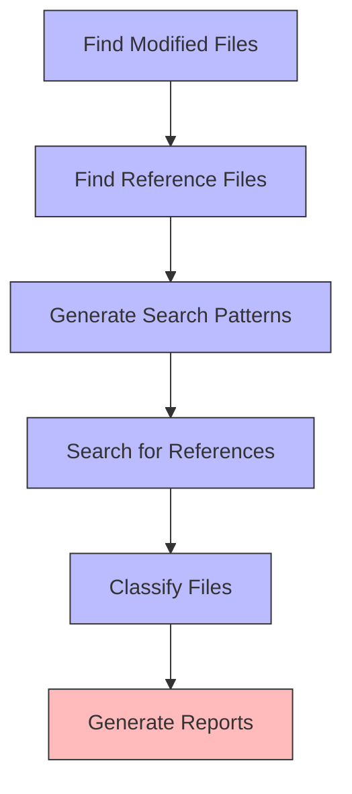

@references:
- .windsurfrules
- CODE_OF_CONDUCT.md
- MQP.md
- README.md
- ROADMAP.md
- CROSSREF_STANDARD.md

@references(level=1):
  - docs/governance/cross_reference_priority_list.md
  - docs/governance/development_standards.md
  - docs/governance/documentation_health_analysis.md
  - docs/governance/file_lifecycle_management.md
  - scripts/cross_reference/documentation_reference_manager.py
  - scripts/cross_reference/recent_files_verifier.py


  - docs/standards/file_reference_checker.md

## Cross References

- [EGOS ROADMAP](../../ROADMAP.md)
- [Development Standards](../governance/development_standards.md)
- [File Lifecycle Management](../governance/file_lifecycle_management.md)
- [Cross-Reference Priority List](../governance/cross_reference_priority_list.md)
- [Documentation Health Analysis](../governance/documentation_health_analysis.md)
- [Recent Files Verifier](../../scripts/cross_reference/recent_files_verifier.py)

# File Reference Checker

The File Reference Checker is a powerful tool designed to identify files that have been modified recently but lack proper cross-references in other files. It helps maintain the integrity of the EGOS documentation system by ensuring all files are properly interconnected.

## Overview

The tool scans the repository for files modified within a specified time window (default: 48 hours) and checks if these files are referenced in other files. It generates detailed reports in both JSON and Markdown formats, highlighting undocumented files that require attention.



## Installation

The File Reference Checker is included in the EGOS repository and requires no additional installation. It depends only on standard Python libraries.

## Usage

### Command Line Interface

```bash
python scripts/cross_reference/file_reference_checker.py [options]
```

#### Options

| Option | Description |
|--------|-------------|
| `--repo-path`, `-r` | Path to the repository (default: current directory) |
| `--since`, `-s` | Time window (e.g., '48h' for 48 hours, '7d' for 7 days) (default: 48h) |
| `--exclude-dir`, `-e` | Directory to exclude (can be specified multiple times) |
| `--include-ext`, `-i` | File extension to include (can be specified multiple times) |
| `--output-json`, `-j` | Path to save JSON report |
| `--output-md`, `-m` | Path to save Markdown report |
| `--agent-mode`, `-a` | Run in agent mode (print JSON to stdout) |

### Examples

Check files modified in the last 48 hours:
```bash
python scripts/cross_reference/file_reference_checker.py
```

Check files modified in the last 7 days, excluding the 'temp' directory:
```bash
python scripts/cross_reference/file_reference_checker.py --since 7d --exclude-dir temp
```

Check only Python and Markdown files:
```bash
python scripts/cross_reference/file_reference_checker.py --include-ext .py --include-ext .md
```

### Python API

The tool can also be used programmatically:

```python
from scripts.cross_reference.file_reference_checker import FileReferenceChecker

checker = FileReferenceChecker(
    repo_path="C:/EGOS",
    since="48h",
    exclude_dirs=["node_modules", ".git"],
    include_exts=[".py", ".md", ".yaml"]
)

report = checker.run()
```

## Configuration

The tool can be configured using the `config.yaml` file located in the `scripts/cross_reference` directory. The configuration includes:

- **monitored_extensions**: File extensions to monitor
- **excluded_dirs**: Directories to exclude from scanning
- **time_window_hours**: Default time window for modified files
- **output_dir**: Directory for reports
- **search_methods**: Methods for searching references
- **context_lines**: Number of context lines to include around matches
- **parallel_processes**: Number of parallel processes to use

## Report Format

### JSON Report

```json
[
  {
    "file": "modules/atlas_core/analyzer.py",
    "last_modified": "2025-05-17T22:43:00Z",
    "mentions": [
      {
        "in": "docs/architecture.md",
        "pattern": "analyzer.py",
        "context": "...analyzer.py processes..."
      }
    ],
    "status": "Documented"
  },
  {
    "file": "scripts/new_tool.js",
    "last_modified": "2025-05-18T02:15:00Z",
    "mentions": [],
    "status": "Undocumented"
  }
]
```

### Markdown Report

The Markdown report includes:

1. **Summary**: Overview of the check results
2. **Undocumented Files**: List of files that need attention
3. **Documented Files**: Details of properly referenced files

## Integration with Windsurf

The File Reference Checker can be integrated with Windsurf using the following rule in your Windsurf configuration:

```yaml
on_save:
  - path: "**/*"
    run: scripts/cross_reference/file_reference_checker.py --since 48h --agent-mode
```

## Performance Considerations

- The tool uses parallel processing to improve performance on large repositories
- Git is used for faster modification detection when available
- Files that can't be read (binary files, encoding issues) are automatically skipped
- Search patterns shorter than 3 characters are ignored to avoid false positives

## Troubleshooting

### Common Issues

1. **Slow Performance**: 
   - Reduce the time window using `--since`
   - Exclude more directories using `--exclude-dir`
   - Limit file types using `--include-ext`

2. **False Positives/Negatives**:
   - Adjust search methods in the configuration
   - Check for encoding issues in files

3. **Encoding Errors**:
   - Ensure all files use UTF-8 encoding

## Related Tools

- [Recent Files Verifier](../../scripts/cross_reference/recent_files_verifier.py): Similar tool focused on cross-reference verification
- [Documentation Reference Manager](../../scripts/cross_reference/documentation_reference_manager.py): Tool for managing cross-references

## Future Enhancements

1. **Fuzzy Matching**: Implement fuzzy matching for more flexible reference detection
2. **Automated Fixes**: Suggest or automatically add missing cross-references
3. **Integration with CI/CD**: Run as part of continuous integration
4. **Web Dashboard**: Visual representation of cross-reference status

## Contributing

Contributions to the File Reference Checker are welcome. Please follow the standard EGOS development process:

1. Create a feature branch
2. Make your changes
3. Add tests
4. Submit a pull request

## License

The File Reference Checker is part of the EGOS project and is subject to the same license terms.