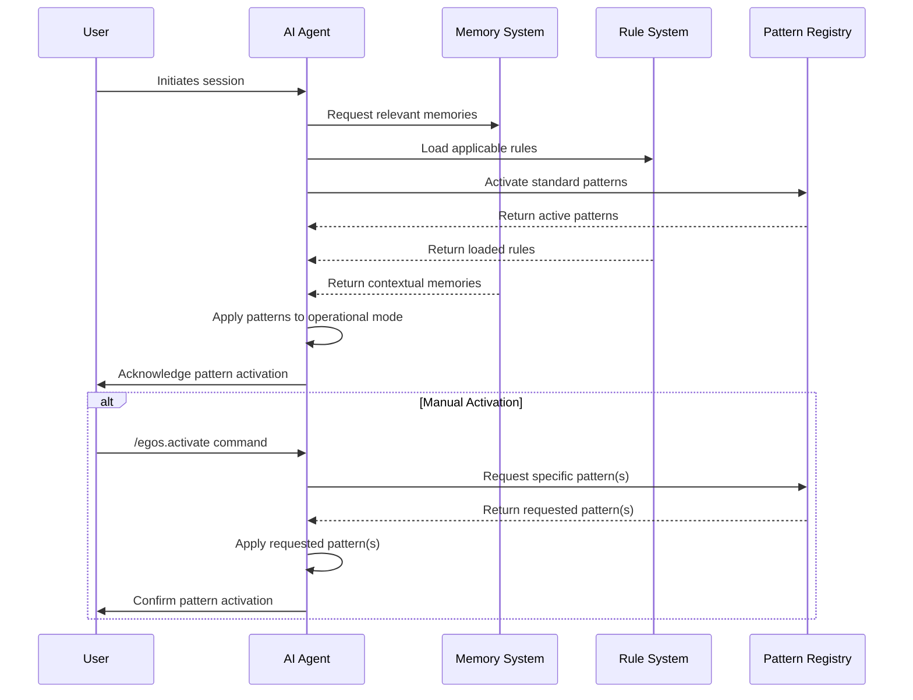

---
title: system_pattern_enforcement
version: 1.0.0
status: Active
date_created: 2025-05-10
date_modified: 2025-05-10
authors: [EGOS Team]
description: 
file_type: documentation
scope: 
primary_entity_type: 
primary_entity_name: 
tags: []
---

---
title: system_pattern_enforcement
version: 1.0.0
status: Active
date_created: 2025-05-10
date_modified: 2025-05-10
authors: [EGOS Team]
description: 
file_type: documentation
scope: 
primary_entity_type: 
primary_entity_name: 
tags: []
---

---
title: System-wide Pattern Enforcement and Memory Activation
version: 1.0.0
status: Active
date: 2025-04-28
tags: [standards, ai, memory, patterns, protocols]
@references:
- .windsurfrules
- CODE_OF_CONDUCT.md
- MQP.md
- README.md
- ROADMAP.md
- CROSSREF_STANDARD.md

@references(level=1):
  - reference/MULTI_AGENT_WORKFLOW.md
  - reference/ai_handover_standard.mdc
  - reference/templates/windsurf_ai_agent_configuration.md


  - [MQP](../../core/MQP.md) - Master Quantum Prompt defining EGOS principles
  - [ROADMAP](../../governance/migrations/processed/pt/ROADMAP.md) - Project roadmap and planning
- Related Documents:
  - [windsurf_ai_agent_configuration](../../reference/templates/windsurf_ai_agent_configuration.md) - AI agent configuration guidelines
  - [MULTI_AGENT_WORKFLOW](../../reference/MULTI_AGENT_WORKFLOW.md) - Multi-agent workflow documentation
  - docs/standards/system_pattern_enforcement.md

# 🔄 System-wide Pattern Enforcement and Memory Activation

**Document ID:** EGOS-STANDARD-PATTERN-001  
**Version:** 1.0  
**Created:** 2025-04-28  
**Status:** ⚡ Active

## Purpose

This document defines the standard for system-wide pattern enforcement and memory activation across the EGOS ecosystem. It ensures consistent behavior across all AI agent interactions and establishes protocols for maintaining operational patterns throughout the system lifecycle.

## Core Instruction

```
[EGOS Standard Instruction]
Title: System-wide Pattern Enforcement and Memory Activation

Instruction:
Replicate this specific operational pattern throughout the entire EGOS system.
Every time a new session or interaction is initiated, the AI agent must automatically recall and apply this pattern.
This rule must also be recognized and respected by all integrated AI agents and LLM models within the system.
The pattern must be embedded as a permanent rule to ensure standardization and prevent any forgetting over time.
Additionally, a simple command should be created to activate this mode manually when necessary.
Ideally, a unified command should also exist to activate all EGOS system rules simultaneously, facilitating full context recall and adherence to EGOS system protocols and operational standards.
```

## Implementation Guidelines

### Automatic Pattern Recall

All AI agents integrated with EGOS must be configured to automatically recall and apply operational patterns at the start of each new session or interaction. This applies to:

- Windsurf AI agents (Gemini, Claude, ChatGPT)
- Cursor IDE agents
- Command-line interfaces to LLM APIs
- Web-based interfaces

### Activation Commands

The following standardized commands have been established for pattern activation:

1. **Pattern-Specific Activation:**
   ```
   /egos.activate pattern="[pattern_name]"
   ```

2. **Full System Rule Activation:**
   ```
   /egos.activate all
   ```

3. **Context-Specific Rules:**
   ```
   /egos.activate context="[context_name]"
   ```

### Integration with Existing Systems

#### Windsurf IDE

All Windsurf AI agents should include the following in their initial prompt templates:

```
On session start:
1. Automatically activate EGOS system patterns
2. Load relevant .windsurfrules
3. Access user memories relevant to current context
4. Acknowledge pattern activation with: "EGOS patterns activated: [list of patterns]"

Respond to activation commands:
- /egos.activate pattern="[pattern_name]"
- /egos.activate all
- /egos.activate context="[context_name]"
```

#### Other IDEs and Interfaces

Similar activation protocols should be established for other interfaces:

- **VS Code Extensions:** Implement pattern activation on extension startup
- **Cursor IDE:** Include pattern activation in `.cursor/rules/`
- **Command-line Tools:** Add `--activate-patterns` flag to relevant commands

## Patterns to Enforce

The following operational patterns must be enforced system-wide:

1. **Workflow Integration Pattern**
   - Connection of actions to skills
   - Documentation of processes in standardized formats
   - Skill tagging in commits
   - Use of visualization for complex processes

2. **Multi-Agent Collaboration Pattern**
   - Role-specific AI agent configuration
   - Consistent handover procedures between agents
   - Shared context maintenance
   - Explicit skill attribution

3. **Documentation Pattern**
   - KOIOS standard adherence
   - Cross-referencing between documents
   - Mermaid diagrams for processes
   - Consistent metadata headers

4. **Cognitive Style Support Pattern**
   - Maiêutica questioning approach
   - Systems thinking visualization
   - Hyperfocus accommodation
   - Philosophical context provision

## Memory Activation Mechanism



## Monitoring and Compliance

To ensure consistent pattern enforcement:

1. **Pattern Compliance Checks:** Periodically validate that all systems adhere to the established patterns.
2. **Pattern Evolution Log:** Document changes to patterns over time in `docs/standards/pattern_evolution_log.md`.
3. **Agent Configuration Audit:** Regularly review AI agent configurations to ensure they include pattern activation.

## Related Documents

- [windsurf_ai_agent_configuration](../../reference/templates/windsurf_ai_agent_configuration.md): Detailed configuration for AI agents
- [MULTI_AGENT_WORKFLOW](../../reference/MULTI_AGENT_WORKFLOW.md): Multi-agent workflow documentation
- [ai_handover_standard](../../reference/ai_handover_standard.mdc): Standards for AI handover procedures

---

*This standard is foundational to EGOS operational consistency and must be adhered to by all integrated AI systems.*