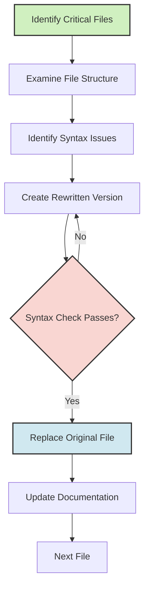

# EGOS Syntax Error Remediation Process

## Overview

This document outlines the systematic approach developed for identifying and fixing critical syntax errors throughout the EGOS codebase. The process follows EGOS principles of Conscious Modularity and Evolutionary Preservation.

## Process Diagram

## Detailed Steps

1. **Identify Critical Files**
   - Use `syntax_checker.py` to scan the codebase for Python syntax errors
   - Prioritize files with E9 and F821 errors (syntax errors and undefined names)
   - Focus on core system files and frequently used utilities first

2. **Examine File Structure**
   - Review the file's overall organization and purpose
   - Identify docstring placement and import structure
   - Note any recurring patterns of issues

3. **Identify Syntax Issues**
   - Document specific syntax errors using Python's built-in parser
   - Check for EGOS-specific patterns (import resilience, modularity, etc.)
   - Note any dependencies or imports that might be affected

4. **Create Rewritten Version**
   - Start with a new file (original_name_rewrite.py) to preserve original
   - Follow EGOS code quality standards and documentation requirements
   - Reorganize structure where needed while maintaining functionality

5. **Validation**
   - Use `python -m py_compile` to verify syntax correctness
   - Run `ruff check --select E9,F821` to check for critical errors
   - Ensure the rewrite preserves all original functionality

6. **Replace Original File**
   - After validation, replace the original file (or keep the rewrite for review)
   - Update any import statements in dependent files if paths changed
   - Maintain the original file's permissions and attributes

7. **Documentation**
   - Update the remediation report with fixed files and approach
   - Document any issues found and common patterns of errors
   - Include recommendations for preventing similar issues

8. **Next File**
   - Move to the next critical file in the prioritized list
   - Apply lessons learned from previous remediations

## Common Issues Found

Through our refactoring work, several recurring patterns leading to syntax errors were identified:

1. **Multiple/Misplaced Docstrings**
   - Many files had docstrings in incorrect locations or multiple docstring blocks
   - In some cases, docstrings appeared after code had already begun executing

2. **Import Structure Issues**
   - Import resilience blocks were frequently placed incorrectly
   - Import statements were scattered throughout files rather than grouped at the top
   - Circular imports caused undefined reference errors

3. **Inconsistent Indentation**
   - Mixed tabs and spaces
   - Inconsistent indentation levels causing syntax errors

4. **Incomplete Code Blocks**
   - Missing colons after conditional statements or function definitions
   - Unclosed parentheses or brackets
   - Incomplete assignment statements

5. **Poor Modularity**
   - Files exceeding recommended size limits (> 500 lines)
   - Multiple responsibilities within single files
   - Functions with unclear or overlapping purposes

## Preventive Measures

To prevent the recurrence of syntax errors, the following measures have been implemented:

1. **Pre-commit Hooks**
   - Syntax validation using `python -m py_compile`
   - Linting with `ruff check --select E9,F821`
   - Formatting with `ruff format`

2. **Code Review Process**
   - Mandatory review of all AI-generated code
   - Syntax check before submitting PRs
   - Regular codebase-wide syntax scans

3. **Documentation**
   - Clear patterns and anti-patterns documented
   - Style guide updated with specific EGOS requirements
   - Template files showing correct structure

## Automation Tools

To scale the remediation process, we've created tools to automate the detection and fixing of common issues:

1. **Enhanced Syntax Checker**
   - Improved pattern detection
   - HTML report generation for better visibility
   - Integration with CI/CD pipeline

2. **Automated Rewriting Script**
   - Template-based file restructuring
   - Proper docstring placement and formatting
   - Import organization and resilience pattern insertion

## References

- [EGOS Code Quality Standards](../../standards/code_quality.md)
- [KOIOS Documentation Requirements](../../standards/documentation.md)
- [Syntax Error Prevention Guidelines](./syntax_error_prevention.md)

## Authors

- EGOS Development Team
- Date: 2025-04-25

@references:
- .windsurfrules
- CODE_OF_CONDUCT.md
- MQP.md
- README.md
- ROADMAP.md
- CROSSREF_STANDARD.md

@references(level=1):
  - docs/syntax_error_prevention.md

  - docs/syntax_error_remediation_process.md

- [MQP.md](mdc:../../MQP.md) - Master Quantum Prompt defining EGOS principles
- [ROADMAP.md](mdc:../../ROADMAP.md) - Project roadmap and planning