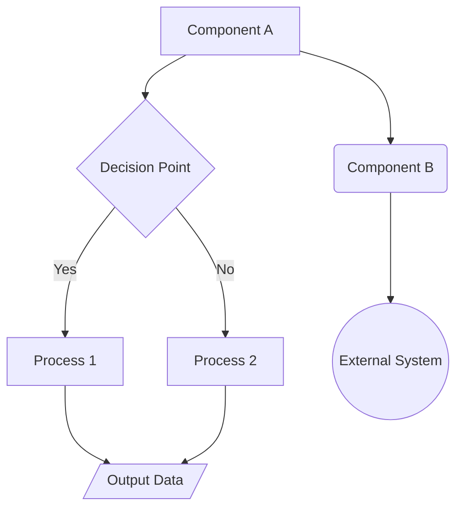

---
title: architecture_document_template
version: 1.0.0
status: Active
date_created: 2025-05-10
date_modified: 2025-05-10
authors: [EGOS Team]
description: 
file_type: documentation
scope: 
primary_entity_type: 
primary_entity_name: 
tags: []
---

---
title: architecture_document_template
version: 1.0.0
status: Active
date_created: 2025-05-10
date_modified: 2025-05-10
authors: [EGOS Team]
description: 
file_type: documentation
scope: 
primary_entity_type: 
primary_entity_name: 
tags: []
---

@references:
- .windsurfrules
- CODE_OF_CONDUCT.md
- MQP.md
- README.md
- ROADMAP.md
- CROSSREF_STANDARD.md

  - [ROADMAP](../../governance/migrations/processed/pt/ROADMAP.md) - Project roadmap and planning
  - [MQP](../../core/MQP.md) - Master Quantum Prompt defining EGOS principles
- Other:
  - [MQP](../../core/MQP.md)
  - docs/templates/reference_templates/architecture_document_template.md


---
metadata:
  author: "[Your Name/Team or EGOS AI Assistant]"
  backup_required: true
  category: ARCHITECTURE_DOCUMENTATION
  description: "High-level architecture design for the [System/Subsystem Name]."
  documentation_quality: 0.1 # Initial draft quality
  encoding: utf-8
  ethical_validation: false
  last_updated: 'YYYY-MM-DD'
  related_files:
    - reference\MQP.md
    - ROADMAP.md
    - subsystems/[SUBSYSTEM_NAME]/README.md # Link to the relevant subsystem README
    # Add links to related API docs, specific component designs, etc.
  required: false # Required only for significant systems/subsystems
  review_status: draft # draft | under_review | approved
  security_level: 0.6 # Architecture details might be more sensitive
  subsystem: "[PARENT_SUBSYSTEM_NAME_UPPERCASE]" # Or 'SYSTEM_WIDE' if applicable
  type: documentation
  version: '0.1.0' # Initial version
  windows_compatibility: true
---

# Architecture Design: [System/Subsystem Name]

**Version:** [Version from metadata]
**Status:** [Design Status: e.g., Proposed, Draft, Approved, Implemented]

## 1. Introduction & Goals

*   **Purpose:** Briefly explain the purpose of this system/subsystem and the scope of this architecture document.
*   **Goals:** What are the primary technical and functional goals this architecture aims to achieve? (e.g., scalability, modularity, specific performance targets, security requirements).
*   **Non-Goals:** What is explicitly out of scope for this system/subsystem or this specific design?

## 2. High-Level Overview

[Provide a conceptual overview of the system/subsystem. A simple block diagram (Mermaid `graph TD` or `graph LR`) can be very effective here to show the main parts and their general relationships.]



*   **Key Principles:** Are there any overarching design principles followed (e.g., event-driven, microservices, layered architecture, domain-driven design)?

## 3. Component Breakdown

[Detail the major components identified in the overview. For each component:]

*   **`ComponentName`:**
    *   **Responsibility:** What is the single primary responsibility of this component?
    *   **Interfaces:** What are its key public interfaces (APIs, message queues it listens to/publishes on, classes/functions)?
    *   **Dependencies:** What other components or external systems does it rely on?
    *   **(Optional) Key Logic:** Briefly describe any particularly important internal logic or algorithms.

## 4. Data Models & Storage

*   **Key Data Structures:** Describe the main data entities or models used within the system/subsystem. Pydantic models or similar definitions are preferred.
    ```python
    # Example Pydantic Model
    from pydantic import BaseModel
    from typing import List

    class UserData(BaseModel):
        user_id: str
        email: str
        preferences: List[str] = []
    ```
*   **Data Storage:** Where and how is persistent data stored (e.g., PostgreSQL database, Redis cache, file system, NoSQL DB)? Briefly describe the schema or storage strategy if relevant.
*   **Data Flow:** How does data move between components and storage? (A Mermaid sequence or flow diagram can be useful here).

## 5. Interaction Patterns & Communication

*   **Communication Style:** How do components communicate (e.g., synchronous API calls, asynchronous messaging via Mycelium, shared database)?
*   **Key Interaction Flows:** Describe 2-3 critical interaction sequences between components. Mermaid `sequenceDiagram`s are highly recommended.

    ```mermaid
    sequenceDiagram
        participant User
        participant ServiceA
        participant ServiceB
        participant Database

        User->>ServiceA: Request Action(Data)
        ServiceA->>ServiceB: Process Subtask(Data)
        ServiceB->>Database: Read/Write Data
        Database-->>ServiceB: Data/Confirmation
        ServiceB-->>ServiceA: Subtask Result
        ServiceA->>Database: Log Action
        ServiceA-->>User: Final Response
    ```
*   **API Contracts:** Reference the relevant API documentation (e.g., `subsystems/SUBSYSTEM/docs/API.md` or OpenAPI specifications).

## 6. Security Considerations

*   **Authentication/Authorization:** How is access controlled?
*   **Data Security:** How is data protected (encryption at rest/transit, input validation, output sanitization)? Reference ETHIK integration.
*   **Secrets Management:** How are API keys, passwords, etc., handled?
*   **Threat Model (Optional):** Briefly outline potential threats and mitigations.

## 7. Deployment & Scalability (Optional)

*   **Deployment Strategy:** How is this system/subsystem deployed (e.g., Docker containers, serverless functions)?
*   **Scalability:** How is the system designed to handle increased load?

## 8. Design Decisions & Alternatives Considered (Optional)

*   **Key Decisions:** Document significant design choices made.
*   **Alternatives:** Briefly mention alternative approaches considered and why they were not chosen.

## 9. Open Questions & Future Considerations

*   List any unresolved design questions.
*   Mention potential future enhancements or refactoring ideas.

---
✧༺❀༻∞ EGOS ∞༺❀༻✧