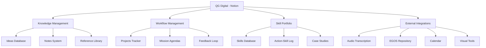
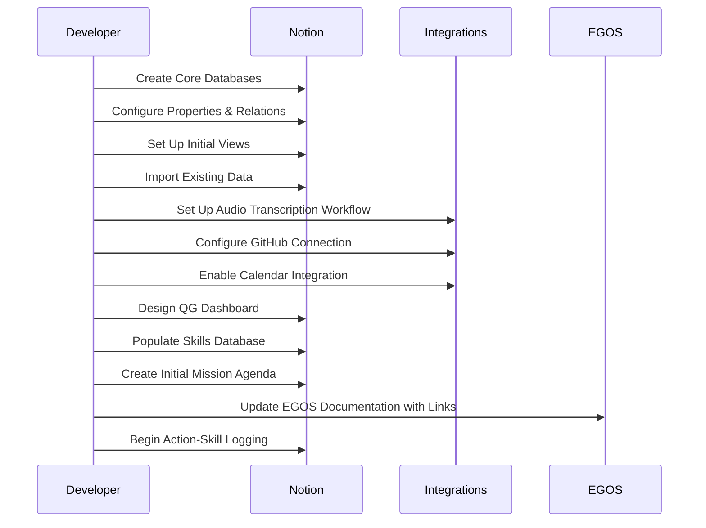

---
title: notion_qg_digital_structure
version: 1.0.0
status: Active
date_created: 2025-05-10
date_modified: 2025-05-10
authors: [EGOS Team]
description: 
file_type: documentation
scope: 
primary_entity_type: 
primary_entity_name: 
tags: []
---

---
title: notion_qg_digital_structure
version: 1.0.0
status: Active
date_created: 2025-05-10
date_modified: 2025-05-10
authors: [EGOS Team]
description: 
file_type: documentation
scope: 
primary_entity_type: 
primary_entity_name: 
tags: []
---

---
title: Notion QG Digital Structure Design
version: 1.0.0
status: Active
date: 2025-04-28
tags: [notion, workflow, organization, second-brain]
@references:
- .windsurfrules
- CODE_OF_CONDUCT.md
- MQP.md
- README.md
- ROADMAP.md
- CROSSREF_STANDARD.md

@references(level=1):
  - docs/templates/reference_templates/action_skill_log_template.md

  - [MQP](../../core/MQP.md) - Master Quantum Prompt defining EGOS principles
  - [ROADMAP](../../governance/migrations/processed/pt/ROADMAP.md) - Project roadmap and planning
- Related Documents:
  - [action_skill_log_template](action_skill_log_template.md) - Template for logging skills
  - [ROADMAP](../../governance/migrations/processed/pt/ROADMAP.md) - Strategic planning and workflow integration
  - docs/templates/reference_templates/notion_qg_digital_structure.md

# 🧠 Notion QG Digital Structure Design

**Document ID:** EGOS-STRAT-NOTION-001  
**Version:** 1.0  
**Created:** 2025-04-28  
**Status:** ⚡ Active

## Purpose

This document outlines the recommended structure for implementing a "QG Digital" (Digital Headquarters) in Notion, serving as an integrated knowledge management system and workflow hub. This design specifically addresses the needs identified in the cognitive profile analysis, supporting hyperfocus work patterns while ensuring organization, skill tracking, and integration with the EGOS ecosystem.

## System Architecture Overview

## Core Databases & Their Structure

### 1. Ideas Database

**Purpose:** Capture and develop emerging thoughts and concepts.

**Key Properties:**
- `Title`: Name of the idea
- `Status`: (Seed, Sprouting, Growing, Harvested, Composted)
- `Domain`: Area of focus (Tech, Philosophy, Education, etc.)
- `Related Skills`: Relation to Skills database
- `Energy Required`: Estimation of effort (Low, Medium, High)
- `Priority`: (Low, Medium, High, Critical)
- `Integration Point`: How it connects to EGOS or other projects
- `Related Ideas`: Relation to other ideas

**Views:**
- **Gallery View**: Visual cards of ideas by status
- **Table View**: Complete details for analysis
- **Kanban Board**: Ideas by development status
- **Calendar**: Timeline view of idea development

### 2. Projects Database

**Purpose:** Track and manage active and planned projects, with special attention to EGOS components.

**Key Properties:**
- `Name`: Project name
- `Status`: (Planning, In Progress, Paused, Completed)
- `Category`: Type of project (EGOS, Education, Research, etc.)
- `Subsystem`: If EGOS-related, which subsystem (ETHIK, KOIOS, etc.)
- `Start Date`: When work began
- `Target Date`: Anticipated completion
- `Skills Applied`: Relation to Skills database
- `Priority`: (Low, Medium, High, Critical)
- `Related Ideas`: Relation to Ideas database
- `Key Tasks`: Checkbox list of major components
- `Documentation`: Links to related documentation
- `GitHub Link`: Direct link to repository if applicable

**Views:**
- **Kanban Board**: Projects by status
- **Timeline**: Gantt-chart style view of project durations
- **EGOS Focus**: Filtered view of only EGOS-related projects
- **Matrix**: Priority vs. Energy required

### 3. Skills Database

**Purpose:** Catalog skills being developed and demonstrated, with tracking of growth over time.

**Key Properties:**
- `Skill Name`: Specific capability
- `Category`: (Cognitive, Technical, Domain-Specific, Meta-Work)
- `Growth Stage`: (Awareness, Learning, Practicing, Mastery, Teaching)
- `EGOS Relevance`: How it relates to EGOS development
- `Evidence`: Links to demonstrations of this skill (commits, documents)
- `Portfolio Pieces`: Links to case studies showcasing this skill
- `Growth Plan`: Notes on how to develop this skill further
- `Related Skills`: Relation to other skills

**Views:**
- **Skills Map**: Mind map visualization of skill relationships
- **Growth Board**: Kanban by development stage
- **Category Matrix**: Table grouped by skill category
- **Portfolio Generator**: Skills with sufficient evidence for showcasing

### 4. Action-Skill Log

**Purpose:** Daily/weekly tracking of activities linked to skills, implementing the Action-Skill Log template.

**Key Properties:**
- `Date`: When the activity occurred
- `Activity`: Brief description of what was done
- `Project`: Relation to Projects database
- `Context`: Where the activity took place
- `Primary Skills`: Relation to Skills database (multiple)
- `Secondary Skills`: Relation to Skills database (multiple)
- `Evidence`: Links to outputs (commits, documents, etc.)
- `Reflection`: Brief metacognitive notes
- `Follow-up`: Any action items generated

**Views:**
- **Timeline**: Chronological journal of activities
- **Skill Focus**: Grouped by primary skill demonstrated
- **Project Journey**: Grouped by related project
- **Weekly Summary**: Rolled-up view of skills demonstrated per week

### 5. Resources Database

**Purpose:** Manage learning resources, references, and materials.

**Key Properties:**
- `Title`: Name of the resource
- `Type`: (Article, Book, Video, Course, Paper, Tool)
- `Status`: (To Explore, In Progress, Completed, Reference)
- `URL`: Link to the resource
- `Related Skills`: Skills this resource helps develop
- `Related Projects`: Projects this resource supports
- `Notes`: Key takeaways or information
- `Rating`: Personal assessment of value (1-5)

**Views:**
- **Learning Queue**: Resources to explore next
- **Library**: Complete catalog of resources
- **Skill Builder**: Resources grouped by related skill

## Specialized Views & Features

### 1. Mission Agenda Framework

A specialized database that implements the "Mission Agenda" concept - a flexible planning approach that supports hyperfocus work patterns.

**Key Properties:**
- `Mission`: Specific objective with clear completion criteria
- `Time Horizon`: When this should be completed
- `Context`: Background information and purpose
- `Energy Type`: What kind of energy is required (Creative, Analytical, Administrative)
- `Deep Work`: Does this require hyperfocus?
- `Related Project`: Connection to Projects database
- `Priority`: (Low, Medium, High, Critical)
- `Status`: (Queued, Active, Paused, Completed)

**How it differs from conventional task tracking:**
- Focuses on missions rather than tasks
- Incorporates energy type and deep work considerations
- Groups related activities based on cognitive context
- Allows for hyperfocus periods with minimal switching

### 2. QG Dashboard

A consolidated mission control center that provides a comprehensive view of the entire system.

**Components:**
- **Daily Briefing**: Current priorities and context
- **Skills in Focus**: Currently developing skills
- **Active Missions**: Current hyperfocus areas
- **Project Status**: Overview of all active projects
- **Idea Incubator**: High-potential ideas to explore
- **Learning Queue**: Resources to engage with next
- **Weekly Reflection**: Structured review prompt

### 3. Skill Portfolio Generator

A specialized view that assembles evidence of skills into presentable formats for external demonstration.

**Features:**
- Automatically compiles evidence for each skill
- Generates summary statistics (e.g., "37 commits demonstrating Systems Thinking")
- Creates exportable skill profiles with evidence links
- Identifies gaps in skill documentation

## Integration Strategies

### 1. Audio Note Integration

**Workflow:**
1. Record audio notes using a preferred mobile app (e.g., Otter.ai)
2. App auto-transcribes content
3. Automation platform (e.g., Make.com) monitors for new transcriptions
4. Transcribed content is sent to Notion "Incoming Notes" database
5. Daily processing of notes into appropriate databases

**Technical Components Needed:**
- Transcription app with API or export capabilities
- Integration platform (Make.com, n8n, Zapier)
- Notion API integration
- Processing templates

### 2. EGOS Repository Connection

**Options:**
1. **GitHub Integration**: Use GitHub + Notion integration to sync issues and milestones
2. **API-Based Sync**: Custom script that pulls EGOS repo information into Notion
3. **Manual Link System**: Consistent linking convention between Notion and GitHub

**Key Information to Sync:**
- Current roadmap status
- Active issues and their progress
- Recent commits with skill tags
- Documentation updates

### 3. Calendar Integration

**Purpose:** Create a harmonized time management approach that respects hyperfocus work patterns.

**Implementation:**
- Two-way sync between Notion and Google Calendar
- Time blocking for deep work (hyperfocus) sessions
- Project milestone visualization
- Integration with Mission Agenda Framework

### 4. Visual Thinking Tools Connection

**Purpose:** Support visualization needs for complex systems thinking.

**Options:**
- Embed Miro/Excalidraw boards directly in Notion
- Create consistent linking patterns
- Export visualizations for inclusion in documentation

## Setup Process

## Usage Examples

### Capturing Ideas During Hyperfocus

1. Enter hyperfocus state working on EGOS ETHIK module
2. New idea emerges about validator architecture
3. Quick capture in Ideas database without breaking flow
4. Later triage determines it's a "Growing" idea with high potential
5. Add connections to Skills (Systems Thinking, Architecture)
6. Schedule time to develop in next Mission Agenda

### Tracking Skill Development

1. Complete significant refactoring of NEXUS module
2. Log in Action-Skill Log with specific skills demonstrated
3. Add Git commit as evidence with skill tags
4. Note progress in Skills database, updating growth stage
5. If substantial achievement, create Case Study
6. Dashboard shows progress in related skills

### Planning with Mission Agenda

1. Review current priorities from Projects database
2. Identify next deep work focus area
3. Create Mission Agenda items grouped by cognitive context
4. Block time in Calendar for hyperfocus sessions
5. Execute missions, logging skill applications
6. Review and reflect on completion

## Maintenance & Evolution

- **Weekly Review**: Process all captures, update statuses, reflect on skill development
- **Monthly Audit**: Ensure all databases remain clean and properly linked
- **Quarterly Evolution**: Assess if structure meets current needs, adapt as necessary

---

*This structure is designed to be implemented incrementally. Start with the core databases and basic views, then add complexity and integrations as the system proves valuable.*