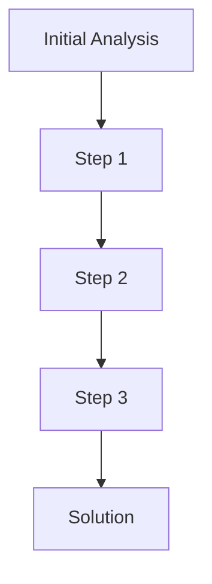
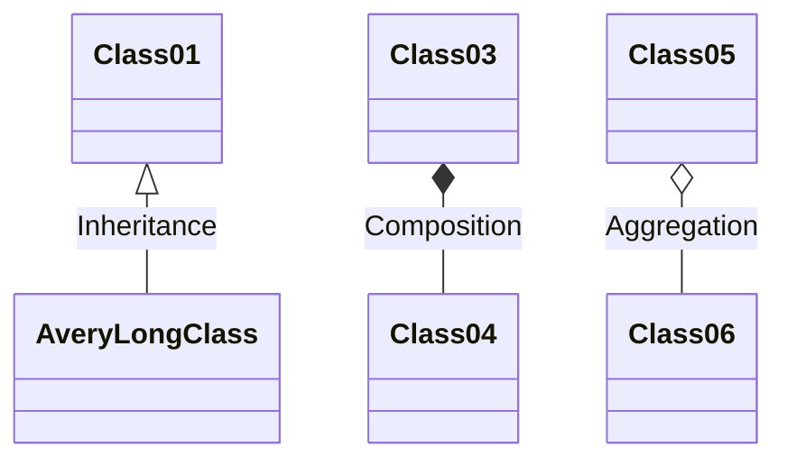

---
title: skill_demonstration_case_study
version: 1.0.0
status: Active
date_created: 2025-05-10
date_modified: 2025-05-10
authors: [EGOS Team]
description: 
file_type: documentation
scope: 
primary_entity_type: 
primary_entity_name: 
tags: []
---

---
title: skill_demonstration_case_study
version: 1.0.0
status: Active
date_created: 2025-05-10
date_modified: 2025-05-10
authors: [EGOS Team]
description: 
file_type: documentation
scope: 
primary_entity_type: 
primary_entity_name: 
tags: []
---

---
title: Skill Demonstration Case Study Template
version: 1.0.0
status: Active
date: 2025-04-28
tags: [documentation, skills, portfolio, demonstration]
@references:
- .windsurfrules
- CODE_OF_CONDUCT.md
- MQP.md
- README.md
- ROADMAP.md
- CROSSREF_STANDARD.md

@references(level=1):
  - docs/templates/reference_templates/action_skill_log_template.md


  - [MQP](../../core/MQP.md) - Master Quantum Prompt defining EGOS principles
  - [ROADMAP](../../governance/migrations/processed/pt/ROADMAP.md) - Project roadmap and planning
- Related Documents:
  - [action_skill_log_template](action_skill_log_template.md) - Template for logging skills
  - [ROADMAP](../../governance/migrations/processed/pt/ROADMAP.md) - Strategic planning and workflow integration
  - docs/templates/reference_templates/skill_demonstration_case_study.md

# 🔍 Skill Demonstration Case Study Template

**Document ID:** EGOS-STRAT-CASE-001  
**Version:** 1.0  
**Created:** 2025-04-28  
**Status:** ⚡ Active

## Purpose

This template provides a structured format for documenting specific project challenges or accomplishments as case studies that demonstrate key skills. These case studies serve as portfolio pieces that externalize your capabilities in a concrete, evidence-based manner.

## Case Study Structure

```markdown
# Case Study: [Descriptive Title]

**Date Range:** [Start Date] - [End Date]  
**Related To:** [Project/System/Component]  
**Primary Skills:** [List 3-5 key skills demonstrated]

## Challenge Overview

[1-2 paragraphs describing the problem/challenge that needed to be solved]

## Context & Constraints

- **Initial State:** [Description of the situation before work began]
- **Requirements/Goals:** [What needed to be accomplished]
- **Constraints:** [Time limitations, technical constraints, etc.]
- **Stakeholders:** [Who was impacted by or interested in this work]

## Approach & Process

[2-3 paragraphs describing your approach to solving the problem]



### Key Decisions

1. **Decision 1:** [Description of decision]
   - Alternatives considered: [Brief list]
   - Rationale: [Why this choice was made]

2. **Decision 2:** [Description of decision]
   - Alternatives considered: [Brief list]
   - Rationale: [Why this choice was made]

3. **Decision 3:** [Description of decision]
   - Alternatives considered: [Brief list]
   - Rationale: [Why this choice was made]

## Solution Details

[Technical description of the solution implemented]

### Code Snippets (if applicable)

```python
# Example code demonstrating key aspects of the solution
def example_function():
    # With comments explaining important points
    return result
```

### Architecture/Design (if applicable)



## Results & Impact

- **Quantitative Outcomes:** [Metrics, performance improvements, etc.]
- **Qualitative Outcomes:** [User feedback, improved workflows, etc.]
- **Lessons Learned:** [Key insights gained from the experience]

## Skills Demonstrated

### Primary Skills

- **[Skill 1]:** [Detailed explanation of how this skill was demonstrated]
  - *Evidence:* [Specific aspects of the work that showcase this skill]
  
- **[Skill 2]:** [Detailed explanation of how this skill was demonstrated]
  - *Evidence:* [Specific aspects of the work that showcase this skill]
  
- **[Skill 3]:** [Detailed explanation of how this skill was demonstrated]
  - *Evidence:* [Specific aspects of the work that showcase this skill]

### Secondary Skills

- **[Skill 4]:** [Brief explanation]
- **[Skill 5]:** [Brief explanation]

## Links & References

- [Link to repository/commits]
- [Link to documentation]
- [Link to related discussions]
- [Link to any presentations/articles about this work]

## Reflection

[1 paragraph of personal reflection on the experience, focusing on growth and future applications]
```

## Usage Guidelines

1. **Select Meaningful Cases**: Choose challenges that clearly demonstrate your strongest skills or interesting problem-solving approaches.
2. **Be Specific & Concrete**: Include actual code, diagrams, metrics, and outcomes wherever possible.
3. **Balance Technical & Process**: Document both the technical solution and your approach/process.
4. **Highlight Decision Points**: Emphasize decision-making, alternatives considered, and rationales.
5. **Connect to Skills**: Explicitly map aspects of the case to specific skills being demonstrated.
6. **Maintain Honesty**: Include challenges and lessons learned for authenticity.
7. **Visual Elements**: Use diagrams, charts, or screenshots to enhance understanding.

## Example Applications

- **Technical Blog Posts**: Adapt this format for sharing on platforms like Medium, dev.to, or personal blog.
- **Portfolio Website**: Create a collection of case studies demonstrating range of capabilities.
- **Interview Preparation**: Reference specific case studies when discussing skills in interviews.
- **Self-Assessment**: Use completed case studies to identify patterns in strengths and growth areas.
- **Knowledge Transfer**: Share problem-solving approaches with team members or mentees.

---

*This template supports both the documentation of completed work and the planning of future work as potential case studies. Consider what skills you want to demonstrate before beginning new projects.*