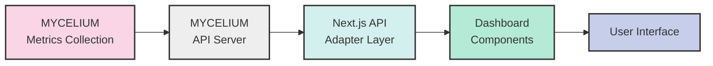

@references:
<!-- @references: -->
- .windsurfrules
- CODE_OF_CONDUCT.md
- MQP.md
- README.md
- ROADMAP.md
- subsystems/AutoCrossRef/CROSSREF_STANDARD.md

  - docs/website/website_MYCELIUM-INTEGRATION-PLAN.md

---
title: MYCELIUM Dashboard Integration Plan
version: 1.0.0
status: Active
date_created: 2025-05-10
date_modified: 2025-05-10
authors: [EGOS Team]
description: 
file_type: documentation
scope: 
primary_entity_type: 
primary_entity_name: 
tags: []
---

# MYCELIUM Dashboard Integration Plan

**Document ID**: INTEGRATION-MYC-DASH-001  
**Created**: 2025-05-01  
**Status**: Draft  
**Related Documents**:
- [DASHBOARD-ROADMAP](../../../governance/roadmaps/DASHBOARD-ROADMAP.md)
- [MYC-VIZ-02](../../../..\..\..\subsystems\MYCELIUM\docs\tasks\MYC-VIZ-02.md)
- [MYC-VIZ-03](../../../..\..\..\subsystems\MYCELIUM\docs\tasks\MYC-VIZ-03.md)

## Overview

This document outlines the comprehensive integration plan between the MYCELIUM metrics collection subsystem and the EGOS dashboard. The goal is to replace mock dashboard data with real-time metrics from the MYCELIUM subsystem while leveraging the existing dashboard components.

## Architectural Overview



## Current System Analysis

### Dashboard Components
- Network visualization with temporal features
- Time series metrics display
- Resource usage visualization
- System health monitoring
- Subsystem status reporting

### Mock API Infrastructure
- `/api/dashboard/metrics/timeseries`
- `/api/dashboard/resources/current`
- `/api/dashboard/health/summary`
- `/api/dashboard/network/data`
- `/api/dashboard/health/detailed`

## MYCELIUM Metrics System

### Capabilities
- Collects real-time message throughput metrics
- Monitors node connectivity and health
- Tracks message routing performance
- Collects system resource utilization

### Data Format
Current MYCELIUM metrics are collected in the following format:
```json
{
  "timestamp": "2025-05-01T00:34:00Z",
  "node_id": "myc-node-1",
  "metrics": {
    "messages_processed": 1250,
    "message_latency_ms": 42,
    "connections": 15,
    "memory_usage_mb": 256,
    "cpu_usage_percent": 12
  }
}
```

## Integration Strategy

### 1. API Contract Definition

Define a clear API contract between the MYCELIUM metrics system and the dashboard, ensuring that data formats are compatible.

#### Data Model Mapping

| MYCELIUM Metric | Dashboard Expectation | Transformation Needed |
|-----------------|------------------------|----------------------|
| `messages_processed` | Time series data point | Format as `{timestamp, value}` |
| `message_latency_ms` | Time series data point | Format as `{timestamp, value}` |
| `connections` | Network node | Transform to network visualization format |
| `memory_usage_mb` | Resource usage | Convert to percentage of total |
| `cpu_usage_percent` | Resource usage | Direct mapping |

#### Endpoint Mapping

| Dashboard API Endpoint | MYCELIUM Data Source | Implementation Priority |
|------------------------|----------------------|-------------------------|
| `/api/dashboard/metrics/timeseries` | Message metrics | High |
| `/api/dashboard/resources/current` | Resource metrics | High |
| `/api/dashboard/health/summary` | Node status | Medium |
| `/api/dashboard/network/data` | Connection topology | Medium |
| `/api/dashboard/health/detailed` | Comprehensive status | Low |

### 2. Adapter Implementation

Create an adapter layer in Next.js API routes that:
1. Fetches data from MYCELIUM metrics API
2. Transforms data to match dashboard expectations
3. Implements caching and error handling
4. Provides fallback to mock data when needed

#### Example Adapter Implementation

```typescript
// /api/dashboard/metrics/timeseries/route.ts
import { NextResponse } from 'next/server';
import { fetchMyceliumMetrics } from '@/lib/mycelium-api';

export async function GET(request: Request) {
  const { searchParams } = new URL(request.url);
  const metric = searchParams.get('metric');
  const points = parseInt(searchParams.get('points') || '60', 10);
  
  try {
    // Fetch from MYCELIUM metrics API
    const myceliumData = await fetchMyceliumMetrics(metric, points);
    
    // Transform to expected format
    const transformedData = myceliumData.map(item => ({
      timestamp: item.timestamp,
      value: item.metrics[metric === 'cpu' ? 'cpu_usage_percent' : 
             metric === 'memory' ? 'memory_usage_mb' : 
             metric === 'network' ? 'messages_processed' : 0]
    }));
    
    return NextResponse.json(transformedData);
  } catch (error) {
    console.error('Error fetching MYCELIUM metrics:', error);
    
    // Fall back to mock data
    return NextResponse.json(generateMockTimeSeriesData(points));
  }
}
```

### 3. Dashboard Component Extensions

Enhance the existing dashboard components to:
1. Handle MYCELIUM-specific data attributes
2. Provide MYCELIUM-focused visualizations
3. Add configuration options for MYCELIUM metrics display

#### Component Extensions Needed

- Add message routing visualization to NetworkVisualization
- Add message type breakdown charts
- Implement MYCELIUM-specific health indicators

### 4. Testing Strategy

#### Integration Testing
- Test each adapter endpoint with real MYCELIUM data
- Verify data transformations are correct
- Test with various data volumes and patterns

#### Performance Testing
- Measure dashboard performance with real-time data
- Optimize refresh rates for different metrics
- Implement efficient caching strategies

#### Fallback Testing
- Test behavior when MYCELIUM metrics are unavailable
- Verify graceful degradation to mock data
- Test recovery when metrics become available again

## Prioritized Implementation Plan

1. **Phase 1: API Contract Definition** (Est. 1 sprint)
   - Document expected formats for all metrics
   - Define TypeScript interfaces for type safety
   - Implement validation schemas

2. **Phase 2: Core Metrics Implementation** (Est. 1-2 sprints)
   - Implement time series metrics adapter
   - Implement resource usage adapter
   - Add basic health status adapter

3. **Phase 3: Advanced Visualization** (Est. 2 sprints)
   - Implement network topology adapter
   - Add detailed health reporting
   - Create MYCELIUM-specific visualizations

4. **Phase 4: Production Readiness** (Est. 1 sprint)
   - Implement authentication between systems
   - Add performance optimizations
   - Finalize testing and documentation

## Technical Considerations

### Security
- **Authentication**: Implement secure token-based auth between the dashboard and MYCELIUM
- **Authorization**: Restrict access based on user roles
- **Data Privacy**: Ensure sensitive metrics are properly secured

### Performance
- **Caching Strategy**: Implement SWR caching for frequently accessed metrics
- **Payload Optimization**: Minimize data transfer size
- **Refresh Rates**: Tune refresh rates based on metric importance

### Extensibility
- **Plugin Architecture**: Design adapter layer for extensibility
- **Configuration**: Allow customization of displayed metrics
- **Future Metrics**: Document process for adding new metrics

## Conclusion

This integration connects the EGOS dashboard frontend with the MYCELIUM metrics backend, providing real-time operational data while leveraging the existing dashboard components. It follows the EGOS principles of Conscious Modularity by clearly separating concerns between data collection and visualization.

The plan avoids duplication of effort by using the existing dashboard infrastructure rather than building a parallel visualization system. Implementation can proceed in phases without disrupting ongoing development of either the dashboard or MYCELIUM subsystems.


