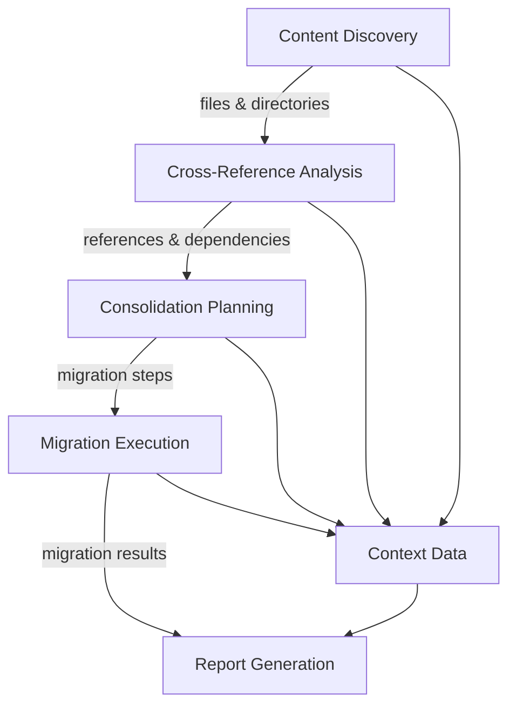

@references:
- .windsurfrules
- CODE_OF_CONDUCT.md
- MQP.md
- README.md
- ROADMAP.md
- CROSSREF_STANDARD.md

  - docs/work_logs/WORK-2025-05-23-Directory-Unification-Implementation.md

# Directory Unification Tool Implementation

**Date:** 2025-05-23
**Author:** Cascade
**Status:** In Progress
**References:**
- C:\EGOS\docs\work_logs\WORK_2025_05_23_Directory_Unification_Analysis.md
- C:\EGOS\scripts\maintenance\directory_unification\content_discovery.py
- C:\EGOS\scripts\maintenance\directory_unification\cross_reference_analyzer.py

## Overview

This work log documents the implementation of the Directory Unification Tool, a comprehensive system for identifying, analyzing, and consolidating related content across the EGOS system. The tool follows EGOS Core Principles and script standardization rules.

## Implementation Progress

### Phase 1: Core Module Development (Completed)

- [x] Created modular structure for the Directory Unification Tool
- [x] Implemented `utils.py` with shared utility functions
- [x] Implemented `content_discovery.py` for finding related content
- [x] Implemented `cross_reference_analyzer.py` for analyzing references

### Phase 2: Planning and Execution Modules (Completed)

- [x] Implemented `consolidation_planner.py` for determining optimal consolidation strategy
- [x] Implemented `migration_executor.py` for executing the migration plan
- [x] Implemented `report_generator.py` for generating comprehensive reports
- [x] Implemented `directory_unification_tool.py` as the main orchestration script

### Phase 3: Testing and Documentation (In Progress)

- [x] Created basic module documentation with docstrings
- [ ] Develop comprehensive testing strategy
- [ ] Create detailed user documentation
- [ ] Update tool registry in `config/tool_registry.json`
- [ ] Create integration tests

## Implementation Details

### Architecture Overview

The Directory Unification Tool follows a modular architecture with clear separation of concerns:

```
directory_unification/
├── __init__.py               # Package exports
├── directory_unification_tool.py  # Main orchestration script
├── content_discovery.py      # Content discovery module
├── cross_reference_analyzer.py  # Cross-reference analysis module
├── consolidation_planner.py  # Consolidation planning module
├── migration_executor.py     # Migration execution module
├── report_generator.py       # Report generation module
└── utils.py                  # Shared utility functions
```

### Data Flow



### Key Features

1. **Content Discovery**
   - Keyword-based search across the EGOS system
   - Parallel processing for performance
   - Detailed metadata collection

2. **Cross-Reference Analysis**
   - Identification of inbound and outbound references
   - Importance metrics calculation
   - Dependency mapping

3. **Consolidation Planning**
   - Intelligent target location determination
   - File classification (unify, preserve, archive, delete)
   - Dependency-aware migration step generation

4. **Migration Execution**
   - Automatic backup creation
   - Safe file operations with error handling
   - Reference updating in affected files

5. **Report Generation**
   - HTML reports with visualizations
   - Markdown reports for documentation
   - Comprehensive statistics and summaries

## Next Steps

1. **Testing**
   - Create unit tests for each module
   - Develop integration tests for the complete workflow
   - Test with various keywords and scenarios

2. **Documentation**
   - Create comprehensive user documentation
   - Add detailed examples and use cases
   - Document potential pitfalls and limitations

3. **Integration**
   - Register the tool in `config/tool_registry.json`
   - Create a PowerShell wrapper script for easier invocation
   - Integrate with the EGOS website for report visualization

4. **Enhancements**
   - Implement additional visualization options for reports
   - Add support for custom classification rules
   - Develop a GUI interface for the tool

## Usage Examples

### Basic Usage

```powershell
# Run the tool with a keyword
python -m scripts.maintenance.directory_unification.directory_unification_tool --keyword dashboard
```

### Advanced Usage

```powershell
# Run with specific target directory and exclusions
python -m scripts.maintenance.directory_unification.directory_unification_tool \
  --keyword dashboard \
  --target-dir apps/dashboards \
  --exclude-dirs venv node_modules .git \
  --exclude-files *.pyc *.log \
  --dry-run
```

### Dry Run Mode

```powershell
# Perform a dry run without making changes
python -m scripts.maintenance.directory_unification.directory_unification_tool \
  --keyword dashboard \
  --dry-run
```

## Implementation Details

### Module Structure

1. **content_discovery.py**
   - Implements keyword-based file and directory search
   - Uses threading for parallel processing
   - Provides detailed metadata about found content

2. **cross_reference_analyzer.py**
   - Analyzes references between files
   - Identifies dependencies and relationships
   - Calculates importance metrics for each file

3. **consolidation_planner.py**
   - Determines optimal target location for consolidation
   - Classifies files into categories (unify, preserve, archive, delete)
   - Generates detailed migration steps with dependencies

4. **migration_executor.py**
   - Creates backups before migration
   - Executes migration steps with proper error handling
   - Updates references in affected files

5. **report_generator.py (In Progress)**
   - Generates HTML and Markdown reports
   - Creates visualizations of the consolidation process
   - Provides detailed statistics and summaries

6. **directory_unification_tool.py (Pending)**
   - Provides command-line interface
   - Orchestrates execution of all modules
   - Handles configuration and arguments

## Next Steps

1. Complete implementation of `report_generator.py`
2. Implement main script `directory_unification_tool.py`
3. Develop comprehensive testing strategy
4. Create detailed documentation
5. Update tool registry

✧༺❀༻∞ EGOS ∞༺❀༻✧