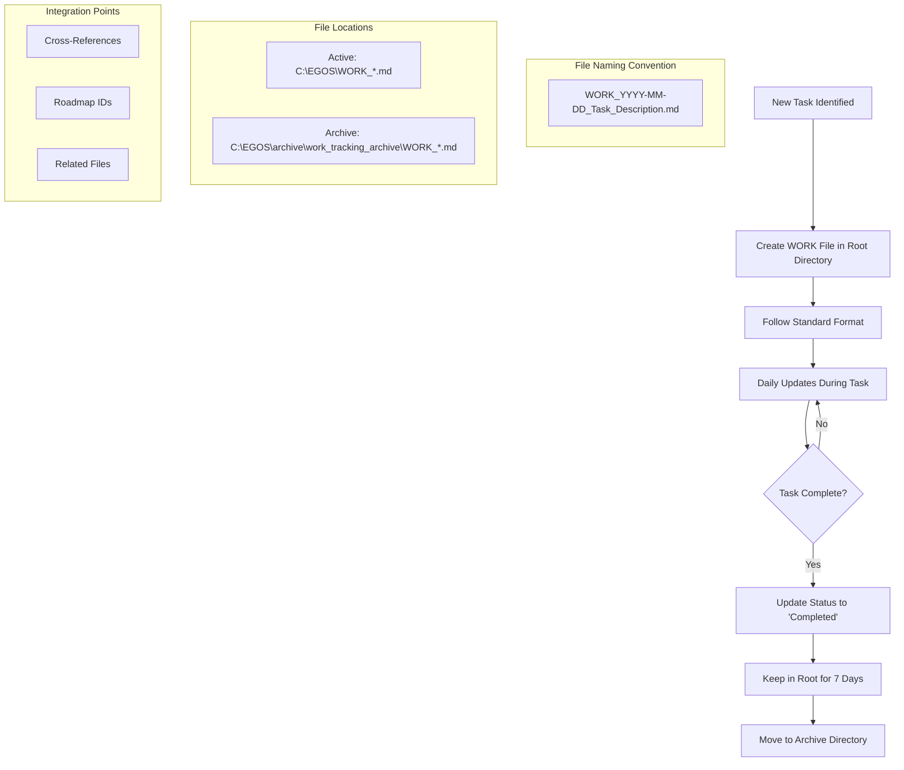

@references:
- .windsurfrules
- CODE_OF_CONDUCT.md
- MQP.md
- README.md
- ROADMAP.md
- CROSSREF_STANDARD.md

@references(level=1):
  - docs/work_logs/active/path/to/document.md


  - docs/work_logs/active/WORK_2025-05-23_Work_Log_Standardization.md

# Work Log Files Standardization (WORK_*.md)

**Date:** 2025-05-23  
**Status:** In Progress  
**Priority:** High  
**Roadmap IDs:** EGOS-CORE-DOC-03

## 1. Objective

Establish a consistent standard for work log files (WORK_*.md) in the EGOS system, including naming conventions, structure, location, and archiving process, to improve visibility, traceability, and organization of completed work.

## 2. Context

This standard operates under the guidance of the [EGOS Workspace Global Rules](../../../.windsurfrules) and aims to ensure all work logs are consistent and effectively contribute to the EGOS knowledge base, aligning with KOIOS and Systemic Cartography principles.

Currently, WORK_*.md files are scattered across different directories in the EGOS system, with inconsistent formats and structures. This makes it difficult to locate, track, and reference previous work. An analysis of the system revealed WORK files in at least four main locations:

- Root directory (`C:\EGOS\`)
- Work logs directory (`C:\EGOS\docs\work_logs\`)
- Applications directory (`C:\EGOS\dashboard\app\`)
- Archive directory (`C:\EGOS\archive\work_tracking_archive\`)

Additionally, the formats of these files vary significantly, from simple task lists to structured documents with YAML metadata.

## 3. Current Situation Analysis

### 3.1 Distribution of WORK Files

A search in the EGOS system revealed 27 WORK_*.md files in different locations:

| Location | Quantity | Observations |
|-------------|------------|-------------|
| `C:\EGOS\archive\work_tracking_archive\` | 2 | Older files |
| `C:\EGOS\dashboard\app\` | 7 | Including recent files |
| `C:\EGOS\docs\work_logs\` | 8 | More organized location |
| `C:\EGOS\scripts\cross_reference\` | 2 | Specific to cross-reference |
| Others (backups) | 8 | Copies in backup directories |

### 3.2 Identified Formats

Analyzing the content of the files, we identified three main formats:

1. **Complete Format with YAML Metadata**:
   ```markdown
   ---
   title: "Work title"
   date: YYYY-MM-DD
   author: "Author name"
   status: "Current status"
   priority: "Priority level"
   tags: [tag1, tag2]
   ---
   
   # Title
   
   ## Objective
   ...
   ```

2. **Simple Format with Header**:
   ```markdown
   # EGOS Work Log - YYYY-MM-DD
   
   ## Project Name
   
   ### Current Status
   ...
   ```

3. **Mixed Format**:
   Various combinations of the above formats, with inconsistencies in structure and content.

## 4. Proposed Standard

### 4.1 Location

All active WORK files **MUST** be kept in `C:\EGOS\docs\work_logs\active\` for focused visibility and organization, aligning with `EGOS_PRINCIPLE:Systemic_Organization`. After completion and a retention period of 7 days, files **SHOULD** be moved to `C:\EGOS\docs\work_logs\archive\` (this path standardizes the previous `C:\EGOS\archive\work_tracking_archive\`).

### 4.2 Naming Convention

- **Format**: `WORK_YYYY-MM-DD_concise_description.md`
- **Date**: Task start date in YYYY-MM-DD format.
- **Description**: Concise description using `snake_case` (all lowercase, words separated by underscores), adhering to `RULE-FS-STD-01` from `global_rules.md`.
- **Example**: `WORK_2025-05-23_dashboard_consolidation.md`

### 4.3 Internal Structure

```markdown
---
title: "Descriptive work title"
date: YYYY-MM-DD
author: "Author Name (Human/AI, e.g., User Name (Human), Cascade (AI), User Name (Lead) & Cascade (Support))"
status: "Planning | In Progress | Completed | Blocked | On Hold | Deferred"
priority: "Critical | High | Medium | Low"
tags: [tag1, tag2, tag3]
roadmap_ids: ["EGOS-EPIC-XXX", "EGOS-EPIC-XXX-YY"]
adrs_ids: ["ADRS-XXX"] # Optional: Link to relevant ADRS Log entries
---

# Work Title

**Date:** YYYY-MM-DD  
**Status:** Current status  
**Priority:** Priority level  
**Roadmap IDs:** EGOS-EPIC-XXX, EGOS-EPIC-XXX-YY

## 1. Objective

Clear and concise description of the work objective.

## 2. Context

Relevant context information to understand the work.

## 3. Completed Tasks

### 3.1 [Task Name]
- ✅ [Completed subtask]
- ✅ [Completed subtask]
- ⚠️ [Subtask with issues]

### 3.2 [Another Task Name]
- ✅ [Completed subtask]
- ❌ [Uncompleted subtask]

## 4. Next Steps

- [ ] [Future task 1]
- [ ] [Future task 2]

## 5. Modified Files

- `path/to/file1.py`
- `path/to/file2.md`

## 6. AI Assistant Contributions (Optional)

Details about significant contributions from AI assistants like Cascade:
- Key tasks performed by AI.
- AI models/tools utilized (if known/relevant).
- Brief description of methodologies/prompts for complex AI tasks.
- Links to temporary AI-generated artifacts (e.g., `ChaTemp.md`).

## 7. References

- [Link to related document](path/to/document.md)
- [Link to roadmap task](C:\EGOS\ROADMAP.md#EGOS-EPIC-XXX)

✧༺❀༻∞ EGOS ∞༺❀༻✧
```

### 4.4 Update Process

- WORK files should be updated daily while the task is in progress.
- Progress updates should be clearly marked with the date:

```markdown
## Update: YYYY-MM-DD

### Progress
- ✅ [New completed task]
- 🔄 [Task in progress]

### Updated Next Steps
- [ ] [New added task]
```

### 4.5 Archiving Process

1. When a task is completed, update the status to "Completed" in the YAML header.
2. Keep the file in the root directory for 7 days for immediate reference.
3. After 7 days, move the file to `C:\EGOS\archive\work_tracking_archive\`.
4. Do not modify the filename during archiving.

### 4.6 Roadmap Integration

All WORK files must explicitly reference related ROADMAP.md tasks using standardized IDs (EGOS-EPIC-XXX). This allows for easy tracking of roadmap task progress.

## 5. Migration Plan

### 5.1 Phase 1: Complete Inventory

- ✅ Identify all WORK_*.md files in the system
- ✅ Analyze formats and contents
- ✅ Document the proposed standard

### 5.2 Phase 2: Active Files Migration

- [ ] Identify active WORK files (created in the last 30 days)
- [ ] Convert to the new standardized format
- [ ] Move to the root directory (`C:\EGOS\`)
- [ ] Update internal references

### 5.3 Phase 3: Archiving Old Files

- [ ] Identify old WORK files (created more than 30 days ago)
- [ ] Convert to the standardized format (optional)
- [ ] Move to `C:\EGOS\archive\work_tracking_archive\`

### 5.4 Phase 4: Documentation Update

- [ ] Update system documentation to reflect the new standard
- [ ] Create a template for new WORK files
- [ ] Add the standard to Windsurf global rules

## 6. Files to be Migrated

### 6.1 Active Files (Move to Root Directory)

| Original File | New Name |
|------------------|----------|
| `C:\EGOS\dashboard\app\WORK_2025_05_23_Dashboard_Consolidation_Plan.md` | `C:\EGOS\WORK_2025-05-23_Dashboard_Consolidation.md` |
| `C:\EGOS\dashboard\app\WORK_2025_05_23_Directory_Unification_Analysis.md` | `C:\EGOS\WORK_2025-05-23_Directory_Unification_Analysis.md` |
| `C:\EGOS\dashboard\app\WORK_2025_05_23_Directory_Unification_Implementation.md` | `C:\EGOS\WORK_2025-05-23_Directory_Unification_Implementation.md` |
| `C:\EGOS\dashboard\app\WORK_2025_05_23_Directory_Unification_Tool_Enhancements.md` | `C:\EGOS\WORK_2025-05-23_Directory_Unification_Tool_Enhancements.md` |
| `C:\EGOS\docs\work_logs\WORK_2025_05_23_Directory_Unification_Verification.md` | `C:\EGOS\WORK_2025-05-23_Directory_Unification_Verification.md` |
| `C:\EGOS\docs\work_logs\WORK_2025_05_23_GitHub_Sync.md` | `C:\EGOS\WORK_2025-05-23_GitHub_Sync.md` |
| `C:\EGOS\docs\work_logs\WORK_2025_05_23_GitHub_Sync_Manager_Implementation.md` | `C:\EGOS\WORK_2025-05-23_GitHub_Sync_Manager_Implementation.md` |
| `C:\EGOS\docs\work_logs\WORK_2025_05_23_GitHub_Sync_System_Implementation.md` | `C:\EGOS\WORK_2025-05-23_GitHub_Sync_System_Implementation.md` |

### 6.2 Recent Files (Move to Root Directory)

| Original File | New Name |
|------------------|----------|
| `C:\EGOS\dashboard\app\WORK_2025_05_22_file_duplication_management.md` | `C:\EGOS\WORK_2025-05-22_File_Duplication_Management.md` |
| `C:\EGOS\dashboard\app\WORK_2025_05_22_run_tools_enhancement.md` | `C:\EGOS\WORK_2025-05-22_Run_Tools_Enhancement.md` |
| `C:\EGOS\dashboard\app\WORK_2025_05_22_tool_registry_system_plan.md` | `C:\EGOS\WORK_2025-05-22_Tool_Registry_System_Plan.md` |
| `C:\EGOS\docs\work_logs\WORK_2025_05_22_DiagEnio_Enhancements.md` | `C:\EGOS\WORK_2025-05-22_DiagEnio_Enhancements.md` |
| `C:\EGOS\docs\work_logs\WORK_2025_05_22_GitHub_Sync_Status.md` | `C:\EGOS\WORK_2025-05-22_GitHub_Sync_Status.md` |
| `C:\EGOS\docs\work_logs\WORK_2025_05_22_tool_registry_phase2.md` | `C:\EGOS\WORK_2025-05-22_Tool_Registry_Phase2.md` |
| `C:\EGOS\docs\work_logs\WORK_2025_05_22_website_design_analysis.md` | `C:\EGOS\WORK_2025-05-22_Website_Design_Analysis.md` |

### 6.3 Old Files (Move to Archive)

| Original File | New Name in Archive |
|------------------|----------------------|
| `C:\EGOS\scripts\cross_reference\WORK_2025_05_21.md` | `C:\EGOS\archive\work_tracking_archive\WORK_2025-05-21_Cross_Reference.md` |
| `C:\EGOS\scripts\cross_reference\WORK_2025_05_21_update.md` | `C:\EGOS\archive\work_tracking_archive\WORK_2025-05-21_Cross_Reference_Update.md` |
| `C:\EGOS\dashboard\app\archive\WORK_2025_05_21.md` | `C:\EGOS\archive\work_tracking_archive\WORK_2025-05-21_Dashboard.md` |

## 7. Expected Benefits

- **Greater Visibility**: All active work will be visible in the root directory
- **Consistency**: Standardized format for all WORK files
- **Traceability**: Clear integration with the roadmap and references to other documents
- **Organization**: Clear process for updating and archiving
- **History**: Maintenance of a complete history of work performed

## 7.1 WORK File Workflow Diagram



This diagram illustrates the complete lifecycle of WORK files in the EGOS system, from creation through active use to archiving, along with the standardized naming convention and integration points with other system components.

## 8. Next Steps

- [x] Obtain approval for the proposed standard
- [x] Implement migration process to move and standardize files
  - Created archive directory structure
  - Migrated active files to root directory
  - Moved older files to archive
- [x] Update Windsurf global rules
  - Added reference to this document in Key Standards References section
- [x] Create tools for standard implementation
  - Created template file at `C:\EGOS\docs\templates\WORK_template.md`
  - Developed `work_log_manager.ps1` script for automated management
  - Added tool to registry in `C:\EGOS\config\tool_registry.json`
- [x] Communicate the new standard to the team
  - Created documentation in `README_WORK_template.md`
- [x] Set up monitoring for compliance
  - Implemented validation function in `work_log_manager.ps1`
  - Added status reporting capability to track compliance

## 9. References

- [DiagEnio.md](C:\EGOS\DiagEnio.md#documentation-structure-analysis)
- [ROADMAP.md](C:\EGOS\ROADMAP.md#EGOS-CORE-DOC-03)
- [KOIOS Documentation Standards](C:\EGOS\docs\standards\koios_documentation_standards.md)

✧༺❀༻∞ EGOS ∞༺❀༻✧