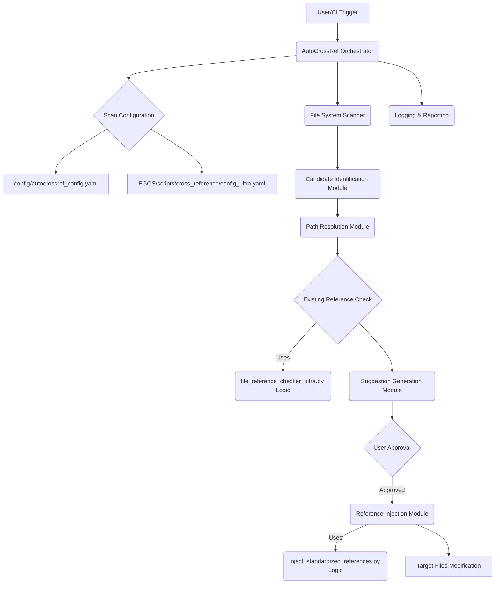

# AutoCrossRef Subsystem - Design Document

**Version:** 0.1
**Last Updated:** {{ CURRENT_DATE_ISO }}

## 1. Introduction

This document details the design and architecture of the AutoCrossRef subsystem. Its primary goal is to automate the management of cross-references within the EGOS project, ensuring consistency, accuracy, and ease of maintenance.

## 2. Core Principles

- **Leverage Existing Assets:** Utilize the proven functionality of `file_reference_checker_ultra.py` and `inject_standardized_references.py`.
- **Safety First:** Prioritize non-destructive operations (dry-runs), backups, and clear user consent before modifications.
- **Modularity:** Design components with clear responsibilities.
- **Configuration-Driven:** Allow flexible control through configuration files.
- **Clarity:** Provide clear logs and reports of actions taken.

## 3. High-Level Architecture



## 4. Key Components & Logic

### 4.1. AutoCrossRef Orchestrator (`src/orchestrator.py`)
- Main control flow.
- CLI interface.
- Coordinates other modules.

### 4.2. File System Scanner
- Traverses specified directories/files.
- Filters based on `config_ultra.yaml` and `autocrossref_config.yaml` (inclusions, exclusions).

### 4.3. Candidate Identification Module
- **Objective:** To identify potential cross-reference terms, phrases, or existing Markdown links within source files that could be standardized or linked.
- **Methods:**
    -   Regex matching for predefined patterns (e.g., `[link text](path)`).
    -   Lookup of known acronyms, titles, or keywords from `autocrossref_config.yaml` (`known_terms_to_paths`, `standalone_keywords`).
    -   (Future) NLP-based entity recognition for more complex candidate discovery.
- **Output:** A list of `(candidate_string, candidate_type, source_file_path, line_number, original_link_target_if_any)` tuples.

### 4.4. Path Resolution Module
- **Objective:** To resolve identified candidates to an absolute, canonical file path within the EGOS project or a valid external URL.
- **Methods:**
    -   Direct lookup for candidates found in `known_terms_to_paths`.
    -   For Markdown links `[text](path)`:
        -   If `path` is absolute, normalize it.
        -   If `path` is relative, resolve it against the `source_file_path`.
        -   If `path` is a project-root-relative path (e.g., `/docs/file.md`), resolve it against `EGOS_PROJECT_ROOT`.
    -   For other candidate types (e.g., capitalized phrases, standalone keywords):
        -   Attempt to find a matching file name in a pre-built file index of the EGOS project.
        -   (Future) Fuzzy matching or search heuristics.
    -   Validate if the resolved path exists (for local files).
- **File Index:** A cache (e.g., dictionary mapping filenames/key_terms to absolute paths) of relevant files in the EGOS project (e.g., `.md`, `.py`, `.yaml` files in `docs/`, `src/`, `subsystems/`). This index is built/updated by the `File System Scanner` or on demand.
- **Output:** `(resolved_absolute_path, resolution_method, preferred_link_text)` or `None` if unresolvable.

### 4.5. Reference Injection Module (`src/ref_injector.py`)
- **Objective:** To safely insert standardized cross-references into files.
- **Methods:**
    -   Locates or creates the `@references:` block according to file-type specific rules (see Section 4.6).
    -   Formats the reference string (e.g., `- path/to/file.md`).
    -   Handles backups before modification.
    -   Supports dry-run mode.
    -   Avoids duplicate entries (checks both raw string and resolved absolute path).

### 4.6. `@references:` Block Standards

To ensure consistency and maintainability across all EGOS project files, the AutoCrossRef subsystem adheres to and enforces specific rules for the placement and formatting of `@references:` blocks. The `ref_injector.py` module is responsible for implementing these standards when adding new references or creating new blocks.

**General Principles:**

*   **Purpose:** The `@references:` block serves as a centralized list of explicit pointers to other relevant documents or artifacts within or outside the EGOS project.
*   **Clarity:** The block should be easily identifiable and consistently located.
*   **Automation-Friendly:** Standardized placement aids automated tools in finding and managing these references.

**Placement Rules by File Type:**

1.  **Markdown Files (`.md`):**
    *   **With YAML Frontmatter:** If the file begins with YAML frontmatter (enclosed between `---` lines), the `@references:` block MUST be placed immediately *after* the closing `---` of the frontmatter.
    *   **Without YAML Frontmatter:** If there is no YAML frontmatter, the `@references:` block MUST be placed at the very *beginning* of the file.
    *   **Separation:** In both cases, there MUST be exactly *one blank line* separating the `@references:` block from the content immediately preceding it (i.e., frontmatter or start of file) and the content immediately following it (unless it's the end of the file).
    *   **Format:**
        ```markdown
        @references:
          - path/to/referenced_document1.md
          - [Optional Link Text](path/to/other_file.py)
  - subsystems/AutoCrossRef/docs/DESIGN.md
        ```

2.  **Python Files (`.py`):**
    *   **With Module Docstring:** If the file contains a module-level docstring (which may appear after a shebang `#!` line and/or an encoding comment like `# -*- coding: utf-8 -*-`), the `# @references:` block MUST be placed immediately *after* the closing quotes of the module docstring.
    *   **No Module Docstring, but Shebang/Encoding Present:** If there is no module docstring, but a shebang or encoding comment exists at the start of the file, the `# @references:` block MUST be placed immediately *after* the last of these header lines.
    *   **No Docstring, Shebang, or Encoding:** If the file has none of the above (e.g., it's a simple script or an empty file), the `# @references:` block MUST be placed at the very *beginning* of the file.
    *   **Separation:** In all cases, there MUST be exactly *one blank line* separating the `# @references:` block from the content immediately preceding it (docstring, shebang/encoding, or start of file) and the content immediately following it (unless it's the end of the file).
    *   **Format:** The block and its items MUST be commented out using Python line comments.
        ```python
        # @references:
        #   - path/to/another_script.py
        #   - ../docs/relevant_standard.md
        ```

**Duplicate Handling:**

*   The `ref_injector.py` module checks for duplicates based on the *resolved absolute path* of the target reference *before* injection. If an equivalent reference already exists (even if the link text or relative path string is different), a new entry will not be added.
*   It also checks for *raw string duplicates* within an existing block.

Adherence to these standards is critical for the effective operation of the AutoCrossRef subsystem and the overall integrity of the EGOS knowledge base.

## 6. Configuration Files

Two main configuration files drive the subsystem:

1.  **`C:\EGOS\subsystems\AutoCrossRef\config\autocrossref_config.yaml`**: Higher-level configuration specific to AutoCrossRef's logic.
    -   `scan_paths: List[str]`: Default directories to scan if not specified via CLI.
    -   `candidate_detection_patterns: List[Dict]`: Patterns for the Candidate Identification Module.
        -   Example entry: `{ "name": "capitalized_phrase", "regex": "\\b([A-Z][a-z]+(?:\\s+[A-Z][a-z]+)+)\\b", "type": "capitalized_phrase_regex" }`
        -   Example entry: `{ "name": "markdown_link", "regex": "\\[(?P<text>[^\\]]+)\\]\\((?P<path>[^)]+)\\)", "type": "markdown_link" }`
    -   `known_terms_to_paths: Dict[str, str]`: Mapping of common terms/acronyms/titles to their canonical file paths. Used by Path Resolution Module.
        -   Example: `"MQP": "C:/EGOS/MQP.md"`
        -   Example: `"KOIOS PDD Standard": "C:/EGOS/docs/standards/KOIOS_PDD_Standard.md"`
    -   `standalone_keywords: List[str]`: Specific keywords/acronyms to actively look for during candidate identification, even if not in `known_terms_to_paths`.
        -   Example: `["PDD", "EaaS", "Mycelium"]`
    -   `backup_options: Dict`: Configuration for the Reference Injection Module.
        -   `enabled: bool` (e.g., `true`)
        -   `directory: str` (e.g., `"C:/EGOS/backups/autocrossref/"`)
        -   `timestamp_format: str` (e.g., `"%Y%m%d_%H%M%S"`)
    -   `logging: Dict`: Standard logging configuration (level, format, file).
    -   `confidence_threshold: float`: (Future) Minimum confidence for auto-suggestion or auto-apply.

2.  **`C:\EGOS\scripts\cross_reference\config_ultra.yaml`**: Lower-level file scanning rules (file extensions, inclusions, exclusions, ignored directories) leveraged by the File System Scanner, and potentially by the existing `file_reference_checker_ultra.py` and `inject_standardized_references.py` if they are called as subprocesses or their config is read directly.

## 7. Error Handling & Logging

- Comprehensive logging of all operations.
- Graceful error handling.

## 8. Future Enhancements

- (Covered in ROADMAP.md)

@references(level=1):
  - subsystems/AutoCrossRef/docs/path
  - subsystems/AutoCrossRef/docs/path/to/other_file.py