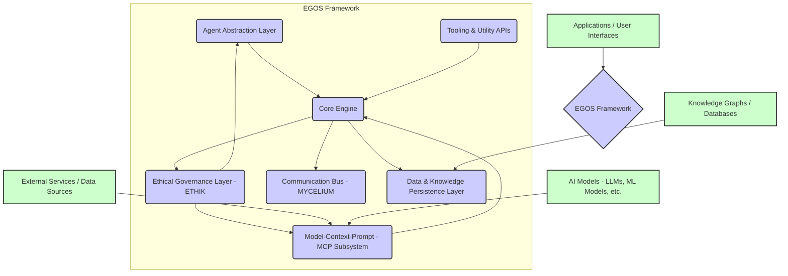

@references:
- .windsurfrules
- CODE_OF_CONDUCT.md
- MQP.md
- README.md
- ROADMAP.md
- CROSSREF_STANDARD.md

@references(level=1):
  - subsystems/CoreDocs/framework_mcp/03_MCP_Subsystem.md

  - EGOS_Framework/docs/02_Architecture_Overview.md

# 02. EGOS Framework Architecture Overview

This document provides a high-level blueprint of the EGOS Framework's architecture. It outlines the main conceptual layers and components, their responsibilities, and how they interact to create a cohesive platform for building intelligent, ethical, and adaptive systems.

The architecture is designed with **Conscious Modularity (CM)** as a core principle, ensuring that components are well-defined, loosely coupled, and can evolve independently while contributing to the overall system's emergent capabilities.

## Conceptual Layers

The EGOS Framework can be visualized as a series of interconnected layers, each providing specific functionalities:

### 1. Agent Abstraction Layer

-   **Responsibility:** Provides the structures, interfaces, and lifecycle management for creating and deploying AI agents within the EGOS ecosystem.
-   **Key Features:**
    -   Standardized agent templates and archetypes.
    -   Agent lifecycle management (initialization, execution, suspension, termination).
    -   Mechanisms for agent perception, reasoning, and action.
    -   Integration with memory systems and tool usage capabilities.
-   **Interactions:** Leverages the Core Engine for execution, communicates via the Communication Bus (MYCELIUM), and utilizes MCPs for accessing AI models and tools.

### 2. Model-Context-Prompt (MCP) Subsystem

-   **Responsibility:** Standardizes and facilitates interaction with diverse AI models (LLMs, specialized ML models) and external services/tools. This is a cornerstone of the framework, detailed further in `03_MCP_Subsystem.md`.
-   **Key Features:**
    -   Defines a common interface pattern for invoking AI capabilities.
    -   Manages context, prompt engineering, and response parsing.
    -   Supports various MCPs like `Oracle-MCP` (LLM gateway), `ScribeAssist-MCP` (code/doc generation), `Hermes-MCP` (web research), `NEXUS-MCP` (knowledge graph access), etc.
-   **Interactions:** Consumed by Agents and other framework components. Interacts with external AI models and services. Subject to ethical validation by the ETHIK Governance Layer.

### 3. Core Engine

-   **Responsibility:** The central orchestrator of the framework. Manages the execution environment, component lifecycle, and core services.
-   **Key Features:**
    -   Component registration and discovery.
    -   Service management and dependency injection (conceptual).
    -   Workflow execution and task scheduling (basic capabilities, enhanced by `Strategos-MCP`).
    -   Configuration management.
-   **Interactions:** Interacts with all other layers, providing the runtime environment.

### 4. Tooling & Utility APIs

-   **Responsibility:** Provides a collection of common utilities, libraries, and APIs to support development and operation within the framework.
-   **Key Features:**
    -   Logging and monitoring services.
    -   Serialization and data transformation tools.
    -   Common data structures and algorithms.
    -   File system and network access utilities (abstracted for security and testability).
-   **Interactions:** Used by all other components and layers to perform common tasks.

### 5. Ethical Governance Layer (ETHIK)

-   **Responsibility:** Ensures all operations, data handling, and agent behaviors within the framework adhere to the MQP and defined ethical protocols. Primarily embodied by the `ETHIK-MCP`.
-   **Key Features:**
    -   Policy definition and enforcement.
    -   Ethical validation of prompts, responses, and agent actions.
    -   Bias detection and mitigation (aspirational, research-dependent).
    -   Audit trails for ethical compliance.
-   **Interactions:** Provides oversight and validation for the Agent Layer, MCP Subsystem, and potentially other Core Engine operations.

### 6. Communication Bus (MYCELIUM)

-   **Responsibility:** Facilitates robust and flexible inter-agent and inter-component communication. Primarily embodied by the `MYCELIUM-MCP`.
-   **Key Features:**
    -   Asynchronous message passing (publish-subscribe, request-response).
    -   Topic-based routing and filtering.
    -   Message serialization, validation, and (optional) encryption.
    -   Support for distributed communication.
-   **Interactions:** Used by Agents, MCPs, and Core Engine components to exchange information and coordinate activities.

### 7. Data & Knowledge Persistence Layer

-   **Responsibility:** Manages the storage and retrieval of data, including agent memory, system state, configurations, and connections to larger knowledge bases.
-   **Key Features:**
    -   Abstracted interfaces for various database types (relational, NoSQL, graph, vector).
    -   Support for structured and unstructured data.
    -   Mechanisms for data versioning and archival (aligned with EP principle).
    -   Integration with `NEXUS-MCP` for knowledge graph interactions.
-   **Interactions:** Accessed by Agents (for memory), Core Engine (for state/config), and MCPs (for knowledge retrieval).

## Design Philosophy

-   **Lightweight Core, Extensible Modules:** The Core Engine aims to be minimal, with richer functionality provided by specialized, pluggable modules (often MCPs).
-   **API-Driven:** Interactions between layers and components are primarily through well-defined APIs.
-   **Event-Oriented:** Many interactions, especially via the Communication Bus, will be event-driven, promoting decoupling.
-   **Security by Design:** Security and privacy (SP principle) considerations are integrated into each layer.
-   **Testability:** Components are designed to be individually testable.

This architectural overview provides a conceptual map. The actual implementation will involve detailed design of each component and their interfaces, always guided by the EGOS principles.

Next, delve into the specifics of the [MCP Subsystem (`03_MCP_Subsystem.md`)](03_MCP_Subsystem.md).

---
✧༺❀༻∞ EGOS Framework ∞༺❀༻✧